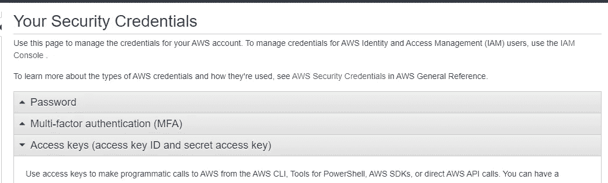

# 从 React 前端上传文件到亚马逊 S3

> 原文：<https://blog.devgenius.io/upload-files-to-amazon-s3-from-a-react-frontend-fbd8f0b26f5?source=collection_archive---------1----------------------->

通过这篇博客，我将讲述如何从 React 应用程序上传文件到亚马逊 S3。我参考了很多资料，这是我的理解和为我制定的步骤的汇编。

这是我的 [GitHub](https://github.com/Namyalg/Upload-to-S3-from-React) 库的链接，你可以简单地克隆它并跟随它。


图片来源:【https://www.google.com/url?sa=i】T2&URL = https % 3A % 2F % 2fwww . freecodecamp . org % 2f news % 2 feverything-you-need-to-know-about-AWS-S3 % 2F&psig = aovvaw 1 ykv5 cmsqjfnc 9 a6 lwgn 75&ust = 1648911265693000&source = images&CD = vfe&ved = 0 casqg

# 铲斗设置和配置

查看一些先决条件:

*   要求在 [AWS](https://aws.amazon.com/) 上有账号。会询问一些基本的细节以及信用卡信息。(这仅用于安全和验证目的)
*   可以使用免费层标签下提到的服务，并且不会向您收费
*   正如维基百科所述，亚马逊 S3 或亚马逊简单存储服务是由亚马逊网络服务提供的服务，它通过网络服务接口提供对象存储。亚马逊 S3 使用与 Amazon.com 相同的可扩展存储基础设施来运行其全球电子商务网络
*   AWS 文档超级简单，强烈推荐:[https://docs . AWS . Amazon . com/Amazon S3/latest/user guide/using bucket . html](https://docs.aws.amazon.com/AmazonS3/latest/userguide/UsingBucket.html)


成功登录后，您应该会被定向到仪表板页面

在这里稍微探索一下，AWS 提供了各种与云相关的服务，并且非常容易使用和构建应用程序，而不必担心资源和可伸缩性。

一旦帐户设置完成，您就准备好了，是时候创建一个新的 bucket(这就是所谓的存储实例)了


搜索 S3 服务并点击它

当选择 S3 服务时，它会打开一个页面，列出您创建的所有存储桶。如果是第一次，您显然不会发现任何创建的 buckets。


此页面列出了您创建的存储桶

单击创建存储桶时，您将被重定向到配置页面。**这是最重要的部分，所以要认真遵循。**

## 免责声明:

对于开发设置，可以选择我选择的所有配置选项，对于生产设置，可能会略有不同。

> 第一步


第一种配置

为您的存储桶设置一个合适的名称，存储桶的名称在某种意义上是 AWS 维护的主键或唯一标识符，用于区分存储桶，因此选择一个以前从未选择过的名称。

> 第二步


第二配置

默认情况下，对象所有权设置为禁用 ACLs，这可能会导致问题，因此，**应该选择启用 ACLs 选项。**

正如 Amazon 文档中所述:Amazon S3 访问控制列表(ACL)使您能够管理对桶和对象的访问。每个存储桶和对象都有一个 ACL 作为子资源附加到其上。它定义了哪些 AWS 帐户或组被授予访问权限以及访问类型。

在选择启用 ACL 选项时，它看起来是这样的


> 第三步


第三种配置

默认情况下，不允许对 bucket 及其对象进行公共访问，但情况并非如此，因为我们的应用程序可能需要用户上传文件/文件夹，而这些文件/文件夹必须存储在 S3 上。

在取消选中阻止所有公共访问时，必须启用该选项，当然，这是有风险的，允许公共访问您的 bucket 的内容，但是再次记住这只是针对开发设置！


承认风险！

其他选项可以保持不变，您可以继续创建您的存储桶


离设置您的铲斗又近了一步

一旦创建了您的存储桶，您将被带到仪表板页面，这里显示了您新创建的存储桶。(我刚刚为演示创建了一个虚拟桶，稍后将被删除)


单击您的存储桶名称，您将进入存储桶控制面板


Tadaaa，这是你上传文件的地方

一旦创建了存储桶，您将需要更改权限，单击 Permissions 选项卡并


权限选项卡

> 克-奥二氏分级量表

应该启用跨源资源共享，即从其他服务器或主机请求的 AWS 上存储的文件应该是可检索的，因此我们制定了编辑 CORS 策略。在“Permissions”选项卡的末尾，您会发现一个编辑 CORS 策略的选项


编辑 CORS 政策

```
[
    {
        "AllowedHeaders": [
            "*"
        ],
        "AllowedMethods": [
            "PUT",
            "POST",
            "DELETE",
            "GET",
            "HEAD"
        ],
        "AllowedOrigins": [
            "*"
        ],
        "ExposeHeaders": [
            "x-amz-server-side-encryption",
            "x-amz-request-id",
            "x-amz-id-2"
        ],
        "MaxAgeSeconds": 3000
    }
]
```

将此粘贴为 CORS 策略，这意味着来自“*”或任何域的请求都将得到服务，为了允许来自特定域的请求得到服务，可以对其进行适当更新。

> 访问控制列表


谁有权做什么

单击“edit ”,将“Read”设置为“Everyone ”,这表示所有人都应该有权读取存储桶的内容，但只有您有权写入存储桶，请记住保存页面末尾的更改


允许每个人阅读

> 木桶策略


编辑存储桶策略

```
{
    "Version": "2012-10-17",
    "Id": "Policy1648807206642",
    "Statement": [
        {
            "Sid": "Stmt1648807205338",
            "Effect": "Allow",
            "Principal": "*",
            "Action": "s3:*",
            "Resource": [
                "arn:aws:s3:::your-bucket-name",
                "arn:aws:s3:::your-bucket-name/*"
            ]
        }
    ]
}
```

将此作为存储桶策略输入，之后，存储桶的配置就准备好了。

> 第四步

一旦这个设置完成，你将需要一些关于你的帐户和桶的信息，这是在前端使用。

1.  存取关键字
2.  秘密钥匙
3.  存储桶名称
4.  铲斗位置

3 和 4 可从铲斗仪表板上获得

要获取 1 和 2 的值，请点击右上角的帐户名称


打开包含以下选项的下拉菜单，单击“安全凭据”


点击访问键，生成一个**创建一个新的访问键。**将生成一个包含访问密钥和秘密密钥的 CSV 文件

这是机密，请妥善保管



创建一个新的访问密钥对，并小心保存它

# 前端

这里使用了 React 中的一个简单前端，克隆库【https://github.com/Namyalg/Upload-to-S3-from-React[，并按照](https://github.com/Namyalg/Upload-to-S3-from-React)[自述](https://github.com/Namyalg/Upload-to-S3-from-React/blob/main/README.md)文件中的说明进行操作。npm 包 **react-aws-s3，**已经被用来抽象上传文件到 bucket 的过程。

使用的 npm 包:[https://www.npmjs.com/package/react-aws-s3](https://www.npmjs.com/package/react-aws-s3)

设置好前端后，在 buckets 仪表板中，您应该可以在 Objects 选项卡中找到上传的文件


上传的文件

要查看上传的文件，您可以访问以下 URL

https://your-bucket-name.s3-us-west-2.amazonaws.com/[文件名](https://store-complaints-rvce.s3-us-west-2.amazonaws.com/sample.jfif)

例如:如果你的存储桶的名字是 gittestdemo，上传的文件的名字是 sample.png，这个上传的图像将在

[https://gittestdemo.s3-us-west-2.amazonaws.com/](https://store-complaints-rvce.s3-us-west-2.amazonaws.com/sample.jfif)sample.png

这些都是你可以遵循上传文件到你的 S3 桶的步骤！