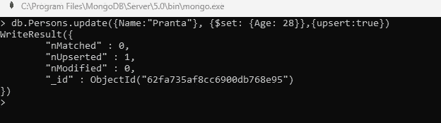
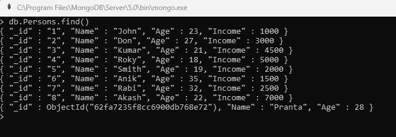
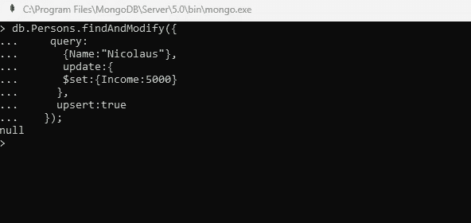
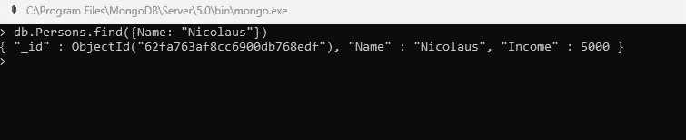
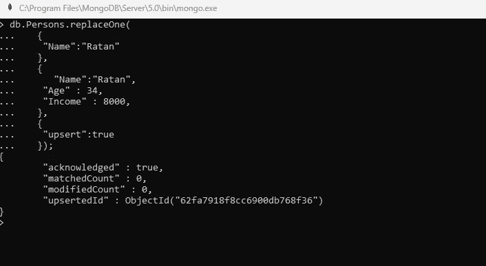
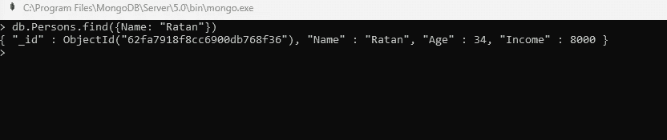
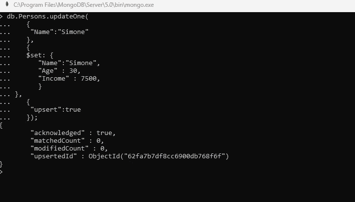
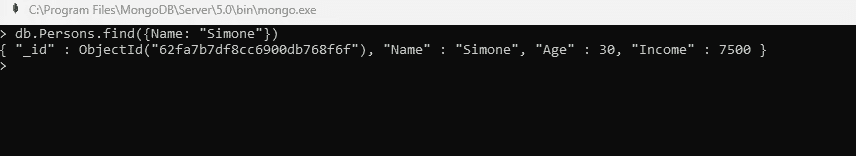
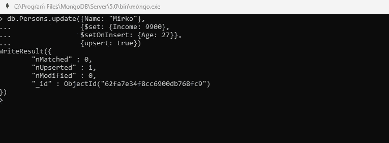
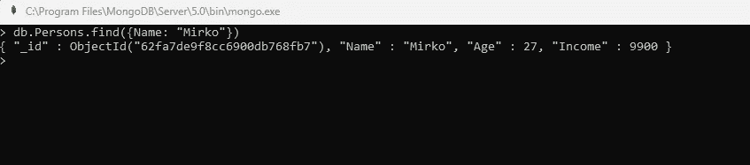

# MongoDB 中的 Upsert

> 原文：<https://blog.devgenius.io/upsert-in-mongodb-42233e4cfcc9?source=collection_archive---------14----------------------->

在 MongoDB 中使用 upsert 的完整指南

MongoDB update 命令修改集合中的文档。一个 update 命令可以包含多个 update 语句。要更新任何特定的文档，我们必须添加条件来选择特定的文档。


在 [Unsplash](https://unsplash.com?utm_source=medium&utm_medium=referral) 上由 [Boitumelo Phetla](https://unsplash.com/@writecodenow?utm_source=medium&utm_medium=referral) 拍摄的照片

MongoDB 提供了另一个命令 *Upsert* ，它也用于更新带有条件的任何特定文档。

*Upsert* 是插入和更新的组合(UPdate + inSERT = upsert)。我们可以使用 *upsert* 配合不同的更新方式，即 *update* 、 *findAndModify* 、 *updateOne、*和 *replaceOne* 。

在 MongoDB 中， *upsert* 选项是一个布尔值。

*   如果该选项的值被设置为*真*并且找到匹配指定查询的一个或多个文档，那么更新操作将*更新*匹配的一个或多个文档。
*   如果该选项的值设置为 *true* 并且没有一个或多个文档匹配指定的文档，则该选项*在集合中插入*一个新文档，并且该新文档具有指示操作的字段。

默认情况下，upsert 选项的值为*假*。如果分片集合中 upsert 的值为 true，那么您必须在过滤器中包含完整的分片键。

**up sert 命令的语法**

```
*upsert: <boolean>*
```

*上插*选项的值为*真*或*假*。

**MongoDB 中 upsert 的用途**

upsert 选项的主要目的是根据应用的过滤器更新现有文档，或者在过滤器不匹配时插入新文档。

**Upsert 在 MongoDB 中的使用**

我们可以通过以下方式使用 upsert。

(I)使用*更新()*方法进行 Upsert

(二)使用 *findAndModify()* 方法进行向上插入

(三)用 *replaceOne()* 方法向上插入

(四)使用 *updateOne()* 方法进行上插

(v)使用 *$set* 和 *$setOnInsert* 操作进行上插

在讨论 upsert 在 MongoDB 中的用法之前，

考虑以下数据中的一个集合名 *Persons。*

```
db.Persons.insert({ _id : "1", Name: "John", Age: 23, Income : 1000});
db.Persons.insert({ _id : "2", Name: "Don", Age: 27, Income : 3000});
db.Persons.insert({ _id : "3", Name: "Kumar", Age: 21, Income : 4500});
db.Persons.insert({ _id : "4", Name: "Roky", Age: 18, Income : 5000});
db.Persons.insert({ _id : "5", Name: "Smith", Age: 19, Income : 2000});
db.Persons.insert({ _id : "6", Name: "Anik", Age: 35, Income : 1500});
db.Persons.insert({ _id : "7", Name: "Rabi", Age: 32, Income : 2500});
db.Persons.insert({ _id : "8", Name: "Akash", Age: 22, Income : 7000});
```

**(i)用 *update()* 方法**进行 Upsert

我们可以使用 *upsert* 选项和 *update()* 方法。该选项的默认值为*假*。

如果我们想要更新个人收集中姓名为 *Pranta* 年龄为*28*的人的信息，并且我们有一个要求，如果不存在，则插入该人。我们有以下的上插选项，

```
db.Persons.update({Name:"Pranta"}, {$set: {Age: 28}},{upsert:true})
```

该命令的结果如下所示，



我们注意到插入了另一个文档，其 id 显示在控制台中。



由于 upsert 选项的值被设置为 *true* ，并且没有文档匹配名称 *Pranta* 和 *Age 28* ，因此 update()方法插入一个包含两个字段 *Name* 和 *Age* 的新文档。

**(ii)用 *findAndModify()* 方法**进行 Upsert

我们也可以通过 *findAndModify* 方法使用 *upsert* 选项。

如果我们想要更新 *Person* 集合中姓名为 *Nicolaus* 收入为*5000*的人的信息，并且我们有一个要求，如果不存在，则插入该人。我们有以下的上插选项，

```
db.Persons.findAndModify({
    query:
      {Name:"Nicolaus"}, 
      update:{
      $set:{Income:5000}
     },
     upsert:true
   });
```

该命令的结果如下所示，



如果我们找到结果，我们注意到另一个文档中插入了姓名为 *Nicolaus* 和*收入 5000* 。



**(iii)用 *replaceOne()* 方法**向上插入

MongoDB 的 *replaceOne* 方法只是在条件匹配时替换集合中的单个文档。

```
db.Persons.replaceOne(
   {
    "Name":"Ratan"
   },
   {
      "Name":"Ratan",
    "Age" : 34,
    "Income" : 8000,
   },
   {
    "upsert":true
   });
```

该命令的结果如下所示，



如果我们找到结果，我们注意到另一个文档中插入了姓名 *Ratan，年龄 34 岁，收入 8000* 。



**(iv)用 *updateOne()* 方法**进行上插

MongoDB 的 *updateOne* 方法只是在条件匹配时替换集合中的单个文档，如果条件匹配不成功，则插入一个文档。

```
db.Persons.updateOne(
   {
    "Name":"Simone"
   },
   {
   $set: {
      "Name":"Simone",
      "Age" : 30,
      "Income" : 7500,
      }
   },
   {
    "upsert":true
   });
```

该命令的结果如下所示，



如果我们找到结果，我们注意到另一个文档插入了名字 *Simone，年龄 30 岁，收入 7500* 。



**(v)上插*$设置*和*$设置插入*操作**

如果 *upsert* 选项的值为 *true* 并且没有文档匹配给定的过滤器，那么更新操作在给定的集合中插入一个新文档，并且在这个新文档中插入的字段是在查询和更新文档中指定的字段。

```
db.Persons.update({Name: "Mirko"}, 
                {$set: {Income: 9900}, 
                $setOnInsert: {Age: 27}},
                {upsert: true})
```

该命令的结果如下所示，



如果我们找到结果，我们注意到另一个文档被插入了名字 *Mirko，年龄 27，收入 9900* ，因为它没有找到任何名字为 *Mirko* 的文档。



**总结**

MongoDB 有很多更新和插入集合文档的命令。其中，upsert 用于更新文档以及在不符合条件时插入文档。我们已经看到了如何使用 MongoDB 的各种更新方法执行 *upsert* 操作。我们使用 mongo shell 实现 upsert 操作。

感谢阅读！