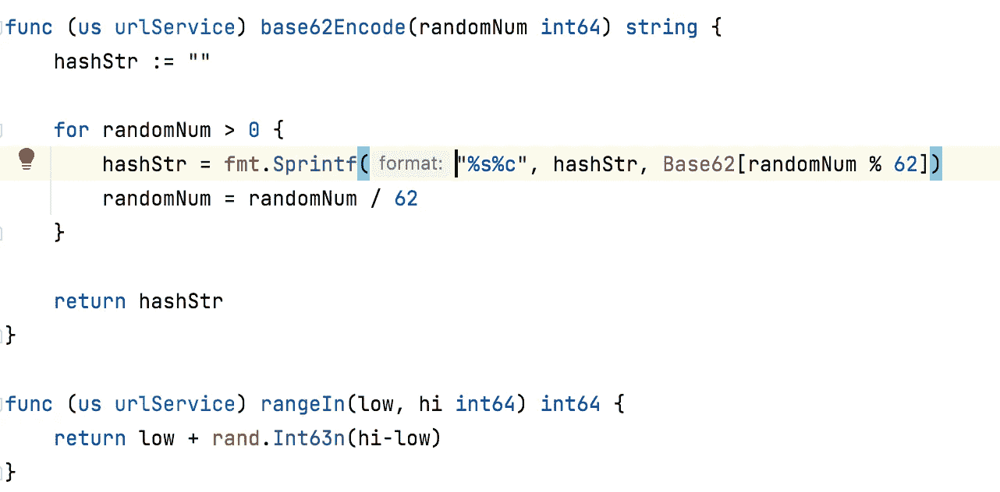
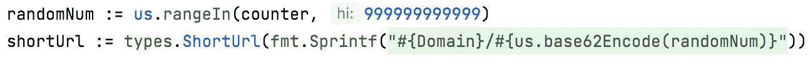

# 网址缩写系统设计

> 原文：<https://blog.devgenius.io/url-shortener-system-design-eb2d246a7f96?source=collection_archive---------3----------------------->

> 功能需求

*   收到长 url 时获取短 URL。
*   收到短 url 时重定向/获取长 url。
*   除域名外，URL 的长度应为 7。

> 非功能性需求

*   高度可用。
*   超低延迟
*   此用例不考虑 TTL 支持。

> 规模

考虑到我们是为 twitter/linkedin 这样的平台设计的:

*   每月 3 亿活跃用户。
*   10%会使用该功能=每月 3000 万。
*   每天 100 万。
*   每天支持 10 到 1000 万次的能力。

> 信息容量

我们将存储:

*   长 URL — 2 KB = 2048 个字符。
*   短 URL — 17 B
*   创建于公元前 7 世纪
*   在— 7 B 到期

总计= 2.03 KB/条目

> 端点

## 公共端点

*   /shorten_url
    输入:long_url
    输出:short_url，expires_at
    curl 命令:curl-X POST http://<host>:<port>/shorten _ URL-H " Content-Type:application/JSON "-d ' " long _ URL ":" https://a _ very _ log _ URL _ to _ be _ shorted _ 0311 . com " } '
*   /fetch_original_url
    输入:short_url
    输出:long_url，状态
    curl 命令:curl-X GET http://<host>:<port>/fetch _ URL-H " Content-Type:application/JSON "-d ' " " short _ URL ":" https://bitly . com/868 dg85 " } '

## 内部端点[在 VPN 内]

目前没有

注意:这里似乎也不需要登录和注销端点。

> 选择编码算法

## MD5 哈希

*   采用长 url 并生成 22–25 个字符长的随机字符串的函数。
*   我们需要选择前 7 个字符来获得我们的短网址。
*   7 个字符，因为这就是我们的短 url 的长度。
*   碰撞的几率很高。意味着不同的 URL 的前 7 个字符在很多情况下是相同的。

## Base 62 编码

*   基数 62 基本上意味着 o/p 由 62 个字符组成:a-z、A-Z 和 0-9。
*   这也是一个函数，它接受一个随机数并给出一个长度为 7 的 base 62 字符串。
*   随机数需要大于 62⁷，以生成 7 个字符长的字符串。
*   下面给出了 base 62 编码的实现。
*   碰撞是最小的，因为 2.5 万亿个组合是可能的。

> 数据库模式和数据库选择

> 活动的时间表

> 问题

## 下面列出了可能出现的问题:

*   如果为之前的请求生成了相同的随机数，则每个请求有多个 DB 调用。
*   为了解决可伸缩性问题，我们将有多个 web 服务器，但是跨 web 服务器生成相同随机数的机会增加了。
*   如果 DB 中的条目数量增加，检查是否已经生成短 URL 的查询将会变慢。
*   如果数据库中的条目数量增加，为给定的短 URL 获取长 URL 的查询将会变慢。

## 有序解决方案

*   如果我们可以生成增量随机数，我们可以避免单个 web 服务器中的冲突，并且如果短 URL 已经被采用，我们也可以跳过检查 DB，因为我们知道它是一个增量随机数
*   如果我们能有一个集中的柜台服务，应要求提供随机数，我们就能避免网络服务器之间的冲突。
*   我们可以有一个 redis 形式的键值存储，可以存储 long_url:short_url 和 short_url:long_url。TTL 将等于我们想要支持的持续时间。
*   前一点中的 redis 解决了这个问题。

> HLD —尝试 1

这里的问题是，如果计数器服务关闭，那么它将成为一个 SPOF，而且由于它是一个内存中的服务，冲突问题将得到支持。

> HLD —尝试 2

Zookeeper 是一个高度可用的组件，即使它的一个服务器关闭，它也会保留计数。

它的工作方式与卡夫卡相似。

Zookeeper 将为每个服务器分配一个随机的数字范围，当用完时将分配一个不同的范围。

所有的服务器都将成为动物园管理员的订户。

> 密码

我试着写了同样的代码。

这段代码目前只适用于单个服务器。

该代码也没有采用从外部服务策略获取随机数。

链接到代码库(戈兰语):[https://github.com/HiteshRepo/URL-Shortener](https://github.com/HiteshRepo/URL-Shortener)

如果你喜欢代码，请留下一颗星。