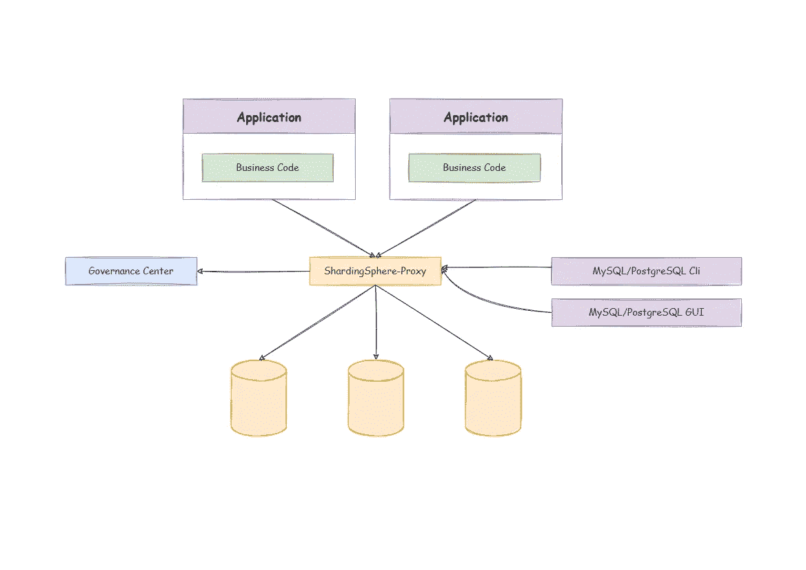

# 使用 AWS CloudFormation 创建 ShardingSphere HA 集群

> 原文：<https://blog.devgenius.io/use-aws-cloudformation-to-create-shardingsphere-ha-clusters-ba0e23f234bf?source=collection_archive---------12----------------------->

# 什么是 AWS CloudFormation？

[AWS CloudFormation](https://aws.amazon.com/cloudformation/) 是一种基础设施即代码(IaC)服务，允许您通过自定义模板轻松建模、供应和管理 [AWS](https://aws.amazon.com/) 提供的所有云服务。

传统上，当我们创建一个新的架构时，我们需要在 AWS 中一步一步地手动配置它，这可能会导致一些错误，例如忘记一些步骤。

现在有了 CloudFormation，我们可以使用声明性配置来定义资源，然后创建和管理它们，而不用担心资源的依赖顺序。

在现实世界的场景中，我们经常需要创建重复的架构。例如，我们可以在其架构和生产环境一致的预发布环境中构建一组 MQ 集群，并在每个可用性区域(AZ)中创建一个具有相同配置的`AutoScalingGroup`。

通过 CloudFormation，这些重复的架构可以以代码的形式表达，并存储在代码库中进行管理。这样，它们可以很容易地集成到现有的 CI/CD 管道中，以根据当前的 DevOps 流程实现基础架构的更改。因此，基础架构变更更加透明、可重复、可测试和可审计，简化了云系统的管理。

# 什么是 Apache ShardingSphere？

[Apache ShardingSphere](https://shardingsphere.apache.org/) 是一个分布式数据库生态系统，它可以将任何数据库转换为分布式数据库系统，并通过分片、弹性伸缩、加密等特性增强它&。

Apache ShardingSphere 遵循[数据库加](https://medium.com/faun/whats-the-database-plus-concepand-what-challenges-can-it-solve-715920ba65aa?source=your_stories_page-------------------------------------)的概念，旨在碎片化的异构数据库之上构建一个生态系统。它侧重于如何充分利用数据库的计算和存储能力，而不是创建一个全新的数据库。

[ShardingSphere-Proxy](https://shardingsphere.apache.org/document/current/en/overview/) 是一个透明的数据库代理，支持任何使用 [MySQL](https://www.mysql.com/) 、 [PostgreSQL](https://www.postgresql.org/) 和 [openGauss](https://opengauss.org/en/) 的客户端。

# 利用云编队进行部署

作为数据基础设施的重要组成部分，ShardingSphere 代理集群对于高可用性非常重要。出于这些原因，我们的社区希望您可以通过 IaC 来管理它，以享受 IaC 带来的好处。

在下面几节中，我们将使用 CloudFormation 在 multi-AZ 中创建一个 ShardingSphere-Proxy 集群。在创建 CloudFormation 模板之前，我们必须理解一个 ShardingSphere-Proxy 集群的架构图。



请注意，我们使用[动物园管理员](https://zookeeper.apache.org/)作为治理中心。

如您所见，ShardingSphere-Proxy 本身是一个无状态的应用程序。在生产场景中，它只需要提供一个负载均衡器，可以在实例之间灵活地分配流量。

为了确保 ZooKeeper 集群和 ShardingSphere-Proxy 集群的 HA，我们使用以下架构。


# 定义云形成参数

[cloud formation 模板](https://aws.amazon.com/cloudformation/resources/templates/?nc1=h_ls)是一个 yaml 或 json 文件，你可以在其中定义所有的基础设施。[cloud formation 参数](https://docs.aws.amazon.com/AWSCloudFormation/latest/UserGuide/parameters-section-structure.html)允许你将自定义值注入模板。然后，在定义资源时，您可以[引用](https://docs.aws.amazon.com/AWSCloudFormation/latest/UserGuide/intrinsic-function-reference-ref.html)这些参数。当然，我们也提供默认值，如果需要的话可以覆盖它。

我们使用 [cfndsl](https://github.com/cfndsl/cfndsl) 编写 CloudFormation 模板:cfndsl 是用 [ruby](https://www.ruby-lang.org/en/) 编写的工具，允许你通过 dsl 配置生成 CloudFormation 模板。

```
Parameter("ZookeeperInstanceType") {
  String
  Default "t2.nano"
}

Parameter("ShardingSphereInstanceType") {
  String
  Default "t2.micro"
}

Parameter("KeyName") {
  String
  Default "test-tf"
  Description "The ssh keypair for remote connetcion"
}

Parameter("ImageId") {
  Type "AWS::EC2::Image::Id"
  Default "ami-094bbd9e922dc515d"
}

Parameter("VpcId") {
  String
  Default "vpc-0ef2b7440d3ade8d5"
  Description "The id of your VPC"
}

....
```

更多参数请参考此[链接](https://github.com/apache/shardingsphere-on-cloud/blob/main/cloudformation/multi-az/cf.rb#L21)。

# 定义云形成资源

注意，AWS 的区域通常包括两个以上的 az，所以我们创建了三个实例。

# 动物园管理员集群

首先，我们在每个 AZ 中部署一个 Zookeeper EC2 实例，以确保 Zookeeper 集群的 HA。

然后我们为每个 Zookeeper 实例创建一个内部域名，ShardingSphere-Proxy 使用这些域名。

当 ZooKeeer 实例启动时，cloud-init 用于自动部署 Zookeeper 服务。你可以在这里查看云初始化配置[。](https://github.com/apache/shardingsphere-on-cloud/blob/main/cloudformation/multi-az/zookeeper-cloud-init.yml)

```
(0..2).each do |i| 
    name = "ZK#{i+1}"
    EC2_Instance(name) {
      AvailabilityZone FnSelect(i, FnGetAZs(Ref("AWS::Region")))
      InstanceType Ref("ZookeeperInstanceType")
      ImageId Ref("ImageId")
      KeyName Ref("KeyName")
      SubnetId FnSelect(i, Ref("Subnets"))
      SecurityGroupIds Ref("SecurityGroupIds")
      Tags [ 
        Tag do 
          Key "Name"
          Value "ZK-#{i+1}"
        end
      ]

      server = "server.%{idx}=zk-%{idx}.${HostedZoneName}:2888:3888"
      UserData FnBase64(
        FnSub(
          IO.read("./zookeeper-cloud-init.yml"), 
          :SERVERS => FnSub((0..2).map{|i| i == 0 ? server %{:idx => i+1} : ("#{server}" %{:idx => i+1}).insert(0, " " * 4)}.join("\n")), 
          :VERSION => Ref("ZookeeperVersion"),
          :ZK_HEAP => Ref("ZookeeperHeap"),
          :INDEX => i+1,
        )
      )
    }

    domain = "zone#{name}"
    Route53_RecordSet(domain) {
      HostedZoneId Ref("HostedZoneId")
      Name FnSub("zk-#{i+1}.${HostedZoneName}")
      Type "A"
      ResourceRecords [FnGetAtt(name, "PrivateIp")]
      TTL "60"
    }
  end
```

# sharding sphere-代理集群

## 启动模板

接下来，我们在每个 AZ 中部署一个 AutoScalingGroup，以确保 sharing sphere-Proxy 集群的 HA。

在创建 AutoScalingGroup 之前，我们需要在每个 AZ 中为 ShardingSphere-Proxy 实例创建一个 LaunchTemplate。

类似地，当实例启动时，cloud-init 用于自动部署 ShardingSphere-Proxy 服务。你可以在这里查看云初始化配置[。](https://github.com/apache/shardingsphere-on-cloud/blob/main/cloudformation/multi-az/shardingsphere-cloud-init.yml)

```
(0..2).each do |i| 
    name = "launchtemplate#{i}"
    EC2_LaunchTemplate(name) {
      LaunchTemplateName FnSub("shardingsphere-${TMPL_NAME}", :TMPL_NAME => FnSelect(i, FnGetAZs(Ref('AWS::Region'))))
      LaunchTemplateData do 
        ImageId Ref("ImageId")
        InstanceType Ref("ShardingSphereInstanceType")
        KeyName Ref("KeyName")

        MetadataOptions do
          HttpEndpoint "enabled"
          HttpTokens   "required"
          InstanceMetadataTags "enabled"
        end

        Monitoring do
          Enabled  true
        end

        NetworkInterfaces [
          {
            :DeleteOnTermination => false,
            :DeviceIndex => 0,
            :NetworkInterfaceId => FnGetAtt("networkiface#{i}", "Id")
          }
        ]

        TagSpecifications [
          {
            :ResourceType => "instance",
            :Tags => [
              {
                :Key => "Name",
                :Value => "shardingsphere-#{i+1}"
              }
            ]
          }
        ]

        UserData FnBase64(
          FnSub(
            IO.read("./shardingsphere-cloud-init.yml"), 
            :ZK_SERVERS => FnSub((0..2).map{|i| "zk-#{i+1}.${HostedZoneName}:2181" }.join(",")), 
            :VERSION => Ref("ShardingSphereVersion"),
            :JAVA_MEM_OPTS => Ref("ShardingSphereJavaMemOpts")
          )
        )
      end
    }
  end
```

## 目标组

当我们使用 [ELB](https://aws.amazon.com/elasticloadbalancing/) 来加载每个 sharing sphere-Proxy 之间的流量时，ELB 应该与 [TargetGroup](https://docs.aws.amazon.com/AWSCloudFormation/latest/UserGuide/aws-resource-elasticloadbalancingv2-targetgroup.html) 结合使用。

AutoScalingGroup 创建的实例自动注册到 TargetGroup。然后，ELB 会将流量转发到目标组。

```
ElasticLoadBalancingV2_TargetGroup("sslbtg") {
    Name "shardingsphere-lb-tg"
    Port Ref("ShardingSpherePort")
    Protocol "TCP"
    VpcId Ref("VpcId")
    TargetGroupAttributes [
      TargetGroupAttribute do
        Key "preserve_client_ip.enabled"
        Value "false"
      end
    ]
    Tags [
      Tag do
        Key "Name"
        Value "shardingsphere"
      end
    ]
  }
```

## 自动缩放组

创建了上述资源之后，现在我们可以创建一个 AutoScalingGroup。

```
(0..2).each do |i| 
    name = "autoscaling#{i}"
    AutoScaling_AutoScalingGroup(name) {
      AutoScalingGroupName "shardingsphere-#{i}" 
      AvailabilityZones [FnSelect(i, FnGetAZs(Ref("AWS::Region")))]
      DesiredCapacity "1"
      MaxSize "1"
      MinSize "1"
      HealthCheckGracePeriod  60
      HealthCheckType "EC2"

      TargetGroupARNs [ Ref("sslbtg")]

      LaunchTemplate do
        LaunchTemplateName  FnSub("shardingsphere-${TMPL_NAME}", :TMPL_NAME => FnSelect(i, FnGetAZs(Ref('AWS::Region'))))
        Version FnGetAtt("launchtemplate#{i}", "LatestVersionNumber")
      end
    }
  end
```

## 负载平衡器和监听器

为 ShardingSphere-Proxy 集群的外部服务创建一个内部负载平衡器和监听器。

```
ElasticLoadBalancingV2_LoadBalancer("ssinternallb") {
    Name "shardingsphere-internal-lb"
    Scheme "internal"
    Type "network"

    mappings = (0..2).map { |x| 
        SubnetMapping do
          SubnetId FnSelect(x, Ref("Subnets"))
        end
    }
    SubnetMappings mappings
    Tags [
      Tag do
        Key "Name"
        Value "shardingsphere"
      end
    ]
  }

  ElasticLoadBalancingV2_Listener("sslblistener") {
    Port Ref("ShardingSpherePort")
    LoadBalancerArn Ref("ssinternallb")
    Protocol "TCP"
    DefaultActions [
      {
        :Type => "forward",
        :TargetGroupArn => Ref("sslbtg")
      }
    ]
  }
```

## 内部域名

最后，我们为 ShardingSphere-Prxoy 集群的外部服务创建内部域名。这些域名指向内部负载平衡器。

```
Route53_RecordSet("ssinternaldomain") {
    HostedZoneId Ref("HostedZoneId")
    Name FnSub("proxy.${HostedZoneName}")
    Type "A"
    AliasTarget do 
      HostedZoneId FnGetAtt("ssinternallb", "CanonicalHostedZoneID")
      DNSName FnGetAtt("ssinternallb", "DNSName")
      EvaluateTargetHealth true
    end
  }
```

# 部署

使用命令`cfndsl cf.rb -o cf.json --pretty`生成最终的[配置](https://github.com/apache/shardingsphere-on-cloud/blob/main/cloudformation/multi-az/cf.json)。

在 UI 页面上创建堆栈，并选择我们生成的配置文件。


几分钟后，你会发现所有的资源都创建好了。


你可以在这里找到完整的代码[，或者访问我们的](https://github.com/apache/shardingsphere-on-cloud/tree/main/cloudformation/multi-az)[网站](https://shardingsphere.apache.org/oncloud/current/en/operation-guide/cloudformation-multi-az/)了解更多信息。

# 试验

该测试旨在确保我们创建的集群是可行的。下面是一个简单的例子。

使用 DistSQL(分布式 SQL)添加两个数据源并创建一个简单的分片规则，然后插入数据。我们可以看到查询返回了正确的结果。

默认情况下，当我们使用 CloudFormation 时，会创建一个内部域名`proxy.shardingsphere.org`。ShardingSphere-Proxy 集群的用户名和密码都是`root`。


**注:** [DistSQL(分布式 SQL)](https://shardingsphere.apache.org/document/current/en/user-manual/shardingsphere-proxy/distsql/) 是 ShardingSphere 的类 SQL 操作语言。它的使用方式与标准 SQL 相同，旨在提供增量 SQL 操作功能。

# 结论

AWS CloudFormation 是一个非常强大的服务，对于 sharing sphere-Proxy 集群的迭代非常有帮助。有了这个新功能，现在开始使用 Apache ShardingSphere 比以往任何时候都容易。