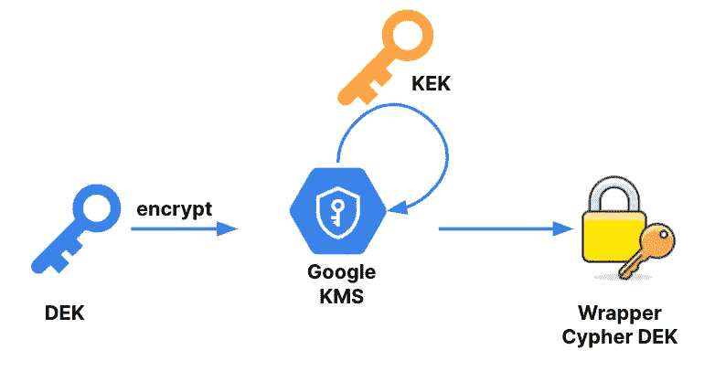
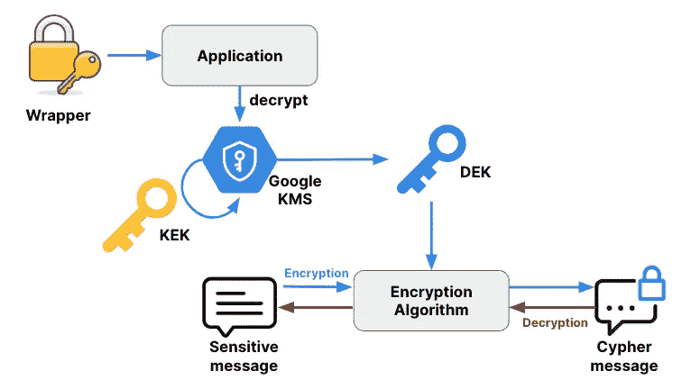
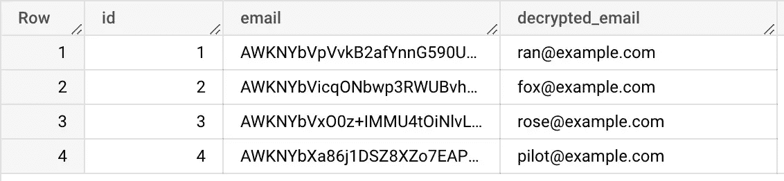

# 使用 AEAD 函数和 Tink 保护您的 BigQuery 数据管道

> 原文：<https://blog.devgenius.io/use-bigquery-aead-functions-and-tink-to-secure-your-data-pipeline-f5cc60f9caf5?source=collection_archive---------4----------------------->

## 在应用程序端加密数据，并在查询时按需解密

[BigQuery AEAD(带关联数据的认证加密)函数](https://cloud.google.com/bigquery/docs/reference/standard-sql/aead_encryption_functions)提供了一种在 BigQuery 中加密和解密列级数据的方法。这允许您加密敏感数据的各个列，同时还允许您查询表中的其余数据。

在本文中，您将看到如何在应用程序端加密敏感数据，并在查询时使用 [Tink](https://developers.google.com/tink) 库、BigQuery AEAD 函数和 Google KMS 在 BigQuery 中解密，从而保护您的数据管道。

我们将使用确定性加密，但是您可以用等效的非确定性函数替换每个函数。

# 创建数据加密密钥包装

为了加密您的数据，您首先需要创建一个数据加密密钥(DEK)。您的 DEK 被认为是最高机密，因为如果密钥被透露给未经授权的个人，他们将能够访问您的数据。

要为 DEK 添加额外的安全层，您可以使用存储在外部加密服务中的密钥加密密钥(KEK)对其进行加密。谷歌云 KMS(密钥管理服务)支持这种类型的密钥加密，允许您安全地存储和管理您的 KEK。

被加密的 DEK 被加密的 KEK 将被称为包装器。包装器不是秘密的，因为没有使用 KEK 的许可，你不能解密它。

包装器生成过程将如下所示:



使用 KMS 创建包装

总而言之，

DEK(数据加密密钥)—是一种用于加密和解密数据的密钥。它是用于实际加密和解密数据本身的密钥，并且是保密和受保护的密钥。

KEK(密钥加密密钥)—是用于加密和解密 DEK 的密钥。它不用于加密和解密数据本身，而是用于保护 DEK，确保只有授权用户才能访问它。

包装器—是由 KEK 加密的 DEK。这不是一个秘密，你不需要保护它，因为它只有在你能访问 KEK 的情况下才能被解密。

# 创造一个 KEK

要使用[谷歌 KMS](https://cloud.google.com/sdk/gcloud/reference/kms) 中的 KEK 加密你的 DEK，你首先需要创建一个密匙环和密匙环中的一个密钥(这个密钥将是 KEK)。您可以使用 KMS 控制台，或者通过执行以下命令行来实现:

```
$ gcloud kms keyrings create poc-keyring \
    --location us-central1

$ gcloud kms keys create kek \
    --keyring poc-keyring \
    --location us-central1 \
    --purpose "encryption"
```

您应该拥有[云 KMS 管理员](https://cloud.google.com/kms/docs/reference/permissions-and-roles#cloudkms.admin)角色才能执行这些命令。

密钥环是密钥的逻辑容器，而密钥是与特定加密密钥相关联的唯一标识符。

一旦你创建了密匙环和密匙，你就可以使用 KMS API 来生成一个新的 KEK，并用它来加密你的 DEK。这将为您的 DEK 提供额外的安全保护，并帮助防止未经授权的访问。

# 安装 Tinkey

[Tink](https://developers.google.com/tink) 是由谷歌的密码学家和安全工程师编写的开源密码库。它还提供了一个名为 [Tinkey](https://github.com/google/tink/blob/master/docs/TINKEY.md) 的 CLI 工具，允许生成和操作 Tink 键集。

我们将使用 Tink 库来加密数据，并用 Tinkey 来生成密钥。

首先，我们应该安装 Tinkey，如果要使用 brew 安装它，请执行以下命令:

```
$ brew tap google/tink https://github.com/google/tink
$ brew install tinkey
```

否则，您可以遵循此处的安装说明[。](https://github.com/google/tink/blob/master/docs/TINKEY.md#tinkey)

Tinkey 需要 Java 8 或更高版本才能运行。

# 创建包装的键集(包装器)

使用 Tinkey，您可以创建包装器。以下命令将生成一个新的 DEK，并使用谷歌 KMS 对 KEK 进行加密。

确保用 KMS 的 KEK uri 更新主密钥 uri。

您应该将 [*云 KMS 密钥加密器*](https://cloud.google.com/kms/docs/reference/permissions-and-roles#cloudkms.cryptoKeyDecrypterViaDelegation) 角色分配给相关的 KEK，以便执行这些命令。

```
$  tinkey create-keyset \
--key-template AES256_SIV \
--out-format json \
–out keyset.json \
--master-key-uri
'gcp-kms://projects/aead-poc/locations/us-central1/keyRings/poc-keyring/cryptoKeys/kek’
```

它将创建一个如下所示的 JSON 文件，包装器是 *encryptedKeyset* 属性的值:

```
{
 "encryptedKeyset": "CiQA14LEnuISWuJQKSETKUD1vgBxhLqJd91FO0YxjjWjN3fvC4MStwEA0pJ5OArBrNvseG/EuJ4rcxbFVpOnCHOsnAbcz0ZlaHeOFKiFHovta2sk/jsPf4iHXEHjO1oL2D2v/5oXQNMd1vzCtSAsGL0P1ZQhr7ZIu4ZOCYalviUqupBSQp/B83ddamxctCXV5ZaWPCuSwUNxtRtsz+xRCYc8tYIozADt4PBmVgCn63sG7WzMrkEmo4cfoAI2hzhSt8I7+MM8xHzo1OppIKgMFi3zrWu8fNBOki2brY9fZ3U=",
 "keysetInfo": {
   "primaryKeyId": 1996068671,
   "keyInfo": [
     {
       "typeUrl": "type.googleapis.com/google.crypto.tink.AesSivKey",
       "status": "ENABLED",
       "keyId": 1996068671,
       "outputPrefixType": "TINK"
     }
   ]
 }
}
```

您还可以使用内置的 BigQuery AEAD 函数、 [KEYS 来生成一个包装器。NEW_WRAPPED_KEYSET](https://cloud.google.com/bigquery/docs/reference/standard-sql/aead_encryption_functions#keysnew_wrapped_keyset) 。

# 在应用程序端加密您的数据

现在我们有了包装器，我们终于可以加密我们的数据了。

我们的应用程序应该要求谷歌 KMS 解密包装。为此，它将向 KEK 提供 URI。如果应用程序有正确的许可，谷歌 KMS 将返回 DEK。一旦应用程序在内存中有了 DEK，它就可以使用相关的加密算法来加密/解密数据。

**注意:数据本身不使用谷歌 KMS 加密/解密，只使用包装器。**



使用包装器和谷歌 KMS 的应用程序加密/解密过程

# 让我们看看一些代码

为此我们将使用 Tink 库，我在示例中使用了 python，但它在 [Java](https://developers.google.com/tink/install-tink#java) 中也受支持。

首先，安装下面的 [pip 依赖](https://pypi.org/project/tink/):

```
$  pip install tink
```

现在我们将读取包装器并创建一个密码对象

```
import tink
from tink import daead
from tink.integration import gcpkms

KEK_URI = ‘gcp-kms://projects/aead-poc/locations/us-central1/keyRings/poc-keyring/cryptoKeys/kek’
KEYSET_WRAPPER_JSON_PATH = './keyset.json'
GCP_CREDENTIAL_PATH = '' # empty string for default or service account json path

with open(keyset_wrapper_json_path, 'rt') as keyset_file:
        keyset_wrapper_json = keyset_file.read()
        daead.register()

        keyset_handle = tink.KeysetHandle.read(
            tink.JsonKeysetReader(KEYSET_WRAPPER_JSON_PATH), gcpkms.GcpKmsClient('', GCP_CREDENTIAL_PATH).get_aead(KEK_URI))
        cipher = keyset_handle.primitive(daead.DeterministicAead)
```

一旦我们有了可以用来加密数据的密码，如果我们愿意，我们也可以用它来解密。

```
import base64
ciphertext = cipher.encrypt_deterministically(b'example_plaintext', b'')
print(base64.b64encode(ciphertext))
print(cipher.decrypt_deterministically(ciphertext, b''))
```

它将打印以下结果:

```
b'BXKNZ9WWfl0iGwvrmxcRLH9VBQ1wpYo7+MCcho08qxtAyVb7jDz='
b'example_plaintext'
```

万一你得到错误:
ti *nk.core._tink_error。tinker error:INVALID _ ARGUMENT:GCP KMS 加密失败:空更新* 遵循[这些指令](https://github.com/google/tink/issues/399#issuecomment-1173914470)以便解决它。

# 将加密数据插入 BigQuery

现在，让我们一起总结一下，创建一个代码，在 BigQuery 中创建一个表，表中的数据使用我们的 DEK 加密。

确保安装以下依赖项:

```
$  pip install tink
$  pip install pandas
$  pip install pandas-gbq
```

这段代码在 BigQuery 中创建了带有两个字段(` id`、` email `)的 *users* 表，其中` id '不加密，而` email '加密。

实际上，您的数据管道可能看起来不同，但是我为了这个例子简化了它。

```
import tink
from tink import daead
from tink.integration import gcpkms
import pandas as pd

KEK_URI = ‘gcp-kms://projects/aead-poc/locations/us-central1/keyRings/poc-keyring/cryptoKeys/kek’
KEYSET_WRAPPER_JSON_PATH = '../keyset.json'
GCP_CREDENTIAL_PATH = ''  # empty string for default or service account json path
PROJECT_ID=’aead-poc’
TABLE_NAME=’poc.users’

def encrypt_and_insert_to_bigquery():
    data = [
        [1, 'ran@example.com'],
        [2, 'fox@example.com'],
        [3, 'rose@example.com'],
        [4, 'pilot@example.com'],
    ]

    # Create the pandas DataFrame
    df = pd.DataFrame(data, columns=['id', 'email'])

    with open(KEYSET_WRAPPER_JSON_PATH, 'rt') as keyset_file:
        # Read the wrapper
        keyset_wrapper_json = keyset_file.read()
        daead.register()

        # Decrypt the wrapper and create cipher
        keyset_handle = tink.KeysetHandle.read(
            tink.JsonKeysetReader(keyset_wrapper_json), gcpkms.GcpKmsClient('', GCP_CREDENTIAL_PATH).get_aead(KEK_URI))
        cipher = keyset_handle.primitive(daead.DeterministicAead)

        # Encrypt the email column using the DEK
        df['email'] = df['email'].apply(lambda email: cipher.encrypt_deterministically(email.encode(), b''))

        # Save to BigQuery
        df.to_gbq(
                  destination_table=TABLE_NAME,
                  project_id=PROJECT_ID,
                  table_schema=[{'name': 'id', 'type': 'INTEGER'},
                                {'name': 'email', 'type': 'BYTES'}],
                  chunksize=10000,
                  if_exists='replace'
                  )

if __name__ == '__main__':
    encrypt_and_insert_to_bigquery()
```

由于这段代码解密了包装器，您应该将一个 [*云 KMS 密钥解密器*](https://cloud.google.com/kms/docs/reference/permissions-and-roles#cloudkms.cryptoKeyDecrypter) 角色分配给相关的 KEK。

# 使用 AEAD 函数在查询时解密数据

现在，当我们有一个包含加密数据的表时，我们可以使用*DETERMINISTIC _ DECRYPT _ STRING*函数来解密数据。

```
DECLARE KMS_RESOURCE_NAME STRING;
DECLARE WRAPPER BYTES;
SET KMS_RESOURCE_NAME = ‘gcp-kms://projects/aead-poc/locations/us-central1/keyRings/poc-keyring/cryptoKeys/kek’;
SET WRAPPER = FROM_BASE64("CiQA….Z3U="); #replace it with your wrapper - taken from `encryptedKeyset` in keyset.json
SELECT
  id,
  email,
  DETERMINISTIC_DECRYPT_STRING( KEYS.KEYSET_CHAIN(KMS_RESOURCE_NAME,
      WRAPPER),
    email,
    "") decrypted_email
FROM `aead-poc.poc.users`
```

它将返回以下结果:



# 许可

如果一个用户拥有[*云 KMS 密钥解密器*](https://cloud.google.com/kms/docs/reference/permissions-and-roles#cloudkms.cryptoKeyDecrypter) 的角色，这实际上意味着他可以解密包装器并得到绝密的 DEK。因此，我们不应该将这种能力给予需要访问来解密数据的用户。

GCP 专门为这个案例创造了一个神奇的角色， [*云 KMS 密钥解密器通过*](https://cloud.google.com/kms/docs/reference/permissions-and-roles#cloudkms.cryptoKeyDecrypterViaDelegation) 委托。它支持通过其他 Google 云服务进行解密操作，这意味着它将解密包装器的权限委托给 BigQuery，但用户自己无法做到这一点。

# 让使用 UDF 更容易

如果你觉得写这么多 SQL 代码来解密你的数据很烦人或者很麻烦，你可以通过创建下面的 UDF 来简化它

```
CREATE OR REPLACE FUNCTION `aead-poc.poc.decrypt`(encodedText bytes) RETURNS STRING AS (
   DETERMINISTIC_DECRYPT_STRING(
KEYS.KEYSET_CHAIN('gcp-kms://projects/aead-poc/locations/us-central1/keyRings/poc-keyring/cryptoKeys/kek',
           b'\004\324........\003'), 
     encodedText, "")
);
```

你必须将你的包装转换成八进制转义序列。您可以使用以下 python 命令来实现:

```
wrapper = ‘CiQA….Z3U=’
print("b'" + ''.join(f'\\{n:03o}' for n in base64.b64encode(wrapper.encode())) + "'")
```

然后，您只需执行以下查询，它将返回相同的结果:

```
SELECT 
  id,
  email, 
 `aead-poc.poc.decrypt`(email) decrypted_email
FROM `poc.users`
```

在这种情况下，用户必须拥有“ *aead-poc.poc.decrypt* ”功能的权限，并且还必须拥有通过委托到 KEK 的*云 KMS 密钥解密器的权限。*

希望它能帮助你保护你的数据管道。请记住，只加密敏感数据，否则，使用您的表会很麻烦。

享受加密！