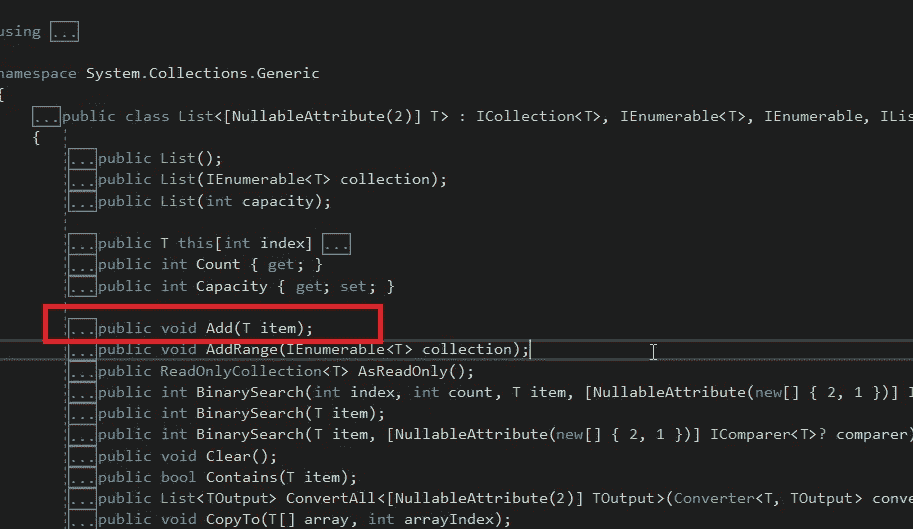
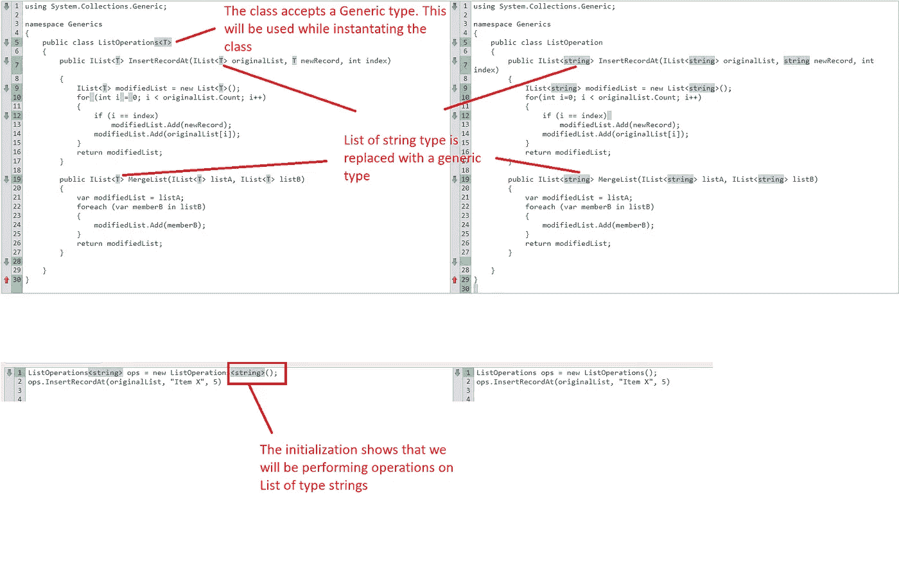
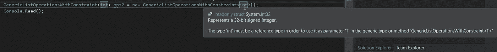

# 使用泛型来遵循枯燥的原则，而没有负罪感

> 原文：<https://blog.devgenius.io/use-generics-to-follow-dry-principles-without-guilt-7602e6914b0a?source=collection_archive---------3----------------------->

干——不要重复你的


最常用的开发实践之一是遵循 DRY(不要重复自己)原则。这一原则的目的是避免代码重复。它消除了技术债务，促进了代码的简单维护。

有时，[遵循 DRY 原则](https://jeremiahflaga.github.io/2021/10/01/on-the-tension-between-DRY-and-SRP/)可能会很棘手，因为如果我们在一个地方组合许多功能或编写许多条件逻辑，它可能会违反[单一责任原则](https://tarunbhatt9784.medium.com/solid-take-responsibility-c5404bf2d4c8?sk=29b469d3fe353abec3e3352f9dc69559)。

我们可以坚持 DRY 原则而不用担心违反 SRP 的方法之一是使用泛型。在这篇文章中，我将使用 C#，但是其他一些软件语言也支持泛型，概念或多或少是相同的。

# 什么是泛型

> 泛型允许软件程序员在不指定数据类型但确保类型安全的情况下编写代码。

泛型的最好例子是查看一些集合类，如 List、Dictionary 等。

```
IList<string> strings = new List<string>();
```

在上一行中，我们已经初始化了一个字符串列表。这并不意味着我们只能创建一个字符串列表。List 支持开发任何类型的列表。例如，要实例化 Employee 类型的对象列表，我们可以执行以下操作:

```
IList<Employee> employees = new List<Employee>();
```

这并不意味着有一个单独的类来创建字符串和类雇员的列表。不仅如此，用于添加一个字符串或者 employee 类型的类的 Add()也是一样的。



我的开发人员笔记本电脑截图

有了这个介绍，我将把这篇文章分成三个部分

1.  创建泛型类
2.  创建泛型方法
3.  向泛型方法或类添加约束

# 创建泛型类

假设我们需要一个执行一些列表操作的类:

1.  InsertRecordAt() —在字符串列表中的特定位置插入记录
2.  MergeList() —合并两个字符串列表。

这些方法的代码将类似于

假设我们想要对整数列表或任何其他类型的列表执行类似的操作。我们将不得不制定新的方法。由于创建这些额外方法的逻辑将与现有方法相同，所以问题是违反了 DRY(不要重复自己)原则。

让我们利用泛型为任何类型的列表创建逻辑。

让我们比较这两个类以及它们的实例化方式



从我的开发人员笔记本电脑

# 创建泛型方法

做任何事都是一个问题。如果我们不希望所有的类方法都操作泛型参数，我们应该使用泛型方法而不是泛型类。下面的示例演示了由泛型和非泛型方法组成的非泛型类:

泛型和非泛型方法可以被称为:

```
ListOperations ops1 = new ListOperations();ops1.InsertRecordAt<string>(originalList, “item 3”, 4);
ops1.NonGenericMethod();
```

# 带约束的泛型

可能会有这样的情况，我们希望对泛型类或方法的使用者施加约束。例如，如果您希望将列表操作用于引用而不是值数据类型。执行以下操作

```
public class ListOperations<T> where T : class
```

完整的类将看起来像:

如果我们使用这个类对整数进行任何列表操作，编译器将会报错，因为 int 数据类型是值类型而不是引用类型。



从我的开发人员笔记本电脑

本文是对 C#中泛型的快速介绍。这是一个很大的话题，我希望在接下来的会议中能涉及更多。

谢谢

塔伦

> 页（page 的缩写）s-Medium 是一个阅读、写作和向其他作者学习的绝佳平台。如果你想加入我的旅程，今天就加入 [medium](https://tarunbhatt9784.medium.com/membership) 。