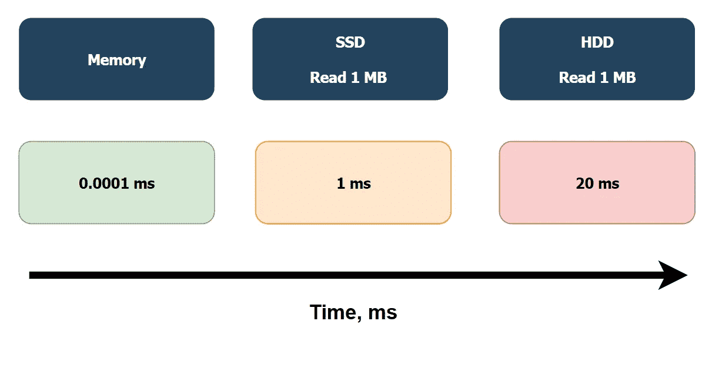
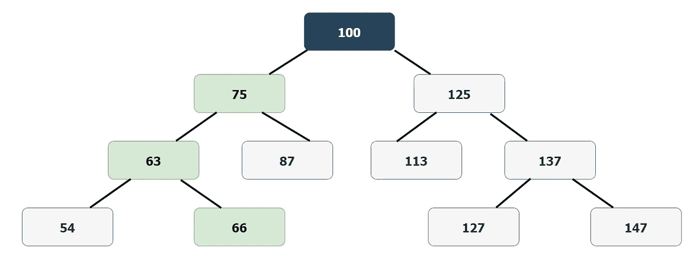
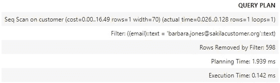
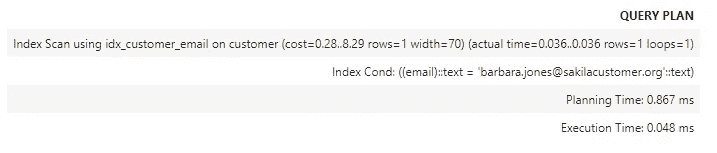
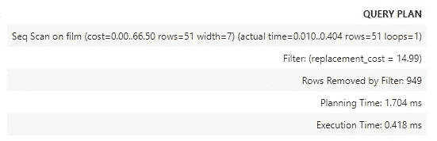
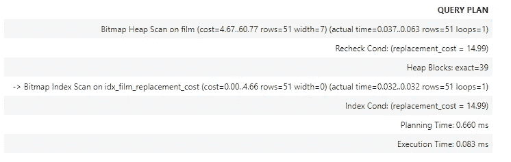
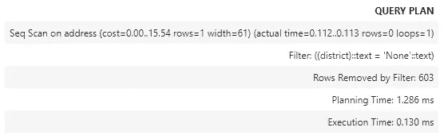
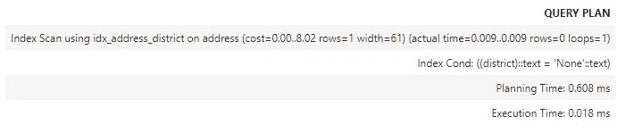
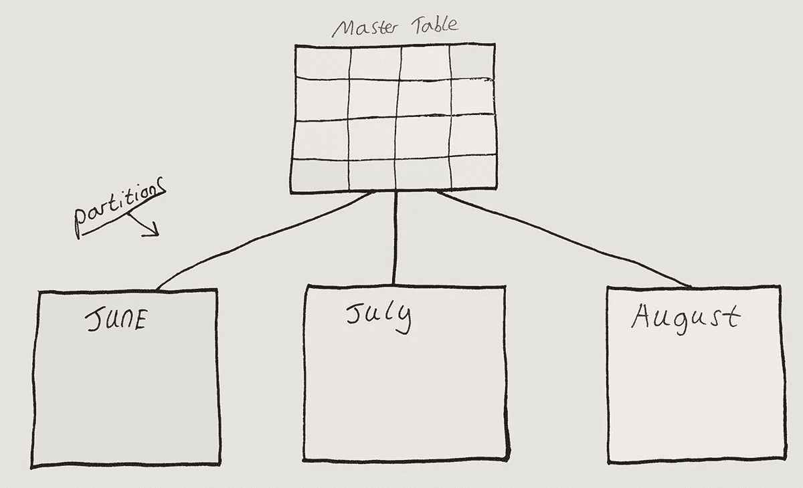

# 使用索引来加速您的 SQL 查询

> 原文：<https://blog.devgenius.io/use-indexing-to-speed-up-your-sql-queries-a38af978ba2d?source=collection_archive---------2----------------------->


# 动机

这篇文章是我在 PostgreSQL 上的系列文章，之前的博文可以在这里找到。这篇文章的目标是熟悉索引，特别关注查询的执行和计划时间。本指南使用了一个名为 dvdrental 的示例数据库，这是一个用于学习 PostgreSQL 的常见资源，可以从[这里](https://www.postgresqltutorial.com/postgresql-sample-database/)下载。

**这段代码也在我的 GitHub 上——可以从** [**这里**](https://github.com/ConanMercer/PostgreSQL/blob/master/postgresSQL_Indexes.ipynb) 查看

# 指数

创建索引是提高 SQL 执行效率的一种方式，索引是表中数据的有序子集。它们可以提高搜索特定值的属性的效率。常见索引的类型有:

*   **B 树索引**，一种自平衡的树数据结构，维护已排序的数据并允许搜索
*   **位图索引**，使用位数组(通常称为位图)并通过对这些位图执行逐位逻辑运算来回答查询
*   **哈希索引**，在查找过程中，对关键字进行哈希处理，得到的哈希指示相应值的存储位置

索引可以加快执行时间，因为它们减少了对全表扫描的需求。它们还有助于强制约束，例如，如果在将新值添加到行之前某列有唯一约束，则检查索引列的相应值是否已经在索引中会提示约束冲突。这比用全表扫描检查整个表要快。



大多数时候，索引比表小。在这种情况下，索引更可能适合系统内存，而不是固态驱动器(SSDs)或硬盘驱动器。在这种情况下，执行时间明显更快，大约为 100 纳秒，而固态硬盘和硬盘的执行时间分别为 1 毫秒和 20 毫秒。

# b 树索引

顾名思义，B 树索引中的数据是以树状结构组织的，有根和节点。根号大约是数据集的中间值，从这里节点分裂到根的左边和右边。较小的数字向左拆分，较大的数字向右拆分。这种模式一直持续到底部，即所有数据都被计算在内的点。

例如，如果根的值为 100，则节点可以在左侧 75 处和右侧 125 处分开。这些节点中的每一个都将再次分裂，因此左侧 75 将在 63 处分裂为左侧，在 87 处分裂为右侧。这种模式在树的每一层继续，下面是一个例子。



如果需要值 66，则需要进行三次比较才能达到，如上面的 B 树索引示例所示。从 100 处的根到 75 处的左侧节点，然后到 63 处的左侧，最后到右侧到达 66。这条路径在上面用绿色表示。

B 树索引是比较常见的索引之一。在 PostgreSQL 中，它是默认索引。当一列中有许多不常见或唯一的值时，这很有用，这就是所谓的高基数。

在下面的例子中，使用`WHERE`语句从 customer 表中查询一个特定的电子邮件地址。此时，没有使用任何索引。这被称为查询计划声明扫描是“Seq Scan ”,它代表顺序扫描。顺序扫描与全表扫描是一回事。计算成本为`16.49`，计划时间为`1.939 ms`，执行时间为`0.142 ms`。

```
**EXPLAIN** **ANALYSE**
**SELECT** *****
**FROM** customer
**WHERE** email **=** 'barbara.jones@sakilacustomer.org';
```



下面的第二个查询是相同的，只是这次在 customer 表上为列`email`创建了一个名为`idx_customer_email`的 B 树索引。这就是所谓的查询计划，它声明扫描是一种“索引扫描”。通过使用这种 B 树索引，查询的整体速度显著提高。计算成本为`8.29`，计划时间为`0.867 ms`，执行时间为`0.048 ms`。

```
**CREATE** **INDEX** idx_customer_email **ON** customer **USING** btree (email);**EXPLAIN** **ANALYSE**
**SELECT** *****
**FROM** customer
**WHERE** email **=** 'barbara.jones@sakilacustomer.org';
```



# 位图索引

虽然 B 树索引适合于高基数(一列中有许多不常见或唯一的值)，但是位图索引对于低基数列更有用。低基数列的一个很好的例子是其中的值只能是“是”或“否”的列，只有两个选项。

位图索引通过为每个索引值存储一系列位来工作。使用的位数等于列中不同值的数量。以“是”或“否”列为例，每个值有 2 位，一位表示“是”，一位表示“否”。这个例子是布尔型的，但是位图索引可以用于 2 个以上的值，当这种情况发生时，所使用的位数与值成比例地增加。

因为位图索引对布尔值特别有效，所以与其他类型的索引相比，`AND`、`OR`和`NOT`等语句可以运行得更快。

PostgreSQL 会动态创建位图索引，因此有可能创建位图索引时没有在查询中明确说明这一点。下面是一个正在使用的位图索引的例子，这被称为查询计划状态扫描是一个“位图堆扫描”。

下面两个查询观察到，使用位图索引时，计划时间和执行时间都显著加快。

```
**EXPLAIN** **ANALYSE**
**SELECT** replacement_cost
**FROM** film
**WHERE** replacement_cost **=** '14.99';
```



```
**CREATE** **INDEX** idx_film_replacement_cost **ON** film(replacement_cost);**EXPLAIN** **ANALYSE**
**SELECT** replacement_cost
**FROM** film
**WHERE** replacement_cost **=** '14.99';
```



# 散列索引

哈希索引使用哈希函数。哈希函数将任意长度的数据映射为固定大小的字符串数据，结果是一个实际上唯一的哈希值。哈希函数的设计方式是，即使输入中有微小的差异，也会产生非常不同的哈希值输出。哈希值的确切大小取决于所使用的算法。

哈希索引通常用于相等操作，如“=”，但不用于值的范围。在 PostgreSQL (10+)的最新版本中，散列索引得到了改进，因此它有时可以比 B 树索引占用更少的内存，尽管散列索引与 B 树索引一样快，但不如 B 树索引快。当整个查询必须适合系统内存时，使用它可能会很有用。

下面两个查询观察到，当使用散列索引时，计划时间和执行时间都显著加快。

```
**EXPLAIN** **ANALYSE**
**SELECT** *****
**FROM** address
**WHERE** district **=** 'None';
```



```
**CREATE** **INDEX** idx_address_district **ON** address **USING** HASH (district);

**EXPLAIN** **ANALYSE**
**SELECT** *****
**FROM** address
**WHERE** district **=** 'None';
```



# 分割

大表导致大索引。例如，当使用 B 树索引时，索引的深度以与表大小成指数的速度增长。意识到这一点很重要，但是因为在大多数情况下索引仍然比全表扫描更有效，所以这应该不是一个大问题。也就是说，解决这个问题的一个方法是对表进行分区表。表分区是将表分成许多更小的表的过程。这可以提高查询的效率，因为它将在表的一个分区上运行得更快，而不是整个表。这一概念的示意图如下:



这通过使用分区键来实现，分区键标识感兴趣的行存储在哪个分区中。一个例子是使每个分区键基于时间，每个分区一个月。每个分区还可以有一个本地索引，以再次加快查询的执行时间。如果过滤器与分区键(在本例中为 time)无关，那么全局索引也可以跨所有分区使用。

# 结论

这篇文章介绍了 PostgreSQL 中的索引以及如何对表进行分区。将来，我会写一些关于连接以及它们如何帮助收集特定信息以供进一步分析的文章。