# 使用 Nocalhost 和 KubeVela 进行云调试和多集群混合云部署

> 原文：<https://blog.devgenius.io/use-nocalhost-and-kubevela-for-cloud-debugging-and-multi-cluster-hybrid-cloud-deployment-5e41d5cff86?source=collection_archive---------9----------------------->

*作者:董天心和于(KubeVela 和 Nocalhost 团队)*

随着 cloud-native 的快速发展，如何利用云为业务发展赋能？在启动应用时，云开发者如何在多集群和混合云环境中轻松开发和调试应用？在部署过程中，如何让应用部署有足够的验证性和可靠性？

这些关键问题迫切需要解决。

在本文中，我们将使用 KubeVela 和 Nocalhost 来提供云调试和多集群混合云部署的解决方案。

当一个新的应用需要开发和启动时，我们希望在本地 IDE 中调试的结果能够与云中的最终部署状态保持一致。这种一致的姿态给了我们部署的最大信心，并允许我们像 GitOps 一样以更高效和敏捷的方式迭代地应用更新。即:当新代码被推送到代码库时，环境中的应用会自动实时更新。

基于 KubeVela 和 Nocalhost，我们可以部署如下应用程序:

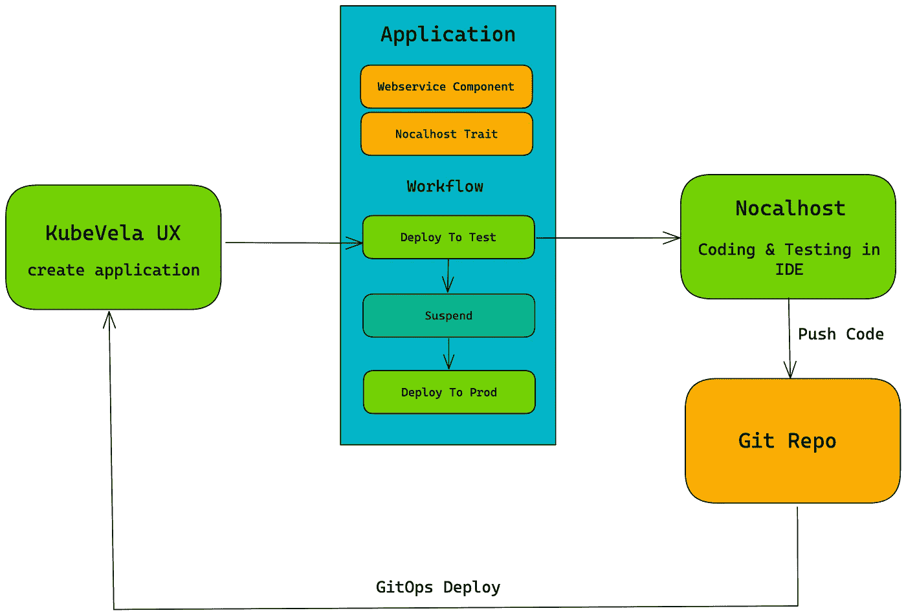

如图:使用 KubeVela 创建一个应用程序，将应用程序部署到测试环境中，然后暂停。使用 Nocalhost 在云中调试应用程序。调试完成后，将调试好的代码推送到代码库，使用 GitOps 用 KubeVela 进行部署，在测试环境中验证后更新到生产环境中。

下面，我们将介绍如何使用 KubeVela 和 Nocalhost 进行云调试和多集群混合云部署。

# 什么是库比韦拉

KubeVela 是一个基于 Kubernetes 和 OAM 的易用且高度可伸缩的应用交付平台。其核心能力是允许开发者在 Kubernetes 上轻松快速地定义和交付现代微服务应用，而无需了解任何与 Kubernetes 本身相关的细节。

KubeVela 还提供了 VelaUX，可以将整个应用分发过程可视化，让申请的过程更加简单。

KubeVela 在这个场景中提供了以下功能:

1.完整的 GitOps 功能:

*   KubeVela 同时支持 GitOps 的拉模式和推模式:我们只需要将更新后的代码推送到代码库中，KubeVela 就可以根据最新的代码自动重新部署应用。在本文中，我们将在推送模式下使用 GitOps。对于 GitOps 在拉模式下的支持，可以查看[这篇文章](https://kubevela.io/blog/2021/10/10/kubevela-gitops)。

2.强大的工作流功能，包括跨环境(集群)部署、批准和通知:

*   凭借其工作流功能，KubeVela 可以轻松地跨环境部署应用程序，并支持用户添加工作流步骤，如手动批准和消息通知。

3.应用程序抽象功能，使开发人员能够轻松理解、使用和定制基础设施功能:

*   KubeVela 遵循 OAM，提供了一套简单易用的应用抽象能力，使开发者能够轻松理解应用，定制基础设施能力。例如，对于一个简单的应用程序，我们可以将其分为三个部分:组件、特征和工作流。在本文的例子中，组件是一个简单的 FE 应用程序；在 traits 中，我们将 Nocalhost trait 绑定到这个组件上，这样这个组件就可以在云端使用 Nocalhost 进行调试；在工作流中，我们可以先在测试环境中部署这个组件，并自动挂起工作流，然后部署到生产环境中，直到通过人工验证和批准。

# 这没什么

Nocalhost 是一个允许开发人员直接在 Kubernetes 集群中开发应用程序的工具。

Nocalhost 的核心能力是提供 Nocalhost IDE 插件(包括 VSCode 和 Jetbrains 插件)来改变远程工作负载到开发模式。在开发模式下，容器的映像将被包含开发工具(如 JDK、Go、Python 环境等)的开发映像所取代。).当开发人员在本地编写代码时，任何更改都将实时同步到远程开发容器，应用程序将立即更新(取决于应用程序的热重装机制或重新运行应用程序)，开发容器将继承所有原始工作负载的配置(ConfigMap、Secret、Volume、Env 等)。).

Nocalhost 还提供:针对 VSCode 和 Jetbrains IDE 的调试和热重装；IDE 中开发容器的终端，以获得与本地开发一致的体验；基于名称空间隔离的开发空间和网格开发空间。此外，Nocalhost 还提供了一个服务器端，帮助企业管理 Kubernetes 应用、开发者和开发空间，让企业可以统一管理各种开发和测试环境。

在使用 Nocalhost 开发 Kubernetes 应用程序的过程中，省去了映像构建、更新映像版本、等待集群调度 Pods 等步骤，代码/测试/调试周期从几分钟缩短到几秒钟。

# 在云中调试应用程序

我们以一个简单的前端应用为例。首先，我们使用 VelaUX 在多环境中部署它。

如果你不知道如何启用 KubeVela 的 VelaUX addon，请查看[官方文档](https://kubevela.io/docs/install#4-install-velaux)。

# 使用 VelaUX 部署应用程序

在 VelaUX 中创建一个环境，每个环境可以有多个交付目标，让我们以一个包含测试和生产交付目标的环境为例。

首先，创建两个交付目标，一个用于测试，一个用于生产。这里的交付目标将分别向本地集群的 test 和 prod 名称空间交付资源。您还可以通过 VelaUX 的集群管理功能添加新的集群进行部署。


在创建交付目标之后，创建一个包含这两个交付目标的新环境。


然后，为云调试创建一个新的应用程序。这个前端应用程序将在端口 80 上公开服务，因此我们为这个应用程序开放端口 80。

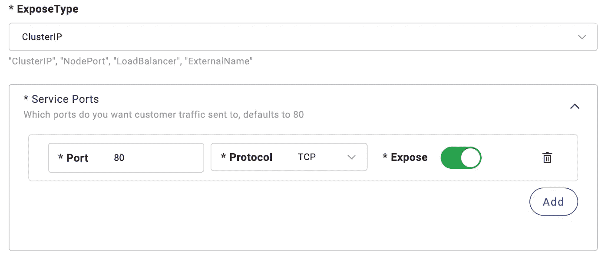

创建应用程序后，应用程序默认带有一个工作流，它会自动将应用程序部署到两个交付目标。但是我们不希望未调试的应用程序直接部署到生产目标。因此，让我们编辑这个默认的工作流:在两个部署步骤之间添加一个暂停步骤。这样，在部署到测试环境后，我们可以暂停工作流，等待用户调试和验证，然后继续部署到生产环境。

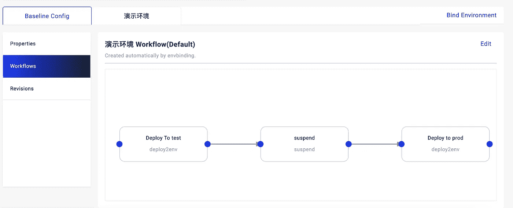

完成这些配置后，让我们为这个应用程序添加一个 Nocalhost 特征，用于云调试。

我们将在这里详细介绍 Nocalhost Trait 中的几个参数:

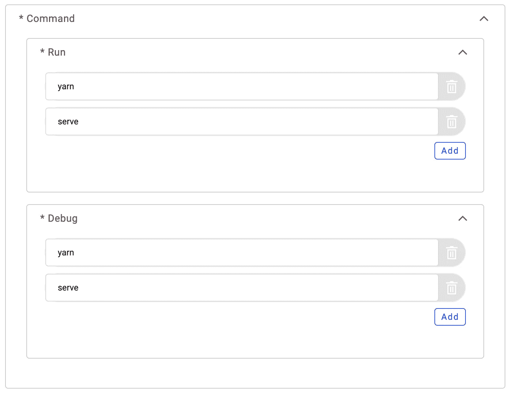

有两种类型的命令，调试和运行。在开发过程中，右键单击插件上的 Remote Debug 和 Remote Run 将在 remote Pod 中运行相应的命令。我们这里使用的是前端应用程序，所以将命令设置为 yarn serve。

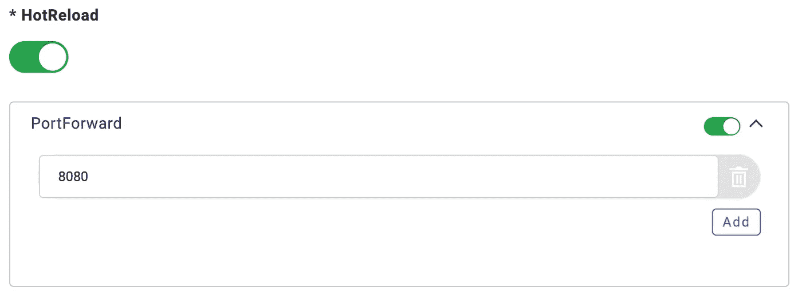

这里的映像指的是调试映像。Nocalhost 默认提供五种语言的图像(go/java/python/ruby/node)。您可以通过填写语言名称来使用内置图像，也可以填写完整的图像名称来使用自定义图像。
开启 HotReload 就是开启热重装能力，修改代码后直接就能看到效果。PortForward 会将云应用的端口 80 转发到本地端口 8080。

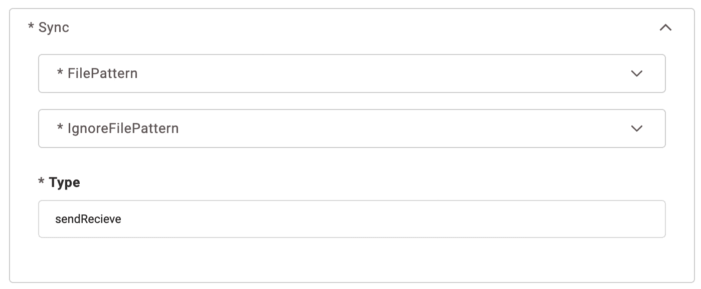

在 Sync 部分，您可以将 type 设置为 sendReceive(双向同步)，或者设置为 send(单向发送)。完成配置后，部署应用程序。如您所见，应用程序在部署到测试目标后会自动挂起。


此时，在 VSCode 或 Jetbrains IDE 中打开 Nocalhost 插件，可以看到我们在 test 命名空间下部署的应用程序，点击应用程序旁边的锤子按钮进入调试模式:


进入 Nocalhost 调试模式后，可以看到 IDE 中的终端已经被容器的终端所取代。使用 ls 命令，您可以看到容器中的所有文件。

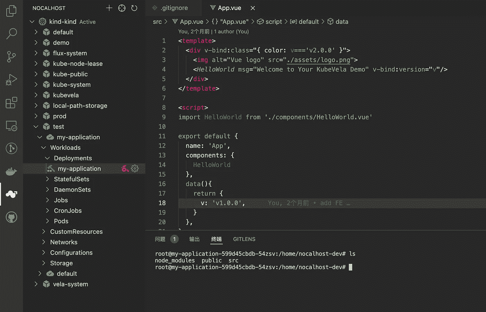

在 Nocalhost 中右击应用，可以选择进入远程调试或者远程运行模式。这两个键将自动执行我们之前配置的调试和运行命令。

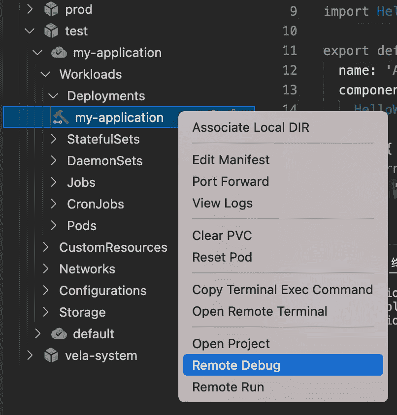

进入调试模式后，我们可以看到我们的云应用程序被转发到本地端口 8080:


打开本地浏览器，可以看到我们目前正在部署的前端应用的版本是 v1.0.0:

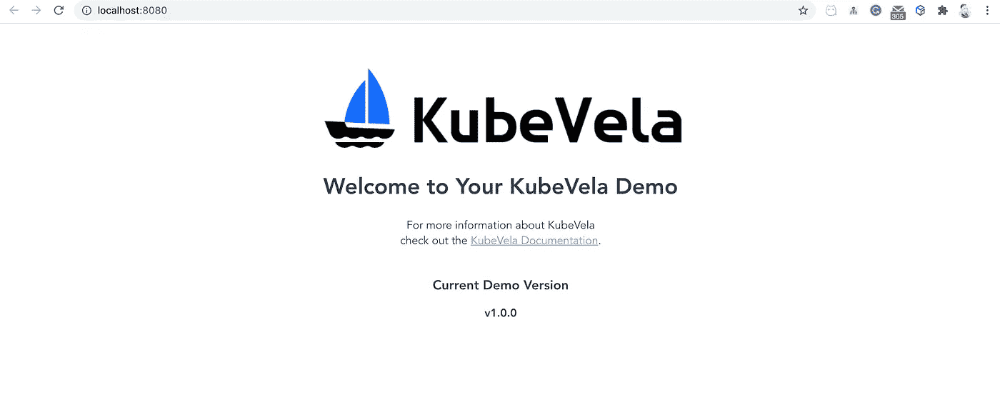

现在，我们可以在本地 IDE 中修改代码，将版本更改为 v2.0.0:


在之前的 Nocalhost 配置中，我们已经启用了热重装。因此，如果我们再次刷新本地 8080 端口页面，我们可以看到应用程序版本变成了 v2.0.0:

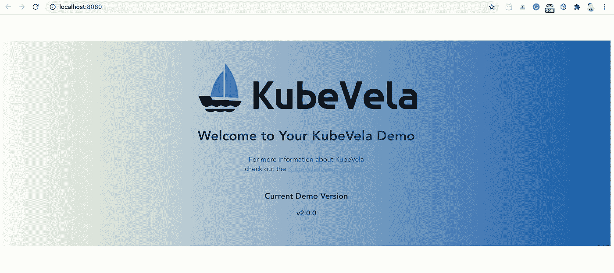

现在，我们可以终止 Nocalhost 的调试模式，并将调试好的代码推送到代码库。


# 使用 GitOps 的多环境发布

在我们完成调试之后，环境上的应用程序仍然是以前的 v1.0.0 版本。那么，更新环境中的应用程序的方法是什么呢？

在整个云调试过程中，我们只修改源代码。因此，我们可以使用 GitOps 来使用代码作为更新源，以完成环境中应用程序的更新。

查看部署在 VelaUX 中的应用程序，您可以看到每个应用程序都有一个默认触发器:


点击手动触发查看详情，可以看到 VelaUX 为每个应用提供了一个 Webhook URL，请求这个地址，并带来需要更新的字段(如:图片等。)，应用程序可以轻松快速地更新。(注意:由于我们需要对外公开地址，所以在部署 VelaUX 时，您需要使用 LoadBalancer 或其他方法来公开 VelaUX 服务)。

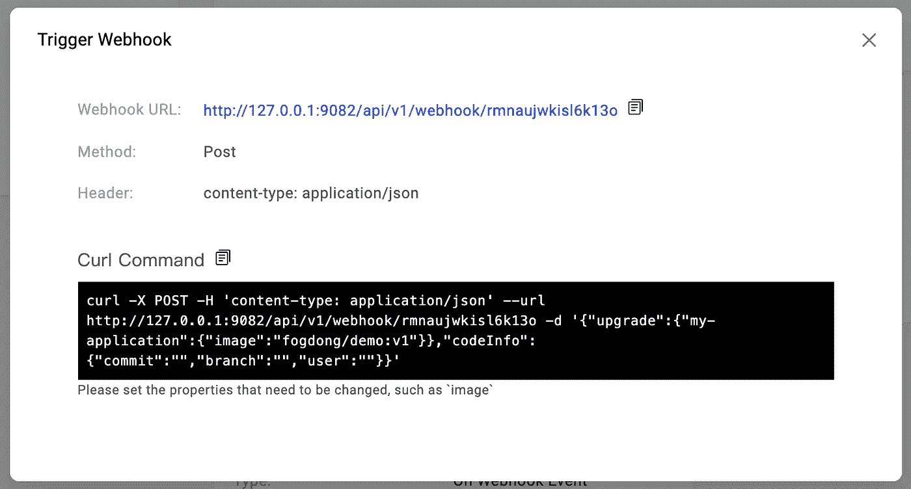

在 Curl 命令中，还提供了一个示例。让我们详细解析请求体:

```
{
  // Required, the update information triggered this time
  "upgrade": {
    // Application name is the key
    "<application-name>": {
      // The value that needs to be updated, the content here will be patched to the application
      "image": "<image-name>"
    }
  },
  // Optional, the code information carried in this trigger
  "codeInfo": {
    "commit": "<commit-id>",
    "branch": "<branch>",
    "user": "<user>",
  }
}
```

`upgrade`是该触发器要携带的更新信息，in `<application-name`是需要打补丁的值。默认建议是更新图像，或者您可以扩展这里的字段来更新应用程序的其他属性。

`codeInfo`是代码信息，可选择携带，如提交 ID、分支机构、提交人等。通常，这些值可以通过在 CI 系统中使用变量替换来指定。

当我们更新的代码合并到代码库中时，我们可以在 CI 中添加一个新的步骤来与代码库中的 VelaUX 集成。以 GitLab CI 为例，可以增加以下步骤:

```
webhook-request:
  stage: request
  before_script:
    - apk add --update curl && rm -rf /var/cache/apk/*
  script:
    - |
      curl -X POST -H "Content-Type: application/json" -d '{"upgrade":{"'"$APP_NAME"'":{"image":"'"$BUILD_IMAGE"'"}},"codeInfo":{"user":"'"$CI_COMMIT_AUTHOR"'","commit":"'"$CI_COMMIT_SHA"'","branch":"'"$CI_COMMIT_BRANCH"'"}}' $WEBHOOK_URL
```

配置完成后，当代码更新时，CI 将自动触发，VelaUX 中相应的应用程序也将更新。

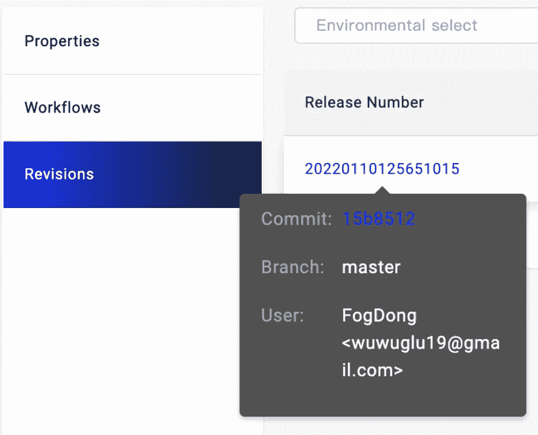

当映像更新后，再次检查应用程序页面，您可以看到测试环境中的应用程序已经变成了版本 v2.0.0。

在测试交付目标中验证之后，我们可以在工作流中单击`Continue`来将应用程序的最新版本部署到生产交付目标。


在生产环境中检查应用程序，您可以看到最新的 v2.0.0 版本已经在生产环境中:

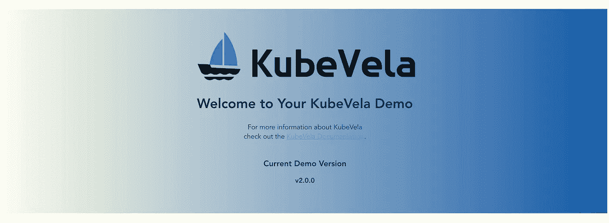

此时，我们首先在测试环境中使用 Nocalhost，通过 KubeVela 进行云调试。通过验证后，我们更新代码，用 GitOps 完成部署更新，在生产环境中继续更新应用，这样就完成了一个应用从部署到上线。

# 摘要

使用 KubeVela + Nocalhost，不仅方便在开发环境中进行云端调试，而且在测试完成后也易于更新部署到生产环境中，使得整个开发和过程稳定可靠。