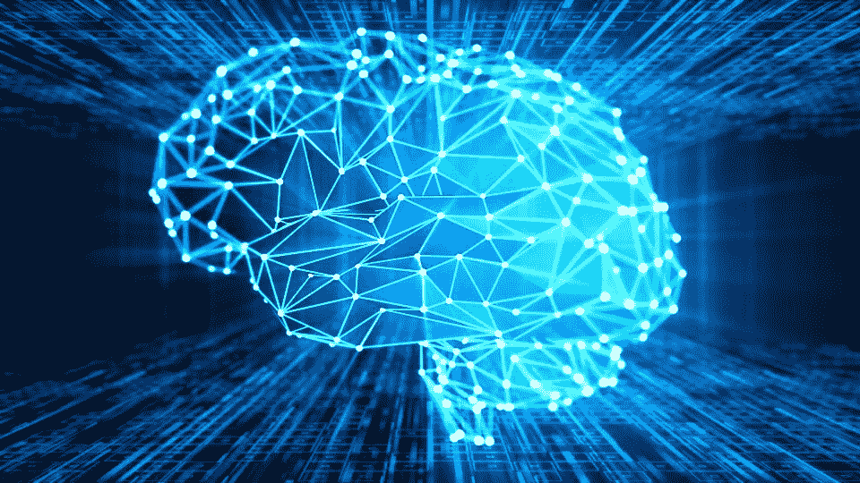

# 人工智能在测试自动化中的应用

> 原文：<https://blog.devgenius.io/use-of-artificial-intelligence-in-test-automation-fa70449eb0cb?source=collection_archive---------4----------------------->

人工智能是计算机科学的一个多样化领域，涉及开发能够执行主要需要人类智能的任务的智能机器。

人工智能被定义为一门具有各种方法的跨学科科学，但深度学习和机器学习的改进几乎正在科技行业的每个领域产生巨大的变革。

AI 让机器更容易执行类似人类的任务。它允许机器对新的输入进行调整，并帮助它们从经验中学习。

你今天可能知道的大多数人工智能例子是自动驾驶汽车、下棋计算机、亚马逊 Alexa，它们严重依赖于深度学习和自然语言处理。随着这些技术的使用，通过识别数据模式和处理大量数据来训练计算机完成特定任务成为可能。

# 人工智能和测试自动化之间的相似之处很少

人工智能和测试自动化都受到了糟糕的媒体报道和糟糕的营销带来的争议和误解。

两者都在努力减轻人类的工作压力。测试工程师心中有疑问，测试自动化可以取代他们的工作。

然而，一些非测试人员从媒体上获取信息，认为 AI 可以接管相当大比例的人类空缺。很难说未来会发生什么，因为魔多情报局的报告向我们解释了一些不同的东西。

根据他们的预测，在 2021 年至 2026 年的预测期间，自动化测试市场预计将增长 14.2%。

由于对测试流程和解决方案自动化的需求，以便为客户提供无缝体验，自动化测试市场的增长将随着软件测试环境的尖端人工智能技术而增长。

在未来几年，我们可以看到人工智能在软件测试中的更多应用，因为它能够缩短测试生命周期。它可以用于测试的几个方面，包括功能测试、回归测试、自动化测试和性能测试。

从手动到自动测试的过渡执行的复杂性增加等因素很可能会阻碍市场发展的增长。但是随着机器学习和人工智能的融合，自动化测试的转向可以更好地管理。

# 根据工作角色，检查测试自动化中的人工智能是如何相似的:

# 人工智能通过数据自动进行重复学习和探索:

毫无疑问，人工智能不同于机器人自动化和硬件驱动的自动化。AI 不会像人类一样觉得累。

它可以可靠地执行计算机化的大容量任务，而不是自动化的手动任务。AI 可以通过数据自动化重复的学习过程和探索；尽管如此，它要求人类在建立系统后提出正确的问题。

类似地，在自动化测试中，软件测试必须在开发周期中不断重复，以满足质量需求。

每当软件开发公司对源代码进行任何修改时，他们的专家都喜欢在每次发布之前重复软件测试。他们测试软件与所有硬件配置和操作系统的兼容性，以便更好地使用它。

人工重复测试耗时且成本高。每当需要一次又一次地运行任何测试而不花费额外的成本时，自动化测试就成了正确的选择，因为它可以将运行重复测试的时间从几个月缩短到几天，从几天缩短到几小时。此外，它有助于节省金钱和精力。

# 人工智能有助于实现准确性:

通过深度神经网络，人工智能可以获得准确性。例如，谷歌搜索和你与 Alexa 的互动都是基于深度学习。

深度学习可以为人类提供图像恢复、图像分类、图像分割和对象检测的超级准确性。

它甚至可以识别手写的数字。在深度学习中，人工神经网络用于教导机器，并自动执行人类视觉系统执行的活动。

许多人考虑人工智能驱动的测试自动化、技术和医疗领域的深度学习来准备癌症患者的 MRI 报告，因为它提供了与经验丰富的放射科医生相同的准确性。

即使在软件测试和技能集方面有太多的认证，大多数熟练的测试团队在手工测试任何软件或应用程序时都会犯错误。使用自动化测试，很容易多次执行相同的步骤，并记录详细的结果。

因此，通过在软件测试中引入人工智能，测试人员可以让他们免于执行重复的手动测试。相反，他们可以更好地关注新的自动化软件测试的创建，并有能力处理应用程序的复杂特性。

# 深度数据分析:

有许多隐藏层的神经网络帮助人工智能详细分析越来越多的数据。

此前，没有人曾经想象过深度学习和人工智能可以帮助建立欺诈检测系统。但是丹麦银行和 TeraData 推出了一个基于人工智能的引擎来实时检测欺诈。大数据和令人难以置信的计算机系统的力量在 21 世纪改变了更多的事情。

不管我们信不信，但人工智能来提高产品质量，并准确地执行任务。

可能需要收集大量数据来训练深度学习模型，因为它们在直接从数据中学习后工作。输入深度学习模型的数据越多，软件就越精确。

此外，人们可以使用人工智能工具来增强测试自动化，如使用 Appitools，这是一种专为可视化管理、UI 测试和软件监控而设计的应用程序，它确保用户可以准确地看到应用程序的 UI。它允许你将 UI 元素放置在合适的大小、颜色和位置。

Applitools 是一个由 visual AI 支持的端到端软件测试解决方案，旨在帮助测试自动化工程师、手动测试人员、开发人员和 QA 经理降低成本、加快交付并提高软件产品的质量。

AI 和 ML 算法可以读懂你的应用，甚至对它有所了解。这些算法开发数据集来观察您的应用程序。它甚至可以帮助您理解特定功能在特定条件下的表现。

通过使用 AI/ML 算法，很容易创建测试用例并自动记录预期的结果。AI 算法的学习能力远胜于基于规则的自动化。因此，人工智能驱动的测试自动化是我们实现从小到大的商业目标的新常态。

# 人工智能中的自学习算法；

让数据本身成为知识产权是可能的，因为一些算法是基于自我学习的。

答案就在数据中，你只需要应用人工智能来产生结果。当考虑竞争层面的最佳数据时，AI 可以帮助您解决复杂的业务问题。

人工智能通过渐进式学习算法变得具有适应性。AI 识别数据的结构，并在成为作为预测器或分类器的算法之前检查其中的不规则性。

同样，算法会自学如何下棋。同样，人工智能自学向客户在线推荐产品。

除此之外，人工智能中还有几种学习模型，可以定义为有监督的，半监督的，无监督的或强化的。

例如，监督模型选择外部环境，以在人工智能算法中扮演教师的角色。它利用外部反馈学习功能，并将输入转化为输出观察值。

另一方面，半监督学习模型使用一组标记和设计的数据。它试图推断新数据集的新属性或标签。同时，无监督模型旨在学习输入数据的模式，不需要任何外部反馈。

此外，强化学习在最新的人工智能解决方案中也很受欢迎，因为它利用从奖励到惩罚的相反动态来加强各种知识。

在大多数情况下，我们可以销售使用人工智能的个人应用程序。我们已经使用的产品可以集成人工智能技术，帮助人们了解新一代服务。例如，苹果产品添加 Siri 作为新功能，以快速分钟获得答案数量。

从智能机器、机器人和对话平台到自动化，人们可以结合其中的大量数据来引入新的功能和技术。

在人工智能时代，我们可以享受更多的创新。另一个例子是机器人过程自动化，这是一个人工智能应用程序，人们可以选择执行单元测试并删除片状测试用例。

# 在软件测试中使用人工智能的好处

软件测试中的 AI 旨在让测试更高效、更智能。机器学习和人工智能都使用推理和解决问题的技术来改进和简化测试过程。

越来越多的公司在软件测试中使用[人工智能](https://www.bugraptors.com/blog/how-artificial-intelligence-will-change-software-testing) ，因为与人工测试相比，它节省了大量时间，并在专注于复杂任务的同时支持团队。

当在应用程序中进行简单的更改时，即使测试自动化工具也无法给出正确的结果，因为传统的测试场景使用单一的选择器，这有时会成为测试失败的原因。

因此，选择人工智能和机器学习进行自动化测试是很重要的，因为它在整个测试过程中给你更多的灵活性。

在优化和机器学习的同时，许多算法显示了它们的自适应性质。在测试期间，当您在应用程序中添加任何自定义功能时，这些技术将实时适应新的变化，并帮助您按照您的偏好工作。

人工智能正在试图接管我们的生活，但我们有责任确认这些系统是有弹性的、兼容的、功能齐全的，并且可以安全使用。做过机器学习模型训练的人已经知道，测试是 AI 项目成功的基础。

在这里，他们不需要建立一个人工智能算法，也不需要担心抛出或调用其中的数据。人们需要进行验证测试，以确保训练数据能够很好地工作。

您还需要进行 QA 测试，以确保将数据和算法与超参数配置数据及其相关元数据考虑在内，并帮助您获得预测结果。在将人工智能模型投入运行之前，执行特定类型的测试至关重要。

由 AI 支持的测试自动化工具帮助开发人员、QA 测试人员和其他团队实现他们的目标，即获得高质量和更快地发布应用程序。

此外，AI 帮助你最大化测试的范围和深度。它可以检查数据表、文件内容、内存、内部程序状态，并确定程序是否按预期工作。有了基于人工智能的测试自动化，你可以一次实现超过数千个测试用例，这是通过手工测试无法实现的。

# 与我们联系

诸如 Allego、沃尔玛、Salesforce、福特、威瑞森、Shatri Store 等组织以及许多其他全球领导者都依赖 bug 迅猛龙进行[人工智能测试服务](https://www.bugraptors.com/ai-testing-services.php)。无论你有智能助理、制造机器人、虚拟旅行预订代理、社交媒体、团队间聊天工具、剽窃检查器，还是使用 Lyft 和优步等拼车应用，都可以来找我们，因为我们确保让你的人工智能设备功能齐全且安全。

来源:[用人工智能自动化软件测试](https://www.bugraptors.com/blog/automate-software-testing-with-ai)