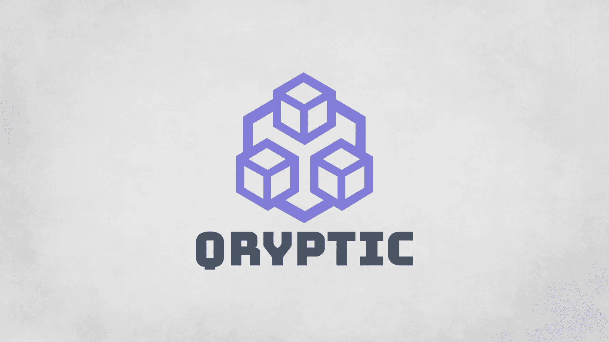

# 使用 Python 和请求库的加密 API

> 原文：<https://blog.devgenius.io/use-qryptic-api-with-python-and-requests-library-3a20eba79a48?source=collection_archive---------20----------------------->



在本指南中，我将向您展示如何开始使用 Qryptic API 并使用 Python 获取加密交换的数据。

你需要做的第一件事是加入加密不和谐服务器[https://discord.gg/xrtwNfqshz](https://discord.gg/xrtwNfqshz)当你进入时，你需要通过进入#qryptic-api 频道申请一个账户，管理员/mod 会给你发送认证信息。由于前端还没有到位，目前你自己没有办法做到这一点。

因此，当获得所有认证信息时，我们应该创建一个新的 Python 文件，并导入我们将使用的必要库:

```
import requests
from requests.exceptions import ConnectionError, Timeout, TooManyRedirects
```

然后，我们需要添加一些常量来保存关于 API URL、令牌生成 URL、客户端 id、客户端密码、用户名、密码和我们将使用的授权类型的信息:

```
API_URL = 'https://api.qryptic.net/v1'
API_TOKEN_URL = 'https://qryptic.net/auth/realms/QrypticAPIKeycloak/protocol/openid-connect/token'
API_CLIENT_ID = 'login-app'
API_CLIENT_SECRET = '<get a client secret from discord admin>'
API_USERNAME = '<your username>'
API_PASSWORD = '<your password>'
API_GRANT_TYPE = 'password'
```

然后，我们将定义一个变量，在获取访问令牌时保存它:

```
access_token = ''
```

下面我们定义一个函数，通过发送带有认证信息的主体信息来生成访问令牌。我们还将变量 access_token 定义为全局变量，这样我们就可以在另一个函数中访问它:

```
def post_get_access_token():
    # Doing a POST request and obtaining the access token

    request_body = {
        "client_id": API_CLIENT_ID,
        "client_secret": API_CLIENT_SECRET,
        "username": API_USERNAME,
        "password": API_PASSWORD,
        "grant_type": API_GRANT_TYPE
    }
    try:
        headers = {'Content-Type': 'application/x-www-form-urlencoded'}
        response = requests.post(API_TOKEN_URL, data=request_body, headers=headers)

        global access_token
        access_token = response.json()['access_token']
    except (ConnectionError, Timeout, TooManyRedirects):
        print('Could not communicate to Qryptic API...')
```

然后，在本例中，存在于 API 上的交换我们在头中使用获得的访问令牌，因为我们需要告诉 API 我们已经对我们进行了身份验证:

```
def get_exchanges():
    # Getting all the exchanges using the access token

    headers = {
        'Authorization': 'Bearer ' + access_token,
        'Content-type': 'application/json',
    }
    try:
        r = requests.get(API_URL + '/exchanges', headers=headers)
        print(r.text)
    except (ConnectionError, Timeout, TooManyRedirects):
        print('Could not communicate to Qryptic API...')
```

这里我们将调用我们之前定义的函数:

```
def main():
    post_get_access_token()
    get_exchanges()

if __name__ == '__main__':
  main()
```

差不多就是这样。它对加密货币和钱包等同样有效。完整的例子在我的 GitHub 上:https://github.com/mjovanc/qryptic-api-python