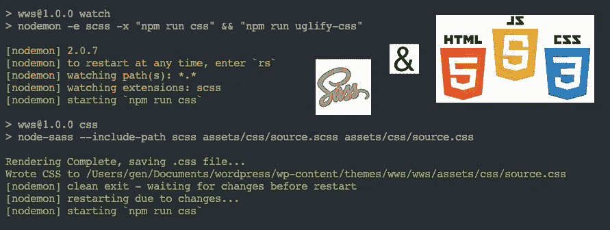
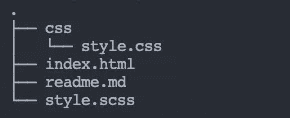
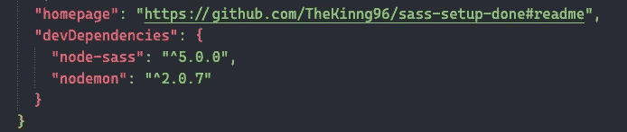
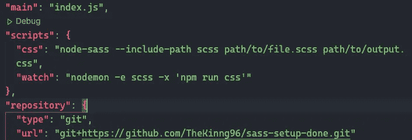
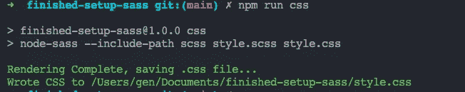
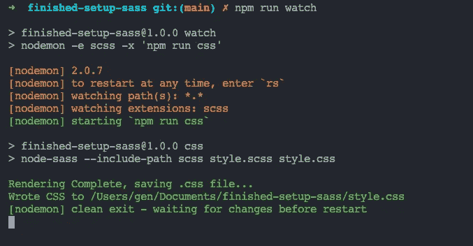

# 在普通的 Html Css & Js 项目中使用 Sass

> 原文：<https://blog.devgenius.io/use-sass-on-your-plain-html-css-js-projects-4f09de547f8a?source=collection_archive---------0----------------------->

这是一个关于如何通过节点和 npm 安装 sass 编译器的指南。



让我们在普通的 HTML CSS 和 JS 项目上使用 sass！杰普将军

# TL；速度三角形定位法(dead reckoning)

1.  `npm install node-sass nodemon --save-dev`
2.  在 package.json `"script"`处添加`"css": "node-sass --include-path scss path/to/file.scss path/to/output.css",`和`"watch": "nodemon -e scss -x 'npm run css'"`
3.  现在你的设置已经完成，享受。CSS 丑陋将在这篇文章的奖金部分介绍。

如果你不知道或者设置失败，请按照下面的说明。如果您对设置仍有问题，请随时留下您的评论。

更新:`node-sass`无法处理`rgba(xxx,xxx,xxx,xxx)`或`rgb(xxx,xxx,xxx)`，这方面的一个技巧是通过 SASS `$name`将颜色代码`(xxx,xxx,xxx)`初始化为十六进制代码`(#xxxxxx)`。

```
$black = #000000;.example {
    background: rgba($black, 0.5);
}
```

# 先决条件

确保您已经在机器上安装了 [NodeJ](https://nodejs.org/en/) S。如果没有，不用担心，让我们安装它。关于 NodeJS，最初 JavaScript 只能在浏览器上运行，因为它没有在我们的默认系统(macOS，Wins 等)上安装运行时。

NodeJs 是允许我们在浏览器之外执行 JavaScript 代码的运行时。在本指南中，我将展示如何通过 NodeJS 安装编译器。

# 设置您的项目目录

如果您已经准备好了自己的项目文件，请跳过这一步。

如果您没有，让我们在您的终端上运行`git clone [https://github.com/TheKinng96/sass-setup](https://github.com/TheKinng96/sass-setup)`来克隆我准备的项目文件夹。文件夹包含一个简单的`HTML`和`SCSS`文件，现在网站风格被破坏了，因为我们还没有编译`SCSS`文件。但是，如果您想查看页面的效果，只需将 `style.css`拖出 CSS 文件夹。

> 如果您是 git 新手，请阅读这篇文章。 [*这里的*](https://medium.com/dev-genius/git-to-getting-repos-from-others-ff829802ba54) *。*



文件夹的树状视图。

# 初始化 NPM

NodeJS 附带的 NPM(节点包管理器)是我们下载库并在代码中使用它们的地方。你可以把它看作下载插件的地方。

首先，运行`npm init-y`为您的项目初始化并生成基本的 package.json 配置。通过`-y`选项，我们告诉`npm`通过留空来注册项目。(如果需要，我们可以在以后更改它们。)

# 安装库

现在运行`npm i node-sass nodemon --save-dev`。`Node-sass`是`SASS`编译器，而`nodemon`是一个在每次检测到变化后刷新节点应用的工具。

要检查安装，在代码编辑器上转到`package.json`，你应该看到`“devDependencies”`中有两个包，在你的项目目录中有一个`node_modules`文件夹。`node_modules`文件夹是那些依赖项的源代码。如果你删除了那个文件夹，只需重新运行`npm i`，这将要求`npm`检查你的依赖项并重新安装所有列出的包。



检查安装

# 使用图书馆

要使用已安装的库，有些可以直接在您的代码中使用，有些需要通过 package.json 中的`"script"`部分调用(如果您不确定如何调用，文档会告诉您如何做)。

今天我们要通过`“script”`调用`node-sass`和`nodemon`，所以用`"css": "node-sass --include-path scss path/to/file.scss path/to/output.css",`替换`"test": "echo \"Error: no test specified\" && exit 1`，按`"watch": "nodemon -e scss -x 'npm run css'"`保存。

> *记得用你的文件路径替换* `*path/to/file.scss*` *和* `*path/to/output.css*` *。万一你用的是我的文件夹，应该是* `*“css”: “node-sass — include-path scss style.scss style.css”*` *。*



替换脚本代码

之后，在您的终端上运行`npm run css`(确保您在正确的目录中)您应该会看到类似这样的内容。



如果我们每次编辑完代码后都要手动运行`npm run css`，这将会非常烦人，所以这里就是`nodemon`的由来。如果我们运行`npm run watch`，`nodemon`会照顾我们的新编辑。



运行 npm 运行观察

你的终端应该看起来像上面的截图。我们已经成功地在我们的项目上设置了 SASS 编译器！恭喜你。

# 奖金

你们中的一些人可能想丑化编译后的 CSS 文件。在所有的库中，我推荐使用`uglifycss`。要安装它，只需运行`npm i uglifycss`并编辑您的`"script"`，如下所示:

```
"css": "node-sass --include-path scss path/to/file.scss path/to/output.css",
“uglify-css”: “uglifycss path/to/file.css > path/to/output.min.css”,
“watch”: “nodemon -e scss -x ‘npm run css && npm run uglify-css’”
```

如果您运行`npm run uglify-css`，它将篡改您放入第一个槽中文件。现在在`“watch”`，我们要求 nodemon 在检测到每个 SCSS 文件更改后运行两个命令。

> 每天学一件小事，总有一天你会成为巨人！