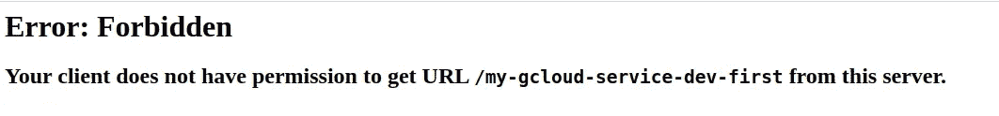

# 使用无服务器部署示例 Google Cloud 功能

> 原文：<https://blog.devgenius.io/use-serverless-to-deploy-sample-google-cloud-functions-c8901f747540?source=collection_archive---------10----------------------->

作为一名 AWS 云实践者，我在 AWS 云中使用各种无服务器部署。然而，作为一个实验，我想看看无服务器是否也能为谷歌云提供类似的体验！让我们检查一下。


# 软件安装

无服务器安装基于 npm pacakage。我用的是 Linux Mint OS (ubuntu 架构)。因此，该命令对于其他操作系统来说可能非常有用。

```
## Install Nodejs & npmcurl -sL https://deb.nodesource.com/setup_18.x | sudo -E bash -
sudo apt-get install -y nodejs## You may also need development tools to build native addons:
     sudo apt-get install gcc g++ make## To install the Yarn package manager, run: curl -sL [https://dl.yarnpkg.com/debian/pubkey.gpg](https://dl.yarnpkg.com/debian/pubkey.gpg) | gpg --dearmor | sudo tee /usr/share/keyrings/yarnkey.gpg >/dev/null
     echo "deb [signed-by=/usr/share/keyrings/yarnkey.gpg] [https://dl.yarnpkg.com/debian](https://dl.yarnpkg.com/debian) stable main" | sudo tee /etc/apt/sources.list.d/yarn.list
     sudo apt-get update && sudo apt-get install yarn# Install actual software :) serverless
npm install -g serverless
```

# 检查安装软件版本

要调试任何问题，我们使用的软件版本非常重要。所以检查下面的命令并验证版本。我也记下了输出以供参考

```
nirav@nirav-IdeaPad-Gaming-3-15ARH05:~$ npm version
{
  npm: '8.12.1',
  node: '18.4.0',
  v8: '10.2.154.4-node.8',
  uv: '1.43.0',
  zlib: '1.2.11',
  brotli: '1.0.9',
  ares: '1.18.1',
  modules: '108',
  nghttp2: '1.47.0',
  napi: '8',
  llhttp: '6.0.6',
  openssl: '3.0.3+quic',
  cldr: '41.0',
  icu: '71.1',
  tz: '2022a',
  unicode: '14.0',
  ngtcp2: '0.1.0-DEV',
  nghttp3: '0.1.0-DEV'
}nirav@nirav-IdeaPad-Gaming-3-15ARH05:~$ node --version
v18.4.0nirav@nirav-IdeaPad-Gaming-3-15ARH05:~$ yarn --version
1.22.19nirav@nirav-IdeaPad-Gaming-3-15ARH05:~$ sls --version
Framework Core: 3.19.0
Plugin: 6.2.2
SDK: 4.3.2nirav@nirav-IdeaPad-Gaming-3-15ARH05:~$ serverless --version
Framework Core: 3.19.0
Plugin: 6.2.2
SDK: 4.3.2
```

# 安装 Cloudfunction 特定库

现在我们已经设置了无服务器，我们可以使用我们想要的模块。在这个例子中，我们将使用云函数。所以安装那个插件。

```
npm install --save serverless-google-cloudfunctions
```

# 使用 google Auth 登录

我们可以连接谷歌认证或服务帐户无服务器。为了简单起见，我使用谷歌认证。

```
gcloud auth application-default login
```

# 启用服务 z

默认情况下，谷歌云在每个项目中只允许很少的服务。对于新创建的项目，请启用它。这项活动只有一次。

```
gcloud services enable deploymentmanager.googleapis.com
gcloud services enable cloudfunctions.googleapis.com
gcloud services enable cloudbuild.googleapis.com
```

# 编写简单的 http 函数

无服务器使安装变得容易。我们可以创建下面的小文件，其中也定义了环境变量。这就是准备飞行的样本代码

```
# serverless.yml
service: my-gcloud-servicepackage:
  patterns:
   - '!node_modules/**'
  excludeDevDependencies: trueprovider:
  name: google
  project: my-test
  labels:
    application: serverless-exampleenvironment:
  max_delay: '5000'plugins:
  - serverless-google-cloudfunctionsfunctions:
  first:
    handler: http
    events:
    - http: path
    labels:
      team: gcf-team
```

索引文件:一个小的 http 响应

```
// index.jsexports.http = (request, response) =>{
  response.status(200).send('Hello World!');
};
```

# 本地测试

关于无服务器最重要的事情是简单的命令来测试本地或从服务器。

```
nirav@nirav-IdeaPad-Gaming-3-15ARH05:~/gcloud$ sls invoke local  --function first
Running "serverless" from node_modules
{
    "status": 200,
    "headers": {
        "content-type": "text/html; charset=utf-8",
        "content-length": "12",
        "etag": "W/\"c-Lve95gjOVATpfV8EL5X4nxwjKHE\""
    },
    "body": "Hello World!"
}
```

# [可选]包装功能

我们可以封装函数来查看任何编译时错误或构建错误。这个步骤是可选的&已经包含在 deploy 函数中。

```
nirav@nirav-IdeaPad-Gaming-3-15ARH05:~/gcloud$ sls package
Running "serverless" from node_modules
Compiling function "first"...
```

# 部署功能

就像我们可以在我们周围环境中部署功能一样。请在执行前检查它所指向的必需信息。

```
#Testing we are pointing right environment
gcloud info
gcloud auth list# deploy functionnirav@nirav-IdeaPad-Gaming-3-15ARH05:~/gcloud$ sls deploy 
Running "serverless" from node_modules
Compiling function "first"...
Uploading artifacts...
Artifacts successfully uploaded...
Updating deployment...
Checking deployment update progress...
..........
Done...
Service Information
service: my-gcloud-service
project: awacs-test
stage: dev
region: us-central1Deployed functions
first
  [https://us-central1-my-test.cloudfunctions.net/my-gcloud-service-dev-first](https://us-central1-awacs-test.cloudfunctions.net/my-gcloud-service-dev-first)
```

# 执行功能

当您直接执行 url 时，它会失败，因为它确实需要验证



我们可以使用无服务器或 gcloud 命令来执行它

```
#With gcloud command
nirav@nirav-IdeaPad-Gaming-3-15ARH05:~/gcloud$ gcloud functions call my-gcloud-service-dev-first 
executionId: ykno5z83bs3c
result: Hello World!#With sls
sls invoke  --function first
```

# 参考:

# 参考:

[](https://www.serverless.com/framework/docs/providers/google/guide/installation) [## 无服务器框架-谷歌云功能指南-安装无服务器框架

### Serverless 是一个 Node.js CLI 工具，所以您需要做的第一件事是在您的计算机上安装 Node.js。去…

www.serverless.com](https://www.serverless.com/framework/docs/providers/google/guide/installation) 

[https://techviewleo . com/how-to-install-nodejs-in-Linux-mint/](https://techviewleo.com/how-to-install-nodejs-in-linux-mint/)

[](https://www.serverless.com/framework/docs/providers/google/guide/credentials) [## 无服务器框架-谷歌云功能指南-证书

### 无服务器框架需要访问您的谷歌云帐户的帐户凭证，以便它可以创建和…

www.serverless.com](https://www.serverless.com/framework/docs/providers/google/guide/credentials)