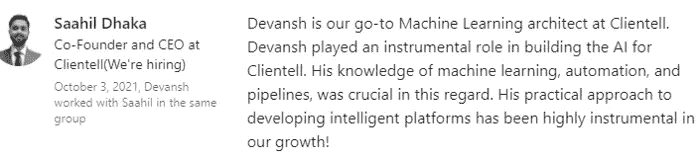
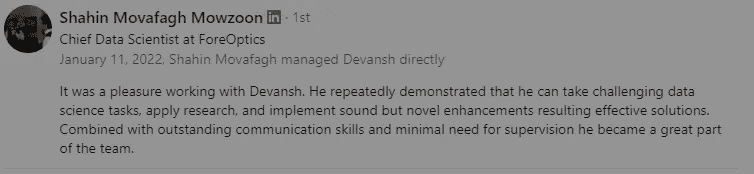
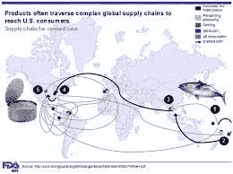
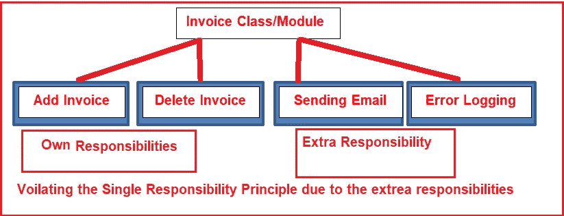
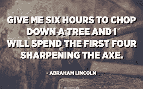

# 使用单一责任来改善您的机器学习渠道

> 原文：<https://blog.devgenius.io/use-single-responsibility-to-improves-your-machine-learning-pipelines-e724e153680f?source=collection_archive---------14----------------------->

## 这使您的管道更具适应性、可读性，并节省大量资源

我通常不写重编码的文章。大多数机器学习都取决于你所做的决定。[选择正确的政策、关注的领域以及忽略/简化的方面](https://www.youtube.com/watch?v=sDiVoK8dtvQ&lc=UgzezIBkwts1cjiP0DB4AaABAg&ab_channel=Devansh%3AMachineLearningMadeSimple)总是会带来最好的结果。也就是说，我最近做了很多代码审查。一些给我的顾客。有些是我参与的创业公司的。我想我会分享我如何喜欢在我的工作中编写我的管道，并介绍我的结构背后的基本原理。这种结构需要花费更长的时间来编写，但是当你以后必须改变你的管道时，它会节省你很多时间。

Clientell 是一家初创公司。极其重要的是，我们在这里创建的 ML 管道能够适应节省开发成本。

# 背景

我希望你花一点时间思考一些软件开发原则。它们为什么存在，能解决什么？为什么为一项职责保留一项功能很重要？这些最佳实践最初为什么会发展起来？除了使代码更易读、更容易理解(这已经是一个巨大的优势)，它实际上有助于添加新功能。我从我的工作经历给你举个实际的例子。

正如你所看到的，ForeOptics 的人从我的方法中受益匪浅

当我在 ForeOptics 的时候，我正在研究一个非常有趣的问题。ForeOptics 希望量化某个供应商因其过去的行为而无法兑现承诺的风险。请记住，供应链跨越全球。因此，公司不仅要跟踪他们的管理和政策，还要跟踪供应链不同部分的地缘政治问题。这意味着我们的数据在不断变化。

甚至罐装金枪鱼也使用来自世界各地的部分。让它深入人心。

这意味着当我自动化数据收集过程时，我必须考虑到我们会随着情况的变化而不断改变数据源。其余的数据预处理、模型训练和评估基本相同。所以我们所做的就是在管道的起点增加另一个来源。

通过单一责任，您可以更改电子邮件协议，而不会影响发票

如果我将管道的不同方面放在同一个类/函数中，那么不断改变我们用来构建数据集的链接/源将是一场噩梦。然而，因为简单的责任，这些变化可以在几秒钟内实现**。**甚至更复杂的事情，如为您的人工智能模型集成多个评估指标，也变成了一项琐碎的任务。

# 这在代码中看起来像什么

既然你已经理解了我们开发哲学背后的思想，那么当我们编码的时候是什么样子的呢？让我们举一个相对简单的数据集编码的例子。在我目前在 KlearNow 的角色中，我们正在构建的大部分东西都处于试错阶段。因此，我们仍在测试许多不同的数据插补和分类变量编码政策。这是我使用多策略对数据集进行编码的代码

代码相对简单。我们为数据集目录中的所有数据集(包括子目录中的数据集)迭代一系列策略。每个策略都适用于每个数据集，我们保存数据集以备后用。想想添加新的编码策略是多么容易。我所要做的就是将策略名称添加到策略列表中，并在 encodeDataset 函数中创建必要的步骤作为 if 语句。这种方法消除了我们会产生的大量额外的膨胀，而不是复制粘贴多余的行并使我的代码变大。

编码最佳实践就像磨利斧头。前期投入更多时间，从长远来看节省资源

一旦实验结束，这将继续有用。一旦我们为不同种类的数据集确定了最佳编码策略，我就可以用正确的文件和策略简单地调用 encoded dataset . encoded dataset()。我知道由于 encodeDataset **只有**根据期望的策略对我们的数据集进行编码，所以我不需要担心意外的后果。这为大型项目的调试节省了大量时间。

我特意选择了一个简单的函数来演示这一点。我可以向你展示我如何使用这种方法能够*编写多个模型的贝叶斯超参数优化协议，缺失数据的不同插补策略，测试各种错误指标，在不同的训练测试分裂*(实际上是我为 Clientell 编写的测试版)。但是这也会让大多数人不知所措。相反，像这个例子这样简单的东西对大多数人来说是有用的(这个代码已经在多个项目中使用过),并能让他们明白这一点。

如果你正在寻找测试版，看看更难的机器学习代码在野外是什么样子，请随时在 [IG](https://www.instagram.com/iseethings404/) 、 [Twitter](https://twitter.com/Machine01776819) 或 [LinkedIn](https://www.linkedin.com/in/devansh-devansh-516004168/) 上给我发消息。我很乐意分享样本和解释。

您可以使用一些基本的编码原则来提升您的性能

上面的视频是一个很好的例子，告诉你如何使用简单而有效的代码设计在面试中脱颖而出。它包含了在这项努力中最能让你受益的技巧和诀窍。

# 关闭

希望这篇文章解释了遵循好的编码实践来使你的机器学习管道更好的重要性。在深思熟虑的设计上多花一两天时间，肯定会让你省去几周的调试、调整和浪费时间。单一责任将允许您更改管道的许多细节，同时保持结构完整并最大限度地减少意外后果。

如果你喜欢这篇文章，看看我的其他内容。我定期在 Medium、YouTube、Twitter 和 Substack 上发帖(所有链接都在下面)。我专注于人工智能、机器学习、技术和软件开发。如果你正在准备编码面试，看看:[编码面试变得简单](https://codinginterviewsmadesimple.substack.com/)，我的每周时事通讯。您可以以每天不到 0.5 美元的价格获得高级版本。高级版将解锁每周编码问题的高质量解决方案、特殊讨论帖子和一个伟大的社区。它帮助了很多人做准备。

为了帮助我写更好的文章和了解你[填写这份调查(匿名)](https://forms.gle/7MfQmKhEhyBTMDUD7)。最多花 3 分钟，让我提高工作质量。

如果你也有任何有趣的工作/项目/想法给我，请随时联系我。总是很乐意听你说完。

以下是我的 Venmo 和 Paypal 对我工作的金钱支持。任何数额都值得赞赏，并有很大帮助。捐赠解锁独家内容，如论文分析、特殊代码、咨询和特定辅导:

https://account.venmo.com/u/FNU-Devansh

贝宝:[paypal.me/ISeeThings](https://www.paypal.com/paypalme/ISeeThings)

# 向我伸出手

如果你想讨论家教，发短信给我。查看免费的罗宾汉推荐链接。我们都得到一个免费的股票(你不用放任何钱)，对你没有任何风险。不使用它只是在浪费钱。

查看我在 Medium 上的其他文章。:[https://rb.gy/zn1aiu](https://rb.gy/oaojch)

我的 YouTube:[https://rb.gy/88iwdd](https://rb.gy/88iwdd)

在 LinkedIn 上联系我。我们来连线:[https://rb.gy/m5ok2y](https://rb.gy/f7ltuj)

我的 insta gram:[https://rb.gy/gmvuy9](https://rb.gy/gmvuy9)

我的推特:【https://twitter.com/Machine01776819 

如果你正在准备编码/技术面试:【https://codinginterviewsmadesimple.substack.com/ 

获得罗宾汉的免费股票:[https://join.robinhood.com/fnud75](https://www.youtube.com/redirect?redir_token=QUFFLUhqa0xDdC1jTW9nSU91WXlCSFhEVkJ0emJvN1FaUXxBQ3Jtc0ttWkRObUdfem1DZzIyZElfcXVZNGlVNE1xSUc4aVhSVkxBVGtHMWpmei1lWWVKNzlDUXVJR24ydHBtWG1PSXNaMlBMWDQycnlIVXNMYjJZWjdXcHNZQWNnaFBnQUhCV2dNVERQajFLTTVNMV9NVnA3UQ%3D%3D&q=https%3A%2F%2Fjoin.robinhood.com%2Ffnud75&v=WAYRtSj0ces&event=video_description)