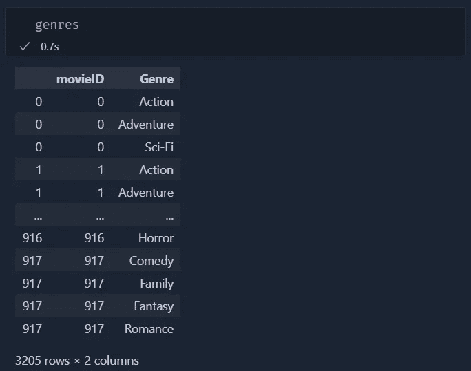
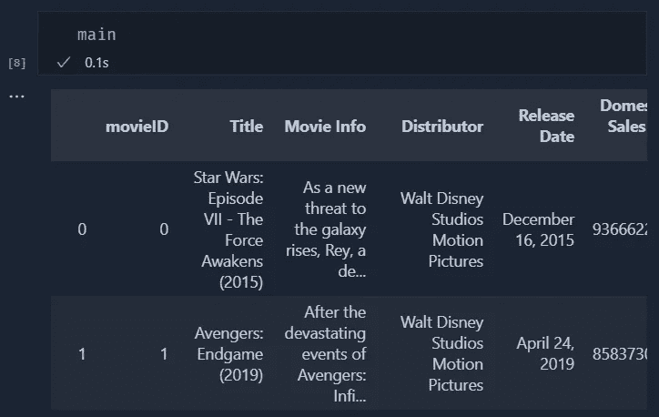
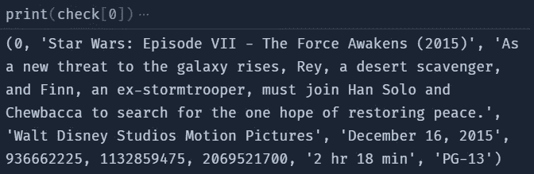
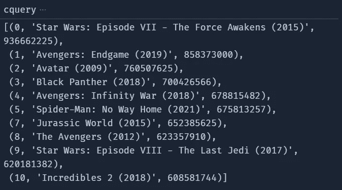

# 在 Python 代码中使用 SQLite

> 原文：<https://blog.devgenius.io/use-sqlite-in-your-python-code-a9b60c9ecc3d?source=collection_archive---------11----------------------->

你好世界！

今天我们将看看如何用几行代码在 Python 脚本中实现 SQLite。

引用他们的网站:SQLite 是一个 C 语言库，实现了一个小型、快速、自包含、高可靠性、全功能的 SQL 数据库引擎。SQLite 是世界上使用最多的数据库引擎。SQLite 内置于所有手机和大多数计算机中，并捆绑在人们每天使用的无数其他应用程序中。

Python 有一个用于 SQLite 的默认模块，名为 sqlite3，因此对于本教程，您不需要下载特定的模块(但是您需要 pandas 来进行数据操作)。

您还需要下载我们将要写入数据库的数据。对于本教程，我已经从 Kaggle 下载了这个数据集。你也可以从那里得到它，或者你可以克隆我的[库](https://github.com/Inzaniak/pybistuff/tree/master/Sqlite%20Introduction)。

让我们开始编码:

我们要做的第一件事是连接到数据库。谈到 sqlite3 中的 DB 连接，我们有两种可能性。我们可以连接到数据库的物理副本，或者使用它的内存副本。在第一种情况下，如果数据库不存在，它将被创建，否则，它将连接到正确的数据库。对于我们的例子，我们将使用一个物理数据库，以便我们可以通过使用其他软件连接到它。

现在我们必须做一些数据操作，根据需要清理和组织数据。如果您对这一部分不感兴趣，请随意跳过。

我们需要做的第一件事是使用 pandas 的 read_csv 方法从 csv 加载数据。之后，我们可以将“未命名:0”列的名称更改为“movieID”。我们还需要将数据框拆分成两个表，因为现在在“流派”列中，每行都有多个流派，所以我们将创建两个通过多对一关系“连接”的表。

为了拆分表格，我们首先创建一个类型，只保留我们需要的列，并将该列转换为一系列 python 列表。之后，我们可以使用 explode 方法将值拆分到新行中:

现在，我们可以从原始数据帧中删除该列，并准备好第二个表:

现在我们可以继续使用 SQLite 了。

我们在数据库中首先需要的是一个插入数据的表。为了创建它，我们将使用在第一步中创建的变量 conn 中的 execute 方法。使用这种方法，我们可以在 Python 代码中执行 SQL 脚本。我还添加了一个 try/except 来删除这个表，以防它已经存在于我们的数据库中。请注意最后一个 conn.commit()，该命令是每次写入数据库的基础。在这篇文章中，我不打算解释事务数据库是如何工作的(因为这超出了讨论范围)，但是请记住，无论何时在数据库上写东西，都需要提交或回滚。否则，你不会看到。

现在我们已经创建了表，最后可以插入行了:

为此，我们将数据框行转换为 python 列表，然后从变量 conn 中调用命令 executemany。execute 和 execute many 之间的区别在于，前者在执行一次命令时很有用，但在使用它插入数千行时会变得相当慢。

现在，我们可以通过在刚刚填充的表上执行 select 来检查一切是否正常:

现在我们可以对这些类型重复同样的步骤

在我们创建了这个表之后，我们现在可以用一个更复杂的指令来查询 DB。在这种情况下，我们将通过国内销售为动作片类型提取最引人入胜的电影:

这是结果:

像往常一样，你可以在我的 [Github](https://github.com/Inzaniak/pybistuff/tree/master/Sqlite%20Introduction) 上找到这个例子的代码。