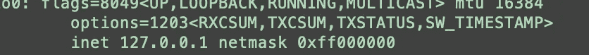

# 使用这个免费工具查找家庭网络中的所有设备

> 原文：<https://blog.devgenius.io/use-this-free-tool-to-find-all-of-the-devices-on-your-home-network-ea83e07bd6b4?source=collection_archive---------11----------------------->

## 弄清楚你家里 WiFi 连接的所有东西，比你想象的要容易。

照片由[哈尔·盖特伍德](https://unsplash.com/@halacious?utm_source=medium&utm_medium=referral)在 [Unsplash](https://unsplash.com?utm_source=medium&utm_medium=referral) 上拍摄

我敢肯定，我不是唯一一个不能 100%确定哪些设备正在使用我的 WiFi 的人。

智能家居技术的购买量在过去几年中不断增加。一些让我的生活变得更简单的东西被拔掉了，放在我的垃圾储藏室里，或者已经被捐赠了。但是我的家庭网络上还有很多我不记得的东西，当然也没有做安全更新。

我的定位？使用 Nmap 扫描我的家庭网络。

# 什么是 Nmap？

Nmap 是一个免费的开源工具，是网络和网络安全工程师的行业标准。

注意: Nmap 是一个有用的合法工具。但是，对任何您无权运行 Nmap 的网络运行 Nmap 可能是非法的。如果用户不知道他们在做什么，Nmap 可能是破坏性的，它可以显示关于网络的敏感信息。

# 如何使用 Nmap 查看家庭网络中的设备？

如果你知道你在做什么，以下是主要步骤。每一步都将在下面进一步分解:

1.  安装 Nmap ( `brew install nmap`)。
2.  使用`ifconfig`来确定您的 IP 地址和子网掩码。
3.  在终端中，运行`nmap -sP [IP address]/[prefix]`，如`nmap -sP 127.0.0.1/8.`
4.  尽情享受你的成果。

## 1.安装 Nmap

Nmap 可以从 Nmap 主网站免费下载[用于 Windows、Linux 和 iOS。使用该工具的第一步是安装它。](https://nmap.org/download.html)

**窗户**

要在 Windows 上安装 Nmap，请下载 Windows 二进制文件，并遵循 [Windows 安装指南。](https://nmap.org/book/inst-windows.html#inst-win-exec)

**Linux**

如果您有 RPM 软件包管理系统，您可以使用以下命令在 Linux 系统上安装 Nmap。

> rpm-vhU https://nmap.org/dist/nmap-7.92-1.x86_64.rpm
> rpm-vhU https://nmap.org/dist/zenmap-7.92-1.noarch.rpm
> rpm-vhU https://nmap.org/dist/ncat-7.92-1.x86_64.rpm
> rpm-vhU https://nmap.org/dist/nping-0.7.92-1.x86_64.rpm

**Mac**

要在 Mac 上安装 NMAP，你需要进入 [Mac OS X Nmap 安装页面。](https://nmap.org/book/inst-macosx.html)下载。dmg，并按照该页面上的说明安装软件。

如果您安装了 homebrew，您可以从终端运行以下命令进行安装:

> brew 安装 nmap

## **2。使用网络工具**获取您家庭网络的 IP 范围/子网掩码

如果您已经知道您的家庭网络的 IP 范围，请跳到下一步。

命令`ifconfig`会给你你的 IP 范围信息。

1.  打开你的终端
2.  运行命令`ifconfig`
3.  在显示的第一个响应中，查找 inet 和网络掩码
4.  你可以在下面的截图中看到，我的 IP 地址是 127.0.0.1，网络掩码是 0xff000000。
5.  如果您的子网掩码是十六进制的，使用这个[站点](https://www.pawprint.net/designresources/netmask-converter.php)来查找您的前缀。0xff000000 的前缀是/8。

## 3.使用 Nmap 扫描家庭网络中已连接的设备

现在，您已经有了自己的 IP 范围，可以开始了。

1.  打开你的终端
2.  跑`nmap -sP [ip address]/[prefix number]`比如我跑`nmap -sP 127.0.0.1/8`
3.  稍微忍耐一下，你的结果就会出现在你的终端里。这将包括类似于`Nmap done: 256 IP addresses (4 hosts up)`的最后一行

最后一行告诉您在您的网络上找到了多少设备。请记住，一个很可能是您的路由器，另一个是您运行命令的机器。

您可以使用`-v` (verbose)标志重新扫描，如果有您不认识的设备，这将为您提供有关这些设备的更多信息。

# 现在清理那些设备

现在我的家庭网络是五个以前被遗忘的更小的设备。这些设备对我的网络来说都不是很大的负担，但是我正在慢慢地提高我的个人安全。这五台设备比我需要安排的软件和安全更新少了五台。

*更多内容尽在*[*blog . dev genius . io*](http://blog.devgenius.io)*。*