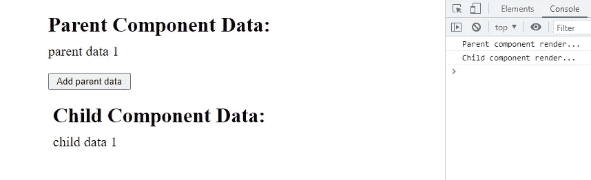
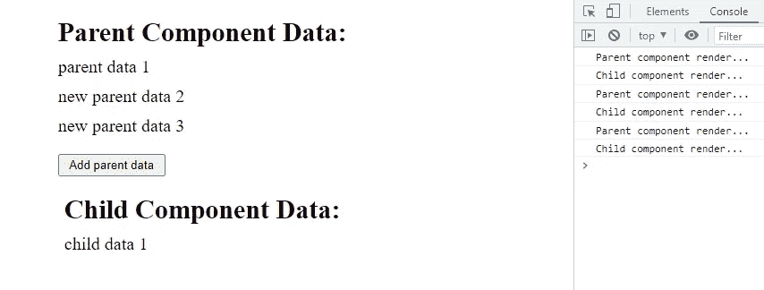
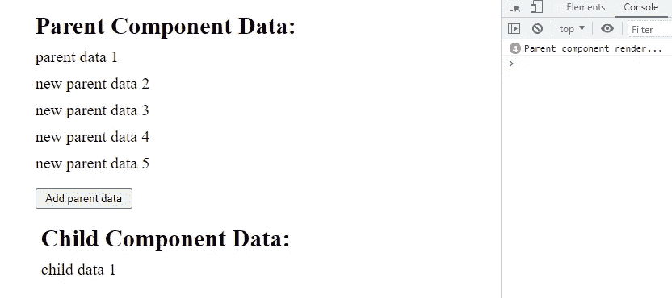
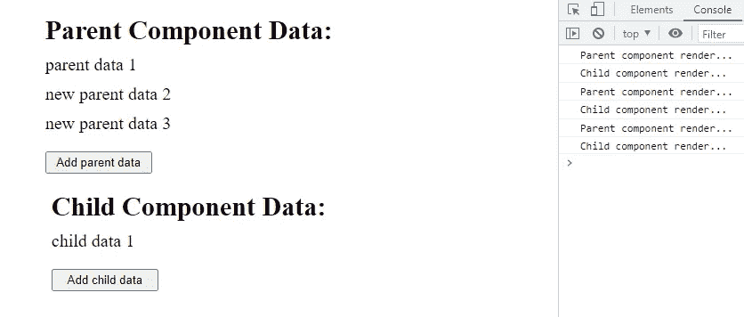
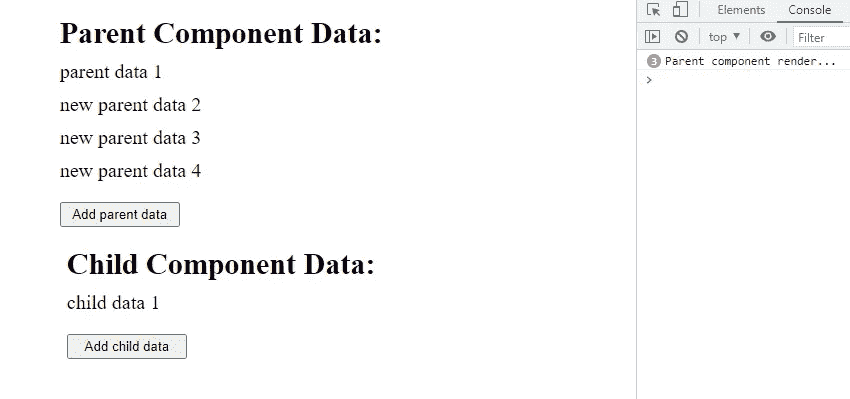

# 使用 Callback()钩子提高 React 组件性能:完全指南

> 原文：<https://blog.devgenius.io/usecallback-hook-to-improve-react-component-performance-a-complete-guide-89bd4997574c?source=collection_archive---------2----------------------->


在这篇博客中，我们将了解 **React** 中的 **useCallback()** 钩子。我们将从介绍开始，看看它的代码实现。我们还将讨论如何以及何时使用 useCallback()钩子。

在我们继续使用 useCallback()钩子之前，你需要理解使用 useMemo()钩子和 react memo()时 React 中的 [**记忆。在这里，我将简单地解释一下 react 备忘录，如果你需要详细的解释，请点击**](/react-memo-and-usememo-explained-in-the-right-way-you-should-know-this-af10a805e620) **[**这里**](/react-memo-and-usememo-explained-in-the-right-way-you-should-know-this-af10a805e620)**

# React 重新渲染和性能缺陷

我们都知道，当 react 组件的状态或道具发生变化时，它会进行渲染，所有子组件也会进行渲染。在某些情况下，我们可能会遇到这样的情况:父组件进行了渲染，但子组件中不需要进行渲染，因为子组件的状态和属性都没有改变，但子组件仍然进行了渲染，因为父组件正在重新渲染，这将是由于不必要的渲染而导致的性能缺陷。

> 让我们看一个不必要的重新渲染的例子

> **App.js**

**App.js** (父组件)

> **Child.js**

**Child.js** (子组件)

> **输出**(页面加载时的初始渲染)



页面加载时的输出

> **输出**(当父组件重新渲染时)



父组件重新呈现时的输出

在上面的代码片段及其输出中，我们可以看到，当父组件重新渲染时，子组件的属性或状态不会改变，但由于父组件重新渲染，它仍然会重新渲染并产生相同的输出，我们都知道任何组件不必要的重新渲染都是一个性能陷阱。为了避免这种不必要的重新渲染，我们使用 react memo。

# 反应备忘录及其重要性

React memo 记忆 React 组件，仅当其属性或状态发生变化时，才允许其重新渲染。从而提高反应元件的性能。

> 让我们使用 react memo，避免不必要的重新渲染

> **App.js 组件将与上述组件相同。**
> 
> **Child.js**

> **输出**



没有不必要的重新呈现的记忆子组件的输出

在上面的例子中，我们使用 memo()来记忆我们的子组件，避免了不必要的重新渲染。

> 让我们添加一个功能，像父组件(App.js)一样在子组件中添加数据

> **App.js**

> **child.js**

> **输出**



现在，当我们添加功能以在子组件中添加数据时，我们的 memoize 子组件不工作了。当父组件重新呈现时，子组件也会重新呈现。这是因为我们将一个函数(addChildData)传递给了在父组件中声明的子组件。

每当父组件重新呈现时，函数(addChildData)会被重新创建并存储在具有新内存引用的新内存位置，因此 memoize 子组件会重新呈现，因为 addChildData 属性的引用已更改。对同一个函数的引用的这种变化会导致重新呈现，这可以使用 useCallback()钩子来解决。

# useCallback()挂钩简介

useCallback()是一个钩子，它通过在重新呈现之间记忆或缓存函数来帮助我们提高 react 组件的性能。

当组件重新呈现时，组件中的每个函数都会被重新创建，因此存储这些函数的内存位置也会发生变化。这也意味着这些函数的地址或引用发生了变化。

useCallback()钩子返回一个内存化的回调函数，该函数作为一个道具传递给子组件。这意味着，我们可以在渲染之间使用相同的函数，而不是在每次重新渲染时都重新创建函数，这样可以避免不必要的渲染。

useCallback 挂钩仅在其依赖项之一发生变化时运行。

## 您需要传递两个东西来使用回调:

1.  要在重新呈现之间缓存的函数定义。
2.  依赖项列表，包括在函数中使用的组件中的每个值。

```
const cachedFn = useCallback(function, dependencies)
```

> 让我们实现 useCallback()钩子来记忆或缓存函数，避免不必要的重新呈现

> **App.js**

> **Child.js**

> **输出**



实现 useCallback()挂钩后的输出

通过 useCallback 钩子的实现，我们成功地避免了不必要的重新渲染，从而提高了 react 组件的性能。

# 什么时候不使用 useCallback()钩子？

useCallback()钩子主要用于通过记忆昂贵的函数来优化性能。这是通过添加依赖项列表来实现的，但是如果你用不必要的 useCallback()填充整个组件，性能就会下降。

**感谢您阅读至此。我希望现在您已经理解了 react 中的 useCallback()钩子及其重要性。**

# 如果你想要更多这样的内容，请在媒体上关注我，订阅我的 YouTube 频道

# 有疑问吗？通过推特[联系我](https://twitter.com/izrajesh)