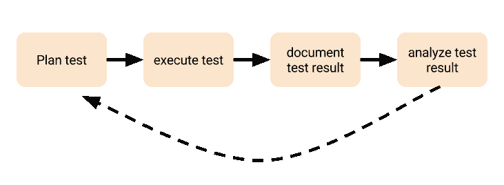

# 用户接受度测试

> 原文：<https://blog.devgenius.io/user-acceptance-testing-764165e36f7a?source=collection_archive---------7----------------------->

用户验收测试(UAT)，也称为*测试版、应用程序*或*最终用户测试*，通常被认为是 web 开发过程中的最后一个阶段，是最终发布或为客户安装网站或软件，或最终发布之前的阶段。

> 用户验收测试(UAT)是软件测试过程的最后一个阶段。在 UAT 期间，实际的软件用户根据规范测试软件，以确保它能够处理真实世界场景中所需的任务。UAT 是新开发的软件推向市场之前必须进行的最后的和关键的软件项目过程之一。

UAT 是指目标受众对软件的使用，并记录和纠正发现的任何缺陷。这是最接近“真实世界”的测试。它让用户有机会与软件进行交互，并发现如果功能被忽略、交流错误、没有沟通等等，一切是否都正常工作。

# 你应该什么时候开始用户接受度测试

虽然 UAT(用户验收测试)是必不可少的，但通常情况下，在应用程序的大部分功能完成之前是无法进行的。测试人员列出了 10 个先决条件，在 UAT 开始之前必须满足这些条件。这些是:

1.  业务需求必须可用
2.  应该充分开发应用程序代码
3.  应完成单元测试、集成测试和系统测试
4.  在系统集成测试阶段，没有显示停止，或高或中等缺陷
5.  在 UAT 之前，只有表面错误是可以接受的
6.  回归测试应该在没有重大缺陷的情况下完成
7.  所有报告的缺陷都应该被修复和测试
8.  应完成所有测试的可追溯性矩阵
9.  UAT 的环境必须准备好
10.  签署来自系统测试团队的邮件或通信，说明系统已准备好进行 UAT 测试

# 谁应该参与用户验收测试？

包括在 UAT 测试中的最重要的同等群体是你的软件的“真正的”最终用户。每个角色和利益相关者群体都应该被包括在内，这意味着每个群体的人都应该被挑选出来加入 UAT 团队。

# UAT 工作流程的 5 个步骤。

## 它是这样工作的。

用户接受度测试是复杂的。这可能是你们很多人的想法。从创建 UAT 计划到执行测试用例并分析它们。各种不同的部门和人都参与其中。

最糟糕的是:UAT 发生在一个尴尬的时间:在一个项目的结尾。

您的开发团队完成了他们的任务(至少他们应该完成)，您的 QA 代理开始测试应用程序。

他们只有一个主要的工作:测试应用程序是否适合你的用户。

以下是 5 个步骤:

*   规划
*   执行
*   证明文件
*   估价
*   报告和经验教训

# UAT 的好处

1.  根据范围内的用户情景验证业务需求是否得到满足。

*   这证实了模型构建者正确地解释了业务需求。

2.降低在生产中发现缺陷的风险。

*   对企业来说，在开发阶段修复项目比在生产阶段修复成本和风险更低。

3.最终用户将在上线前使用新系统时获得技能和信心。

# 什么是成功的 UAT 过程

1.  在 UAT 开始时，对测试人员设定适当的期望值。
2.  基于用户故事的 UAT 脚本(参考验收标准集)。
3.  确保最终用户执行 UAT 测试脚本。最终用户最了解业务流程，因此也最了解预期的系统行为。
4.  阶段测试并引入与业务流程执行一致的功能。阶段可以适应自动化并发测试和最终用户测试，或者多轮最终用户测试，其间有时间进行调整。
5.  召开每日会议，交流状态并解决出现的问题。
6.  为缺陷解决和功能的重新测试安排时间。
7.  确定缺陷和变更的优先级。

# 结论

StackedQA 最简洁地描述了用户验收测试(UAT ):

> 用户验收测试的目标是评估系统是否能够支持日常业务和用户场景，并确保系统对于业务使用是足够的和正确的。

如果您正在寻找我们的服务，请点击下面的网站:

[StackedQA 网站](https://www.stackedqa.com/)

在社交媒体上关注我们:

[脸书](https://www.facebook.com/StackedQA)，[推特](https://twitter.com/stackedqa)， [Instagram](https://instagram.com/stackedqa) ，&Linkedin