# Django 从头开始—Django 第 1 部分中使用 REST API 的用户验证

> 原文：<https://blog.devgenius.io/user-auth-with-rest-api-in-django-part-1-92e0635c0e36?source=collection_archive---------3----------------------->

*   序列化数据—[Django 第 2 部分中使用 REST API 的用户验证](https://antonraphaelcaballes.medium.com/user-auth-with-rest-api-in-django-part-2-f5a3487d11c9)
*   用户认证—[Django 第 3 部分](https://antonraphaelcaballes.medium.com/user-authentication-user-auth-with-rest-api-in-django-part-3-da9e0593effb)中使用 REST API 的用户认证🚀

本文旨在建立 Django REST 框架。我还包括了使用 JSON Web Token 的用户认证，它被广泛称为 **JWT** 。此外，在本教程中，您将学习如何使用 Django 中的管理界面创建数据，使用内置的用户和配置文件关系模型进行身份验证。

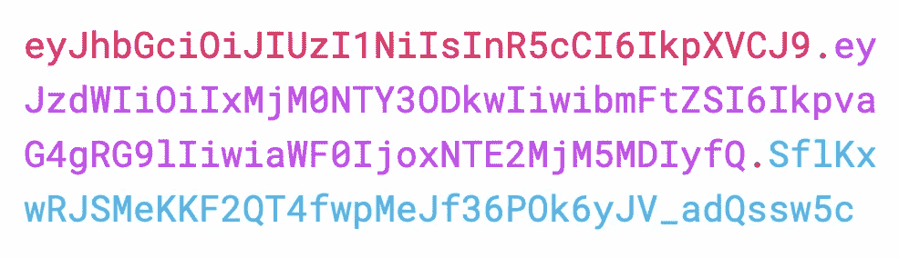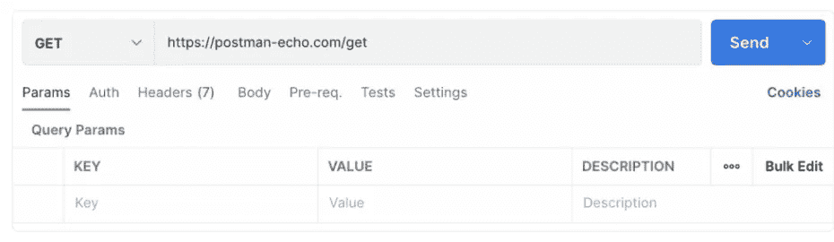

我们将创建不同的应用程序，例如，“项目”，“用户”和“个人资料”应用程序以及它们的管理界面。

> 注意:如果您还没有设置 Python ENV。我强烈建议在你继续之前先把它做好。— [链接](https://antonraphaelcaballes.medium.com/set-up-virtual-environment-python-dbe6d5190504)

# 安装 Django

在你的终端中输入这个-> pip 安装 django

virtualenv → "my_virtual_env "

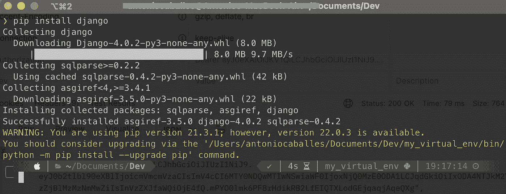

# 创建项目

执行:***django-admin start project<project _ name>***

在我的例子中，我的项目名称是*“myrestapi”*

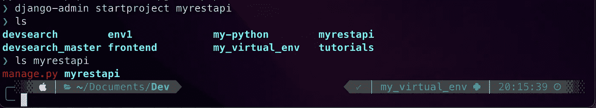

现在让我们尝试运行我们的应用程序。*(你会注意到我用了****python 3****而不是****python****因为这取决于你本地电脑上安装的 python 版本)*

`> python3 manage.py runserver`

我假设您已经成功运行了您的应用程序。我们现在可以开始创建模型。

# 规划

在我们开始我们的模型之前，我们应该对这个系统将要做什么有一个计划。让我们创建一个稍微复杂一点的应用程序。我决定创建一个简单的系统，可以创建一个帐户或用户，并访问他们的项目。我在下面创建了一个数据库模型来可视化我的计划。

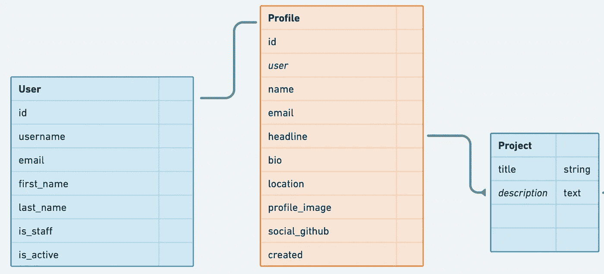

# 创建应用程序

在您的终端中输入命令***python 3 manage . py startapp 项目*** *(您会注意到我使用了****python 3****而不是****python****，因为这取决于您本地计算机上安装的 python 版本)。*

可以看到，在按下 enter 后创建了一个新文件夹。我们的项目中现在有一个名为“项目”的应用程序。对“用户”应用程序执行相同的例程。

> 请记住，我们在这里创建一个系统，将处理用户帐户及其项目。

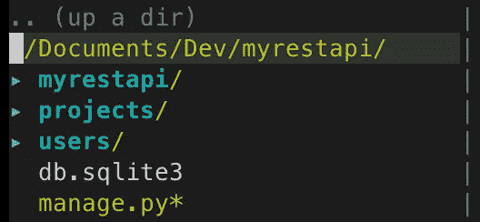

# 创建模型

在这一节中，我将向您展示如何在我们的*项目*应用程序中迁移一个模型。现在我们已经有了它，我们必须在 **INSTALLED_APPS 下的 ***settings.py*** 中添加应用程序。**

```
INSTALLED_APPS = [
     ... ,
     'projects.apps.ProjectsConfig',
     'users.apps.UsersConfig',
]
```

既然我们已经在 INSTALLED_APPS 中添加了新创建的应用程序，现在我们可以开始我们的模型了。首先，让我们创建项目模型。我无法解释 **models.py** 文件中的每个细节。我建议你阅读 Django [文档](https://docs.djangoproject.com/en/4.0/topics/db/models/)中的文档，以充分理解如何制作模型。

在项目目录中查找`models.py`文件，然后添加以下代码。

```
# projects/models.pyfrom django.db import models
import uuidclass Project(models.Model):
    title = models.CharField(max_length=255)
    description = models.TextField(null=True, blank=True)
    created = models.DateTimeField(auto_now_add=True)
    id = models.UUIDField(default=uuid.uuid4, unique=True, primary_key=True, editable=False)
```

## 进行迁移

顾名思义，让我们通过在您的终端中输入以下命令来创建迁移。请注意，您的当前目录位于您的项目目录中。

```
> python3 manage.py makemigrations
```

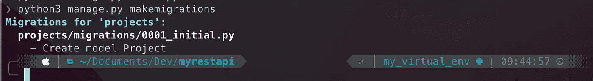

## 移动

迁移迁移(在我的示例中，我们包括了用户应用程序)

`> python3 manage.py migrate`

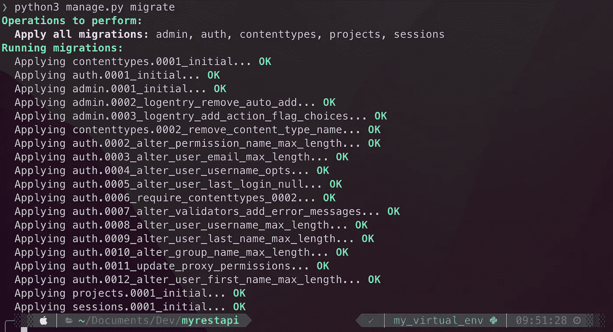

# 管理

[*http://127 . 0 . 0 . 1:8000/*](http://127.0.0.1:8000/)admin

有些人可能想知道这是什么管理路线。[链接](https://docs.djangoproject.com/en/4.0/ref/contrib/admin/)

Django 有一个管理界面。它能够操纵我们应用程序内部的数据。在本教程中，我们将使用 admin 来创建测试数据或虚拟数据。访问上面给出的 url，确保首先运行您的服务器。

`> python3 manage.py runserver`

## 创建超级用户帐户

你会注意到，你需要在我们的管理员帐户凭证。要创建超级用户，请按顺序执行以下命令。[链接](https://docs.djangoproject.com/en/1.8/intro/tutorial02/)

```
> python manage.py createsuperuser
> admin
> admin@email.com
```

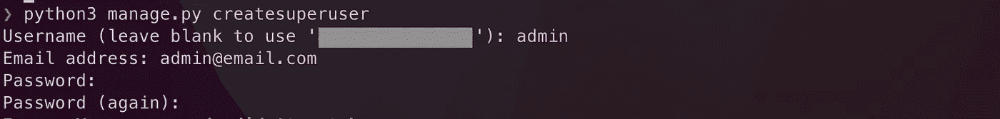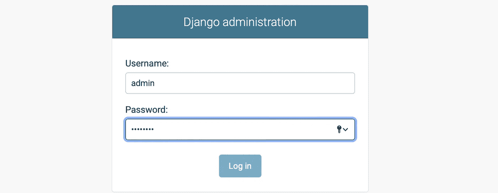

admin 密码；

在您的浏览器中，您应该会看到管理界面。这个示例中添加了*项目*应用程序。

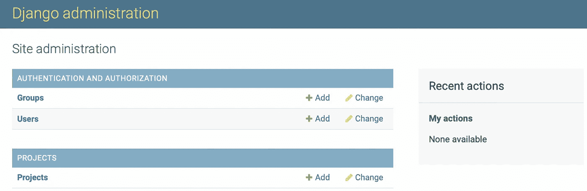

> 我们如何在我们的管理应用程序中添加**项目**应用程序。在您的`admin.py`文件的项目目录中，添加以下代码。

```
# projects/admin.pyfrom django.contrib import admin
from .models import Projectadmin.site.register(Project)
```

现在，您可以在我们的*项目*应用程序中添加示例数据。以下是我的示例项目。

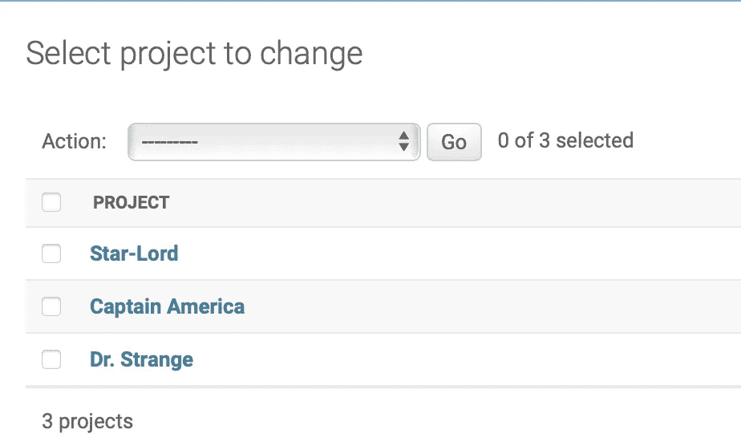

## 最后，我们将创建用户和配置文件模型。

在这一部分，我们将在 Django 中实现内置的**用户**模型(用于认证)以及它的**概要文件**。— [链接](https://docs.djangoproject.com/en/4.0/ref/contrib/auth/)

在你的`users/models.py`中复制下面的代码。一旦你复制了它，运行 **makemigrations** 和**migration**。

> 请务必查阅关于用户模型的文档，以充分理解这一点。请注意:django.contrib.auth.models

```
from django.db import models
from django.contrib.auth.models import User
import uuidclass Profile(models.Model):
    user = models.OneToOneField(User, on_delete=models.CASCADE, null=True, blank=True)
    name = models.CharField(max_length=255, blank=True, null=True)
    username = models.CharField(max_length=200, blank=True, null=True)
    email = models.CharField(max_length=200, blank=True, null=True)
    created = models.DateTimeField(auto_now_add=True)
    id = models.UUIDField(default=uuid.uuid4, unique=True, primary_key=True, editable=False)def __str__(self):
        return self.name
```

结果-->

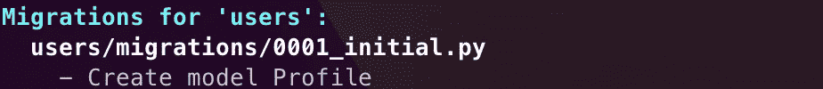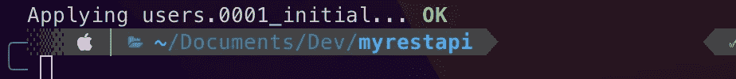

进行迁移和迁移

成功迁移之后，您现在可以在我们的 **admin.py** 中注册**概要文件**模型。就像我们在*项目*应用程序中所做的一样。

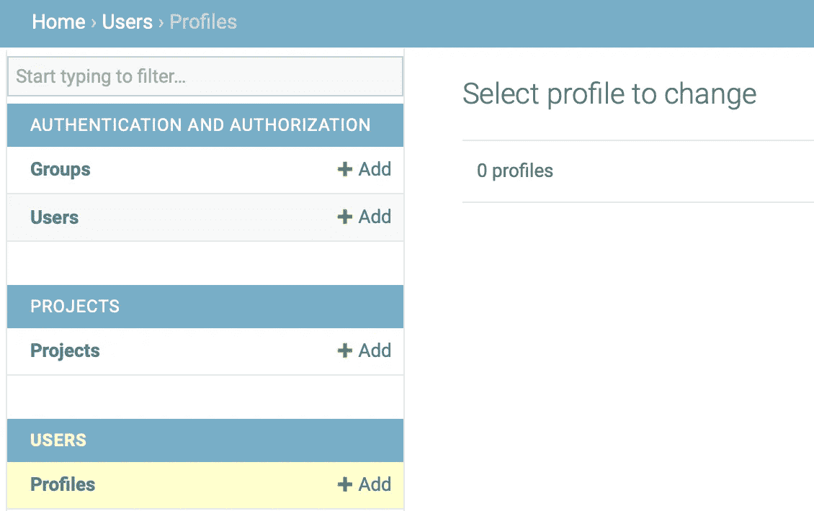

现在让我们转到第 2 部分…

## Django 中使用 REST API 的用户验证—第 2 部分

🔗[链接](https://medium.com/@antonraphaelcaballes/user-auth-with-rest-api-in-django-part-2-f5a3487d11c9?postPublishedType=initial)