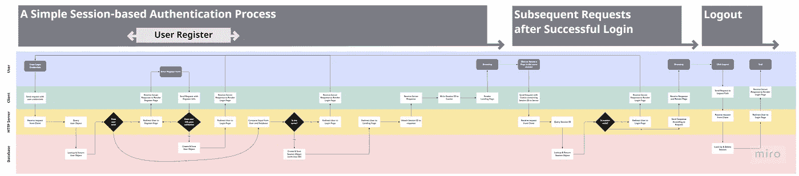

# 简而言之，基于会话的认证

> 原文：<https://blog.devgenius.io/user-authentication-in-a-nutshell-ecf0d9dee2b3?source=collection_archive---------5----------------------->

## 查看我在[我的技术文章](https://yumingchang1991.medium.com/technical-article-structure-on-medium-954850e1ef4d)中的所有其他帖子

对于初学者来说，认证可能是最难攻克的话题之一。写这篇文章是为了让你对用户认证有一个更全面的了解，这样你，作为一个初学者，就不会像我一样感到迷茫。

下面提到的基于会话的认证是跨不同语言通用的。

# 涵盖的主题

1.  为什么用户认证对初学者来说势不可挡
2.  在处理身份认证之前，有哪些先决条件
3.  认证简介
4.  不同类型的认证
5.  基于会话的认证过程
6.  结束前注意
7.  参考

# 为什么用户认证势不可挡

几周前，我在自由代码营学习认证时感到不知所措。我按照他们的指示输入了很多我不知道的代码。

出现了许多新术语，例如，会话、会话存储、快速会话、通行证、策略、序列化和反序列化等。

然后学习材料继续重构代码，这使得情况更加模糊。我对代码已经没有任何线索，现在它被抽象了。

我感到力不从心，因为我对身份验证没有一个整体的看法，相反，我被太多的实现细节塞满了。

我需要夺回控制权。我错过了什么？

# 先决条件

原来基本面还挺多的。一口气看完它们是不可能的，至少对我来说是不可能的。我花了一个月的时间才最终掌握了认证流程。

这些先决条件相当多，所以我不会在这篇文章中详细讨论它们。相反，我会列出在着手下一个概念之前你应该掌握的概念，并提供一些参考。

1.  **什么是 Express 框架中的中间件？它做什么，如何实现？**
    这里是我的帖子 [*一分钟讲解中间件*](https://yumingchang1991.medium.com/express-middleware-explained-in-one-minute-671af8d5a3b9) 。它会给你一个清晰的感觉。之后，你就可以在 [*编写中间件*](http://expressjs.com/en/guide/writing-middleware.html) ，使用中间件[*阅读快递公文了。*](http://expressjs.com/en/guide/using-middleware.html)
2.  什么是会话、快速会话和会话存储？
    我发现扎克和自由代码营的这个 [*YouTube 视频*](https://youtu.be/F-sFp_AvHc8?t=3905) 极有帮助。观看他介绍快速会话的部分。让我给你一个提示。Session、express-session 和 session store:其中之一不是一个概念，而只是一个实现这个概念的库。
3.  **什么是 cookie？cookie 和 session 是什么关系？**
    这里是我的帖子地址 [*缓存，cookie 和 Web 存储*](/cache-cookies-and-web-storage-in-a-nutshell-11f9dc02bacc) 在客户端。你可以只看介绍饼干的部分，跳过其余部分。之后，做一些谷歌搜索，找出 cookie 和会话之间的关系。
4.  (可选，但大多数时候你会用到)**如何使用 Mongoose 操作 MongoDB 或 MongoDB Atlas？**
    这里是我的帖子 [*介绍 MongoDB 图集和 mongose*](/mongodb-mongoose-all-you-need-to-know-as-a-beginner-3eb3bf6979f2)。

在继续阅读之前，请确保您确实理解了上述先决条件。

# 认证简介

认证是确定某人是否是他们所声明的那个人的过程。事实上，这在我们的生活中很常见。

例如，当我们去另一个国家旅行时，我们需要向当地海关官员提供我们的护照。护照是我身份的证明。换句话说，我用护照告诉海关官员我是来自台湾的张玉明。

当涉及到互联网时，客户端设备发送带有证书的 HTTP 请求以证明他们是谁。该证书不是由客户端本身提供，而是由服务器提供。这就像我们不打印自己的护照，而是从外交部申请。

大多数情况下，客户端设备向服务器提供登录凭证，以交换在接下来的 24 小时内有效的证书。证书的有效期由服务提供商或美国开发商决定。

# 不同类型的认证

虽然我们可以用护照来证明我们是谁，但我们只在旅行时才使用护照。在其他情况下，passport 可能一点用都没有。

例如，我们可能需要拿出我们的贵宾卡，这样酒店的服务员，或者 Arc'teryx 的销售助理就知道我们是谁了。然而，在这种情况下，护照不会为我们提供任何特别的优惠。

正如我们可以使用护照或贵宾卡来证明我们是谁，在不同的情况下，也有不同的方法来实现网络认证:

*   **基于会话的认证**常用于客户端与服务器之间的通信
*   而**基于令牌的认证**通常用于服务器到服务器的通信

让我们更深入地研究一下基于会话的身份验证。

# 基于会话的认证过程

此流程图描述了一个简单的基于会话的身份验证过程

上面流程图描述了认证的一般过程。你可能想[使用这个链接](https://drive.google.com/file/d/1ZRnk1eNVCZkHELfC_oGph7e8PNP-qjpU/view?usp=sharing)在 Google drive 上查看更好的分辨率。

## 当客户端没有证书时

*   用户输入登录凭证并提交
*   客户端发送带有登录凭据的请求
*   服务器接收请求并检查登录凭证是否有效
*   如果有效，服务器创建一个会话并将该会话 id 附加到响应(会话 ID 是证书)
*   客户端接收服务器响应并将会话 ID 存储为 cookies

## 一旦客户端收到证书

*   由于客户端将证书存储为 cookie，并且 cookie 总是随请求一起发送，因此来自该客户端的所有后续请求都将携带此证书
*   当服务器收到带有证书的请求时，它通过查询会话数据来检查该证书是否有效
*   如果证书有效，那么服务器返回请求所要求的内容

## 客户端还可以通过注销在证书到期前主动删除证书

*   当服务器收到注销证书的请求时，它只是查找相关的会话数据并删除它

# 结束前注意

当我理解认证过程的整体观点时，使用 Passport.js 的逻辑对我来说很有意义。

如果这篇文章有助于您实现基于会话的身份验证，请鼓掌与我分享您的激动之情！

# 参考

*   **文章** : [*会话 vs 基于令牌的认证*](https://www.geeksforgeeks.org/session-vs-token-based-authentication/) 由极客为极客