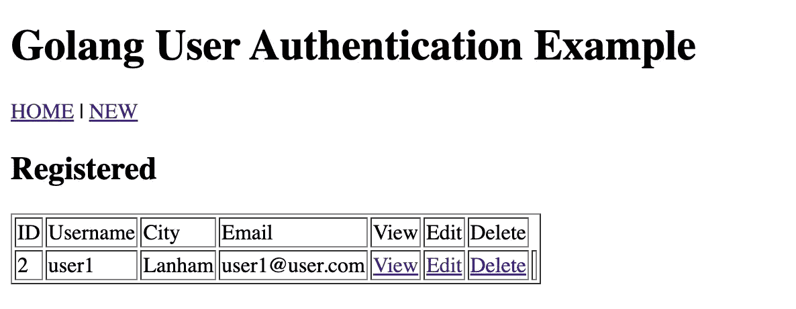
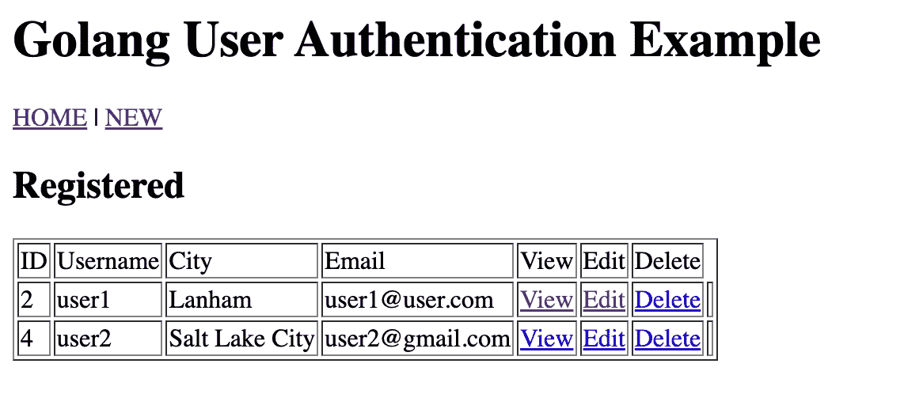

# Golang 中的用户创建和验证第 2 部分— CRUD 操作

> 原文：<https://blog.devgenius.io/user-creation-and-authentication-in-golang-part-2-crud-operations-cecb4e986655?source=collection_archive---------7----------------------->

# 通过 HTTP 接口的 CRUD 操作

在之前的[文章](https://medium.com/@elijahomolo/user-creation-and-authentication-in-golang-part-1-f6b6cc08d9fe)中，我们演示了使用 Go 建立到本地 Postgres 数据库的成功连接。在本文中，我们将继续使用数据库，并介绍 HTML 模板作为浏览器中的 HTTP 请求和针对数据库的 CRUD(创建、读取、更新和删除)操作之间的接口。

# 先决条件:

*   **一个围棋装置。**安装说明见[安装 Go](https://go.dev/doc/install) 。
*   一个编辑你代码的工具。你有的任何文本编辑器都可以，我用的是 Goland。
*   **一个命令终端。使用 Linux 和 Mac 上的任何终端，以及 Windows 中的 PowerShell 或 cmd，Go 都可以很好地工作。**
*   PostgreSQL 的本地[安装](https://www.postgresql.org/download/)
*   PSQL CLI 的安装

## 1.从数据库中读取:

让我们从我认为最容易实现的操作开始，从数据库中读取数据。我们将使用 PSQL 手动运行 SQL 查询，然后通过浏览器在 HTML 模板中检索信息。

首先，创建一个“users”表，其中包含以下行:user_id、用户名、密码、城市和电子邮件。然后我们将播种一些任意的数据进行测试。打开 PSQL shell 并对 myapp 数据库执行以下查询:

```
eomolo$ psql
psql (14.2)
Type "help" for help.eomolo=# \c myappYou are now connected to database "myapp" as user "eomolo".myapp=# CREATE TABLE users (
  user_id serial PRIMARY KEY,
  username VARCHAR ( 50 ) UNIQUE NOT NULL,
  password VARCHAR ( 50 ) NOT NULL,
  city VARCHAR ( 50 ) NOT NULL,
  email VARCHAR ( 255 ) UNIQUE NOT NULL);CREATE TABLEmyapp=# \dtList of relations
Schema | Name  | Type  | Owner
--------+-------+-------+--------
public | users | table | eomolo
(1 row)myapp=# INSERT INTO users(username,password, city,email) VALUES ('user1',123456, 'Lanham', 'user1@user.com');INSERT 0 1
myapp=#
```

接下来，在您的 myapp 项目目录中，创建一个目录“form ”, html 模板将存在于其中。在其中创建一个 Index.tmpl 文件:

构建并添加页眉和页脚:

表单目录结构目前应该如下所示:

```
ls myapp/form/
Footer.tmpl     Header.tmpl     Index.tmpl 
```

在 main.go 文件中，我们将导入另外两个包:

1.  [文本/模板](https://pkg.go.dev/text/template) —包模板实现数据驱动的模板，用于生成文本输出。
2.  [net/http](https://pkg.go.dev/net/http) —包 http 提供 http 客户端和服务器实现。

我们需要创建一个定义用户模型的结构:

```
// define a user model
type User struct {
   Id    int
   Username  string
   City string
   Email string
   Password string
}
```

如下所示重构 main.go 文件，添加一个“Index”函数，该函数将查询用户表并返回其行的内容:

现在可以通过向地址 [http://localhost:8080/](http://localhost:8080/) 发出请求来列出所有用户。



## 2.创建用户

创建一个用户需要能够输入信息，然后发出一个 post 请求，这个请求可以传递给一个函数，然后这个函数将数据插入数据库。一旦这样做了，它就应该重定向到现在显示新添加的信息的索引页面。

为此，我们将创建一个“新建”和“显示”模板以及相应的插入和显示函数。“新”模板将包括一个表单动作，将数据发送到“插入”路径，该路径将用于向插入函数传递输入。

首先，使用 New.tmpl 表单获取创建新用户所需的输入:

表单操作会将插入的数据发送到“插入”路径，该路径会通过相应的插入功能在数据库中创建一个新行:

当数据库语句成功执行时，浏览器将重定向到显示添加用户的索引页面。



通过构造以下内容，可以使用表中的“查看”按钮显示单个用户:

显示单个用户的显示模板:

以及一个 show 函数，它返回数据库中的信息，这些信息由单击 View 按钮时传递的 Id 值过滤:

## 3.更新用户

既然我们已经实现了创建和显示用户的功能，现在我们可以启用编辑功能，更新数据库中的条目，然后重定向到显示新数据的索引页面。

让我们创建一个重定向到“更新”动作的编辑表单。

然后，一个编辑功能将查询数据库中要更新的用户:

然后，用户将被传递到更新操作函数，该函数将使用传递的值执行一条语句:

## 4.删除用户

配置的最后一个操作是删除用户。当用户 ID 通过/delete 路由传递时，应该执行相应的语句从数据库中删除条目。下面的函数应该可以实现这一点:

您的 main.go 文件现在应该类似于以下内容:

这将简化操作数据库所需的 CRUD 操作。在下一篇文章中，我们将添加一个身份验证层，根据用户身份来限制或启用访问和功能。

我欢迎任何可以改进演示的建议或更正，请在评论中告诉我。