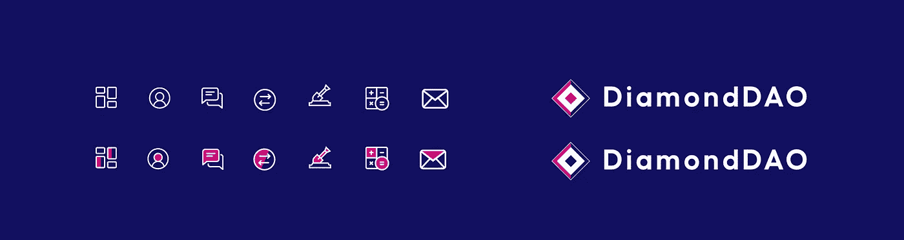

# 5 级台风期间和之后的用户体验设计

> 原文：<https://blog.devgenius.io/user-experience-design-in-the-midst-and-aftermath-of-a-category-5-typhoon-462a9cd0ab1b?source=collection_archive---------5----------------------->

> 周四晚上 7 点，我承诺会在周日之前完成并交付我所有的设计。五级台风将在我的城市登陆前一小时。让 7 个地区陷入完全的黑暗，切断所有的水源供应，让每个人的生活天翻地覆。

*举例来说，2005 年肆虐美国的卡特里娜飓风时速为 280 公里，拉伊飓风时速为 259 公里。*

## 不知道将要发生什么

在过去的 2-3 周，我一直呆在家里，只出去买杂货，并没有真正关心外面的世界。这是因为我一直在学习 React 和 NextJS，所以我有点全神贯注于整个过程。我还删除了我所有的社交媒体，所以我最近没怎么看新闻。*我知道，我知道，无论如何，我不应该从社交媒体上获取新闻。*这意味着，直到 15 分钟前，我根本不知道有台风要来，直到它在拐角处露出头来。

起初，只是下着毛毛雨，还有些风，公寓外传来轻轻的嚎叫声。请注意，这些年来我们遇到过一些风暴，但总是一些暴雨，到处都是被淹的街道，还有我的光纤网络的轻微中断，可能会断电几个小时，但仅此而已。

**不是这个。**

想象一下树叶像子弹一样飞驰。

第一滴水滴落下 10 分钟后，开始下雨了。**努力。真的很难。雨变得又大又密，风从各处卷起树叶和垃圾。**

起初它并没有真正困扰我，但后来砰砰声开始了。镀锌钢板折叠时发出的刮擦声。小树枝被撕裂，撞击着玻璃窗，呼啸的风声本身就是一场噩梦。

就这样，一片漆黑。停电了，应急灯只能亮几个小时。两个月来，我也一直在计划买一个发电站，但我一直在拖延，所以现在我觉得自己比以往任何时候都像个白痴，还害怕我的屋顶会被吹走。所以，双重打击。

台风拉伊(奥德特)的视频

现在风暴终于达到了顶峰，风敲打着我的前门，就像一个被抛弃的旧情人想要进来。雨水仍在寻找从关闭的窗户进入室内的方法，我和我的女朋友在房子里跑来跑去，把水从门的缝隙中推出来，放入水的裂缝中。[🧙](https://emojipedia.org/mage/)💍 [💦](https://emojipedia.org/sweat-droplets/)。一片混乱。

## 一个非常愚蠢的决定。

这东西可能会把我斩首

当我看着发生在我家外面的火车事故时。一块波纹状的屋顶正好飞到我正往外看的窗户前面，落在我车旁的一根柱子附近。它卡在一根小管子和水泥柱子之间，每过一秒钟，它就会被风吹走一点，离我的车更近一点。我是个白痴，我打算移动汽车，以确保它最终飞走时不会被扁平的金属片损坏。

当我坐进车里的时候，能见度大概是这样的。

不幸的是，那天晚上冷静的头脑并没有占上风，我冒着生命危险移动汽车。我一打开门，暴风雨就由于风的力量把我推回了膝盖，不到一秒钟就把我湿透了。我跑到司机座位上，发动了汽车，意识到由于雨下得很大，挡风玻璃上的能见度为零。还好我用备用摄像头还能看到街上的一些地方。

当我把车开到离嵌在里面的金属片几米远的地方后。我关掉它，跑回了房子。我周围的一切都是漆黑一片，风太大了，我被推回到车上，树叶和小树枝打在我的脸上和手臂上。当这一切发生的时候，我所能想到的就是我这么做有多愚蠢，如果我死了或者被斩首了。我完全活该。幸运的是，我没有被抓伤。暴风雨来临时，请不要出门。这是非常不安全的，我只有我幸免于难。

回到房子里后，我擦干身体，我生活的一部分在我眼前闪过。

## 我需要开始工作了

在那个愚蠢的噱头之后，我意识到我还有 20 个设计要在 4 天内完成，我还在第 0 页，我的 M1 Macbook Pro 有 97%的电池，我的手机有 50%的电池用于数据。所以我穿上我的大 boi 裤子，推开所有可怕的想法，开始工作。我想过要求延期，我相信我的客户会理解，但我已经说过我不会让他失望，每当我说这些话时，我总是能做到。那就是 PeterGarciaGuarantee **。**

在黑暗中工作了几个小时后，几乎不能上网。我完成了几个设计，并告诉自己这个项目已经有了很好的进展。

www.daoofdiamonds.com[的仪表盘设计](https://www.daoofdiamonds.com/)

过了一段感觉像是永远的时间(可能最多两个小时)，一切都平息了，我终于筋疲力尽，在黑暗中倒下了。

当早晨来临时，现实来了，我意识到经历风暴是所有事情中最容易的部分。

## 余波

这里有一些发生在整个城市的破坏的照片:

商业区的市场被吹走了

一辆汽车被倒下的树压扁了

该市的大部分企业都受到了风暴的影响，暂停了运营

因为五级台风。该市 95%的电力线路被切断，所以大部分民众直到现在都没有电。一些报道称电力将在一个月后恢复。

由于强风，电线被切断了。

供水也被切断，人们现在在家门口等着运水车把饮用水送到每家每户。我还听说，在一些情况下，人们从夜晚到黎明都在等待运水车的到来。

人们在路边等待水车来送水，因为供水线路中断了。

人们也在加油站排队，队伍通常长达一英里或更长。有时你不得不等 3 个小时才能吃饱。还有一个问题是个人囤积天然气，并带来大容器。*老实说，我认为这非常自私，这些人应该为他人着想，而不仅仅是自己。尤其是现在。*

这条线长达一英里多，堵塞了交通。

街道也因为树木碎片或电线倒下而无法通行。

所有街道都有倒下的树木，其中一些已经无法通行，直到政府部门能够清除大部分的堵塞。

人们也在百货公司抢购，食品库存也快用完了。饮用水也达到了疯狂的昂贵价格:从每瓶 15 比索(0.30 美元)到一些地区的 250 比索(5 美元)。自动取款机也已经没有现金了，这个城市的大多数工薪阶层都没有借记卡或信用卡。即使他们这样做了，大多数终端也不能工作，因为通信线路也受到了影响。

其他人也在他们被毁的家园外的帐篷里睡觉，但幸运的是，这里已经停止下雨了，所以他们不会淋湿。

当我意识到恢复供电还需要一段时间时，我选择把我所有的冷冻肉送给其他人烹饪，而不是让它们白白浪费。我还把我所有的库存罐头食品都送人了，因为我可以从酒店里得到食物。

因为我喜欢做饭，所以我倾向于储存食物，但是其他人更需要这些，如果我不放手，这些食物就会被浪费掉。

# 完成设计。

台风袭击这座城市的第二天。所有主要道路都遭到破坏，基本设施已经停止工作。我想呆在我的房子里，因为它没有受到太大的损坏，但是我的女朋友为我们预定了一个酒店房间。

我们很幸运地得到了最后一个房间，我仍然感谢我们决定得到一个房间，而不是呆在没有电和水的房子里。我还需要给我的设备充电，这非常幸运。

我仍然感谢我的女朋友强迫我去酒店开房间。那个女人是天赐之物。

在我终于能够安顿下来，找到一个工作的地方，有体面的住宿，以及让我这边的事情有条不紊。我能够完成我需要做的所有设计，考虑到当时的情况，我对这个项目的结果感到非常高兴和自豪。我创作了一个我的客户特别想要的设计，并让它出类拔萃。

我还为开发人员提供了桌面和移动视图需要发生什么的注释。因为我也做前端开发，所以我已经知道如何编写这个 UI。我只需要把它传达给另一个开发者。

我也非常满意我为用户界面创建的这两个色调图标。

有了这一切，我感到非常幸运，因为我们能够预订一个有电、无线网络和干净自来水的酒店房间。我有资金留在这里，直到一切恢复正常，或者直到我的资金用完。我没有经济上的损失，因为我的财产没有受损。

但我是例外，而不是规则。对于每一个像我一样幸运的人来说，还有成千上万的人因为台风而挣扎着度过难关。

## 其他人需要帮助。

如果你想捐款帮助受这场灾难影响的人们。

您可以发送到以下地址:

ETH:0x 6619 f 55971 BCB 5 ce 1744 BF 481328832d 98276900

BTC:3 f 63 ehhvkzo 6 reuajgfyzbxsm 5 tgpztwzg

我将亲自管理，并尽可能将所有捐款分发给更多的人，我将感谢基金的每一位捐助者，每一分钱都将入账。还将提供收据，以便每个人都知道资金的用途。我也会捐出一些我个人的钱，但这还不够。

## 去哪里找我

你可以在这里查看我的作品集:[https://bricksandcanvas.com/](https://bricksandcanvas.com/)你也可以联系 bricksandcanvas@gmail.com

感谢阅读。