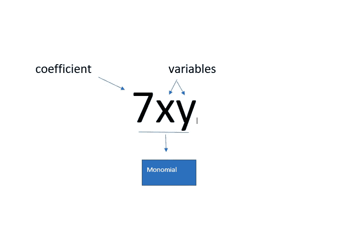
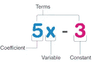
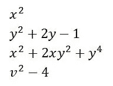
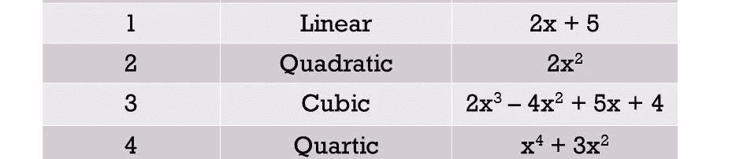
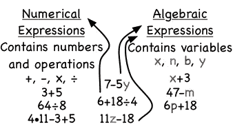
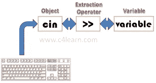
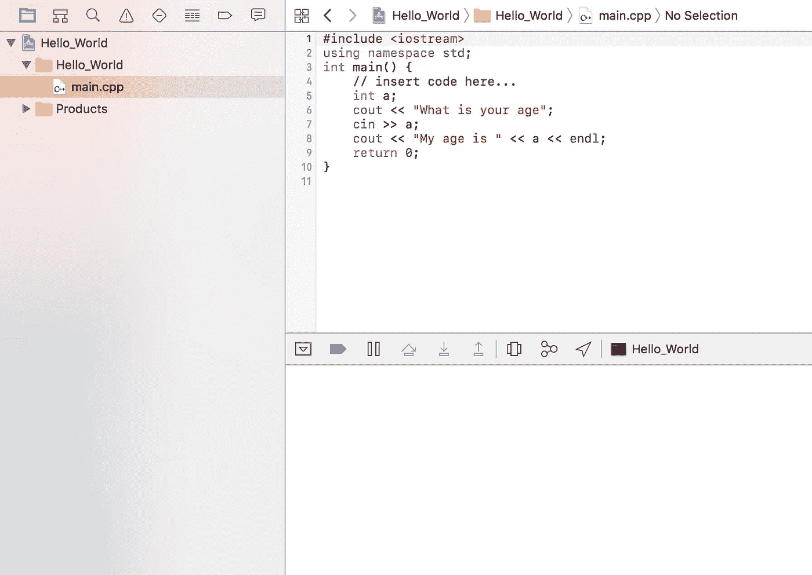

# 用户输入

> 原文：<https://blog.devgenius.io/user-input-55e9987bd4a8?source=collection_archive---------56----------------------->

## C++基础:

## 去更好地理解一个人。有必要建立一种你们双方都能轻松沟通的关系。

[**用户输入**](https://www.youtube.com/watch?v=t07tO3lMgOM&t=38s)

我将讨论一些表达式和用户输入，因为我已经在我的[数据类型](https://medium.com/@coolahmed21)博客中讨论了数据类型。其中我写道，数据类型是计算机的一种感觉，通过它，计算机理解你提供什么类型的数据，你需要什么类型的数据。正如我也讨论过的一些数据类型，例如用于输入/输出的整数的 ***int*** 、用于输入/输出的小数的*以及用于输入/输出的字母的 ***char*** 变量。*

*你们都很熟悉这种表达方式。*一个* ***表达式*** *是一组数字变量和运算符。数学中有许多类型的表达式(即:单项式表达式、二项式表达式、多项式表达式、线性表达式、二次表达式、三次表达式、双二次表达式、数值表达式、变量表达式等等)。现在我想给你稍微回顾一下每个表情。**

***单项表达式:***

**由一项、一个整数或* ***系数*** *(与变量相乘的数)和一个或多个变量或字符*组成的表达式，如:- **单项表达式:***

**由一项、一个整数或* ***系数*** *(与变量相乘的数)和一个或多个变量或字符*组成的表达式，例如:-*

**

*7xy 其中 7 是系数，x，y 是两个变量，或者 38xyz 是另一种类型的单项式。*

**

***二项式表达式:***

**表达式由两个不同术语和一个运算符* **组成，例如:-***

*5x + 3 其中 5x 是第一项，3 是第二项减号(—)是运算符。*

***多项式表达式:***

**

*图 1.1*

**一个表达式由一个、两个或多个术语组成，如图 1.1****所示。****

*其中，x 平方是单项表达式。y 平方+ 2y -1 是三项表达式等等。*

***线性表达式:***x 的幂是这样一个表达式的表达式称为线性表达式。**

***二次表达式:***x 的幂是二或平方的表达式称为二次表达式。**

***三次表达式:***x 的幂是三或三次方的表达式称为三次表达式。**

***双二次或四次表达式:**x 的幂为四的表达式，这样的表达式称为双二次表达式。*

*这里我分别展示了线性、二次、三次和双二次表达式的例子。*

**

*数值表达式:由两个或多个数字项和一个运算符组成表达式。*

*变量表达式:由两个或多个字母项和一个运算符组成的表达式。*

*这里我也展示了数值和变量表达式的例子。*

**

> *水流中的碳*

*了解了一下表情之后。现在我们可以更好地理解 cin 流的概念。在 C++中，我们有一个预定义的库。在这个库中，有许多变量已经被声明并被赋予了特定的函数，例如 cout 或输出流，正如我在我的博客 [**cout**](https://medium.com/@coolahmed21/cout-is-a-magical-tool-4b73378f7566) 中所讨论的。它的功能是在屏幕上打印一些东西，cin 用来接收用户的数据。*

> *税收*

*它使用起来非常简单。我们只需简单地编写 cin 变量，并使用小于运算符，然后编写用户将赋值的变量，并在最后终止符号。*

> ***cin >变量名称>；***

**

*句法*

*如果你想分别接受两个或更多的输入，你需要在每个变量后使用>>操作符。语法将是*

> ***CIN>变量 1>变量 2；***

*现在我们有一个非常基本的程序，其中我们使用输入流和输出流。*

**

*运行它。*

> *E 一步一步解释:*

*第一步:添加一个库，比如 iostream*

*第二步:创建主函数，比如 int main()*

*第三步:定义或声明变量如 **a** 来存储**年龄。***

*第四步:使用输出流(cout)打印一个字符串，比如“你的年龄是多少？”*

*第五步:使用输入流(cin)获取用户年龄*

*第六步:再次使用输出流打印字符串，如“我的年龄是”，然后 **a** 将打印您存储在 **a.** 中的年龄*