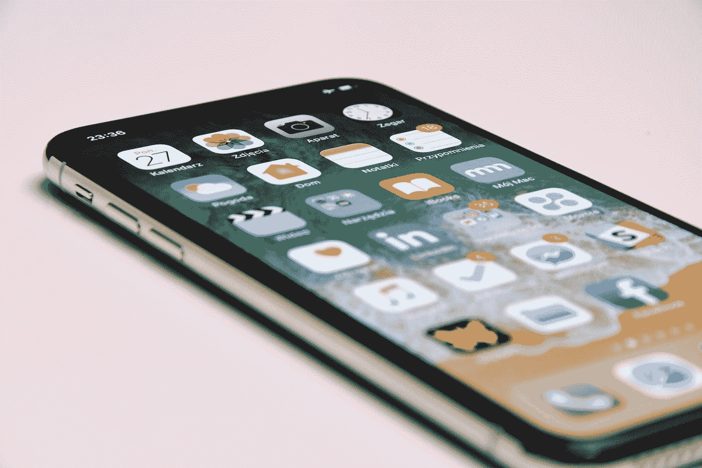
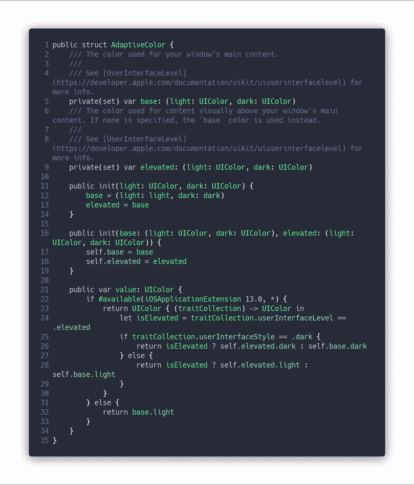
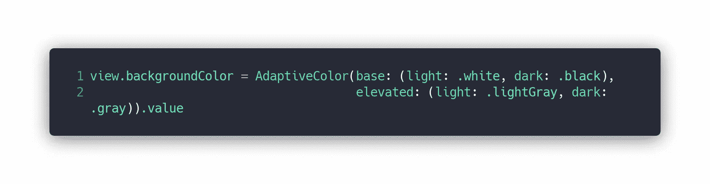
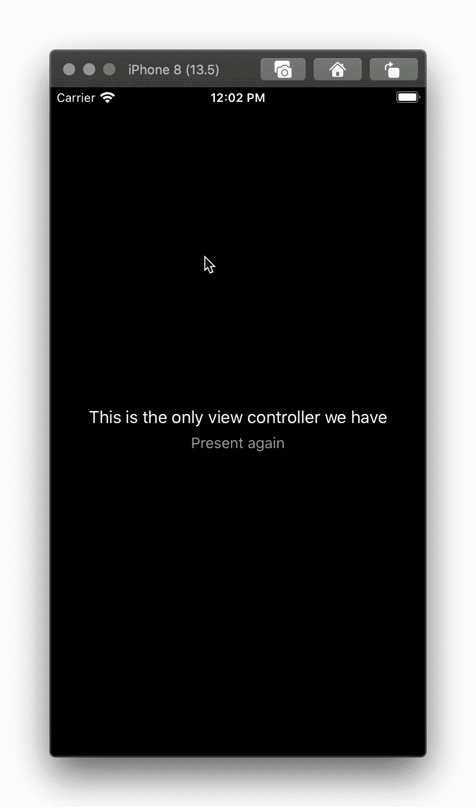

# 用户界面级别，浮动应用的未来？

> 原文：<https://blog.devgenius.io/userinterfacelevel-the-future-of-floating-apps-bec2d3328e79?source=collection_archive---------6----------------------->

## iOS 13 为你的应用带来了新的活力。

照片由 [Przemyslaw Marczynski](https://unsplash.com/@pemmax?utm_source=medium&utm_medium=referral) 在 [Unsplash](https://unsplash.com?utm_source=medium&utm_medium=referral) 上拍摄

去年在 Shopify，我们开始开发全新的销售点。有一个小问题，假设所有的屏幕都全屏显示给用户，我们需要区分模态屏幕和其他屏幕的能力。iOS 13 对此有过很棒的回答。

感觉每一个新的 iOS 版本都给`UITraitCollection`或者`UIUserActivity`增加了一些东西。iOS 13 也不例外，它为`UITraitCollection`增加了一个小而强大的功能，在开发通用应用程序时会派上用场。特别是如果你的应用程序是以浮动窗口的形式出现的话，这个附加功能就是`userInterfaceLevel`。

## 什么是用户界面级别？

苹果将其描述为窗口内容的视觉层次。可能的值有`base`、`elevated`和`unspecified`。第一个是窗口的主要内容，最后一个是它上面的任何内容。这将是完美的匹配，我们需要的模态窗口有一个专门的背景颜色。

> *查看评论部分，了解杰夫·哈克沃斯关于这些值如何因其他因素而变化的精彩解释

## 用它来满足我们的需求

AdaptiveColor 源代码

前面的片段是 Shopify 的[销售点应用](https://shopify.com/pos)如何处理动态颜色。您应该关注第 24 行，我们检测用户界面的当前高度，并决定将两个颜色集中的哪一个用于这个特定的颜色。

现在，假设我们想改变一个视图的背景颜色，我们需要做的就是:

AdaptiveColor 的用法示例

由于出色的 UIAppearance，我们可以像设计背景视图一样设计我们的 UINavigationController，并且我们所有的屏幕都将以正确的颜色显示。

将所有东西放在一个项目中，它看起来像这样:

背景颜色的变化对显示级别做出反应

## 进一步阅读

仅此而已！，一如既往，您可以在 GitHub 上找到完整的源代码

 [## Raul riera/技术文章

### 我写的技术文章的代码库👨🏻‍💻。您可以在以下网站找到它们及更多内容…

github.com](https://github.com/raulriera/technical-articles) 

1.  苹果文档[https://developer . apple . com/documentation/ui kit/uitraitcollection/3238085-user interface level](https://developer.apple.com/documentation/uikit/uitraitcollection/3238085-userinterfacelevel)
2.  苹果文档[https://developer . apple . com/documentation/ui kit/ui appearance](https://developer.apple.com/documentation/uikit/uiappearance)