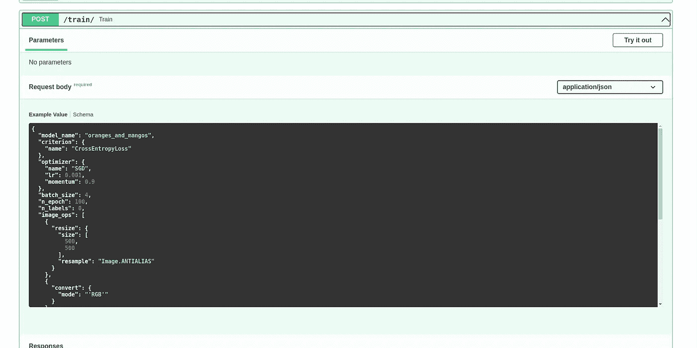
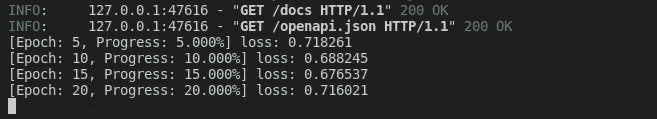
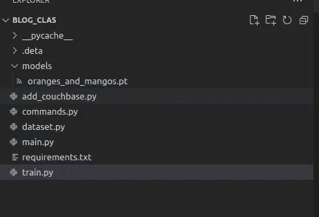

# 使用可定制的字典通过 FastApi、PyTorch 和 SerpApi 自动训练网络

> 原文：<https://blog.devgenius.io/using-a-customizable-dictionary-to-automatically-train-a-network-with-fastapi-pytorch-and-serpapi-ff3c4ed404e9?source=collection_archive---------11----------------------->

这是与人工智能实现相关的系列博文的一部分。如果你对故事的背景或情节感兴趣:

在前几周，我们探索了如何使用 [SerpApi 的 Google Images Scraper API](https://serpapi.com/images-results) 自动创建自己的图像数据集。本周我们将重塑训练命令、数据加载和训练的结构，以使一切都完全高效，并且完全可定制。

# 自动训练的新命令结构

在过去的几周里，我们已经向端点传递了一个命令字典来自动训练模型。我已经提到了我在解释结构时所做的改动。想法是在命令字典上有更多可定制的字段，以便训练和测试你的模型。我们将给予除了模型以外的一切定制控制。

同样在前几周，我们已经介绍了一种从 Couchbase 服务器调用随机图像用于训练目的的方法。这种方法有好有坏的副作用。但是，幸运的是，坏的副作用可以在即将到来的更新中得到控制。

从 Couchbase 服务器随机获取图像的好处是能够在不知道数据集大小、操作速度、有效存储以及将来从存储服务器异步获取的可用性的情况下进行操作。这最后一部分对于减少训练模型的时间可能是至关重要的，这是训练大图像分类器的一个主要问题。我们将会看到在实现通用 cuncurrent 训练的道路上是否会有其他的坎坷。

目前，从 Couchbase 服务器获取图像的一个不好的方面是，我们不会将训练数据库和测试数据库分开。我们将从存储服务器随机获取图像，这也意味着我们可以用两个图像训练网络两次。所有这些副作用只有在使用少量图像时才是至关重要的。考虑到 SerpApi 的 Google Images Scraper API 每次调用可以提供多达 100 张图片，我刚才提到的所有内容都可以忽略不计。也许在将来，我们可以在 Couchbase 服务器中的 image 对象内创建另一个键，以便拥有一个基于您正在训练的模型的控件。

让我们来看看新的指挥结构:

如你所见，`criterion`、`optimizer`的参数现在可以从字典体中传递。除了`name`以外的每个键都将被用作参数。
对于`criterion`在这个上下文中，被调用的对象将是:

对于优化器:

`image_ops`表示`PIL`库的`Image`类的图像操作方法。每个元素本身都是一个要调用的函数:

和

注意，为了传递一个字符串对象，我们将它嵌套在另一个撇号中。

`transform`和`target_transform`将创建一个带有`torch.nn.transforms`的数组，在对图像进行变换后进行合成。`True`表示没有参数的操作。在我们的案例中:

对于包含字典的变量，字典中的项目将作为参数调用:

# 使用自定义数据集和自定义数据加载器从存储服务器获取随机图像

这里我必须介绍一种从数据库而不是本地存储中读取图像的方法，并将它们作为张量返回。

另外，另一个挑战是抛弃`torch.utils.data.DataLoader`并引入一种像类一样将图像返回为张量的方法。原因很简单。`DataLoader`使用迭代，而我们需要多次随机调用对象`batch_size`，并像以前一样返回它们。

以下是重构后的导入版本:

让我们启动数据集对象:

请注意，我们现在没有要通过的操作类型(培训、测试)。相反，我们传递一个数据库对象。另外，所有元素的初始化现在都改变了，以适应新的命令结构。

`create_transforms`函数负责`transforms`中的递归对象创建。然后，我们将每个创建添加到一个数组中，并在 main 函数中组合它们。

代替迭代函数(`__get_item__`)，我们现在引用另一个函数:

虽然这是真的，但把它放进去可能看起来很残忍。但是考虑到我们在数据库中有图像，我们随机调用一个新图像不会有任何问题。我在 Couchbase 存储中遇到了一些小问题。我没有进一步调查。它可以在未来被塑造得更好。

但是现在，我们从我们在命令字典中提供的`label_names`中调用一个随机的`label`。然后我们对这个标签做一个一次性的预测。最后，我们从数据库中调用图像。部分是可以接受的，这是我在前几周的博文中犯的另一个懒惰的编程错误。但不是最重要的。我们取图像的`base64`，解码成`bytes`，存入`BytesIO`对象，然后用`Image`读取。

在函数的下一部分，我们根据命令字典中的条目对图像进行操作:

接下来是我们在初始化数据集时定义的 torch 的转换:

最后，我们返回图像和标签。

对于 dataloader，我们传递命令字典、数据集对象和 Couchbase 数据库适配器:

为了迭代训练，我们现在求助于一个更长的方法:

我们创建一个图像和标签列表。然后转换成`numpy.ndarray`，再转换回 float64 pytorch 张量。最后，我们在每个时期返回它们。

# 培训过程

我改变了我们训练模型的方式，从遍历数据集改为只遍历随机获取图像的时期。另外，如果支持的话，我增加了对使用 gpu 训练的支持。以下是更新的导入:

我没有改变模型中的任何东西，虽然，我没有时间解释我在那里做的手动计算变成一个自动的有解释的计算。那将是接下来的几周:

让我们根据命令字典中的信息初始化我们的训练类:

如您所见，`optimizer`和`criterion`是从我们提供的变量中创建的。此外，我们需要增加`n_epochs`，这是我们迭代来训练模型的时期数，因为我们现在没有遍历完整的训练数据集。因此，最后，如果我们提供的历元是`100`，它将在每个历元从存储器中获取 100 个随机图像，并在其上进行训练。

以下是主要的训练过程:

正如你所看到的，我们在每个时期获取一个随机图像，并使用 cpu 或 gpu 对其进行训练。然后，我们报告流程，最后，使用指定的模型名称保存它:

# 显示优点的东西

如果我们运行服务器，并前往`localhost:8000/docs`，用默认命令尝试新的`/train`端点:

我们一执行，就可以在终端中观察训练过程:

训练结束后，模型将以指定的名称保存:

# 结论

我感谢 SerpApi 的[聪明人让这篇博文成为可能，我也感谢读者的关注。我们还没有讨论我在前几周提到的一些要点。然而，我们已经为一些关键部分扫清了道路。在接下来的几周，我们将讨论如何使模型可定制，可从文件名调用，并发调用](https://serpapi.com/team) [SerpApi 的 Google Images Scraper API](https://serpapi.com/images-results) ，并创建不同模型之间的对比测试结构。

*原载于 2022 年 6 月 29 日*[*【https://serpapi.com】*](https://serpapi.com/blog/automatic-training-customizable-dictionary-fastapi-pytorch-serpapi/)*。*