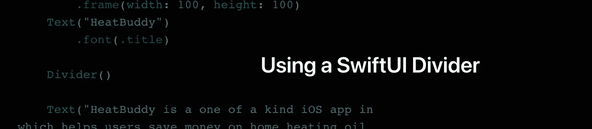
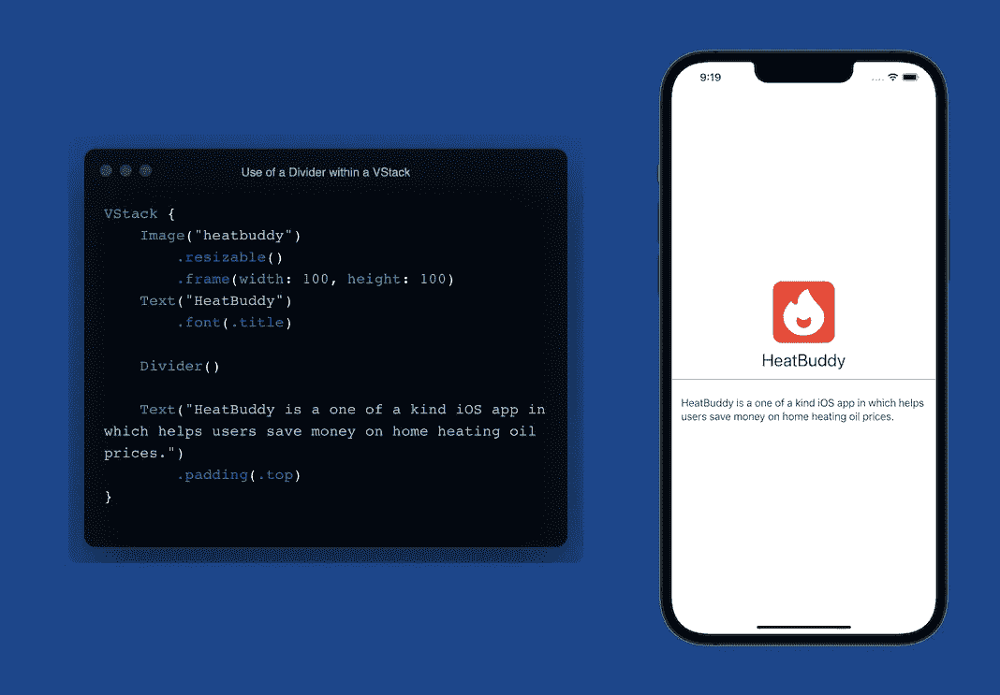
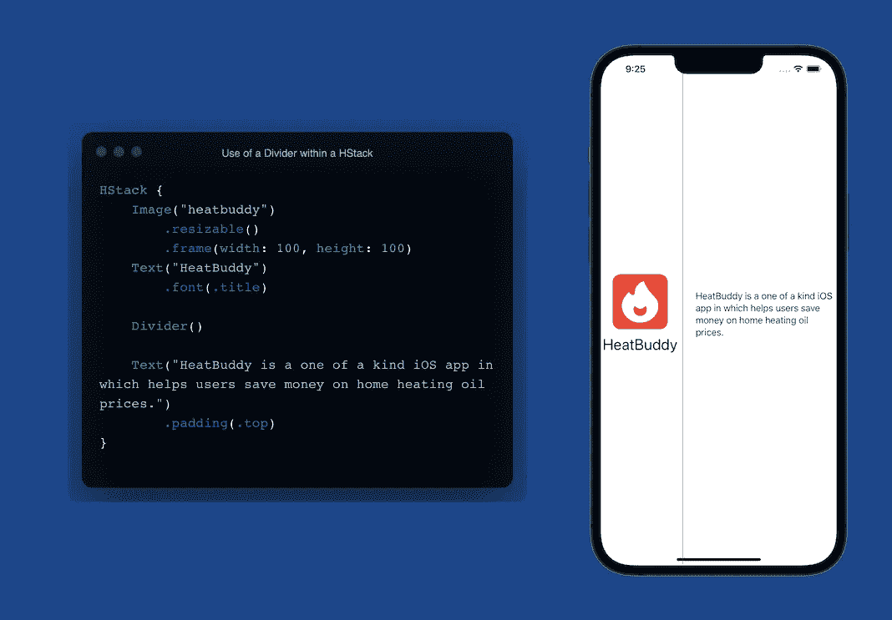
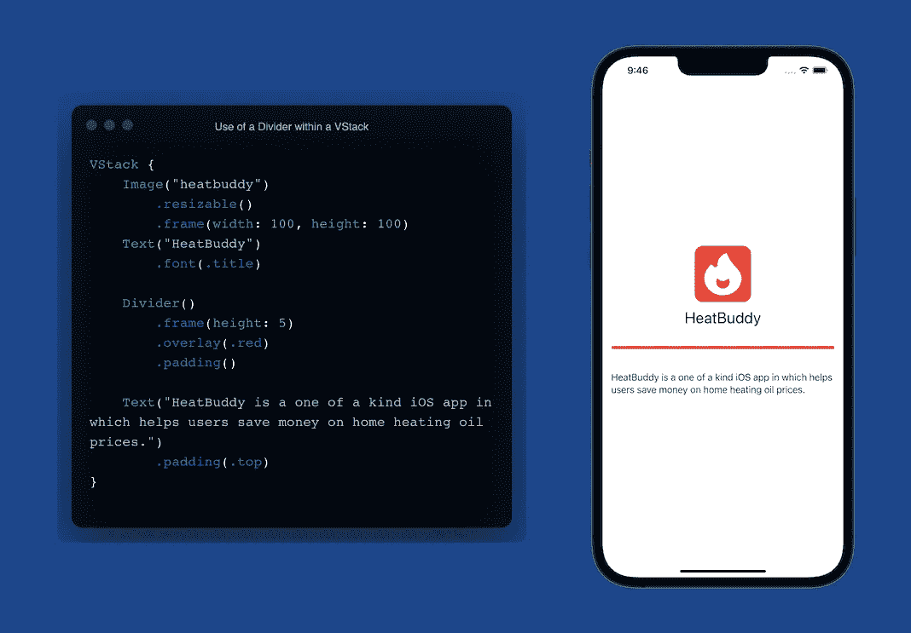

# 在 SwiftUI 中使用分隔线

> 原文：<https://blog.devgenius.io/using-a-divider-in-swiftui-b7405fbd9f35?source=collection_archive---------8----------------------->

SwiftUI 中的分隔线是一种简单而简洁的方式，有助于在视图中分隔内容。在这篇简短的文章中，我将向您展示它有多简单，以及一些用例。



## 什么是分割线？

分隔线帮助我们清晰简单地分割内容。它是一条简单的灰色细线，可以水平或垂直显示。不幸的是，除法器的使用非常有限，但是定制仍然是可能的。



## 在 VStack 和 HStack 中使用分频器有什么区别？

如上所示，在 VStack 中使用分隔线会产生一条横跨整个轴的水平线。在 HStack 中使用分隔线时，会产生一条横跨整个轴的垂直线，如下所示。两者都有自己的使用案例，但是仍然可以根据您的设计需求进行定制。



## 分频器的定制

虽然分隔器简单易用，但它们也有其局限性和怪癖。假设您想要增加隔板的厚度。我们必须根据栈的类型使用合适的`.frame()`修饰符。如果我们在 VStack 中，那么我们必须使用`.frame(height: 5)`,而如果我们在 HStack 中，我们将使用`.frame(width: 5)`修饰符。

初次使用时，您会注意到分隔线会从一边到另一边横跨整个轴。我们可以简单地添加`.padding()`将它从边缘带进来一点，而不是硬编码某种宽度。

想加点颜色吗？为此，我们需要使用`.overlay` 修改器，并传入我们的颜色，比如`.overlay(.red)`，它会将颜色改为红色。要查看所有这三个修改的效果，请看下图！



总之，您可以看到，尽管我们如何定制它存在一些限制。分隔线为我们提供了一个很好的简单的方法来分隔内容，而不必使用路径或制作一个非常薄的矩形，老实说，我早就这样做了！

```
**Let's Connect!**If you have any questions, or want to chat - reach out to me on Twitter [@halluxdev](https://twitter.com/halluxdev)!
```