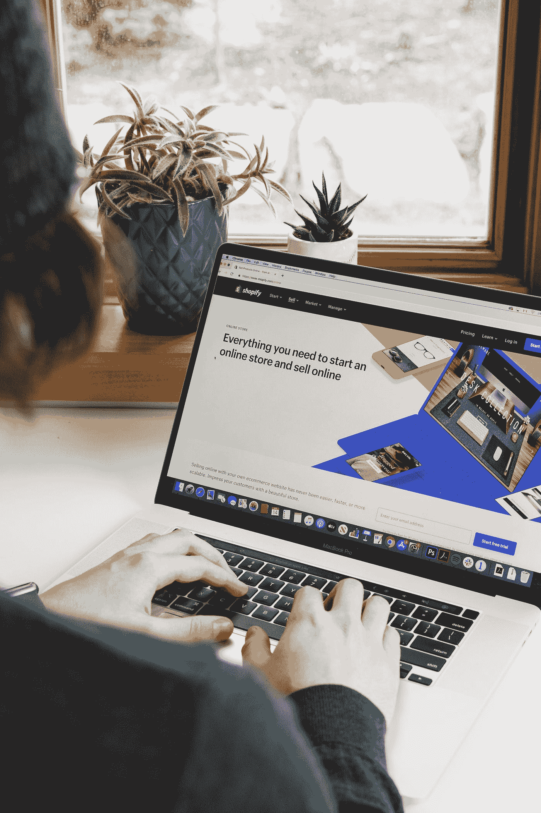
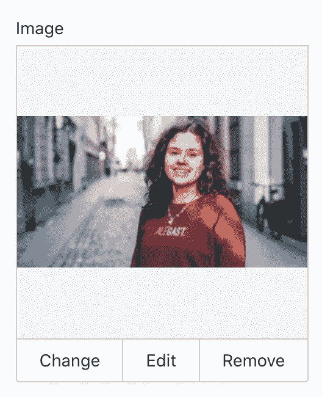
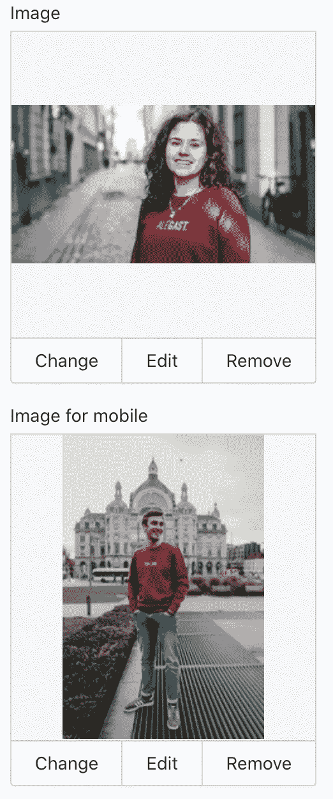

# 在 Shopify 上使用移动标题图像

> 原文：<https://blog.devgenius.io/using-a-mobile-header-image-on-shopify-be7e4cae60f9?source=collection_archive---------8----------------------->



罗伯特·科尔特斯在 [Unsplash](https://unsplash.com?utm_source=medium&utm_medium=referral) 上拍摄的照片

在过去的 3 年里，我一直在 Shopify 上经营一家网店。鉴于我的开发(PHP)背景，我自己管理它，我们努力在任何可能的地方做得更好。

在我们的主页上(【https://www.kleirantwerp.be/】，这是一个荷兰网站)，我们有一个巨大的标题图像来吸引用户的注意。然而，这张巨大的图片也用于移动用户，并相应地进行了缩放。

我想为手机使用不同的标题图像，这样加载时间会减少**和**的比例可以是纵向。有道理，对吧？

唯一阻止我这么做的是，我们没有从界面上轻松上传的选项。经过几个月的拖延，我决定放手一搏，改变源代码中的图像。我想，总比没有好。

通过更改媒体查询，我能够在手机上添加自定义图像。通过添加后一个媒体查询，我在手机上使用了另一张图片。耶。任务完成。

```
@media screen and (max-width: 1024px) and (max-height: 768px)  {
  .hero__image--{{ block.id }} {
    background-image: url('{{ block.settings.image | img_url: '1024x1024' | format: 'jpg' }}');
  }
}
@media screen and (max-width: 768px) {
  .hero__image--{{ block.id }} {
    background-image: url('{{ 'mobile-header-image.jpg' | asset_img_url}}');
  }
}
```

但是等等，还有更多。这就是好东西出现的地方。

在编辑我的 liquid 文件时，我注意到文件底部的 **schema** 标签(在我的例子中是 slideshow.liquid)。

```

```

经过一些调查后，我意识到我可以添加我自己的设置来管理移动标题图像。通过这样做，我能够保持它的虚拟证明，允许其他团队成员也可以轻松地上传一个新的移动标题图像。

下面的块(除了其他设置之外)表示我的 Shopify 设置中的图像拾取器。

```
"settings": [
  {
    "type": "image_picker",
    "id": "image",
    "label": "Image"
  },
```

上面的方块是下面图像拾取器的示意图



通过简单地复制该块并重命名唯一的 id，我能够添加一个图像拾取器以供移动使用。

```
"settings": [
  {
    "type": "image_picker",
    "id": "image",
    "label": "Image"
  },
  {
    "type": "image_picker",
    "id": "image_mobile",
    "label": "Image for mobile"
  },
```

这会产生以下字段:



唯一剩下的事情是更改媒体查询以使用上传的图像。注意 if 中的 image_mobile id。

```

  <style>
    @media screen and (max-width: 768px) {
      .hero__image--{{ block.id }} {
        background-image: url('{{ block.settings.image_mobile | img_url: '768x1152' | format: 'jpg' }}');
      }
    }
  </style>

```

就是这样。就这么简单。购物规则。感谢您的阅读，并留下您的评论。