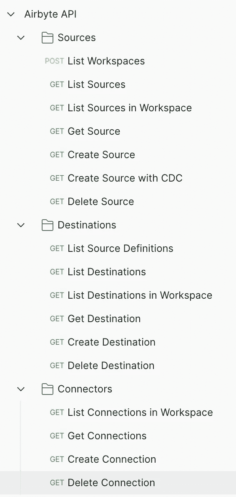

# 通过 Rest API 使用 Airbyte

> 原文：<https://blog.devgenius.io/using-airbyte-with-rest-api-2e65c180ee80?source=collection_archive---------6----------------------->

仅供参考。而不是构建一个 Rest API 自定义连接器！！！

如果你在这里，你一定已经知道如何在你的本地或 AWS 或 Azure 上设置 Airbyte。

我想谈谈通过 Rest API 启动 Airbyte。如果有 UI，为什么我需要使用 REST？出于某种原因，我们不必通过 UI 暴露密码来启动 UI 上的源或目的地连接。

因此，我在 Airbyte 页面上使用了一些有良好文档记录的 REST API，尝试创建源、目的地和连接器。

好戏开始了。假设您的 Airbyte 安装在本地主机上，端口为 7000

工作空间:-一旦你设置了 Airbyte，它就有了一个工作空间 ID。找出你的工作空间，这里就是终点。当然，您知道如何获得工作区 ID，它已经在 Airbyte webapp URL 上定义了。

```
http://localhost:7000/api/v1/workspaces/list
```

列出 Airbyte 中所有可用的资源:

```
http://localhost:7000/api/v1/source_definitions/list
```

假设您已经在 UI 上尝试了一些源代码，现在，让我们通过 Rest API 在您的工作空间中获取这些源代码。

```
http://localhost:7000/api/v1/sources/list
```

```
{
  "workspace_id": "The output from the first endpoint(/api/v1/workspaces/list)"
}
```

输出如下所示。

```
{
    "sourceDefinitionId": "hfdd-dffd-sdsds",
    "sourceId": "fdfds-fdfd",
    "workspaceId": "esdffdfdg-ffff",
}
```

通过 Rest API 创建源代码:-从上面的示例输出中，我尝试创建一个与下面的端点和主体的 MSSQL server 连接。

```
http://localhost:7000/api/v1/sources/create

{
    "sourceDefinitionId": "MSSQL Source Definition ID (This you can get from the list of sources)",
    "workspaceId": "Your Workspace Id",
"connectionConfiguration": {
        "host": "MSSQL Host",
        "port": 1111,
        "schemas": [
            "dbo"
        ],
       "database": "databaseName",
        "password": "Password. (When building a wrapper for this, try to read the secret from AWS Secret Manager or Azure Vault))",
        "username": "admin",
        "ssl_method": {
            "ssl_method": "encrypted_trust_server_certificate"
        },
        "tunnel_method": {
            "tunnel_method": "NO_TUNNEL"
        },
        "jdbc_url_params": "integratedSecurity=false&encrypt=true",
        "replication_method": {
            "method": "STANDARD"
        }
    },
    "name": "MSSQL Rest API"
}
```

如果要在源上启用 CDC，请将复制方法更改为如下所示。上面的复制方法是“标准的”。仅供参考。

```
"replication_method": {
            "method": "CDC",
            "data_to_sync": "Existing and New",
            "snapshot_isolation": "Snapshot"
        }
```

如果你不喜欢你的来源，用下面的端点删除它。

```
http://localhost:7000/api/v1/sources/delete

{
    "sourceId": "The source id is the output from the above create endpoint."
}
```

现在，我们已经完成了对源的研究，让我们深入研究目的地。

列出 Airbyte 中所有可用的定义:

```
http://localhost:7000/api/v1/destination_definitions/list_latestList the destinations in your workspace
```

列出工作区中的所有定义

```
http://localhost:7000/api/v1/destinations/list

{
    "workspaceId": "Your workspace ID"
}
```

通过定义 ID 获取目的地:

```
http://localhost:7000/api/v1/destinations/get

{
    "destinationId": "A destination ID from your current destinations in workspace"
}
```

创建一个 S3 目的地。我已经创建了一个 ARM 角色，它允许部署 airbyte 的 EC2 实例能够为 S3 存储桶做出贡献，否则，您知道如何处理其余的细节。至少，我不必在这里为此提供密码。乌夫！

```
http://localhost:7000/api/v1/destinations/create

{
    "destinationDefinitionId": "S3 Definition ID from List Destinations",
    "workspaceId": "Your workspace ID",
    "connectionConfiguration": {
        "format": {
            "format_type": "Parquet",
            "page_size_kb": 1024,
            "block_size_mb": 128,
            "compression_codec": "SNAPPY",
            "dictionary_encoding": true,
            "max_padding_size_mb": 8,
            "dictionary_page_size_kb": 1024
        },
        "s3_endpoint": "",
        "s3_bucket_name": "Your Bucket Name",
        "s3_bucket_path": "Your Bucket Path",
        "s3_bucket_region": "Your Bucket Region"
    },
    "name": "S3 Rest API"
}
```

不喜欢你创建目的地后看到的东西。删了它！！！！

```
http://localhost:7000/api//v1/destination_definitions/delete

{
    "destinationId": "The destination Id from the prev endpoint."
}
```

现在，您创建了源和目的地，现在，让我们开始创建一个连接器。我们很接近了！！！

列出工作区中的连接器

```
http://localhost:7000/api/v1/connections/list

{
    "workspaceId": "Your Workspace Id"
}
```

通过 Rest API 获取连接细节，如果您已经在 UI 中尝试过的话。

```
http://localhost:7000/api/v1/connections/get

{
    "connectionId": "35f7ccf6-8780-4ee3-85aa-9fa01cac118f"
}
```

现在，让我们创建一个新的连接，源为 MSSQL，目的地为 S3。是的。我们差不多完成了。

```
http://localhost:7000/api/v1/connections/create

{
    "name": "MSSQL Rest API <> S3 Rest API",
    "namespaceDefinition": "source",
    "namespaceFormat": "${SOURCE_NAMESPACE}",
    "prefix": "",
    "sourceId": "Source ID which you got after creating the source",
    "destinationId": "Destination ID which you got after creating it.",
    "operationIds": [],
    "syncCatalog": {
        "streams": [
            {
                "stream": {
                    "name": "The table from your source system if you want it via REST",
                    "jsonSchema": {
                        "type": "object",
                        "properties": {
                            "column1": {
                                "type": "number",
                                "airbyte_type": "integer"
                            },
                            "column2": {
                                "type": "string"
                            },
                            "column3": {
                                "type": "string"
                            },
                            "_ab_cdc_lsn": {
                                "type": "string"
                            },
                            "_ab_cdc_deleted_at": {
                                "type": "string"
                            },
                            "_ab_cdc_updated_at": {
                                "type": "string"
                            }
                        }
                    },
                    "supportedSyncModes": [
                        "full_refresh",
                        "incremental"
                    ],
                    "sourceDefinedCursor": true,
                    "defaultCursorField": [],
                    "sourceDefinedPrimaryKey": [
                        [
                            "column1"
                        ]
                    ],
                    "namespace": "dbo"
                },
                "config": {
                    "syncMode": "incremental",
                    "cursorField": [],
                    "destinationSyncMode": "append",
                    "primaryKey": [
                        [
                            "column1"
                        ]
                    ],
                    "aliasName": "tablealias",
                    "selected": true
                }
            }
        ]
    },
    "scheduleType": "manual",
    "status": "active",
    "geography": "auto"
}
```

从上面可以看出，您还可以将您的计划类型更改为不同的选项，一旦设置了连接器，您将看到您的数据流动。

最后。删除连接器:

```
http://localhost:7000/api/v1/connections/delete

{
    "connectionId": "Your connection id from the prev output"
}
```

我已经通过 Postman 测试了所有这些，现在你也可以了。这是我的邮差图书馆。



有一个我没有测试过的更新端点，您可以在那里编辑您的源、目的地和连接。我想现在，你已经明白这背后的要点了。和 Airbyte 玩得开心！！！一个免费的低代码/无代码解决方案，有一些很酷的连接器，源，目的地每天都在建立！

我仍然致力于建立一个自定义连接器，这是，咳咳！还是一个痛(免责声明:只对我。)我想很多人都做过，我还没有完全了解。如果我到了那里，期待另一篇文章。虽然，Airbyte 有一些关于如何做事情的很好的文档，但是，我还是想把它简化并发布出来。


向这个懒散的小家伙寻求帮助！他们真的很及时(有时候，大多数时候。)