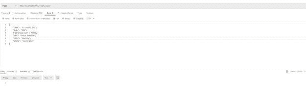
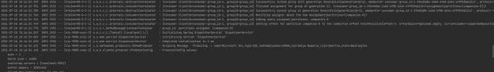

# 用阿帕奇·卡夫卡和 Spring Boot

> 原文：<https://blog.devgenius.io/using-apache-kafka-with-spring-boot-6ea035db42d9?source=collection_archive---------1----------------------->

在这篇文章中，我将展示如何将 Apache Kafka 与 Spring Boot 应用程序集成。我还将展示如何从我们的应用程序中发送和使用消息。

# 什么是阿帕奇卡夫卡？

我之前写过一篇关于卡夫卡的介绍性文章。但如果你还是对卡夫卡一无所知，那么这将是一个很好的总结。

Kafka 是一个流处理平台，目前作为 Apache 的开源软件提供。Kafka 提供了大量数据的低延迟摄取。

然而，Kafka 的一个关键优势是它允许移动大量数据并实时处理。Kafka 考虑了横向扩展，这意味着可以通过在 Kafka 集群中增加更多的经纪人来实现扩展。

# 卡夫卡术语

所以，[卡夫卡](https://kafka.apache.org/)有自己的术语。但是，这也很容易理解，如果你正在开始。

1.  **Producer**—Producer 是一个客户端，它生成一条消息，并将其发送到指定主题的 Kafka 服务器。
2.  **消费者** —消费者是消费来自 Kafka topic 的消息的客户端。
3.  **集群** — Kafka 是一个经纪人的分布式系统。多个代理构成一个集群。
4.  **Broker** — Kafka broker 可以通过 zookeeper 直接或间接在彼此之间共享信息来创建 Kafka 集群。因此，代理从生产者处接收消息，而消费者通过主题、分区和偏移量从代理处获取该消息。
5.  **主题** —主题是类别名称，生产者向其发送消息，消费者从其消费消息。
6.  **分区** —一个主题的消息在 kafka 集群中传播到几个分区中。
7.  **Offset** — Offset 是一个指针，指向卡夫卡发送给消费者的最后一条消息。

# 设置 Spring Boot 应用程序

作为这篇文章的一部分，我将展示如何在 Spring Boot 应用程序中使用 Apache Kafka。

我们将在机器上运行 Kafka 服务器，我们的应用程序将通过生产者向主题发送消息。应用程序的一部分将通过消费者使用该消息。

首先，我们的项目中需要一个 Kafka 依赖项。

```
implementation 'org.springframework.kafka:spring-kafka:2.5.2'
```

我们将有一个 REST 控制器，它将基本上接受一个 JSON 消息，并使用 Kafka Producer 将其发送到 Kafka topic。

```
package com.betterjavacode.kafkademo.resource;

import com.betterjavacode.kafkademo.model.Company;
import com.betterjavacode.kafkademo.producers.KafkaProducer;
import org.springframework.beans.factory.annotation.Autowired;
import org.springframework.web.bind.annotation.*;

@RestController
@RequestMapping(value = "/v1/kafka")
public class KafkaRestController
{
    private final KafkaProducer kafkaProducer;

    @Autowired
    public KafkaRestController(KafkaProducer kafkaProducer)
    {
        this.kafkaProducer = kafkaProducer;
    }

    @PostMapping(value = "/send", consumes={"application/json"}, produces = {"application/json"})
    public void sendMessageToKafkaTopic(@RequestBody Company company)
    {
        this.kafkaProducer.sendMessage(company);
    }
}
```

这个`KafkaProducer`使用 KafkaTemplate 将消息发送到一个主题。KafkaProducer 是我们为此应用程序创建的服务。

```
@Service
public class KafkaProducer
{
    private static final Logger logger = LoggerFactory.getLogger(KafkaProducer.class);
    private static final String topic = "companies";

    @Autowired
    private KafkaTemplate<String, Company> kafkaTemplate;

    public void sendMessage(Company company)
    {
        logger.info(String.format("Outgoing Message - Producing -> %s", company));
        this.kafkaTemplate.send(topic, company);
    }
}
```

同样，我们将有我们的消费者。

```
@Service
public class KafkaConsumer
{
    private final Logger logger = LoggerFactory.getLogger(KafkaConsumer.class);

    @KafkaListener(topics = "companies", groupId = "group_id")
    public void consume(String company)
    {
        logger.info(String.format("Incoming Message - Consuming -> %s", company));
    }
}
```

我们的消费者正在使用`KafkaListener`，它允许我们听一个话题。当一条消息到达这个主题时，监听器会提醒消费者，消费者会收到这条消息。

# 卡夫卡式结构

在展示我们将如何发送和消费这些消息之前，我们仍然需要在我们的应用程序中配置 kafka 集群。我们的生产者和消费者还需要一些其他的属性。

基本上，有两种方法可以配置这些属性。以编程方式或通过 YML 配置。对于我们的应用程序，我已经通过 YML 配置文件进行了配置。

```
server:
  port: 9000
spring:
  kafka:
    consumer:
      bootstrap-servers: localhost:9092
      group-id: group_id
      auto-offset-reset: earliest
      key-deserializer: org.apache.kafka.common.serialization.StringDeserializer
      value-deserializer: org.apache.kafka.common.serialization.StringDeserializer
      properties:
        spring.json.trusted.packages: "com.betterjavacode.kafkademo.model"
    producer:
      bootstrap-servers: localhost:9092
      key-serializer: org.apache.kafka.common.serialization.StringSerializer
      value-serializer: org.springframework.kafka.support.serializer.JsonSerializer
```

**bootstrap-servers** —运行 Kafka 服务器的主机和端口
**key-deserializer**—用于反序列化消费者使用的消息的密钥的类
**value-deserializer**—用于反序列化消费者使用的消息的值的类
**key-serializer** —序列化生产者产生的消息的密钥的序列化器类
**value-Serializer**—序列化器类

**自动偏移重置**—Kafka 主题分区中的每条消息都有一个唯一的标识符，即`offset`。此设置会自动将偏移重置为最早的值。

在我们发送消息之前，我们的主题必须存在。我将手动创建这个主题，并在下一节中展示。在 Spring Boot 应用程序中，我们可以创建一个`KafkaAdmin` bean，并使用它来创建主题。

# 运行 Kafka 服务器

作为演示的一部分，我还将展示如何启动我们的第一个 Kafka 服务器实例。从[这里](https://kafka.apache.org/downloads.html)下载卡夫卡。

一旦你下载并解压到一个目录中，我们将不得不编辑`zookeeper.properties`和`server.properties`中的两个属性。

用数据目录(dataDir)更新`zookeeper.properties`,您希望 zookeeper 在其中存储数据。

启动动物园管理员— `zookeeper-server-start.bat ../../config/zookeeper.properties`

用日志目录更新`server.properties`。

启动服务器— `kafka-server-start.bat ../../config/server.properties`

现在要创建一个主题，我们可以运行另一个命令提示符，并从安装 kafka 的目录中使用这个命令
`kafka-topics.bat -create -topic companies-bootstrap-server localhost:9092`。

# 发送和使用消息

到目前为止，我们已经用 Kafka 创建了一个 Spring Boot 应用程序。我们已经配置了我们的 Kafka 服务器。现在是向卡夫卡主题发送和消费信息的时候了。

我们有一个 REST API 来发送关于一家公司的消息。然后卡夫卡制作人将这个消息发送给卡夫卡主题`companies`。一个 Kafka 的消费者将会从这个主题中读出这个信息，因为它将会听到它。



一旦这个消息被发送，我们可以查看我们的应用服务器日志，因为它将显示通过 Kafka Producer 生成这个消息。



同时，我们的消费者也在倾听。因此，它将获取此消息进行消费。


# 结论

到目前为止，我们已经展示了如何在 Spring Boot 应用程序中使用 Apache Kafka。随着应用程序中的数据不断增加，以低延迟传输变得越来越重要。这个演示应用程序的代码库是这里的。

如果你想让我介绍卡夫卡的其他内容，请随意评论这篇文章，我会在接下来的文章中介绍更多关于卡夫卡的细节。

*原载于 2021 年 7 月 18 日 https://betterjavacode.com**的* [*。*](https://betterjavacode.com/kafka/using-apache-kafka-with-spring-boot)