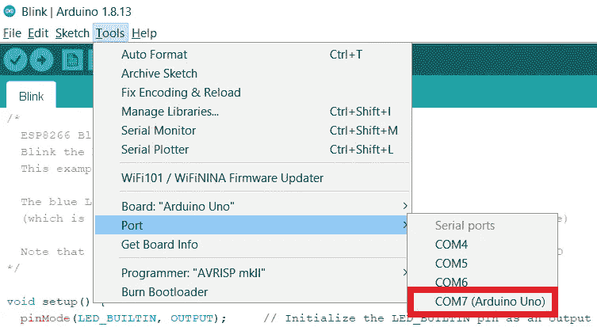
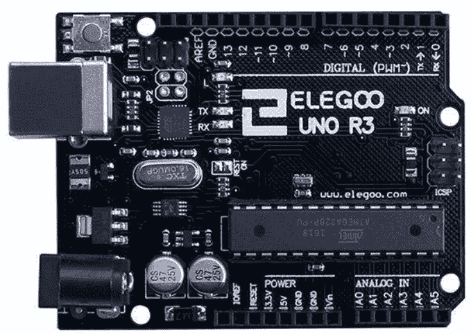

# 使用带有 CH340 芯片的非官方 Arduino 克隆的 Arduino IDE

> 原文：<https://blog.devgenius.io/using-arduino-ide-with-unofficial-arduino-clones-bearing-ch340-chip-752d1b90810d?source=collection_archive---------0----------------------->

或者进入不可预知的非官方 Arduino 克隆世界

照片由 [Lucas Santos](https://unsplash.com/@_staticvoid?utm_source=medium&utm_medium=referral) 在 [Unsplash](https://unsplash.com?utm_source=medium&utm_medium=referral) 上拍摄

Arduino 是许多 DIY 项目非常受欢迎的平台，由于它的开放设计，我们有许多非官方的克隆。他们中的一些人完全复制了 Arduino 的原始设计，而另一些人则试图让它更便宜。

这就是你在宣传一些非官方的 Arduino 克隆产品时得到的东西

如果你买了非官方的 Arduino Uno R3 克隆，把它插在你的 Windows 机器上，得到**“USB 设备未被识别”**错误，那么**这篇文章是给你的。**下面我们会看到一个官方的和一些非官方的 Arduino 板卡有什么区别，以及一些非官方的板卡需要安装什么才能被 Windows 识别。

## USB 适配器

先来看看下面的**原** Arduino UNO R3:

原装 Arduino Uno R3，采用 ATmega16U2 作为 USB 转串行转换器

这张照片中的 1 号芯片是 Arduino 的大脑:这是通过 Arduino IDE 编程的 **ATmega328P** 。这是电路板的核心，这个芯片运行你所有的草图——它包含 CPU、内存和控制所有的 Arduino 引脚。

但是如果你仔细看，你会发现在这块板上实际上还有另一个芯片，标有数字 2。这是 ATmega16U2 ,在这块板上，它有一个也是唯一的作用——充当 USB 转串行转换器。换句话说，它为该主板提供 USB 连接，并充当计算机 USB 端口和 Arduino 串行端口之间的桥梁。

> 有趣的事实:ATmega16U2 也是比较强大的芯片，相比 ATmega328P。是的，16U2 内存更少，时钟速度稍慢，但它仍然可以完成很多任务。因此，它有可能被用作一些项目的主芯片，但它的能力在这里显然被浪费了，它只是被用作 USB 转串行转换器。

所以，基本上，当你将 USB 插入原始 Arduino 板时会发生什么——你实际上是将它插入 ATmega16U2，它与你的计算机通信，操作系统识别它并从安装的驱动程序列表中加载相应的驱动程序。然后，驱动程序在系统中注册新的 COM 端口，这是您在 Arduino IDE 中编程 Arduino 时选择的。请注意，在下面的截图上，正确的端口将被相应地命名——不确定这是由 ATmega16U2 芯片上的驱动程序还是固件完成的，如果你知道，请在评论中告诉我。

官方 Arduino UNO R3 的 COM 端口也相应命名

但是上面描述的一切对官方 Arduino Uno R3 主板来说都是正确的，对一些非官方主板来说并不总是正确的。然而，一些非官方的主板完全是 Arduino 的克隆版，只是在颜色和标识上有所不同。

Elegoo UNO R3 是原始 Arduino Uno R3 的精确克隆之一，也有 ATmega16U2 作为 USB 到串行适配器

看看这个 Elegoo UNO R3 板:你可以很容易地找到相同的芯片，因为在原来的 Arduino 板上，它们在相同的点上:板上最大的芯片是 ATmega328P，左边靠近 TX 和 RX LEDs 的小芯片是 ATmega16U2。因此，对于 Windows 驱动程序，该板看起来与原始板完全相同，因为驱动程序与同一个 ATmega16U2 芯片通信，所以它将被识别，并将与 Arduino IDE 一起正常工作。

## 带有 CH340G 芯片的非官方主板

然而，有一些非官方的板，不会被 Windows 如此简单地识别，因此设备将关闭，没有 COM 端口将被暴露，因此，您不能在 Arduino IDE 中使用这些板，因为如果没有 COM 端口，就没有通信方式，也不可能上传草图。

另一个非官方的 Arduino 克隆，ATmega328P 是在不同的情况下，有 CH340G 而不是 ATmega16U2

让我们看看这块板。你从第一眼就能看出不同——那个巨大的 ATmega328P 去哪了？！别担心，就在这里——在这张照片上标有 1 号。是的，它明显更小，但它是相同的芯片，只是包装在不同的外壳中。因此，即使它在视觉上明显不同，它的内部仍然是同一个 ATmega328P，所以你所有的草图都将完全一样。

真正的差别是标有数字二的芯片中的 T1。记住，我们在官方 Arduino 上的这个地方有 ATmega16U2，但在这个板上我们有 **CH340G** 。

CH340 是一系列专用芯片，旨在完成一项任务，即 USB 转串行转换器。由于高度专业化，它比官方电路板上使用的功能强大、用途广泛的 ATmega16U2 更简单，因此也更便宜。然而，请记住，ATmega16U2 的所有这些潜在能力和可能性都浪费在了官方电路板上，所以即使你已经有了这个芯片，它的潜力也没有得到利用。因此，从 Arduino 板的整体性能和功能的角度来看，你基本上不会看到任何差异，无论使用什么芯片作为 USB 到串行适配器。

> 我自己没有测试过，但我在网上看过一些文章，声称带有 CH340 板载的 Arduinos 比带有 ATmega16U2 的主板耗电更少。这很有可能，因为 CH340 是一个简单的单任务芯片，而 ATmega16U2 是一个复杂的微控制器。当然，如果你只是在玩 Arduino IDE 或通过电源插座运行你的项目，这不会有任何影响，但如果你有一些东西是通过小电池运行的，那么这可能是一个尝试 CH340G 主板的理由——也许它会为你赢得几天或运行时间。

## CH340 驱动程序

但 CH340 有一个问题:Windows 缺乏内置的驱动程序。严格来说，这不是 CH340 的问题，而是 Windows 的问题，但对于我们这些最终用户来说都是一样的——当我们将这些板插入 USB 时，Windows 只会抱怨“无法识别 USB 设备”,并且不会为板创建 COM 端口。

解决方案很简单—只需安装正确的驱动程序！

*   **第一步:**找到司机。只要谷歌一下“Arduino CH340 驱动”，就会得到很多链接。[这里的](https://sparks.gogo.co.nz/ch340.html)是我首先在谷歌上看到的，但也可以随意使用任何其他链接，因为这个驱动程序在很多地方都有。
*   **第二步:**将文件解压到一个临时位置，运行安装程序。
*   **步骤 3:** 插入 Arduino 板，在设备管理器中检查新的 COM 端口。下图中的是 COM3，但它可能使用了您计算机上的另一个端口号。

CH340 驱动程序在这里使用 COM3，但它可以使用您计算机上的另一个端口号

*   **步骤 4:** 在 Arduino IDE 中选择正确的端口。请注意，这一次它将不会被标记为“Arduino Uno”，它将只是一个端口号:

在 Arduino IDE 中选择正确的 COM 端口。请注意，端口旁边没有提示，因为它是用于 ATmega16U2 的板

## 结束了

CH340 不仅用于 Arduino 克隆，还用于许多其他主板。所以，如果你刚刚开始进入微控制器编程的奇异世界，你迟早会需要这个驱动程序。

好奇，试试别的 Arduino 克隆(这么便宜！)并且玩得开心！

## 资源

*   **CH340 驱动**可以在这里获得:[https://sparks.gogo.co.nz/ch340.html](https://sparks.gogo.co.nz/ch340.html)但这只是众多位置中的一个，所以你可以随便谷歌一下！