# 时间序列 ARIMA 算法预测标准普尔 500 指数近 500 只股票

> 原文：<https://blog.devgenius.io/using-arima-algorithm-to-forecast-almost-500-stocks-from-s-p-500-index-443679e6f41e?source=collection_archive---------5----------------------->

## 一种使用 Pycaret lib、beta 方差和 yahoo finance 生成指标以构成未来股票投资组合的方法。

我想预测和验证哪些股票的未来可能价值比其他股票风险小；基于此；我能识别一些经济理论和统计指标；在这篇文章中，我将分享一些片段，这些片段可以提供**见解**来玩股票预测，更准确地说是一个叫做 [uto 回归综合移动平均线](https://www.investopedia.com/terms/a/autoregressive-integrated-moving-average-arima.asp) (ARIMA)的时间序列模型。

**在发现澳洲之前，旧世界的人们相信所有的天鹅都是白色的，这是一个不容置疑的信念，因为它似乎完全被经验证据所证实。**、** [**纳西姆·尼古拉斯·塔勒布**](https://www.nytimes.com/2007/04/22/books/chapters/0422-1st-tale.html)**

**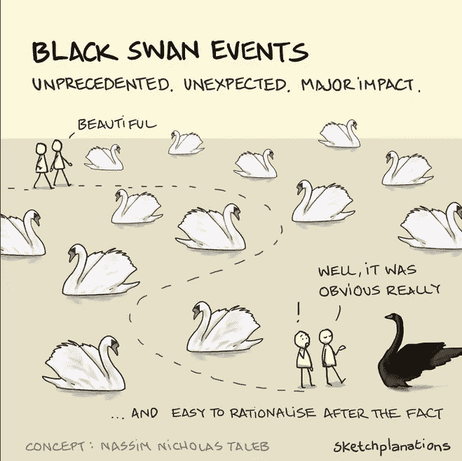**

**字体:[https://sketchplanations.com/black-swan](https://sketchplanations.com/black-swan)**

**首先，我意识到股票有黑天鹅，像 covid，乌克兰战争，Elon Musk，以及其他可以扰乱常态的情况，并以某种方式改变股票的方差行为。基于此，我开始四处寻找一些股票的风险管理系统，我发现了一个有趣的方法，叫做 [CAPM](http://capital%20asset%20pricing%20model%20-%20wikipedia/) [—资本资产定价模型。](http://capital%20asset%20pricing%20model%20-%20wikipedia/)**

**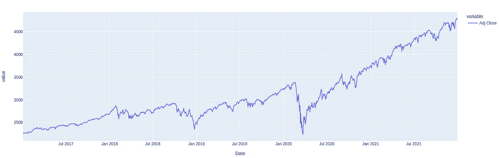**

**标准普尔 500 指数——我们可以想象，在 2020 年中期，乔维德·疫情打破常规。**

**CAPM 模型提供了一种叫做贝塔方差的理论。此功能可用于计算股票的系统风险，例如，通过比较股票和其他指数(如 S&P500 指标)之间的方差。这一指标可以显示为一个因素，可用于根据某些指数选择不太不稳定的股票；更多细节，你可以查看这篇文章。**

# **不再多言，让我们深入数据！！**

**为了组织，我把这篇文章分成 6 个步骤来组织:取样、探索、修改、建模、总结。**

**所有这些步骤和代码都可以通过这个 [git repo](https://github.com/gabrielhribeiro/PortifolioSP500) 获得。**

****样品****

**首先，我们需要收集标准普尔 500 指数的股票。通过简单的网络搜集，我们将从维基百科页面收集 SP500 股票代码值。**

```
#Identify after how much time they started at the SP500 after their foundation
#Show how sectors are at the SP500
#show quantity based on security
#show GICS Sub-Industry
#function to take stocks and values
import pandas as pd

def returnstocks():
    table=pd.read_html('https://en.wikipedia.org/wiki/List_of_S%26P_500_companies')
    stocksdf = table[0]
    stocksdf.to_csv('S&P500-Info.csv')
    stocksdf.to_csv("S&P500-Symbols.csv", columns=['Symbol'])
    stocksdf['Symbol'] = stocksdf['Symbol'].replace('.B','', regex=True)
    return stocksdf

def eachstock():
  myList = ['^GSPC']
  for stick in returnstocks()['Symbol'].unique(): 
    myList.insert(0, stick)
  return myList
```

```
tickers = ['^GSPC','ZTS','ZION','H','RA','YUM'..]
```

**函数 eachstock()将返回一个由 SP500 初始化的股票列表。**

****探索****

**在一些探索性分析中，我们可以确定 SP500 使用的主要部门，这些部门可以用来分散股票投资组合，因为分散风险越小，琐碎但重要的是避免特定部门的黑天鹅。**

**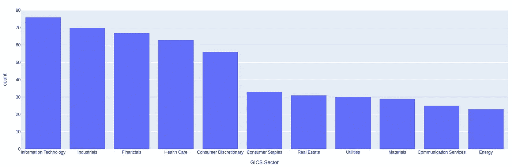**

**SP500 地区**

**对于这一步，我们使用来自[维基百科](https://en.wikipedia.org/wiki/List_of_S%26P_500_companies)的组件，并且我们将引入一个新的代理[雅虎金融](https://pypi.org/project/yfinance/)。雅虎财经有来自 https://finance.yahoo.com 的热门数据，我们可以利用这些数据来提高我们的决策能力，来创建股票投资组合。**

```
#@title Yahoo Finance request and beta/Alpha calculation
#@markdown For this step, we are using the component from Wikipedia, and we are going to introduce a new agent, the yahoo finance. Yahoo Finance, has hot data from https://finance.yahoo.com, and we can use these data to improve our power to decision making, regarding to create a stocks portfolio.

yfin.pdr_override() #override method from pandas_datareader by importing data as pdr

tickers = eachstock()

#tickers = ['ZTS', 'ZION', '^GSPC']

#function for receive list of stocks, source where to search and initial date/lastdate
def stockdoublebench_returns(ticker, initialdate, lastdate): #future change ticker for returnstocks()['Symbol'].unique()
    stockdouble = yfin.download(ticker, initialdate, lastdate) #data = yf.download("SPY AAPL", period="max",)
    return stockdouble['Adj Close']

#stockdoublebench_returns #run just this command to check the volatility of each one. 

def stockdoublebench_percent(ticker, initialdate, lastdate): #future change ticker for returnstocks()['Symbol'].unique()
    stockdoublepercent = yfin.download(ticker, initialdate, lastdate)
    #return stockdouble['Adj Close']] #add this line to use the graph to compare the volatility
    return stockdoublepercent['Adj Close'].pct_change()[1:]

#alpha, beta and stock
abstocks = pd.DataFrame(columns=['Alpha', 'Beta', 'stocks']) #created dataframe

def alphabetastock(df, index): #Function for generate alpha and beta from stocks
    for col in df: #for column in dataframe do
        x = sm.add_constant(df[index].values) #create a matrix using 1 and the value
        model = sm.regression.linear_model.OLS(df[col].values,x).fit() #linear regression to get values https://www.statsmodels.org/dev/generated/statsmodels.regression.linear_model.OLS.html
        abstocks.loc[len(abstocks.index)] = [model.params[0], model.params[1], col] #add each value to the dataframe
    return abstocks #model.params[0], model.params[1], col

#need to add a new line at the df for show the predicted values from each stock, and its important add the value
#from the accuracy from test as well. 
```

**Dataframe **abstocksna** ，返回值。阿尔法、贝塔和股票，关于贝塔和阿尔法的更多信息，请:查看这篇[文章](https://www.investopedia.com/ask/answers/102714/whats-difference-between-alpha-and-beta.asp)。**

**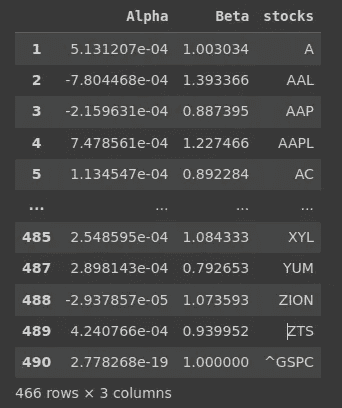**

**阿尔法和贝塔方差**

**设置我们的配置，我们能够检查更多有用的信息。**

****修改****

**我们需要准备要使用的数据，因为股票具有很高的波动性，所以我们需要规范化我们的数据，我们将使用来自 [sklearn、](https://scikit-learn.org/stable/modules/generated/sklearn.preprocessing.MinMaxScaler.html)的 lib MinMaxScaler()，带有函数 fit_transform 和 inverse_transform，现在我们能够满足这一要求。由于 ARIMA 使用最小最大标量的结果比 z 得分法更好，我们将直接选择最小最大()来拟合和缩放我们的数据。**

```
stockdfs = pd.DataFrame()
def datenormalization(stockdf): 
  global stockdfs
  stockdf = stockdf.groupby('Date').sum()
  stockdf = stockdf.asfreq(freq ='D'); 
  stockdfs = stockdf.ffill() #associate frequency by day to get hollidays
  stockdfs.sort_index(ascending=True, inplace=True)
  return pd.DataFrame(stockdfs)

obj = '' #global variable
def scaler_fit(series):
  global obj
  scaler = MinMaxScaler()
  obj = scaler.fit(series)
  return obj

def min_max_fit(series): #normalization
  scaler_fit(series)
  scaler = MinMaxScaler()
  series[list(series.columns)] = scaler.fit_transform(series)
  return series

def min_max_inverse(series, obj): #denormalization
  series[list(series.columns)] = obj.inverse_transform(series)
  return series
```

****

****MinMaxScaler 将特征数据转换为范围[0，1]。****

****型号****

> **ARIMA 模型**使用差分将非平稳时间序列转换为平稳时间序列，然后根据历史数据预测未来值**。这些模型使用数据中残差的“自动”相关性和移动平均值来预测未来值。[https://www . capital one . com/tech/machine-learning/understanding-ARIMA-models/](https://www.capitalone.com/tech/machine-learning/understanding-arima-models/)**

****设置模型****

**在一些测试中，我们确定了 ARIMA，一个在短时间内预测股票的最佳算法，对几天的预测。为了进行这些测试，我们使用 pycaret 来可视化和识别最适合的方法。**

**首先，我们只是创建我们的设置，传递 fh(预测展望期)值和 fold，用于交叉验证。session_id 参数用于为此设置传递一个随机数。**

> **fh:预测范围是**准备预测的未来时间长度**。**

**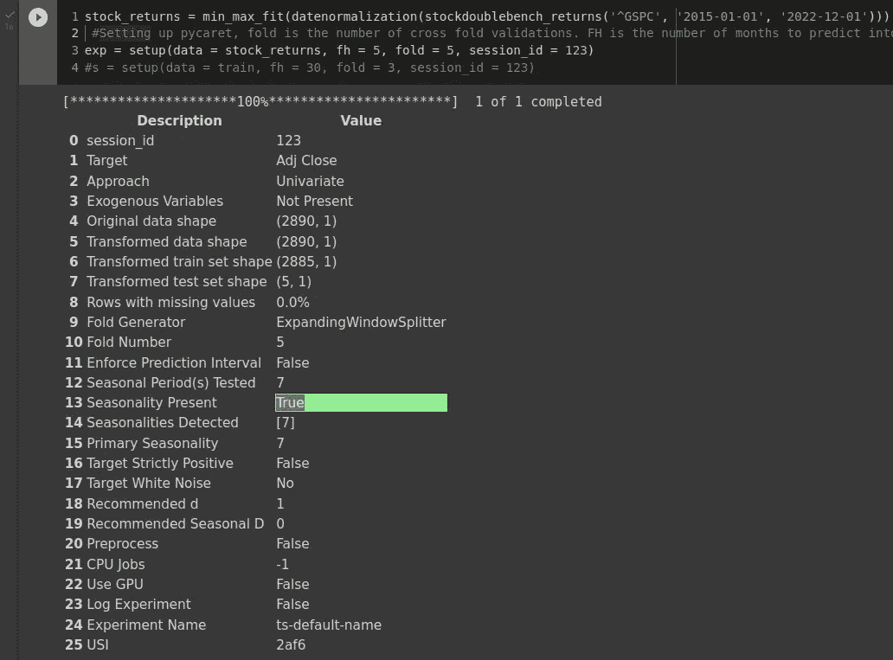**

**pycaret 设置**

**Pycaret 返回一些关于目标训练和测试数据帧的好值，需要注意的一点是关于[外生](https://www.reed.edu/economics/course_pages.archive/red_spots/endogenous_and_exogenous_v.htm)变量，你如何将变量传递给 pycarat，如果你遇到问题，查看下面的参考。**

**[](https://github.com/pycaret/pycaret/issues/1588) [## 为时序问题添加外部变量支持#1588 pycaret/pycaret

### 您的功能请求是否与某个问题相关？请描述一下。添加创建多元时间序列的能力描述…

github.com](https://github.com/pycaret/pycaret/issues/1588) 

在设置过程之后，我们需要选择一个模型，因为我已经有一个 ARIMA 模型可供选择，如果你想让 Pycaret 选择/测试最适合你的算法，你可以使用函数 compare-models()，你可以通过 pycaret [文档](https://pycaret.readthedocs.io/en/latest/api/time_series.html#pycaret.time_series.compare_models)进行更深入的验证。

**创建模型**

由于我已经选择了一个选项，我们将继续进行 ARIMA 模型，其中它被归类为时间序列预测算法。

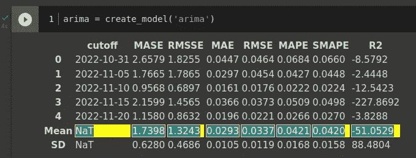

pycaret 度量

**识别并阅读指标**

**布斯指标(梅伊和 MRSE)之间的相似性**

1-度量的布斯表示基于关于原始代码(训练/测试)的预测模型的平均误差。

2-它们在 0-无穷大之间，返回幅度误差。

3-越接近零(0)，该值越好。

更多详情: [**梅和 MRSE**](https://medium.com/human-in-a-machine-world/mae-and-rmse-which-metric-is-better-e60ac3bde13d)

**检查结果—创建的模型**

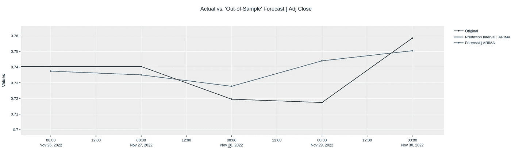

绘图模型(arima)

**创建模型**

**敲定车型**

当共享的结果达到预期时，我们将最终确定模型。

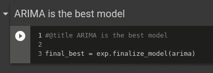

**绘制预测值—提前 5。**

因为我们已经创建了模型，所以我们将预测 5 天的未来值。

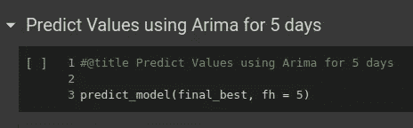

预测 5 天

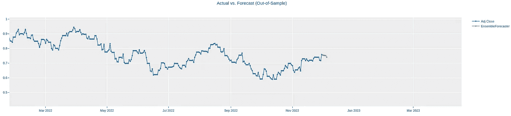

预测结果

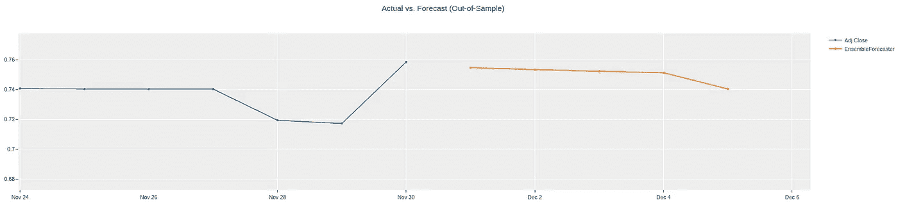

绘图预测值-详细信息

**工程什么都一起**

之后，我们创建了两个函数，一个用于计算训练、归一化和反归一化，第二个函数用于创建一个数组并将每个信息合并到一个数据帧中，这样我们就可以进行进一步的分析。

所有算法的工作流程如下:

***minmax()→setup()→finalize model()→predict model()→inverseminmax()→merge results()→data frame[]→Validation→Delviery***

```
 #@title Engineering All to Predict Stocks
 #@markdown Engineering to predict all 500 stocks
from pycaret.time_series import *

pred_unseen_deno = pd.DataFrame()
dffdstocks = pd.DataFrame()
transpredicted = pd.DataFrame()
dfstocks = pd.DataFrame()
dfstocks.iloc[0:0]

def train_and_normalize(stock, initialdate, finaldate, predictdays, predictdaysx, crossvalidation):
  global pred_unseen_deno
  global transpredicted
  stock_returns = datenormalization(stockdoublebench_returns(stock, initialdate, finaldate))
  print(stock_returns)
  exp2 = setup(min_max_fit(stock_returns[['Adj Close']]), fh = predictdays, fold = crossvalidation, session_id = 123)
  arima2 = exp2.create_model('arima')
  #pred_holdout = predict_model(arima2) 
  pred_unseen_deno = min_max_inverse(predict_model(exp2.finalize_model(arima2), fh = predictdaysx), obj)
  #if you need to see the pred_holdout value
  #pred_unseen_deno = min_max_inverse(predict_model(finalize_model(arima2), fh = predictdaysx), obj)
  transpredicted = pred_unseen_deno.T
  transpredicted['stocks'] = stock
  return transpredicted

def iterate_predicted_stocks(initialdate, finaldate, predictdays,predictdaysx, crossvalidation): 
  global dffdstocks
  global dfstocks
  for value in (abstocksna['stocks']):
    try: 
      train_and_normalize(value, initialdate, finaldate, predictdays, predictdaysx,crossvalidation) 
      dffdstocks = dffdstocks.append(transpredicted, ignore_index = True)
      dfstocks = pd.merge(dffdstocks, abstocks, on='stocks')
    except:
      continue
  return dfstocks
  #We are going to use this function to start up our algoritm to predict future values. 
#initial date, last date, predictdays(for test), predictdate for future to be used after last date, and how 
#many values fold we are going to use for cross validation.

abstocks = alphabetastock(stockdoublebench_percent(tickers, '2015-01-01', '2022-12-25'),'^GSPC')
abstocksna = abstocks.dropna()
iterate_predicted_stocks('2015-01-01', '2022-12-25', 30, 10 ,5) 
```

函数 alphabetastock()首先被调用来计算α和β的所有值，然后这些值被保存在数据帧 abstocksna 中，之后函数 iterate_predicted_stocks()开始迭代并将每个值传递给我们的函数 train_and_normalize()，可以看到，我们提供了初始日期、最终日期、测试集(30)、未来预测值(10)，5 是用于[交叉验证的数量。](https://en.wikipedia.org/wiki/Cross-validation_(statistics))

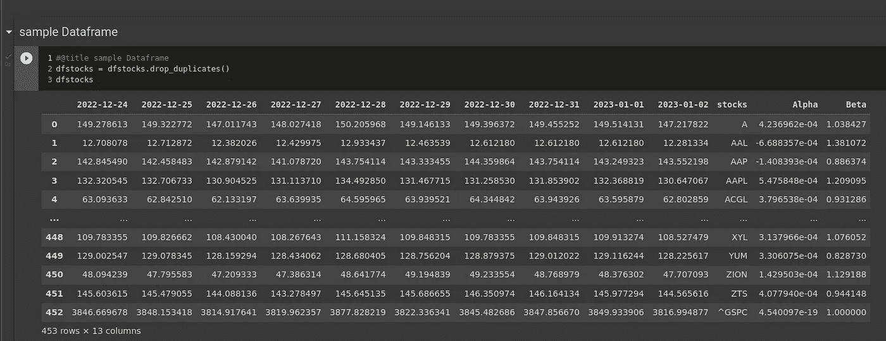

预测 500 只股票

**结论**

因此，我们能够获得所选日期的预测值，在这种情况下，我们将使用 5 天，我们有 Beta 方差和 Alpha 来帮助我们开发股票钱包。可以用高值、最小值、平均值和每个的扇区来增加该数据框架，以使用更多的统计推断来识别和应用粒子群算法，或者可以使用多标准决策来识别最佳的未来股票组合。

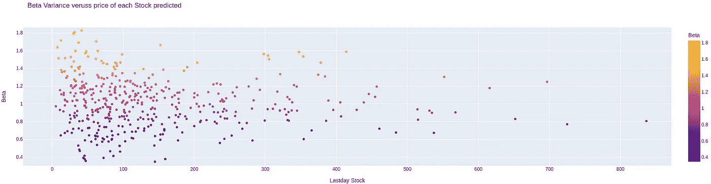

绘制 beta 差异与最后一天预测库存的对比图

**接下来的步骤**

*   用新值增加最终数据帧，以获得更好的决策者。
*   定义股票投资组合的多准则算法。
*   优化未来投资组合..**