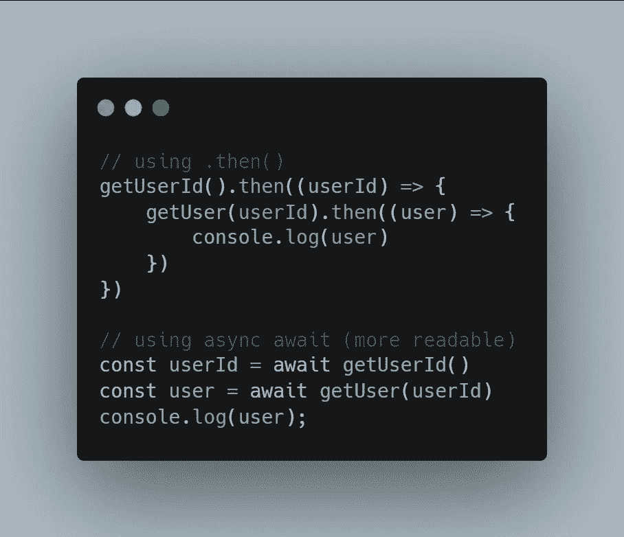
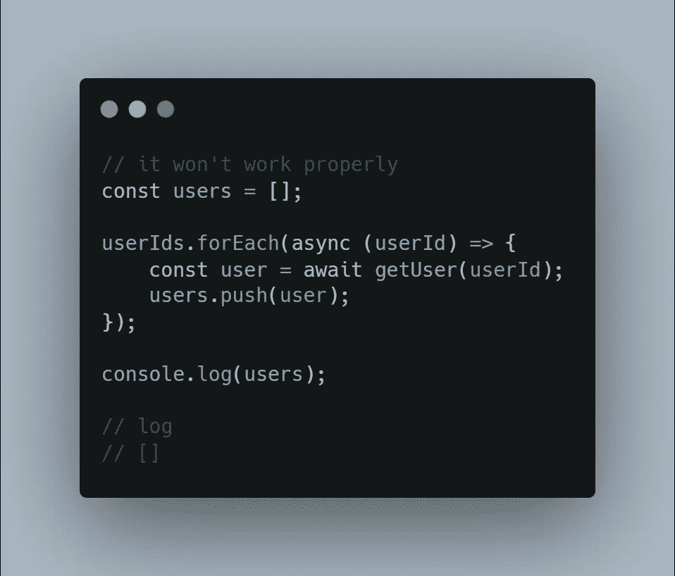
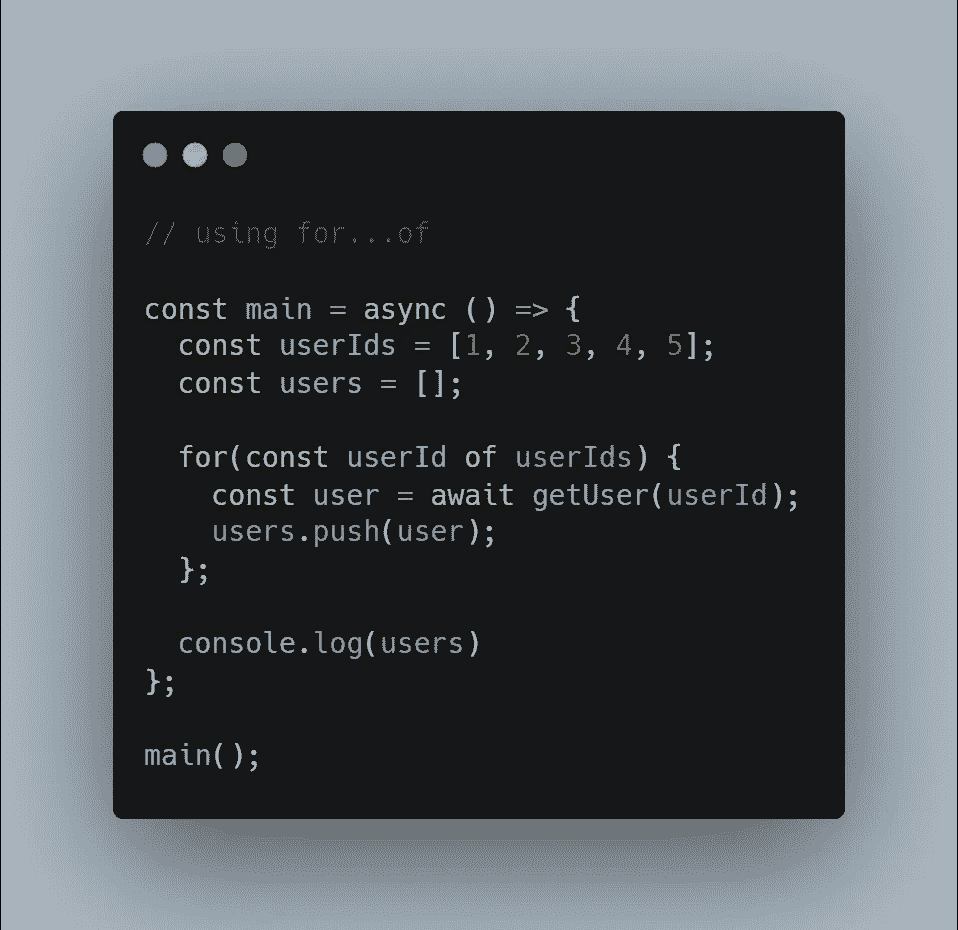
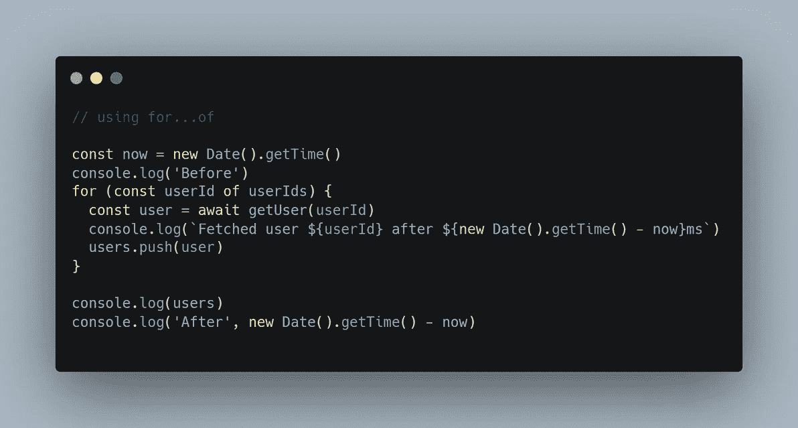
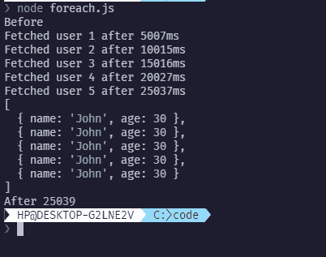
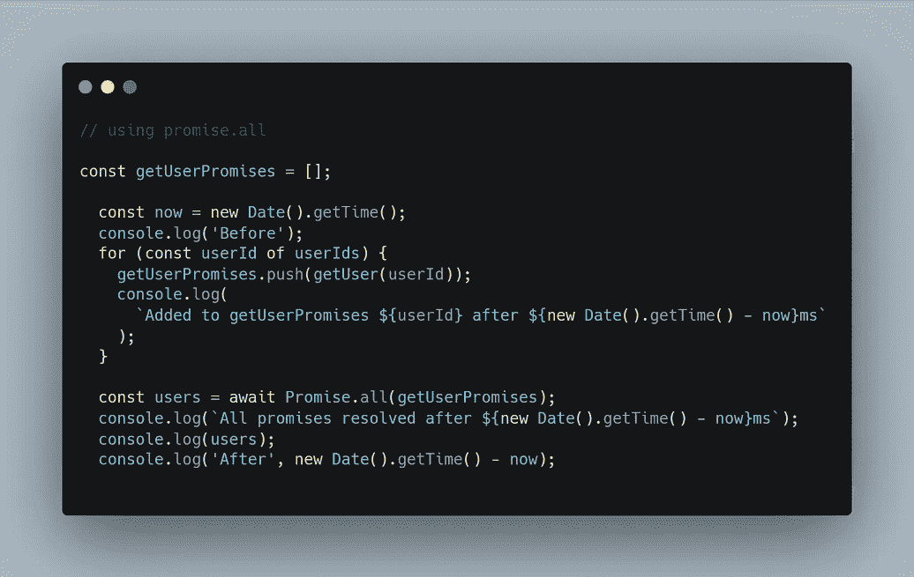
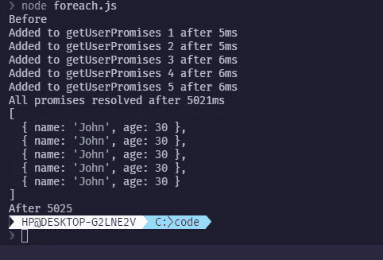

# 在 forEach 循环中使用 async/await(不能)

> 原文：<https://blog.devgenius.io/using-async-await-in-a-foreach-loop-you-cant-c174b31999bd?source=collection_archive---------0----------------------->

我遇到一个抱怨，当你把一个异步 lambda 函数作为回调参数传入每个元素时，forEach 循环是不一致的。从表面上看，这似乎不是一个不切实际的期望，但在本文中，我将尝试解释为什么它不起作用，向您展示开发人员实现这一点的一种流行方式，最后是一种适用于特定场景的优化(这通常是大多数人需要它的场景)。

# 快速后台(异步/等待)

如果你已经掌握了 async/await，你可以跳过这一节。我注意到的另一件事是，就像我一样，大多数人不理解 [javascript 承诺](https://www.freecodecamp.org/news/javascript-promises-explained/#:~:text=What%20is%20a%20promise%20in,operation%2C%20and%20its%20resulting%20value.)，正因为如此，他们不理解 async-await 语法实际上在做什么。async-await 语法只是 promises API 上的语法糖，函数上的 async 标记只是让 javascript 知道这个函数将返回一个 promise，函数内部的 waiting 告诉解释器停留在函数调用中的这行代码上，直到该行调用的 promise 被完全解析。它让丑陋嵌套。then()调用看起来可读性更好。

# 问题(承诺)

forEach 循环不是为使用异步回调函数而构建的，这也是它没有达到预期效果的原因。在继续下一次迭代之前，它不会等待迭代的承诺得到解决。这意味着在 forEach 循环迭代结束时，实际上没有任何东西被推入用户数组(稍后会被推入，但我并不想进入这里的[事件循环](https://www.digitalocean.com/community/tutorials/understanding-the-event-loop-callbacks-promises-and-async-await-in-javascript))。

# 流行的解决方案(我们的老一套 for 循环)

仔细观察这个问题，你会发现我们的代码不能正常工作的主要原因是我们试图使用 forEach 循环来做一些它不是为之而创建的事情。我们需要一些东西，让我们迭代数组，并允许我们阻止程序执行，直到我们的承诺得到解决，这就是循环的基础。

我们可以使用循环的 for…或者旧的 for(让 I = 0；….)类型的 for 循环，但我将在这里使用 for…of，因为我们不需要对迭代过程进行太多控制。

Nore:循环的 for…必须在异步函数中才能在循环中使用 await。除非在运行环境中设置了一些额外的配置，否则不能在程序的顶层使用这种语法。

这将完全按照您的预期工作，并且已解析的用户将被记录。

# 优化(我们可以做得更好，不是吗)

从上一节来看我们的解决方案，您可以看到一些可能出现的问题。想象一下，让用户进行 getUser 调用需要 5 秒钟，这意味着记录所有用户需要 25 秒钟，当您从更大的角度来看这个问题时，情况会更糟。

对于这个从用户 id 数组中获取用户的特定场景，您可能会注意到，在开始获取下一个用户之前，我们正在等待返回一个用户，但是我们不需要等待，因为获取下一个用户与上一个调用返回的值无关。我们能不能并行获取它们，这样就可以用 5 秒钟来获取它们？是啊，肯定的。这就是 Promise.all()的用武之地，我们用它来批量解析承诺。

使用 Promise.all()，所有的承诺都被并行解析，解析一个承诺所花的时间与解析所有承诺所花的时间相同。需要注意的一点是，只有当所有承诺都被解决时，您才能访问所有已解决的承诺，因此，如果其中一个电话需要 10 秒钟，而其他电话需要 2 秒钟，则您必须等待 10 秒钟。

# 结论

我不是一个真正的作家，所以我希望你明白这一点，我完成了。另外，如果你有更好的方法，请在评论中告诉我，我也喜欢学习新东西。