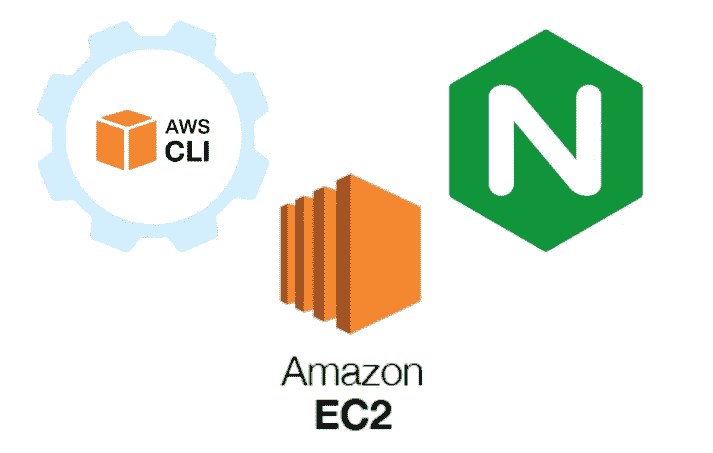
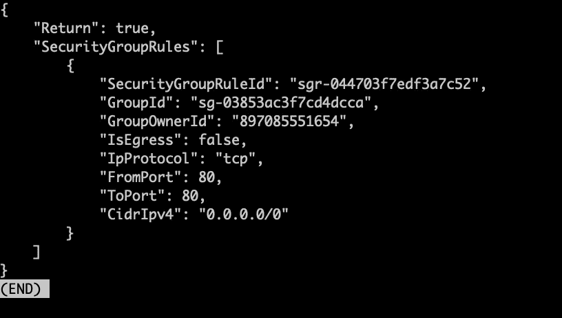
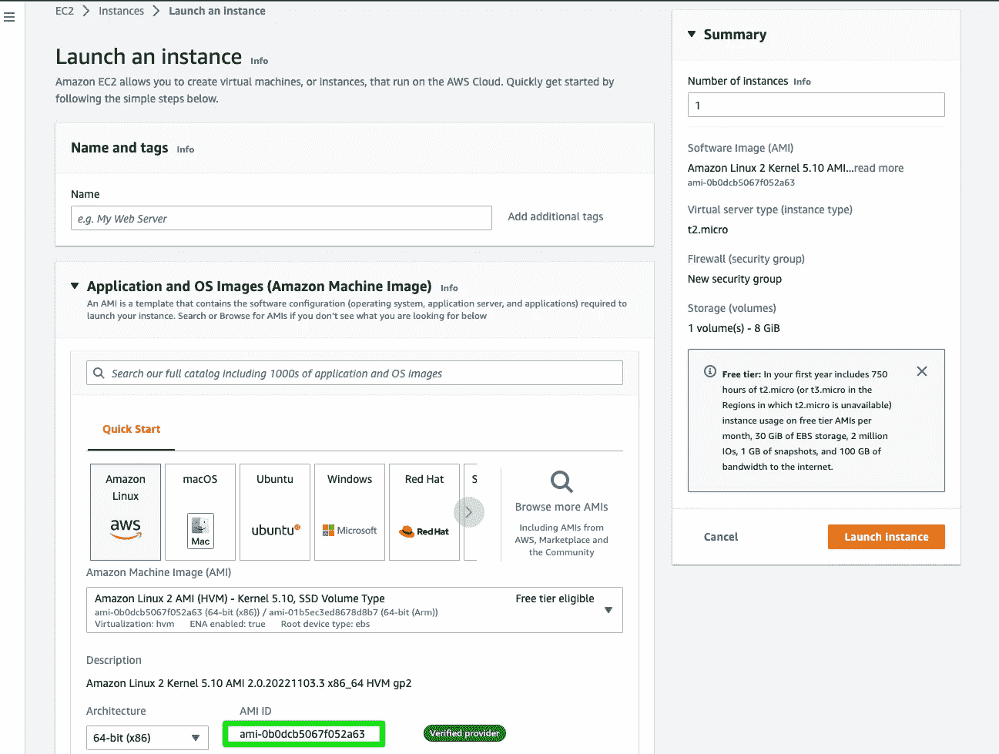
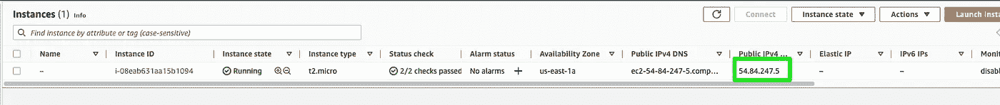
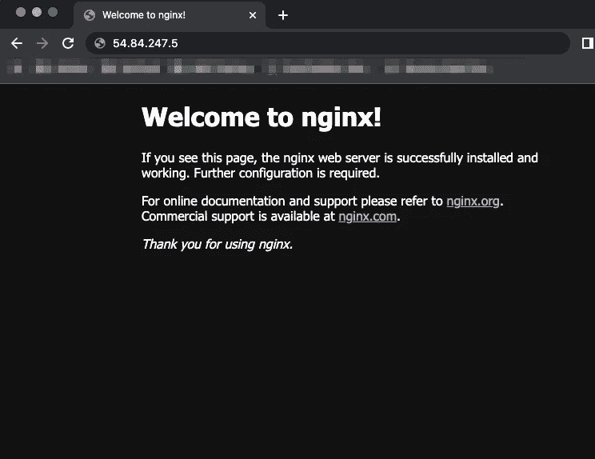

# 使用 AWS CLI 创建带有 Nginx 安装的 EC2 实例

> 原文：<https://blog.devgenius.io/using-aws-cli-to-create-ec2-instance-with-nginx-install-75b1510b087?source=collection_archive---------8----------------------->

如何使用 AWS CLI 和用户数据字段创建 Nginx web 服务器



# 任务:

我们的目标是使用 Amazon EC2 实例，通过 AWS CLI 启动 Nginx web 服务器。我们将创建一个安全组，并将服务器配置到我们的默认 VPC，安装并启动我们的 web 服务器，而无需登录到它。

# 要求:

*   AWS 自由层
*   配置 AWS CLI 以供您的帐户使用
*   尝试

# 步骤 1:创建安全组

将需要创建一个安全组，以允许来自外部的流量攻击我们的 web 服务器。让我们给它一个名字和描述。我将把它命名为“ **allow-web-access** ”。

```
 aws ec2 create-security-group --group-name allow-web-access --description 'Allow for inbound traffic to port 80'
```

如果命令成功，您将收到一个用 JSON 编写的响应，注明 **GroupID** 。


显示带有 GroupID 的响应

接下来，我们需要为组配置规则。我们将创建一个规则，允许从任何 IP 发往 TCP 端口 80 的入站流量。下面是我们将用来为刚刚创建的安全组指定规则的命令。

```
aws ec2 authorize-security-group-ingress --group-name allow-web-access --protocol tcp --port 80 --cidr 0.0.0.0/0
```



显示成功命令的响应

# 步骤 2:创建 EC2 实例

在创建 EC2 实例之前，我们需要收集创建实例所需的信息。首先，让我们看看我们的 AMI 的 ID 是什么。您需要登录到门户来确认您想要的实例的 ID。导航到“ **EC2 >实例>启动实例**”，然后选择您想要的图像并记下 ID 和实例类型。



显示 AMI ID

在运行命令创建实例之前，我们需要创建一个 BASH 脚本。这个脚本将用于在初始启动时安装 Ngnix web 服务器。为此，我们将利用“**用户数据**”选项。在您的本地机器上创建以下脚本，并将其保存为“ **install.sh** ”。

```
#!/bin/bash
sudo yum update -y
sudo amazon-linux-extras install nginx1 -y
sudo systemctl start nginx
sudo systemctl enable nginx
```

现在让我们运行 AWS CLI 命令来创建实例。

```
aws ec2 run-instances --image-id ami-0b0dcb5067f052a63 --instance-type t2.micro --security-groups allow-web-access --user-data install.sh
```

现在，您应该会在控制台中看到我们的新实例。让我们将公共 IP 复制到一个新的浏览器窗口中。



显示新实例和公共 IP



显示默认网页

就是这样！