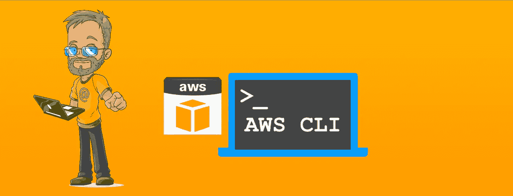
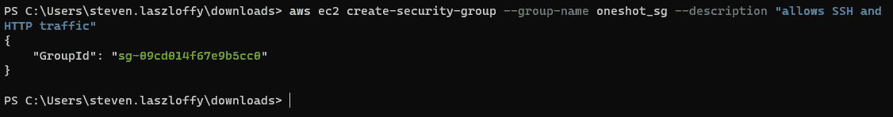
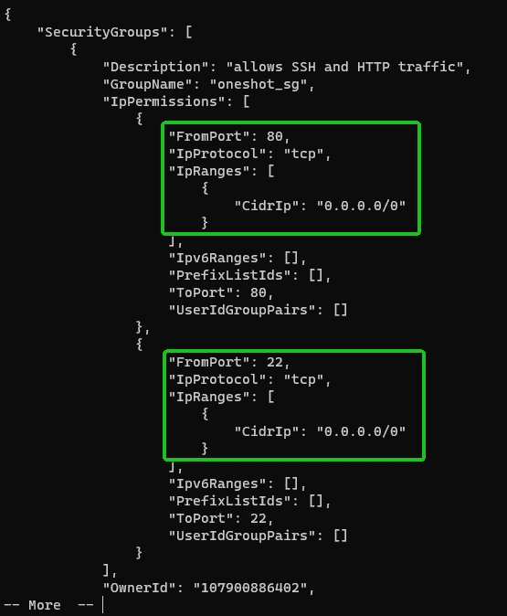
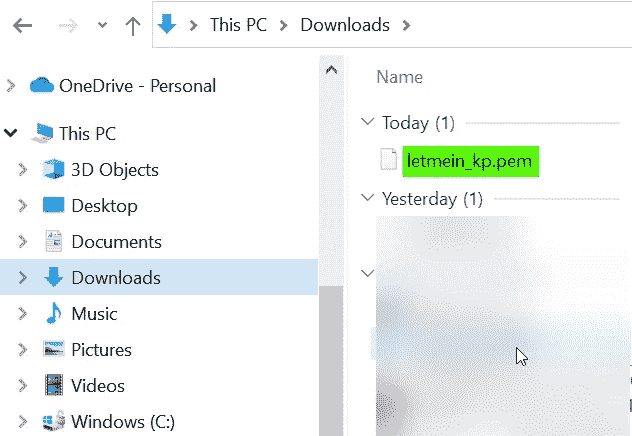
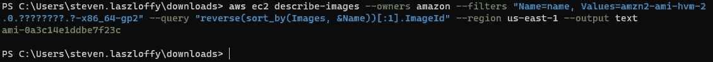
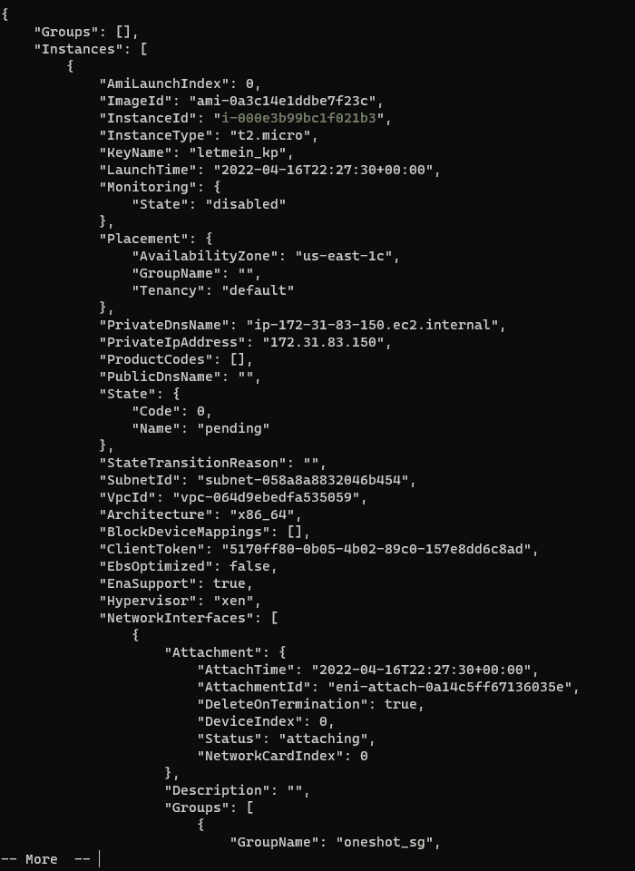

# 使用 AWS CLI 通过 Apache 启动 EC2 服务器

> 原文：<https://blog.devgenius.io/using-aws-cli-to-launch-an-ec2-webserver-with-apache-e6f0c56a99e3?source=collection_archive---------9----------------------->

在这个项目中，我们将尝试创建一个 EC2 web 服务器，仅使用*AWS CLI 运行 Apache。我们将尝试用一个命令来完成它。*

也就是说，我们需要先完成一些准备/信息收集步骤。

*   我们需要创建一个安全组并向其添加规则。
*   我们需要为实例创建一个密钥对。
*   (可选)为引导脚本创建一个文本文件。否则，你可以直接“内联”它。
*   我们需要将要使用的图像的 AMI ID。

我喜欢从零开始我的项目，所以我们只基于一个假设:

*   您已经在工作站上安装并配置了 AWS CLI。(我用的是 Windows 终端)如果你不知道，你可以看看 AWS 关于安装和配置 AWS CLI 的很棒的文档，它会让你在几分钟内启动并运行。

既然我们都准备好了，让我们开始吧！

# 安全组

我们要做的第一件事是确保我们的实例和后续的 web 服务器能够与我们对话。为此，我们将使用以下命令:

`aws ec2 create-security-group --group-name oneshot_sg --description "allows SSH and HTTP traffic"`

一旦我们运行这个命令，它就会显示“GroupId”。抓住这只小狗，把它放在记事本什么的里面，因为我们马上就要用到它了。*如果您错过了，可以随时使用* `aws ec2 describe-security-groups` *来列出您所有的安全组。*

让我们添加 SSH 和 HTTP 的规则:
`aws ec2 authorize-security-group-ingress --group-id sg-09cd014f67e9b5cc0 --protocol tcp --port 22 --cidr 0.0.0.0/0`
`aws ec2 authorize-security-group-ingress --group-id sg-09cd014f67e9b5cc0 --protocol tcp --port 80 --cidr 0.0.0.0/0`

验证我的两个规则显示如下:
`aws ec2 describe-security-groups --group-ids sg-09cd014f67e9b5cc0`

让所有人进来。非常适合测试。对生产来说没那么多。

# 密钥对

我们的下一步设置是创建一个密钥对。该命令将创建对，然后将对输出到我当前目录下的. pem 文件:
`aws ec2 create-key-pair --key-name letmein_kp --query 'KeyMaterial' --output text | out-file -encoding ascii -filepath letmein_kp.pem`

该命令不向终端提供任何输出，但我们可以通过检查下载文件夹来验证文件是否已成功创建:

# AMI ID

最后一个设置步骤是找到我们将用于发布的准确的 Amazon 机器映像 ID (AMI ID)。这个 ID 是特定于地区的，所以我们将使用一个命令来列出所有符合我们标准的 AMI。

`aws ec2 describe-images --owners amazon --filters "Name=name, Values=amzn2-ami-hvm-2.0.????????.?-x86_64-gp2" "Name=state, Values=available" --query "reverse(sort_by(Images, &Name))[:1].ImageId" --region us-east-1 --output text` *注意:由于复制/粘贴添加了新行，命令将不得不手动键入*

用 ami-______ 抓取钻头。我们需要这个。

现在我们所有的设置都已完成，我们可以将所有的部分放在一起启动这个实例了！

# 发射命令

首先，让我们看看这个野兽！记下我们收集的所有不同组件？

`aws ec2 run-instances --image-id ami-0a3c14e1ddbe7f23c --count 1 --instance-type t2.micro --key-name letmein_kp --security-group-ids sg-09cd014f67e9b5cc0 --user-data file://bootstrap06.txt`

我引用的 bootstrap 只是一个文本文件，我在其中包含了一些 bash 脚本和 html 代码，因此我们得到了一些有趣的输出，表明我们成功地完成了项目。主要部分是下面的代码:

`#!/bin/bash
yum update -y
yum install httpd -y
service httpd start
chkconfig httpd on`

运行启动命令后，我们应该会看到如下输出:

在我们给它几分钟的时间来完成所有的命令和更新之后，我们获取公共 IP，然后！我们有了自己的网络服务器！

# 精益求精！