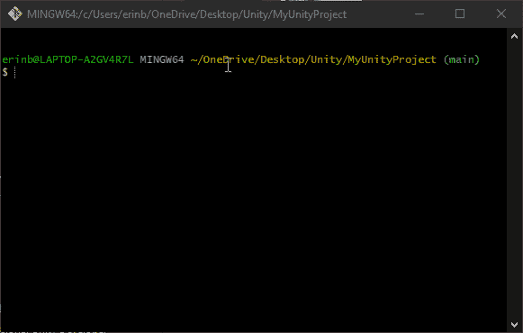
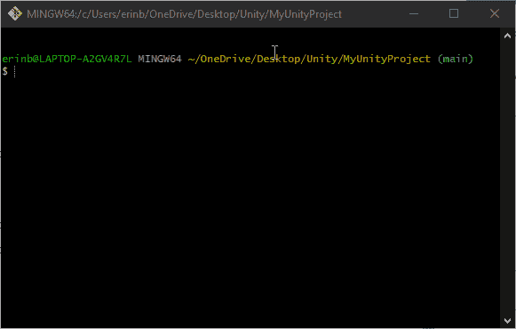
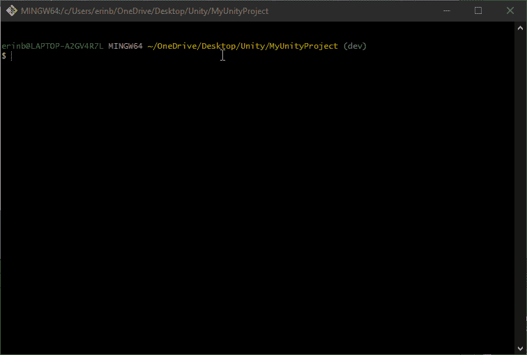
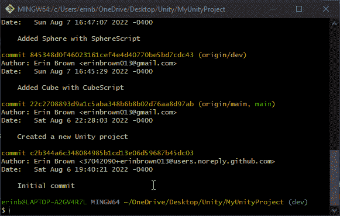
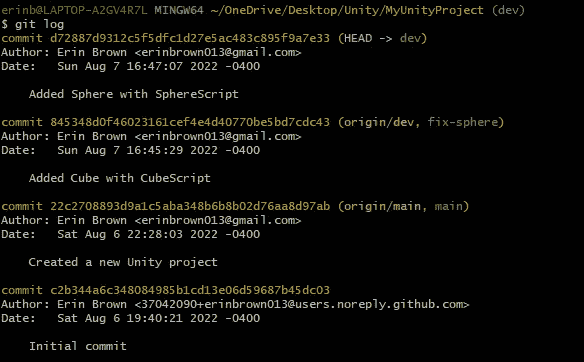
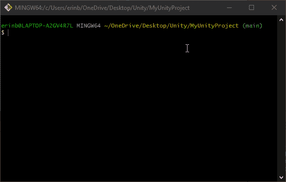
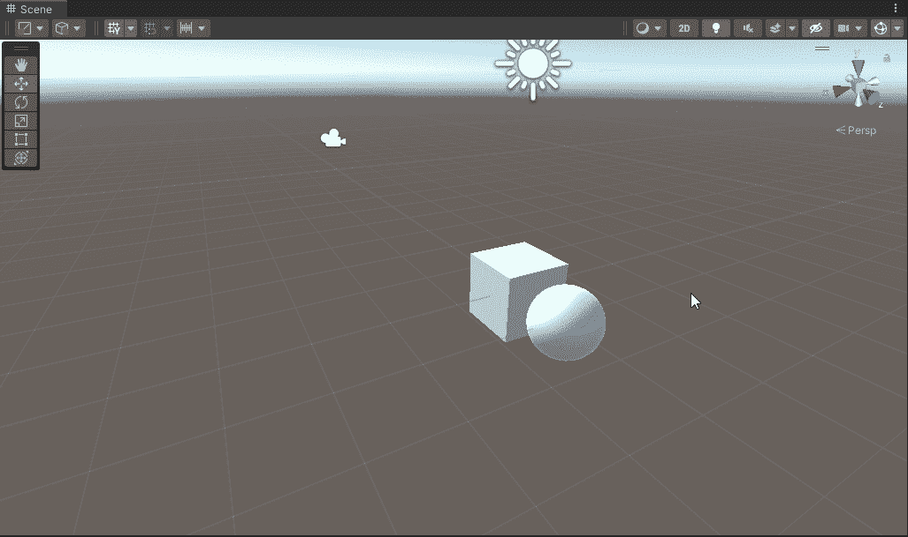
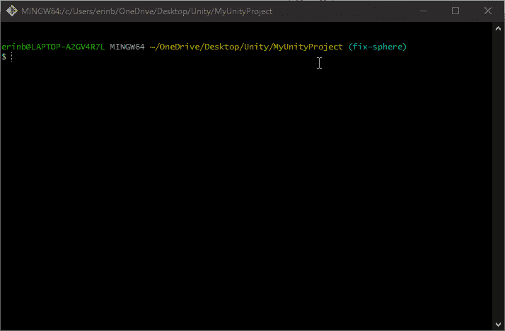

# 在 Git 中使用分支

> 原文：<https://blog.devgenius.io/using-branches-with-git-384a89beb1fa?source=collection_archive---------19----------------------->

Git 最通用特性之一的快速指南

树枝——照片由[米拉·托瓦尔](https://unsplash.com/@milatovar?utm_source=unsplash&utm_medium=referral&utm_content=creditCopyText)在 [Unsplash](https://unsplash.com/s/photos/branches?utm_source=unsplash&utm_medium=referral&utm_content=creditCopyText) 上拍摄

分支是 Git 最灵活的特性之一。除了它增强的变更跟踪，分支实际上允许你在不影响主版本的情况下留出一个版本的项目来工作。

**查看项目中的分支**

使用 git branch 命令

首先，要查看您的存储库中有哪些分支，您可以在 Git Bash 控制台中输入 *git branch* 。在一个新的存储库中，您可能只有一个分支(通常是 *main* 或 *master* ，这取决于您的默认设置)。 *git branch* 将只显示本地存储库中的分支。要查看所有本地和远程分支，输入 *git branch -a.*

**创建新的分支**

使用 git branch 创建新的分支

当您准备好从项目的主版本中分支时，您可以通过输入 *git branch* 后跟新分支的名称来创建一个新分支。默认情况下，这将创建一个与活动分支的当前版本相匹配的新分支。

如果您想在创建新分支时选择一个特定的时间点和/或另一个要复制的分支，您还可以在新分支名称后指定一个起点，可以是另一个分支(它将指向它的当前状态)的形式，也可以是历史中特定提交的哈希代码。

使用 git log 命令

要找到提交的哈希代码，输入 *git log* 查看提交历史。在要开始新分支的 commit 上，复制单词“commit”后面的一长串字母和数字。

使用带有起始点的 git branch 命令

然后，当你进入 *git 分支*时，输入一个新的分支名称，然后粘贴哈希代码*。*

git 日志显示每个分支指向哪个提交

如果您再次检查 *git 日志*，您可以看到历史中哪些分支指向哪些提交。在上面的例子中，注意“fix-sphere”分支是如何指向添加了一个多维数据集的提交的。有了 fix-sphere 分支，我可以回到球体被添加到项目之前，确定问题是什么并修复它。

**分支间切换**

使用 git 开关命令

现在您已经在项目中有了一个新的分支，您需要切换到它，这样您就可以开始工作了。为此，输入 *git switch* ，后跟您想要切换到的分支的名称。您的活动分支显示在文件路径末尾的括号和蓝色文本中。当您运行 *git branch* 来列出您的本地分支时，您也可以看到它用绿色和星号标记。

这可能很难相信，但真的就是这么简单。您在 Unity 中的项目将会更新以匹配活动分支的状态。当我从场景中有球体和立方体的*开发*分支切换到只有立方体的*修复球体*分支时，见下图:

在分支机构之间切换时，Unity 会实时刷新

**合并分支机构**

一旦您对一个分支中的更改感到满意，并准备将这些更改与项目的另一个版本相结合，就该合并分支了。

为此，首先切换到应该从更新的分支接收更改的分支。然后，输入 *git merge* ，后跟更新后的分支的名称。如果需要，可以将提交作为合并的一部分进行处理，并且会出现一个文本编辑器来捕获提交消息。关闭编辑器以保存默认消息。在上面的例子中， *dev* 分支已经被更新，以包括来自 *fix-sphere* 分支的变化(它将一个胶囊对象添加到场景中)。

除了开发新特性或解决修复问题，分支还为多个用户提供了灵活性，通过从不同的分支工作并合并结果来对同一个项目进行更改。