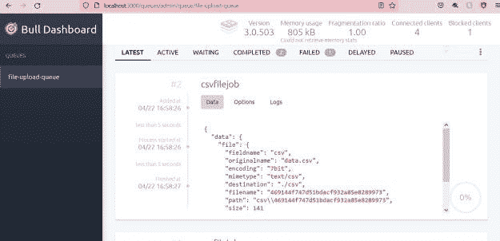

# 在 NestJS 应用程序中使用 Bull 队列

> 原文：<https://blog.devgenius.io/using-bull-queues-in-nestjs-application-dd8421b3f3b?source=collection_archive---------7----------------------->

在许多情况下，您将不得不处理异步的 CPU 密集型任务。尤其是当应用程序通过 REST API 请求数据时。REST 端点应该在有限的时间范围内做出响应。

在这篇文章中，我将展示我们如何使用队列来处理异步任务。我们将在一个简单的 NestJS 应用程序中使用 Bull 队列。


队列是一种遵循线性顺序的数据结构。在大多数系统中，队列就像一系列任务。发布者将消息或任务发布到队列。消费者提取该消息以进行进一步处理。这可以异步发生，为 CPU 密集型任务提供急需的喘息机会。一旦消费者使用了该消息，任何其他消费者都不能使用该消息。

牛市队列基于 Redis。在我之前的文章中，我介绍了如何在 [NestJS 应用程序](https://betterjavacode.com/programming/adding-health-checks-in-nestjs-application)中添加 Redis 或数据库的健康检查。

*   设置 NestJS 应用程序
*   NestJS 应用程序中的 Bull 队列
*   实现处理器来处理队列数据
*   集成公牛仪表板
*   添加牛纸板类
*   添加控制器
*   结论

# 设置 NestJS 应用程序

作为演示的一部分，我们将创建一个简单的应用程序。我们将通过 csv 文件上传用户数据。控制器将接受该文件，并将其传递给队列。处理器将拾取排队的作业并处理文件，以将数据从 CSV 文件保存到数据库中。

`nest new bullqueuedemo`

一旦这个命令为`bullqueuedemo`创建了文件夹，我们将设置 Prisma ORM 来连接数据库。(注意-确保安装 prisma 依赖项。).

`npx prisma init`

如果您使用的是 Windows 机器，运行 prisma init 时可能会遇到错误。考虑到所有的事情，设置一个环境变量来避免这个错误。

`set PRISMA_CLI_QUERY_ENGINE_TYPE=binary` `set PRISMA_CLIENT_ENGINE_TYPE=binary`

一旦模式被创建，我们将用我们的数据库表更新它。对于这个演示，我们正在创建一个表`user`。

```
// This is your Prisma schema file,
// learn more about it in the docs: https://pris.ly/d/prisma-schema

generator client {
  provider = "prisma-client-js"
  engineType = "binary"
}

datasource db {
  provider = "mysql"
  url      = env("DATABASE_URL")
}

model User {
  id    Int     @default(autoincrement()) @id
  email String  @unique
  first_name  String
  last_name   String?
}
```

现在，如果我们运行`npm run prisma migrate dev`，它将创建一个数据库表。

总之，到目前为止，我们已经创建了一个 NestJS 应用程序，并用 Prisma ORM 建立了我们的数据库。让我们看看我们必须为 Bull Queue 添加的配置。

# NestJS 应用程序中的 Bull 队列

安装`@nestjs/bull`依赖关系。这个依赖封装了 [bull](https://github.com/OptimalBits/bull) 库。我们将假设您已经安装并运行了`redis`。默认情况下，Redis 将在端口 6379 上运行。

我们将在我们的`.env`文件中添加`REDIS_HOST`和`REDIS_PORT`作为环境变量。为 Bull 安装两个依赖项，如下所示:

`npm install @nestjs/bull` `npm install @types/bull`

之后，我们将通过向我们的 app 模块添加`BullModule`来建立与 Redis 的连接。

```
@Module({
  imports: [
    BullModule.forRootAsync({
      imports: [ConfigModule],
      useFactory: async (configService: ConfigService) => ({
        redis: {
          host: configService.get('REDIS_HOST'),
          port: Number(configService.get('REDIS_PORT')),
        },
      }),
      inject: [ConfigService]
    }),
    BullModule.registerQueue({
      name: 'file-upload-queue'
    }), 
  ],
  controllers: [AppController, BullBoardController],
  providers: [UserService, PrismaService, FileUploadProcessor,],
})
export class AppModule {}
```

我们正在注入 ConfigService。这个服务允许我们在运行时获取环境变量。有了这个，我们将能够在我们的应用程序中使用`BullModule`。

正如你在上面的代码中看到的，我们有`BullModule.registerQueue`，它注册了我们的队列`file-upload-queue`。现在让我们将这个队列添加到我们的控制器中，在那里将使用它。

```
@Controller('/api/bullqueuedemo')
export class AppController {
  constructor(@InjectQueue('file-upload-queue') private fileQueue: Queue) {
    queuePool.add(fileQueue);
  }

  @Post('/uploadFile')
  @UseInterceptors(FileInterceptor("csv", {
    storage: diskStorage({
      destination: './csv',
      fileName: (req, file, cb) => {
        const randomName = Array(32).fill(null).map(() => (Math.round(Math.random() * cb(null, `${randomName}${extname(file.originalname)}`))))
      }
    })
  }))
  async uploadCsvFile(@UploadedFile() file): Promise {
    const job = await this.fileQueue.add('csvfilejob', {file: file});
    console.log(`created job ${ job.id}`);
  }

  @Get('/')
  async getHello(): Promise {
    return "Hello World";
  }
}
```

让我们慢慢地看一下这段代码，以理解发生了什么。

*   在构造函数中，我们注入了队列`InjectQueue('file-upload-queue')`。
*   我们的 POST API 用于上传 csv 文件。
*   我们正在使用一个[文件拦截器](https://docs.nestjs.com/techniques/file-upload)。这是 NestJS 提供的一个特性，用于拦截请求并从请求中提取文件。这个拦截器有两个参数`fieldName`和`options`。
*   `storage`选项允许我们将上传的文件存储在当前执行目录下的一个名为`csv`的文件夹中。上传的文件将以随机生成的名称和扩展名`.csv`重命名。
*   在方法`uploadCsvFile`中，我们接收上传的文件。这来自我们的文件拦截器。我们使用注入队列来添加一个名为`csvfilejob`的作业和包含该文件的数据。

# 实现处理器来处理队列数据

此后，我们在队列中添加了一个任务`file-upload-queue`。现在为了进一步处理这个任务，我们将实现一个处理器`FileUploadProcessor`。

我们用`@Processor('file-upload-queue')`来注释这个消费者。

```
@Processor('file-upload-queue')
export class FileUploadProcessor {

    constructor(private readonly userService: UserService){}

    @Process('csvfilejob')
    async processFile(job: Job) {
        const file = job.data.file;
        const filePath = file.path;
        const userData = await csv().fromFile(filePath);

        console.log(userData);

        for(const user of userData) {
            const input = {
                email: user.email,
                first_name: user.first_name,
                last_name: user.last_name,
            };
            const userCreated = await this.userService.createUser(input);
            console.log('User created -', userCreated.id );
        }

    }

}
```

简而言之，我们可以看到我们使用队列中的作业，并从作业数据中获取文件。请注意，我们必须将`@Process(jobName)`添加到消耗作业的方法中。`processFile`方法消耗工作。我们将 CSV 数据转换成 JSON，然后使用`UserService.`处理每一行，将用户添加到我们的数据库中

一旦你创建了`FileUploadProcessor`，确保在你的应用模块中注册为一个提供者。

为了说明这一点，如果我通过 Postman 执行 API，我将在控制台中看到以下数据:

```
[Nest] 21264  - 04/22/2022, 4:57:19 PM     LOG [NestFactory] Starting Nest application...
[Nest] 21264  - 04/22/2022, 4:57:20 PM     LOG [InstanceLoader] DiscoveryModule dependencies initialized +43ms
[Nest] 21264  - 04/22/2022, 4:57:20 PM     LOG [InstanceLoader] ConfigHostModule dependencies initialized +0ms
[Nest] 21264  - 04/22/2022, 4:57:20 PM     LOG [InstanceLoader] BullModule dependencies initialized +4ms
[Nest] 21264  - 04/22/2022, 4:57:20 PM     LOG [InstanceLoader] ConfigModule dependencies initialized +0ms
[Nest] 21264  - 04/22/2022, 4:57:20 PM     LOG [InstanceLoader] BullModule dependencies initialized +12ms
[Nest] 21264  - 04/22/2022, 4:57:20 PM     LOG [InstanceLoader] BullModule dependencies initialized +10ms
[Nest] 21264  - 04/22/2022, 4:57:20 PM     LOG [InstanceLoader] AppModule dependencies initialized +1ms
[Nest] 21264  - 04/22/2022, 4:57:20 PM     LOG [RoutesResolver] AppController {/api/bullqueuedemo}: +62ms
[Nest] 21264  - 04/22/2022, 4:57:20 PM     LOG [RouterExplorer] Mapped {/api/bullqueuedemo/uploadFile, POST} route +3ms
[Nest] 21264  - 04/22/2022, 4:57:20 PM     LOG [RouterExplorer] Mapped {/api/bullqueuedemo, GET} route +1ms
[Nest] 21264  - 04/22/2022, 4:57:20 PM     LOG [NestApplication] Nest application successfully started +582ms
created job 2
[
  {
    id: '1',
    email: 'john.doe@gmail.com',
    first_name: 'John',
    last_name: 'Doe'
  },
  {
    id: '2',
    email: 'jacob.drake@gmail.com',
    first_name: 'Jacob',
    last_name: 'Drake'
  },
  {
    id: '3',
    email: 'jos.butler@gmail.com',
    first_name: 'Jos',
    last_name: 'Butler'
  }
]
User created - 1
User created - 2
User created - 3
```

多头队列提供了许多功能:

*   最小 CPU 使用率
*   基于 redis 的稳健设计
*   并发
*   重试
*   限速器
*   事件监督

经常出现的一个问题是，如果作业失败或暂停，我们如何监控这些队列。一个简单的解决方案是使用 Redis CLI，但是 Redis CLI 并不总是可用，尤其是在生产环境中。最后，出现了一个简单的基于 UI 的仪表板——Bull 仪表板。

# 集成公牛仪表板

关于 Bull 队列的伟大之处在于有一个 UI 可以用来监视队列。还可以添加一些选项，允许用户重试处于失败状态的作业。让我们安装两个依赖项`@bull-board/express`和`@bull-board/api`。

`npm install @bull-board/express` -安装 express 服务器专用适配器。如果您在 NestJS 应用程序中使用`fastify`，您将需要`@bull-board/fastify`。

`npm install @bull-board/api` -安装一个核心服务器 API，允许创建一个 Bull 仪表板。

# 添加牛纸板类

我们将创建一个 bull board queue 类，它将为我们设置一些属性。它将创建一个队列池。每次注入新队列时，这个队列池都会被填充。我们还需要一个方法`getBullBoardQueues`在加载 UI 时提取所有队列。

```
@Injectable()
export class BullBoardQueue { }

export const queuePool: Set = new Set();

export const getBullBoardQueues = (): BaseAdapter[] => {
    const bullBoardQueues = [...queuePool].reduce((acc: BaseAdapter[], val) => {
        acc.push(new BullAdapter(val))
        return acc
    }, []);

    return bullBoardQueues
}
```

# 添加控制器

有几种方法可以访问 UI，但我更喜欢通过控制器添加，这样我的前端就可以调用 API。我们创建一个`BullBoardController`来映射传入的请求、响应和下一个 like Express 中间件。在我们的 UI 路径中，我们有一个 Express 的服务器适配器。这允许我们设置一个基本路径。我们使用上面描述的`getBullBoardQueues`方法获取所有注入的队列。然后我们使用`createBullBoard` API 来获得`addQueue`方法。`serverAdapter`为我们提供了一个路由器，我们用它来路由传入的请求。在我们路由请求之前，我们需要做一点小改动，用`/`替换 entryPointPath。

```
@Controller('/queues/admin')
export class BullBoardController{

    @All('*')
    admin(
        @Request() req: express.Request,
        @Response() res: express.Response,
        @Next() next: express.NextFunction,
    ) {
        const serverAdapter = new ExpressAdapter();
        serverAdapter.setBasePath('/queues/admin');
        const queues = getBullBoardQueues();
        const router = serverAdapter.getRouter() as express.Express;
        const { addQueue } = createBullBoard({
            queues: [],
            serverAdapter,
        });
        queues.forEach((queue: BaseAdapter) => {
            addQueue(queue);
        });
        const entryPointPath = '/queues/admin/';
        req.url = req.url.replace(entryPointPath, '/');
        router(req, res, next);
    }
}
```

现在，如果我们运行我们的应用程序并访问 UI，我们将看到一个漂亮的 Bull Dashboard UI，如下所示:



最后，这个用户界面的好处是你可以看到所有隔离的选项。

# 结论

Bull 队列是管理一些资源密集型任务的一个很好的特性。在这篇文章中，我们学习了如何在 NestJS 应用程序中添加 Bull 队列。我们还轻松地将一个公告板集成到我们的应用程序中来管理这些队列。这篇文章的代码可以在[这里](https://github.com/yogsma/betterjavacode/tree/main/bullqueuedemo)找到。

想看更多关于 NestJS 的帖子吗？请在此将您的反馈[发送给我。](https://betterjavacode.com/contact-us)

*原载于 2022 年 4 月 24 日 https://betterjavacode.com*[](https://betterjavacode.com/programming/using-bull-queues-in-nestjs-application)**。**