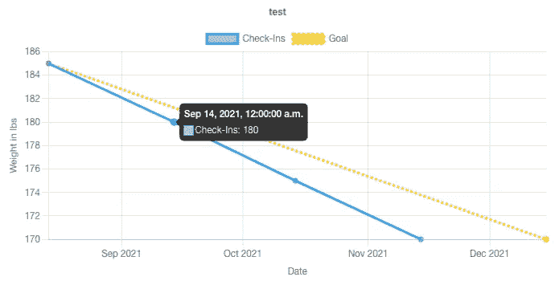
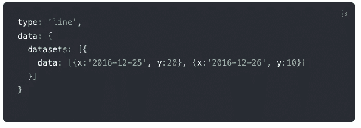

# 使用 Chart.js 和 React.js 创建响应式折线图，显示与目标相关的进度。

> 原文：<https://blog.devgenius.io/using-chart-js-with-react-to-create-a-line-chart-showing-progress-over-time-3e34377b1391?source=collection_archive---------2----------------------->



# 摘要

这篇文章描述了如何使用 React.js、 [Chart.js](https://www.chartjs.org/docs/latest/) 和 [react-chartjs-2](https://www.npmjs.com/package/react-chartjs-2) 创建一个类似于我在[可爱的营养减肥跟踪器](https://lovely-nutrition-weight-loss.herokuapp.com/)中创建的折线图。它从用户那里接受一组签入对象。每个对象都包括带有相关日期的数据(重量)。该数据沿时间笛卡尔 x 轴绘制。

类似这样的图表对于显示数据相对于预测或目标随时间的变化非常有用。它也有助于可视化两个或多个数据集之间的比较。

# 应用程序的描述

我将首先描述图表所在的应用程序，然后描述如何创建图表。

## 技术堆栈

它是一个 mono-repo 全栈应用程序，具有 Rails API 后端、Postgres 数据库和通过 Heroku 部署的 React.js 前端。

## 链接

下面是应用的链接:[可爱的营养减肥追踪器](https://lovely-nutrition-weight-loss.herokuapp.com/)

这里有一个[链接](https://github.com/jsnidar/lovely-nutrition-weight-loss)到 Github 上的回购。

## 用户体验

用户可以注册一个帐户，或者如果他们已经有一个帐户，他们可以登录到他们的帐户。一旦他们登录，用户可以创建一个签到，并输入他们的体重和日期。他们还可以创建带有开始日期、结束日期和目标权重的目标。当他们有一个签到和目标时，他们将在主屏幕上看到一个图表，在一个线形图上显示目标和他们朝着目标取得的进展。用户可以创建、编辑和删除目标和签入。

这里有一个[链接](https://watch.screencastify.com/v/W1fjBS6PIxBKOmXFbyQg)到用户体验的视频演示。

# 创建图表

## 安装依赖项

首先，我需要安装图表所需的库。我用的是 npm，但是你也可以用 CDN。

**如果您正在使用 Rails 创建一个 mono-repo 应用程序，您需要在安装这些依赖项之前将 cd 放入客户端文件夹，或者在每次安装一个依赖项时键入** `**--prefix client**` **(例如** `**npm install chart.js --prefix client**` **)。如果你有一个单独的后端和前端回购，那么你只需将它们安装在你的前端回购。**

**安装 Chart.js 和 react-chartjs-2**

`npm install --save react-chartjs-2 chart.js`

下面是**链接到**[**chart . js**](https://www.chartjs.org/docs/latest/getting-started/installation.html)**和**[**react-chart js-2**](https://www.npmjs.com/package/react-chartjs-2)**文档**。我建议至少在继续之前扫描它们。如果熟悉 **Bootstrap** 和**React****Bootstrap**的话，chart.js 和 react-chartjs-2 的交互方式是一样的。React-chartjs-2 使导入组件变得快速简单，但是要定制这些组件，您需要遵循 Chart.js 文档。

**安装**[**chart js-adapter-date-fns**](https://github.com/chartjs/chartjs-adapter-date-fns)**以便在 Chart.js.** 中使用一个 [**时间笛卡尔轴**](https://www.chartjs.org/docs/latest/axes/cartesian/time.html)

**`npm install date-fns chartjs-adapter-date-fns --save`**

**时间笛卡尔轴显示日期，因此数据之间的距离反映了两个数据点之间的时间。为了用 Chart.js 做到这一点，你需要一个日期库— [date-fns](https://date-fns.org/) —和它安装的适配器—[chart js-adapter-date-fns](https://github.com/chartjs/chartjs-adapter-date-fns)。另外，在浏览器中处理日期和时间时，date-fns 是一个非常好的资源。如果你以前没有这样做过，把他们的网站加入书签，当你这样做的时候再回去看看，你不会后悔的！**

## **导入依赖关系**

**现在我已经安装了我的依赖项，我创建了一个 GoalChart.js 文件，并将它们导入其中。**

```
import {
  Chart as ChartJS,
  registerables,
} from ‘chart.js’;
import { Line } from ‘react-chartjs-2’;
import ‘chartjs-adapter-date-fns’;
import {enGB} from ‘date-fns/locale’;
//this sets the display language. In the documentation it uses "de", which will display dates in German.
ChartJS.register(…registerables);
```

## **返回图表组件**

```
return(
  <Container className="border border-secondary">
    <Row>
      <Line
        options={options}
        data={data}
        style={{vh:50}}
        datasetIdKey="id"
      />
    </Row>
  </Container>
)
```

**Line 组件像其他 react 组件一样工作，但是它接受选项、数据和样式作为道具。它还可以接受一个用于区分数据集的`datasetIdKey`。**

## **时间笛卡尔轴的格式化图表选项**

**图表使用一个[选项对象](https://www.chartjs.org/docs/latest/general/options.html)来自定义图表选项。我将只讨论特定于时间笛卡尔轴的选项。为了使用时间笛卡尔轴，我需要定制对象`options.scales`中的 scales 关键点。`options.scales`应该是这样的:**

```
scales: {
  y: {
    title: {display: true, text: “Weight in lbs”}
  },
  x: {
    adapters: {
      date: {locale: enGB},
      type: “time”,
      distribution: “linear”,
      time: {
        parser: “yyyy-MM-dd”,
        unit: “month”
      },
      title: {
        display: true,
        text: “Date”
      }
    }
  }
},
```

**y 轴非常直。它将显示该轴的标题，该标题将是文本键处的字符串值。**

**`**options.scales.x.adapters**`**

**x 刻度需要一个以这种方式格式化的 adapters 对象来使用时间笛卡尔轴。这是我用来设置它的文档。每个键上都有几个选项可供选择。以下是解释一些重要密钥的信息:**

*   **`adapters.date.locale`设置日期显示的语言。在[文档](https://github.com/chartjs/chartjs-adapter-date-fns#locale-support-via-scale-options)中，他们使用`locale: de`将日期语言设置为德语。我想要英语，所以我把它改成了`enGB`。**
*   **`adapters.time`设置日期显示时的格式。**
*   **`adapters.time.parser`可以定制，并遵循日期-fns 文档中的[解析参数。](https://date-fns.org/v2.28.0/docs/parse)**

## **格式化数据对象**

**数据对象包含一个键`datasets`，它保存一个数据集对象数组。**

```
const data = {
  datasets: [
    {
      label: ‘Check-Ins’,
      data: goalCheckIns,
      borderColor: ‘rgb(53, 162, 235)’,
      backgroundColor: ‘rgba(53, 162, 235, 0.5)’,
      showLine: true
    },
    {
      label: ‘Goal’,
      data: [
        {x: startDate, y: currentWeight}, 
        {x: endDate, y: currentGoal.goal_weight}
      ],
      borderColor: ‘#FFCE0E’,
      backgroundColor: ‘#FFCE0E’,
      borderDash: [3]
    }
  ],
};
```

**每个数据集对象都有一个`label`键，Chart.js 用它来区分数据集，类似于 React 使用的`key`属性。`data`键保存一个数据对象数组。其他键提供样式信息，如`borderColor`。**

**涉及日期的数据需要遵循以下格式:**

****

**[https://www . chart js . org/docs/latest/general/data-structures . html # object](https://www.chartjs.org/docs/latest/general/data-structures.html#object)**

**`x`包含此格式的日期字符串，而`y`包含为该日期绘制的值。在我的项目中，`x`是用户签到的日期，`y`是他们的体重。**

# **JavaScript 日期问题**

**这种数据格式的问题是，根据您加载页面的时间，日期会以不同的方式显示，通常会相差一天。这是因为您需要考虑浏览器加载的时间。**

## **将日期字符串转换为日期对象以控制时间**

**我重新格式化了代码，将每个日期字符串转换成一个日期对象。从数据库获取的日期数据以字符串形式出现(例如“2021–12–14”代表 2021 年 12 月 24 日)。当我以这种格式在图表中输入数据时，它并不准确，因为它将包括数据加载到组件中的时间。**

**我通过调试发现，如果我使用这个语法`new Date(year, monthIndex, day)`使用 [Date()构造函数](https://developer.mozilla.org/en-US/docs/Web/JavaScript/Reference/Global_Objects/Date/Date)，它解决了这个问题(例如。`new Date(2021, 11, 24)`)。注意:月份是零索引的，所以 11 是第 12 个月。由于没有输入小于天的时间单位，因此每个时间被设置为上午 12:00。这样，当我加载数据时，时间会保持不变。**

**我想让我的代码保持干燥，所以我在 App.js 中声明了这些变量，并将它们作为道具发送到 GoalChart.js。**

```
const year = (date) => date.slice(0,4)
const month = (date) => parseInt(date.slice(5,7)) - 1
const day = (date) => date.slice(8,10)
```

**对于`month`,我需要将它转换成一个整数并减去 1，因为月份的索引是 0。**

## **按日期对象排序**

**我通过按日期对用户的目标数组进行排序并选择数组中的最后一个目标来选择当前目标。**

```
const currentGoal = currentUser.goals.sort(function(a,b){
  return new Date(
    year(a.goal_end_date),
    month(a.goal_end_date),
    day(a.goal_end_date)
  ) - new Date(
    year(b.goal_end_date),
    month(b.goal_end_date),
    day(b.goal_end_date)  
  );
})[currentUser.goals.length -1]
```

**然后，我将开始日期和结束日期保存到变量中。**

```
const startDate = new Date(
  year(currentGoal.goal_start_date),
  month(currentGoal.goal_start_date),
  day(currentGoal.goal_start_date)
)const endDate = new Date(
  year(currentGoal.goal_end_date),
  month(currentGoal.goal_end_date),
  day(currentGoal.goal_end_date)
)
```

**我用这些日期作为虚线目标趋势线的数据点。**

```
{
  label: ‘Goal’,
  data: [
    {x: startDate, y: currentWeight}, 
    {x: endDate, y: currentGoal.goal_weight}
  ],
  borderColor: ‘#FFCE0E’,
  backgroundColor: ‘#FFCE0E’,
  borderDash: [3]
}
```

## **比较日期对象**

**当在 sort 方法之外比较两个 date 对象时，我试图使用这个逻辑，但它不起作用。所以经过一些搜索和调试，我决定使用 [valueOf()方法](https://developer.mozilla.org/en-US/docs/Web/JavaScript/Reference/Global_Objects/Date/valueOf)。**

**在后端，我没有创建一个连接表来关联签到和目标。我想保持灵活性，因为多个目标可以同时进行。**

**因此，我使用当前目标的日期范围来确定哪些签到符合目标。我声明了`goalCheckIns`，并使用 forEach 将一个对象`{x: checkIn.date, y: checkIn.weight}`推入数组。**

```
let goalCheckIns = []
currentUser.check_ins.forEach(checkIn => {
  const checkInDate = new Date(
    year(checkIn.date),
    month(checkIn.date),
    day(checkIn.date)
  )
  if(
    checkInDate.valueOf() >= startDate.valueOf() &&
    checkInDate.valueOf() <= endDate.valueOf()
  ){
    goalCheckIns.push({x: checkIn.date, y: checkIn.weight})
  }
})
```

**然后，我把它们按日期分类。**

```
goalCheckIns = goalCheckIns.sort(function(a,b){
  return new Date(a.x.valueOf()) - new Date(b.x.valueOf());
})
```

**现在，图表完全正常，并显示了与目标相关的正确日期！**

# **结论**

**使用这些方法，我能够绘制一个在时间笛卡尔轴上有两条线的折线图。我希望这篇教程也能帮助你做到这一点！**