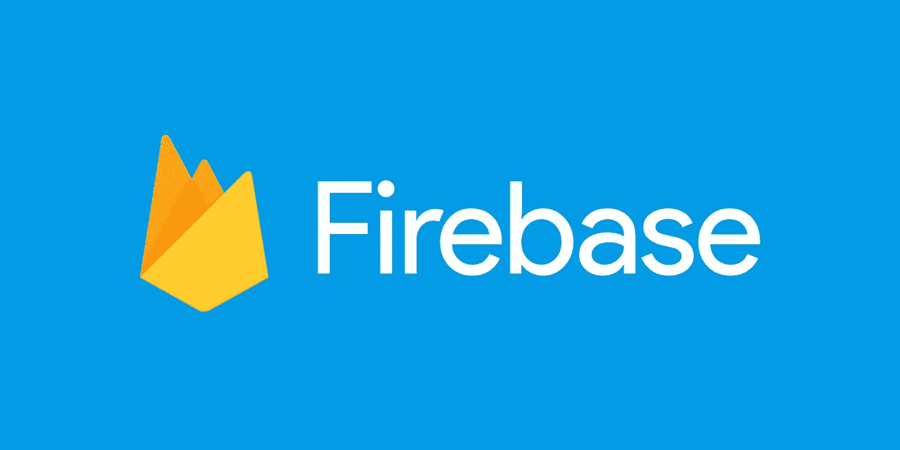
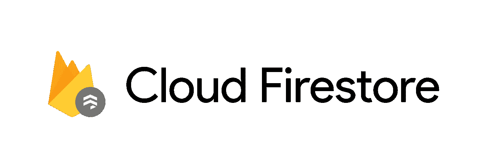
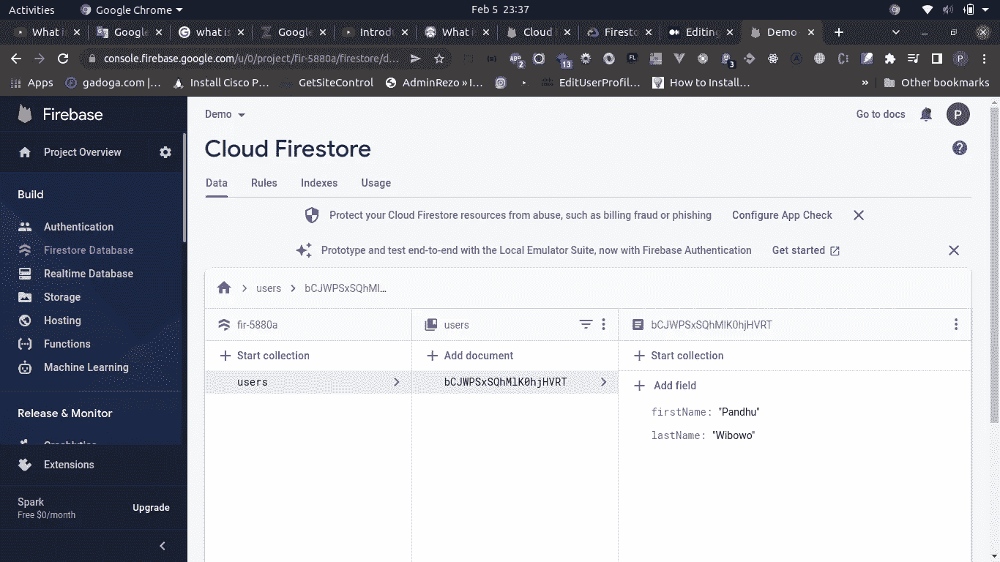
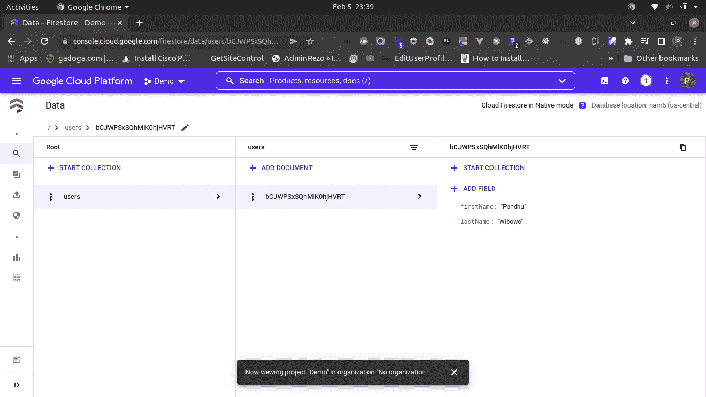

# 使用云 Firestore 作为您的 NoSQL 数据库来支持您的业务|第 1 部分

> 原文：<https://blog.devgenius.io/using-cloud-firestore-as-your-nosql-database-to-supports-your-business-part-1-c18347d4086a?source=collection_archive---------9----------------------->

## 介绍 Firebase Firestore

照片由 [Unsplash](https://unsplash.com?utm_source=medium&utm_medium=referral) 上的 sanga Rima Roman Selia 拍摄

大家好！我叫潘杜，是一名软件工程师。欢迎来到我的博客。今天，你将了解 **Firestore，**NoSQL 数据库之一。

# NoSQL

[https://encrypted-tbn0.gstatic.com/images?q = tbn:and 9 GCT C1 w 34 nruylve 8 z 45mg 5 yr jav 8 ztd 8 yngra&usqp = CAU](https://encrypted-tbn0.gstatic.com/images?q=tbn:ANd9GcTC1W34nruYLvE8Z45mg5YrJaV8TZTD8YNgRA&usqp=CAU)

NoSQL 数据库(也称为不仅是 SQL)将数据存储在文档中，而不是关系数据库中。

> 根据 Couchbase，NoSQL 数据库的类型包括纯文档数据库、键值存储、宽列数据库和图形数据库。NoSQL 数据库是从头开始构建的，用于存储和处理大规模的大量数据，并支持越来越多的现代企业。

在 NoSQL 你可以找到很多类型。到目前为止，我只使用了两种类型，它们是文档数据库和键值存储。我希望有一天能在我的真实项目中学习和使用它们。**希望是**。

> 其目的是构建特定的数据模型，并为构建现代应用程序提供灵活的模式。

好了，关于介绍，你可以在网上深入搜索，现在进入主题。

# 重火力点

firebase.google.com

Firebase 是谷歌云平台的一部分。它向我们提供了许多消费我们所需要的东西。他们的服务是，

# 建设

*   证明
*   实时数据库
*   Firestore
*   云函数
*   机器学习
*   储存；储备
*   主办；主持

# 发布和监控

*   碰撞分析
*   表演
*   测试实验室
*   应用分发

# 分析学

*   仪表盘
*   实时的
*   事件
*   转换策略
*   观众
*   自定义定义
*   调试视图等

# 从事

*   预言
*   A/B 测试
*   云消息传递
*   应用内消息
*   远程配置
*   动态链接
*   和 AdMob

这一次，我会弄清楚关于**云**火店**火店**的事情。

# 什么是**云火店**？

> 据[cloud.google.com](https://cloud.google.com/firestore/docs#:~:text=Firestore%20is%20a%20NoSQL%20document,describes%20relationships%20between%20data%20objects.)介绍，Firestore 是一个 NoSQL 文档数据库，具有自动缩放、高性能和易于应用程序开发的特点。虽然 Firestore 界面具有许多与传统数据库相同的功能，但作为 NoSQL 数据库，它在描述数据对象之间关系的方式上与传统数据库不同
> 
> 在[firebase.google.com](https://firebase.google.com/docs/firestore)也支持云 Firestore 是一个灵活的、可扩展的数据库，用于 Firebase 和 Google Cloud 的移动、web 和服务器开发。像 Firebase 实时数据库一样，它通过实时监听器使您的数据在客户端应用程序之间保持同步，并为移动和 web 提供离线支持，因此您可以构建响应迅速的应用程序，无论网络延迟或互联网连接如何。Cloud Firestore 还提供与其他 Firebase 和谷歌云产品的无缝集成，包括云功能。

首先，云 Firestore 又名 Firebase Firestore 是谷歌云 Firebase 或谷歌 Firebase 的一部分。云火石是 NoSQL 的数据库。比如 MongoDB，AWS 中的 DynamoDB 等等。在 Firestore 向公众展示之前，我们首先知道实时数据库，即使现在它实际上仍然在 Firebase 部分。如果你显示文件结构，实时数据库有像树一样的结构，对我来说很难理解，我认为，在我看来我不推荐你把它用于主数据库。

我不记得 Cloud Firestore 显示的是什么时间，但我记得 Cloud Firestore 在很长一段时间后推出了实时数据库。

云 Firestore 有一个非常容易理解的界面，也很容易维护。与实时数据库(键值数据库)相比，它是非常不同的。

https://www.youtube.com/watch?v=v_hR4K4auoQ&list = PLl-k 7 zzesyllug 5 mcvezzaq 7 acsbcuzgz

到目前为止，我已经使用云 Firestore 近 3 年了，到目前为止一切顺利。它有非常棒的文档，对我来说非常可读。他们也有 Slack 社区在你有困难的时候支持你。云 Firestore 支持索引查询。这意味着您可以在单个查询中排序、组合和创建过滤函数。此外，所有文档和集合都使用前面讨论过的 ACID 事务。

【https://www.youtube.com/watch?v=QcsAb2RR52c 

Cloud Firestore 是一个完全托管的 NoSQL 文档数据库，建立在 Google 云平台之上，具有高可靠性和高性能。你可以直接在 Firebase 控制台中打开，也可以在 Google 控制台中打开。他们两个都可以访问它。

我将向你展示其中的一些。

## 消防基地控制台

## GCP 控制台

如果你在 Firebase 控制台上使用它，而不是在 GCP 控制台上，那就非常简单了。但是如果你想要完整的功能，请使用 GCP 控制台。

我想这就够了，我把它分成几个部分，请继续关注我的下一篇博客，好吗？希望你理解，对你有用。谢谢你访问我的博客。

# 警惕！

如果你们来自印度尼西亚，想要支持我写更多的东西，希望你们能从钱包里拿出一点来。你可以通过一些方式分享你的天赋，

# 萨韦里亚

https://saweria.co/pandhuwibowo

# 特拉克特尔

【https://trakteer.id/goodpeopletogivemoney 

# 多读我的文章

 [## 用 JavaScript 理解堆栈算法

### 用一个简单的例子为初学者解释了堆栈数据结构。

javascript.plainenglish.io](https://javascript.plainenglish.io/understand-the-stack-algorithm-with-javascript-33905ec11137)  [## 错误:过时的 postmaster.pid 文件 di Mac OS

### 你好，泰曼，我是大唐博客的萨拉马特。这是我第一次看到处理错误…

pandhuwibowo.medium.com](https://pandhuwibowo.medium.com/error-stale-postmaster-pid-file-di-mac-os-5927039925e0)  [## Git 备忘单—第 4 部分

### 哈洛泰曼-泰曼塞拉马特大唐迪博客。我知道你会把小抄扔给饭桶。呸。

medium.com](https://medium.com/easyread/git-cheat-sheet-part-4-59749c7abd85)  [## Git 备忘单—第 5 部分

### 哈洛泰曼-泰曼塞拉马特大唐迪博客。我知道你会把小抄扔给饭桶。呸。

medium.com](https://medium.com/easyread/git-cheat-sheet-part-5-4f6e9da9559f)  [## 作曲家？

### 哈洛特曼-特曼，塞拉马特大唐迪博客萨亚。首先，我要说的是，我的名字叫 Pandhu，我的名字叫……

medium.com](https://medium.com/easyread/composer-acc9b27764b9) 

# 参考

 [## NoSQL 数据库

### 为了帮助你更好地了解 NoSQL，这一页包括:NoSQL 数据库存储数据在文件中，而不是关系…

www.couchbase.com](https://www.couchbase.com/resources/why-nosql)  [## 什么是 NoSQL？|非关系数据库，灵活的模式数据模型| AWS

### 具有灵活数据模型的高性能、非关系数据库 NoSQL 数据库是专为特定数据构建的…

aws.amazon.com](https://aws.amazon.com/nosql/)  [## 什么是 NoSQL？NoSQL 数据库解释道

### 随着存储成本的快速降低，应用程序需要存储和查询的数据量增加了。这个数据…

www.mongodb.com](https://www.mongodb.com/nosql-explained)  [## 云 Firestore | Firebase 文档

### 使用我们灵活、可扩展的 NoSQL 云数据库，为客户端和服务器端开发存储和同步数据。云…

firebase.google.com](https://firebase.google.com/docs/firestore)  [## 云 Firestore | Firebase 文档

### 使用我们灵活、可扩展的 NoSQL 云数据库，为客户端和服务器端开发存储和同步数据。云…

firebase.google.com](https://firebase.google.com/docs/firestore) 

https://cloud . Google . com/Firestore/docs #:~:text = Firestore % 20 is % 20a % 20 no SQL % 20 文档，描述% 20data %对象之间的% 20 关系。

 [## 什么是云 Firestore？

### 支持高性能 web 或移动应用程序的功能之一是健壮的数据库。一个优秀的…

blog.back4app.com](https://blog.back4app.com/what-is-cloud-firestore/#What_is_Cloud_Firestore)  [## 谷歌云 Firestore: 5 个关键特征，将使其成为您的首选数据库。

### 谷歌 Android 生态系统中的关键工具之一 Firebase 平台推出了谷歌云 Firestore-一个 NoSQL…

www.zerone-consulting.com](https://www.zerone-consulting.com/google-cloud-firestore-5-key-features-you-should-know/)