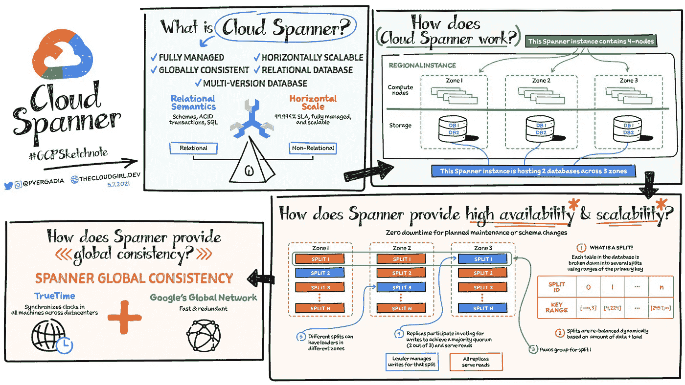
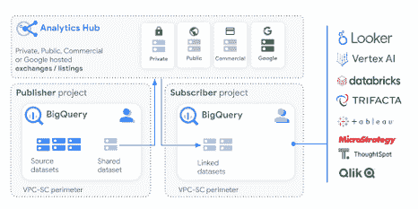
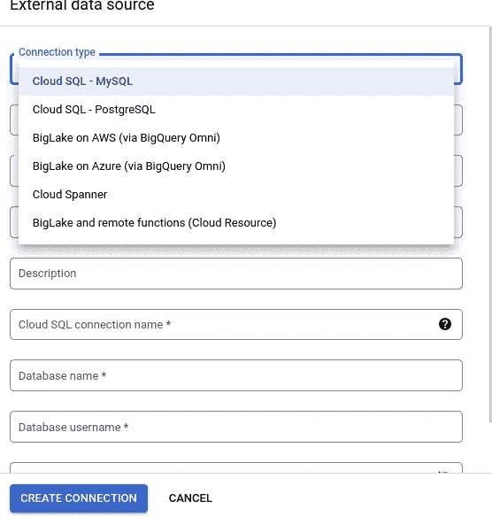

# 在 BigQuery 中使用云扳手联邦查询

> 原文：<https://blog.devgenius.io/using-cloud-spanner-federated-queries-in-bigquery-740a42ab94ed?source=collection_archive---------8----------------------->

## 谷歌刚刚整合了 Cloud Spannner 和 BigQuery

马特·阿特兹在 [Unsplash](https://unsplash.com/s/photos/spanner?utm_source=unsplash&utm_medium=referral&utm_content=creditCopyText) 上拍摄的照片

最近我写了一篇[文章，关于谷歌如何将 BigQuery 越来越多地构建成一种大数据分析形式](https://medium.com/p/a07563414fdf)。随着 BigTable、BigLake 和 Analytics Hubs 的集成，BigQuery 作为 SaaS 变得更加强大，今天接下来的好消息是关于 BigQuery 和 Cloud Spanner 的。

Spanner 是一个来自 Google 的全球分布式 NewSQL 数据库，您可以在 Google 云平台中使用。Google Spanner 是 Google 的 BigTable 和 MegaStore 数据库的继承者[1][2]。

什么是谷歌云扳手—图片来源:[谷歌](https://cloud.google.com/blog/topics/developers-practitioners/what-cloud-spanner) [3]

现在，谷歌宣布，对于 Cloud Spanner，它也可以让 BigQuery 实时查询驻留在 Spanner 中的数据，而无需复制或移动数据。遵循相同的零 ETL 方法，他们刚刚宣布了 BigTable，并与 Google BigLake 集成。什么给你同样的好处，并克服传统的 ETL 方法的一些缺点。比如:

*   更高的数据新鲜度(最新的业务洞察，而不是几小时甚至几天前的数据)。
*   不用为存储相同的数据支付两次费用(客户通常在 BigTable 中存储太字节甚至更多)。
*   减少对 ETL 管道的监控和维护。

这意味着，作为一名数据科学家或分析师，你可以通过 SQL 直接访问平台内甚至跨平台(如 AWS 和 Azure)的许多其他(大)数据工具，并通过 SQL 直接实时查询它们。当然，有趣的是与 Google Data Studio 的直接集成，这也允许来自企业的用户访问。Google Analytic Hub 帮助您进行良好的数据治理，并且只将数据分发给合适的人。

Google Analytics Hub 建立在 BigQuery 和 BigQuery 数据集的发布和订阅模型之上。

分析中心的架构——来源:[谷歌](https://cloud.google.com/analytics-hub#section-7) [4]

要通过 BigQuery SQL 查询数据以及来自其他外部源的数据，您需要添加一个外部数据源。

将云浏览器添加为外部来源—图片由作者提供

所以正如我所说，好消息是 BigQuery 越来越成为一个跨平台的分析软件，在最近几周堆积起来，你可以对谷歌在不久的将来会呈现什么保持好奇。

如果你像我一样经常使用 GCP 和 BigQuery，你可能也会对这些文章和新功能感兴趣:

*   [BigQuery 现在支持查询队列](https://medium.com/p/378a65fdc9c1)
*   [使用 Google BigQuery 中的 Load Data 语句](https://medium.com/p/ca40a30fd05d)
*   [谷歌提高其数据仓库 BigQuery 的数据安全性](https://medium.com/p/817191ddc636)
*   [谷歌的三大公告](https://medium.com/p/c0363d303632)

## 资料来源和进一步阅读

[1]谷歌研究，[扳手](https://research.google.com/archive/spanner.html) (2022)

[2]埃里克·拉森，[谷歌的扳手:可以扫描地球的数据库技术](http://mashable.com/2012/09/21/google-spanner/) (2017)

[3]谷歌，[什么是谷歌云扳手](https://cloud.google.com/blog/topics/developers-practitioners/what-cloud-spanner) (2022)

[4]谷歌，[分析中心](https://cloud.google.com/analytics-hub#section-7) (2022 年)