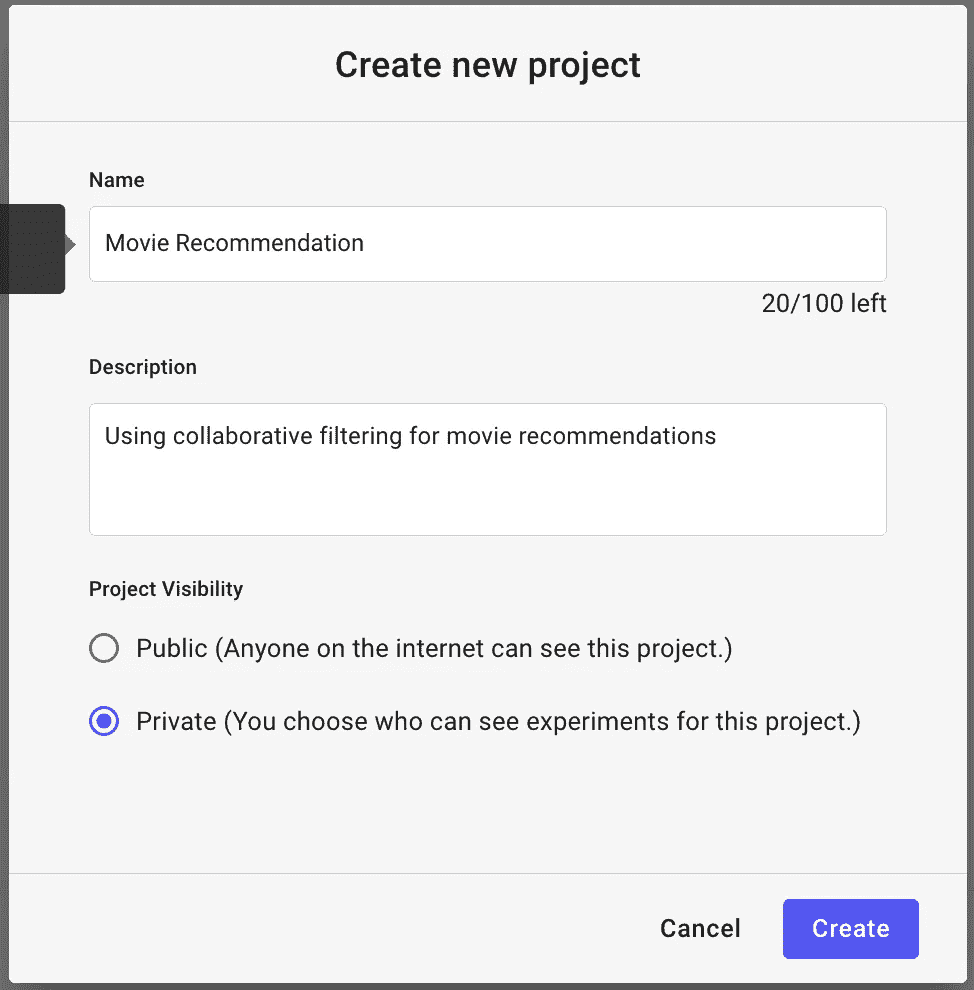
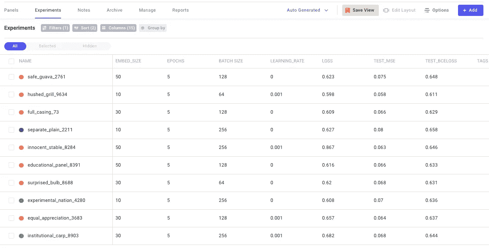
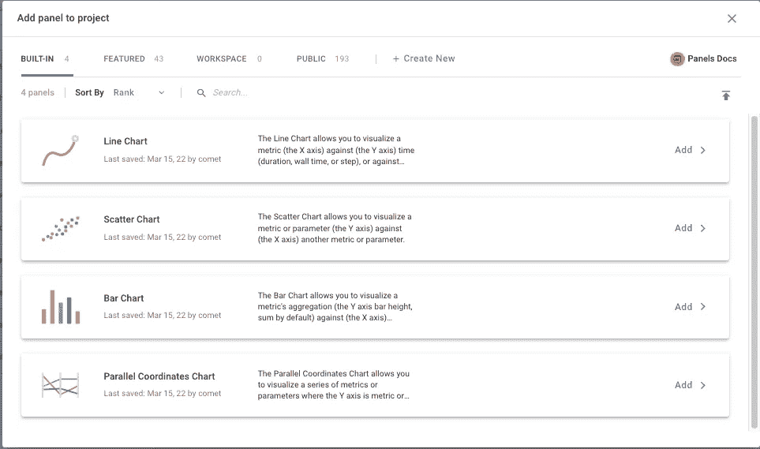
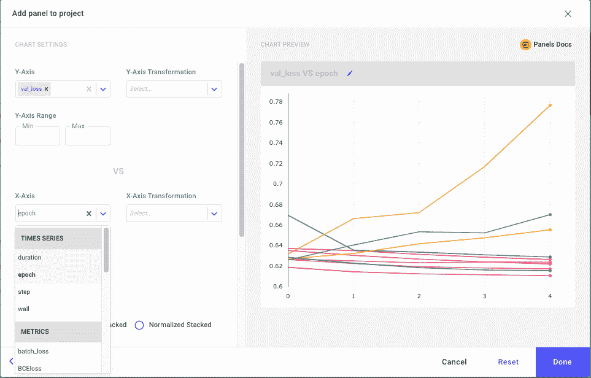
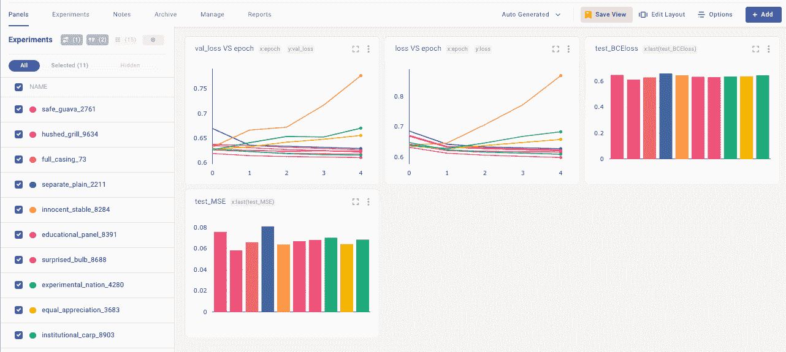
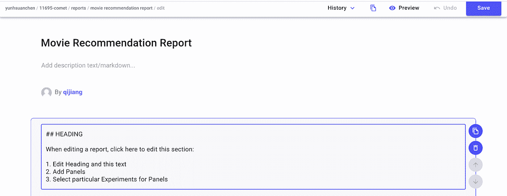
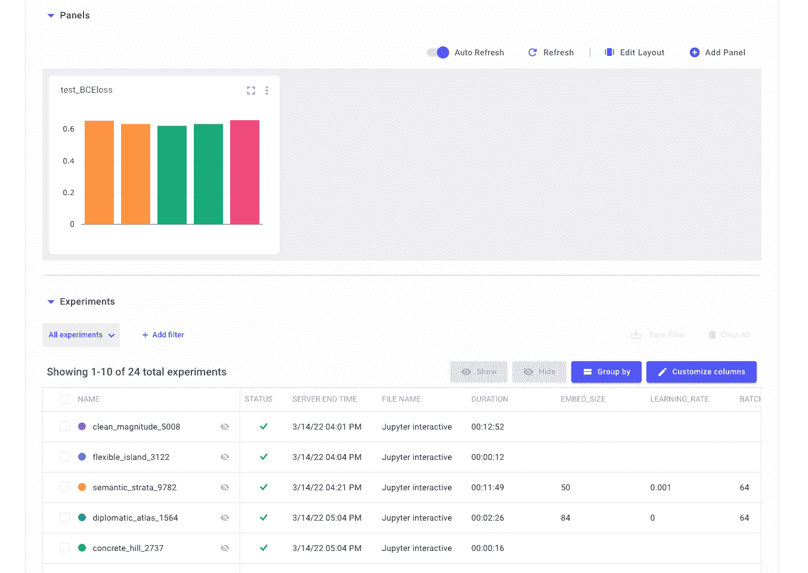
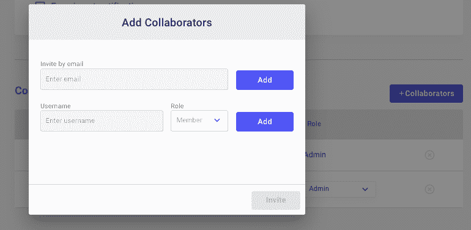
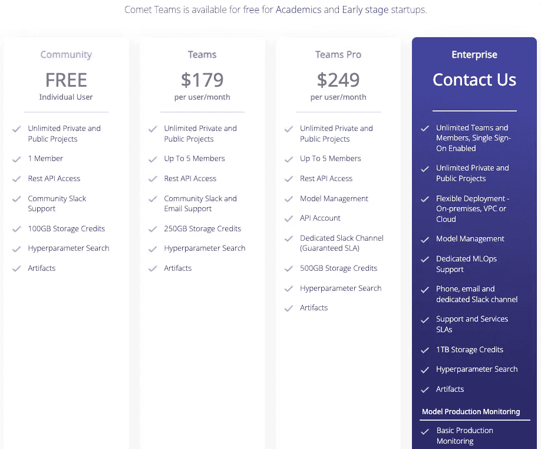

# 在电影推荐场景中使用 Comet.ml

> 原文：<https://blog.devgenius.io/using-comet-ml-in-movie-recommendation-scenario-23f012c52c04?source=collection_archive---------8----------------------->

作者:诺埃尔·陈，齐江


# 概观

现在，在我们的日常系统中有一个机器学习组件是很常见的。拥有一个平台来跟踪数据集、实验历史和代码更改对于数据科学家和机器学习工程师来说至关重要，以便高效地跟踪他们的工作。Comet.ml 是一个涵盖所有这些并提供可视化和团队协作的平台。

在本文中，我们将介绍

*   Comet.ml 是什么？
*   在电影推荐场景中使用 Comet.ml
*   功能 1:日志记录
*   特性 2:优化器
*   特点 3:可视化
*   功能 4:报告
*   功能 5:工作区共享
*   Comet.ml 的定价
*   Comet.ml 的优势和局限性

我们还在这个 [Google Colab 链接](https://colab.research.google.com/drive/1pzP-3cPPJML5z2UlTd27EBfG4ategK9J?usp=sharing)中提供了一个实践练习，你可以跟着做！

# Comet.ml 是什么？

Comet.ml 提供了一个自托管和基于云的元机器学习平台，可以轻松管理、跟踪和优化实验和模型，被数据科学家和企业广泛使用。建立机器学习模型通常需要大量不同模型结构和超参数的实验，在生产中，监控输入数据和机器学习系统至关重要。此外，可视化也是数据分析和模型优化的有力工具。Comet.ml 提供了用户友好的工具来解决这些问题，包括 Comet 工件、Comet 模型生产监控和 Comet 面板。

Comet 工件使您能够将您的实验构建为多级管道或有向无环图，因此中间结果可以按照预定义的方式重用、跟踪、版本化和分析。工件还通过跟踪数据集和模型的版本来实现复杂场景下的实验跟踪和再现。在将模型部署到生产中之后，检测输入数据的漂移或变化以及监控模型的工作方式是非常重要的，因此 Comet 模型生产监控提供了对模型性能的实时跟踪，包括准确性、预测数量、错误报告等。此外，Comet Panel 是一个动态的、灵活的和可重用的可视化平台，支持定制的 GUI 和 JS/HTML/CSS 生态系统。也有各种图形模板可用。

Comet 提供多种语言和框架的库，如 Python、Keras、Tensorflow、PyTorch 等。，所以您的实验代码只需几行代码就可以连接到 Comet central panel。它还通过在团队中共享实验信息和提供用户管理使团队合作变得更加容易。现在让我们通过一个简单的例子来了解 Comet.ml。

# 在电影推荐场景中使用 Comet.ml

当我们想要试验多个参数并找到最佳模型时，Comet.ml 非常有用。这里我们将使用一个电影推荐场景来演示 Comet.ml 的有用性。

# 数据

我们使用的数据是从一个流中收集的，该流包含关于哪个用户观看了哪个电影以及他们给该电影的评级的信息。格式为<timestamp>、<user id="">、<movie id="">、<rating>。条目示例如下所示</rating></movie></user></timestamp>

```
2021-12-16 14:52:44, 461360, the+muppet+movie+1979, 2
```

# 记录

为了让 Comet.ml 记录实验结果，只需要添加几行代码。

## 步骤 1:在 Comet.ml 上创建项目

在向代码中添加任何东西之前，最关键的一步是注册一个 Comet.ml 帐户(如果你是学生，想使用团队协作功能，记得用你学校的邮箱注册，因为它是免费的🤩).注册后，点击“+新建项目”，创建一个项目。您可以将项目可见性设置为公共或私有。



## 步骤 2:安装并导入 Comet.ml

现在让我们给我们的代码增加一些活力。用安装 Comet.ml

```
pip3 install comet_ml
```

然后通过添加以下内容来导入模块

```
import comet_ml
```

## 步骤 3:设置 Comet API 密钥

我们需要设置一个名为`COMET_API_KEY`的环境变量来验证我们自己。要获取您的 API 密钥，请在 Comet.ml 的右上角点击您的用户帐户，然后找到“开发者信息”。在这里，您可以点击“API 密钥”将您的密钥复制到剪贴板。现在，我们可以通过以下方式在笔记本中设置环境变量

```
os.environ['COMET_API_KEY'] = '<YOUR-API-KEY>'
```

或者，如果你不像我们一样使用 Google Colab/Jupyter 笔记本，你也可以使用

```
export COMET_API_KEY=”<YOUR-API-KEY>”
```

## 步骤 4:创建一个实验

根据 Comet.ml 的文档，实验被定义为

> 一个可测量的研究单位，用一些数据/参数/代码/结果定义一次运行。

我们可以用这 3 行代码创建一个普通的实验:

```
experiment = comet_ml.Experiment( project_name="movie-recommendation", workspace="<YOUR-WORKSPACE>")
```

## 步骤 5:记录参数和指标

现在我们已经声明了实验变量，我们可以记录保存在 Comet.ml 中的数据。Comet.ml 还提供了许多用户可以登录的其他选项，你可以在[这里](https://www.comet.ml/docs/python-sdk/Experiment/)查看它们。在我们的场景中，我们希望记录我们的模型参数。

```
batch_size = 64epochs = 5EMBEDDING_SIZE = 50learning_rate = 0.001params={ "batch_size":batch_size, "epochs":epochs, "embed_size":EMBEDDING_SIZE, "optimizer":"Adam", "learning_rate":learning_rate, "loss":"BinaryCrossentropy",}experiment.log_parameters(params)
```

当我们完成一个实验时，我们还想记录我们的二元交叉熵损失(BCEloss)和均方误差(mse)。

```
BCEloss = model.evaluate(x_val, y_val)y_pred = np.squeeze(model.predict(x_val))mse = MSE(y_pred, y_val)metrics = { 'BCEloss':BCEloss, 'MSE':mse,}experiment.log_metrics(metrics)
```

## 第六步:完成实验

在 Jupyter 中，我们需要指出一个实验已经完成

```
experiment.end()
```

# 【计算机】优化程序

Comet.ml 提供了一个名为`Optimizer`的非常有用的类，我们可以用它来找到最小化/最大化指标的最佳超参数集。优化器将对下一步尝试什么超参数提出建议。

对于我们的电影推荐场景，我们希望搜索最佳的嵌入大小、学习速率和批量大小组合。我们可以这样定义我们的优化

```
config = { "algorithm": "bayes", "name": "Optimize Recommendation Network", "spec": {"maxCombo": 10, "objective": "minimize", "metric": "loss"}, "parameters": { "embed_size": {"type": "discrete", "values": [10, 30, 50]}, "learning_rate": {"type": "discrete", "values": [0.001, 0.0005, 0.0001]}, "batch_size": {"type": "discrete", "values": [64, 128, 256]},}, "trials": 1,}opt = comet_ml.Optimizer(config)
```

这里我们只使用所有参数中的离散值作为我们的搜索空间。包括“离散”在内，Optimizer 提供了四种参数:“整数”、“双精度”或“浮点”、“离散”(对于数字列表)和“分类”(对于字符串列表)。细节可以在 Comet.ml 文档中的这里找到[。](https://www.comet.ml/docs/python-sdk/introduction-optimizer/#specifying-optimizer-parameters)

现在，我们只需要从优化器中获取实验数据，并训练不同的模型:

```
for experiment in opt.get_experiments(project_name="11695-comet"): epochs = 5 batch_size = experiment.get_parameter("batch_size") EMBEDDING_SIZE = experiment.get_parameter("embed_size") learning_rate = experiment.get_parameter("learning_rate") model = build_model(experiment) train(experiment, model, x_train, y_train, x_val, y_val) evaluate(experiment, model, x_val, y_val) experiment.end()
```

我们的示例代码在这个 [Google Colab 链接](https://colab.research.google.com/drive/1pzP-3cPPJML5z2UlTd27EBfG4ategK9J?usp=sharing)中🔗(没有提供数据集，但是可以自己轻松创建！)

# 形象化

在运行实验并发送所有日志之后，我们可以在 Comet.ml 中查看它。

首先，我们可以点击工作区下的“实验”。在这里，我们可以找到我们刚刚用优化器运行的所有实验。所有的参数都已经成功地记录在 Comet.ml 中，有了这个接口，我们可以很容易地比较所有的参数值，并看到它们各自的 MSE(这是我们的度量)。



我们还可以进入“面板”并创建非常丰富多彩的图表📊。要创建一个图表(他们称之为“面板”)，我们可以点击右上角的“+add”并选择“New Panel”。

Comet.ml 提供了四种内置图表:折线图、散点图、条形图和平行坐标图。



选择要绘制的图表，然后单击“添加”。设置标题，x 轴，y 轴。



点击“完成”，你可以在你的面板上看到它！根据这个条形图，我们可以很容易地找到 MSE 得分最低的实验，并找到我们的最佳参数集。



# 报告

在 Comet.ml 面板中，我们还可以创建实验报告，根据您的设置，您的队友或公众可以看到该报告。点击“报告”,然后点击“新建报告”,将会提供一个报告模板，您可以在其中添加文本、图形和表格，这些图形和表格可以直接从选定的实验中生成。



# 工作区共享

Comet.ml 通过向您的工作区添加协作者来支持团队协作。(对我来说，在学校进行小组项目时非常方便)。点击顶部横幅上的用户名，然后进入“设置”。向下滚动找到合作者部分，您可以点击“+合作者”



# 定价

1.  **社区:**免费(无团队 collaboration🥲)
2.  **团队:** $179 每个用户/月
3.  **Teams Pro:**$ 249/用户/月
4.  **学术:**免费(有和团队一样的功能！)



[Comet.ml 定价](https://www.comet.ml/site/pricing/)

# 强项

*   Comet.ml 带有**用户管理**特性，允许团队内部共享项目
*   Comet.ml 使**能够轻松集成**多种编程语言和框架
*   它的**可视化** UI 提供了不同实验的可视化比较，包括代码、超参数、度量等。它还可以可视化视觉、音频、文本和表格数据的输入数据。

# 限制

*   Comet.ml 不支持许多可视化技术，如度量图表平滑和步骤/时期滑块，后者支持步骤/时期之间的比较。
*   Comet.ml 使用**固定价格**而不是基于使用的价格，这不提供根据实验数量进行扩展的灵活性。

# 结论

Comet.ml 是生产中机器学习的强大工具。它可以轻松集成多种编程语言和框架、流水线实验、动态可视化以及团队内的项目共享和管理。然而，没有一种工具是完美的。Comet.ml 在定价和可视化选项上也有限制。我们还提供了在电影推荐数据上应用 Comet.ml 的实践，让您体验一下这个工具。

希望你喜欢这个博客，和 Comet.ml 玩得开心！😊

# 参考和链接

*   [https://www.comet.ml/docs/python-sdk/keras/](https://www.comet.ml/docs/python-sdk/keras/)
*   [https://www . comet . ml/docs/python-SDK/introduction-optimizer/# optimizer](https://www.comet.ml/docs/python-sdk/introduction-optimizer/#optimizer)
*   [https://www.comet.ml/site/announcing-comet-artifacts/](https://www.comet.ml/site/announcing-comet-artifacts/)
*   [https://www . comet . ml/site/introducing-comet-MPM-model-production-monitoring/](https://www.comet.ml/site/introducing-comet-mpm-model-production-monitoring/)
*   [https://www . comet . ml/site/introducing-panels-custom-visualizations-for-machine-learning/](https://www.comet.ml/site/introducing-panels-custom-visualizations-for-machine-learning/)
*   [https://neptune.ai/blog/the-best-comet-ml-alternatives](https://neptune.ai/blog/the-best-comet-ml-alternatives)