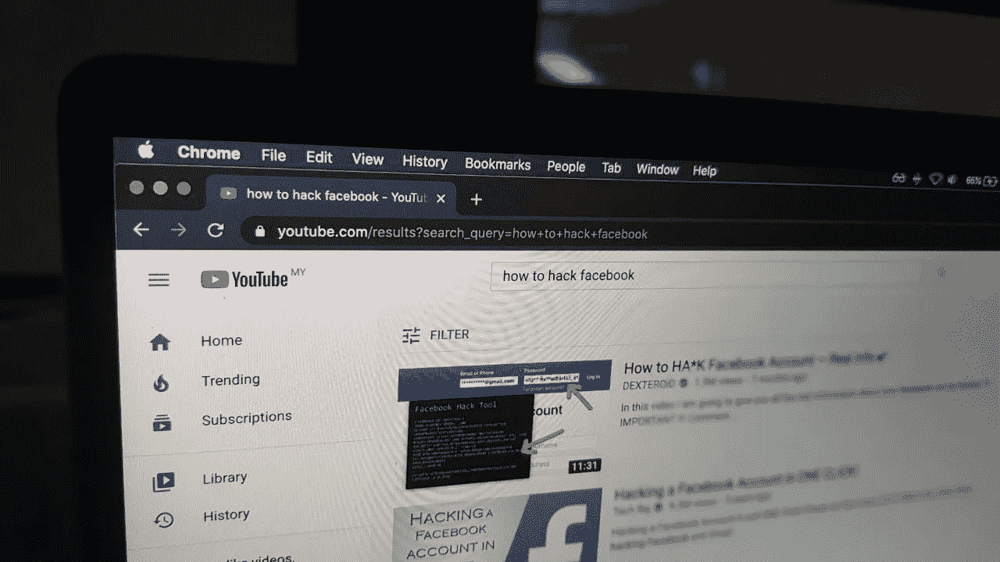

# 使用命令行，从 YouTube 中提取一个视频剪辑

> 原文：<https://blog.devgenius.io/using-command-line-extract-a-video-clip-from-youtube-398118adf747?source=collection_archive---------6----------------------->

从 YouTube 下载和提取视频剪辑的 shell 脚本。



你还想黑脸书吗？祝你好运——照片由[苏莱曼](https://medium.com/u/123f1163cb22?source=post_page-----398118adf747--------------------------------)拍摄

我因为各种原因几乎每天都在 [**YouTube**](https://youtube.com) 上看视频，从学习到娱乐。有时我想存储或共享视频的特定部分。我经常发现自己选择在线 YouTube 下载者，然后我搜索另一个在线资源来修剪/删除我需要的部分。

这个过程可能很烦人，尽管那些第三方(YouTube 下载器、视频微调器)网站充斥着广告(有时非常尴尬……)和可疑的弹出窗口。如果不小心的话，你可能会在下载你的视频剪辑的同时下载一个 [*恶意软件*](https://us.norton.com/internetsecurity-malware.html) *或* [*间谍软件*](https://us.norton.com/internetsecurity-how-to-catch-spyware-before-it-snags-you.html) 或其他恶意内容。

> “每天都有越来越多的黑客滋生，越来越多才华横溢的头脑正在变成黑客。安全进步了，但黑客也进步了。”
> 
> **迈克尔妖 Calce**

像许多 [*软件开发人员*](https://simple.wikipedia.org/wiki/Software_developer) 一样，我热爱终端(命令行)，没过多久我就决定写一个脚本来替我完成这项工作。多亏了开源社区，这变得轻而易举。

有太多的开发者为开源平台做出贡献，这是对我们英雄的赞扬(并非所有人都披着斗篷)。如果你是一名开发人员，你可以通过为开源社区做贡献或者支持那些做贡献的人来回馈社会。

## 任务—脚本的目的

1.  下载 YouTube 视频
2.  从视频中剪下一个片段

为了完成上述任务，我将使用两个命令行程序，分别是[***YouTube-dl***](https://youtube-dl.org/)*和*[***ffmpeg***](https://ffmpeg.org/)***。下载并安装到你的设备上…非常简单。*****

*   *****Youtube-dl*** 是一个命令行程序，可以从[*【youtube.com】*](http://youtube.com)和少数 [*以上网站*](http://ytdl-org.github.io/youtube-dl/supportedsites.html) 下载视频。**
*   *****FFmpeg*** 是一个完整的跨平台解决方案，用于录制、转换和流式传输音频和视频。**

**让我们下载一个视频剪辑，我将使用史蒂夫·乔布斯著名的 2005 年斯坦福大学毕业典礼演讲。**

> **“不要让别人观点的噪音淹没了你自己内心的声音。最重要的是，要有勇气跟随你的心和直觉。他们已经知道你真正想成为什么样的人。其他的都是次要的。"**
> 
> ****史蒂夫·乔布斯****

## **用 Youtube-dl 下载视频**

**若要下载视频，请获取视频 id 并运行以下命令。您还可以指定视频的输出格式。**

```
***$ youtube-dl --format mp4* ***UF8uR6Z6KLc*****
```

**一旦上面的命令成功执行，您应该会在执行该命令的目录中获得下载的 ***.mp4*** 文件。这个文件应该被命名为“*史蒂夫·乔布斯 2005 年斯坦福毕业典礼 Address-UF8uR6Z6KLc.mp4*”。**

## **接下来，从下载的视频文件中获取一个剪辑**

**对我来说，演讲的高潮是他在大学辍学时谈到的部分，他应对的方式，他的兴趣书法和 windows 如何抄袭 Mac…哈哈。我会用 ***ffmpeg*** 把那段剪掉，它在第 3 分钟和第 6 分钟之间。**

```
***$ ffmpeg -i* ***steve-video.mp4*** *-ss 00:03:32 -to 00:05:32* ***steve-clip.mp4*****
```

**现在我们已经下载了 YouTube 视频并从中剪切出我们需要的部分，让我们将上面的命令组合成一个 shell 脚本。**

## **命令过程**

**我们把这个文件命名为***YouTube-clip . sh .***脚本如下；**

```
***#!/bin/bash**# youtube video id
vid="$1";**echo "[youtube-dl] download video from youtube in .mp4 format...";
youtube-dl --format mp4 $vid -o '%(title)s.%(ext)s';**if [ "$2" == --trim ]
then    
    # from which point to which point you want to trim
    # start e.g.    00:03:32
    # end   e.g.    00:05:32* *start="$3";
    end="$4";* *# get the name of the video file
    file_name=`youtube-dl --get-filename -o '%(title)s' $vid`;

    # file extension
    ext="mp4";* *# path to working directory
    path=`pwd`;

    # video clip name and path to store location
    clip="$path/${file_name}_clip.${ext}";* *echo "[ffmpeg] cutting out the section file you need";
    ffmpeg -i "$path/$file_name.$ext" -ss $start -to $end "$clip";
fi**echo "done...";***
```

**太棒了，我们准备好了。我在脚本中添加了一个条件语句。这将允许我们下载，然后决定是否修剪视频文件或没有。确保你给了 ***youtube-clip.sh*** 适当的权限。**

```
***# make a file executable in Terminal on Mac
$ chmod 755 youtube-clip.sh***
```

**现在让我们在终端上执行 ***youtube-clip.sh*** 脚本。**

**下载视频时不需要修剪，只需传递 [*视频 Id*](https://www.youtube.com/watch?v=liJVSwOiiwg) 。**

```
***$ ./youtube-clip.sh UF8uR6Z6KLc***
```

**为了从视频中下载和提取剪辑，添加—*然后经过 ***开始*** 和 ***结束*** 时间。***

```
***$ ./youtube-clip.sh UF8uR6Z6KLc --trim 00:03:32 00:05:32***
```

**一旦你执行了上面的命令，你应该会在同一个目录中看到一个名字相似的文件，包括 ***_clip.mp4*** 。**

****注**:您可以调整或重写***YouTube-clip . sh***脚本来处理音频(即 mp3 文件)。同样，检查其他网站 y *outube-dl* [*支持*](http://ytdl-org.github.io/youtube-dl/supportedsites.html) *s* 比如 twitter，我会让你探索那些选项…祝你好运黑客。**

> **“你的时间有限，所以不要浪费在过别人的生活上。”**
> 
> ****史蒂夫·乔布斯****

**上面引用的史蒂夫·乔布斯的话引起了我的共鸣，当我想到他时，我会想到时间以及时间是多么有限……明智地使用你的时间。**

## **参考**

**你可以在我的 [GitHub Gist](https://gist.github.com/namieluss) 中找到完整的脚本“***YouTube-clip . sh***”。**

**还有，结账[***veed . io***](https://www.veed.io/screen-recorder)。这是一个有趣的软件，你可以编辑和保存你的视频以适应 YouTube，或者你可以选择“Instagram”、“抖音”或“Twitter”设置，并调整你的内容以适应任何社交媒体平台。**

 **[## youtube-dl

### 编辑描述

youtube-dl.org](https://youtube-dl.org/)**  **[## FFmpeg

### FFmpeg-I input.mp4 输出. avi FFmpeg 为 libavfilter 添加了一个实时明亮闪光去除滤镜。请注意，这…

ffmpeg.org](https://ffmpeg.org/)**