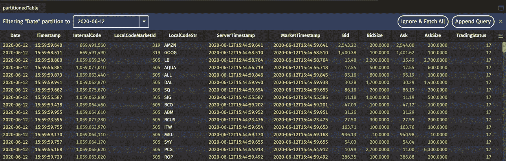

# 使用 Deephaven 的分区表

> 原文：<https://blog.devgenius.io/using-deephavens-partitioned-tables-20a456a592f9?source=collection_archive---------26----------------------->

## 如何简化代码并减少运行时间


简·安东宁·科拉尔在 [Unsplash](https://unsplash.com?utm_source=medium&utm_medium=referral) 上拍摄的照片

作者哈里森·斯皮萨克

# **简介**

在创建程序时，我最关心两件事:运行时和代码的整体外观。对于涉及大量数据的大型编码项目，这一点对我来说更为重要。幸运的是，Deephaven 数据实验室的高性能数据库有许多加快运行时间和清理代码的工具。分区用户表就是这样一个工具，它将一个表的数据分成多个可以独立管理的分区。例如，如果用户将表中的日期列设置为分区列，那么数据将按不同的日期分组保存。这使得用户可以非常快速地获取特定一天的数据，因为表已经被适当地划分了。

# **现实生活中的例子**

我最近在一个程序中使用了一个分区用户表，该程序保存了股票市场每天的收盘数据。将一天结束时的值保存在一个表中是非常有价值的，可以大大减少需要这些值的程序的运行时间。在我的第一次尝试中，我的程序工作正常，但是代码重复，生成的表没有优化。在我第二次尝试使用分区用户表时，我立即注意到我的排序执行得更快了。这也清理了我的代码，增强了我保存的数据。

让我们看看我在实现分区用户表之前的代码*:*

重复代码

这段代码有两个主要问题:首先，存在可避免的重复，包括 QueryScope 函数、stocksEOD 表和 optionsEOD 表；其次是合并功能的使用。可以通过不在循环外初始化表来消除重复…但是为了合并功能正常工作，表*必须在循环外初始化*。我找到了一个解决方案，即在每次循环迭代时初始化表，然后将数据保存到分区的用户表中。通常，必须一次上传整个表，但是使用分区用户表，用户可以分几部分上传一个表。

在详细介绍如何改进这段代码之前，我首先想更好地解释如何使用分区用户表。为了将数据保存到分区用户表，用户必须设置分区用户表的位置，给出将存储在那里的表的轮廓，并说明将用于对数据进行分区的列。Deephaven 的“addPartitionedTableDefinition”方法实现了这一点。

```
db.addPartitionedTableDefinition(“ExampleNamespace”, “ExampleTableName”, “ColumnToPartitionOn”, table.getDefinition())
```

初始设置后，用户可以向表中添加数据。为此，他们必须提供保存表的分区，使用“addTablePartition”方法一次添加一个分区。现在，用户可以随时向该表添加数据，也可以随时提取数据。

```
db.addTablePartition(“ExampleNamespace”, “ExampleTableName”, partition, table)
```

实现分区表缩短了我的代码并消除了合并功能，如下所示:

改进的代码

这段代码的工作方式是为股票和期权创建一个 end of day 表，然后将当天的数据保存在当天分区下的一个分区用户表中。这消除了循环前的重复代码，并通过基于分区列的排序提高了用户表的排序速度。



按日期分区的表

# **总结**

Deephaven 数据实验室的数据库允许用户保存分区的数据表。这些分区用户表允许用户将数据保存在 waves 中，并通过将这些操作基于分区列而不是所有数据来减少排序数据所花费的时间。此外，这种简化和简洁的代码减少了执行时间，这是我作为程序员主要关心的问题。