# 使用 Selenium 的依赖注入。NET Core 6 和 NUnit —第 1 部分

> 原文：<https://blog.devgenius.io/using-dependency-injection-with-selenium-net-core-6-and-nunit-part-1-5675874a2d85?source=collection_archive---------1----------------------->

大型企业中的自动化测试通常由不同的团队在模块级别上处理。每个团队负责分配给他们的模块。这种策略在自动化大型应用程序时很有帮助。有必要为不同的团队创建一个简单、健壮且不引人注目的测试自动化框架。这允许您用最少的努力来添加和维护自动化测试。如果框架写得不好，我们最终可能会增加更多的复杂性。一个好的测试框架可以帮助各种规模的组织有效地自动化测试。

在本文中，我们将利用微软的依赖注入 Selenium 4 和 NUnit 来创建一个可维护的测试自动化框架。要开始学习，您应该对 C#语言有很好的了解，并对坚实的原理和。网芯。如果没有，建议你查看本文末尾的链接。

我们大多会坚持。微软的. NET 内置模块或 nugets。在这一部分中，我们将了解如何设置解决方案、配置文件，以及如何使用 Microsoft DI 容器在测试中注入 *IWebDriver* 。稍后，我们将使用这个框架为一个[自动化实践](http://practice.automationtesting.in/)站点编写一些测试。我们开始吧！

**源代码**:

这个项目的源代码在 [GitHub](https://github.com/Fazali-Illahi/AutomationPractice) 上公开。存储库包含包含解决方案的 *article_support_code* 文件夹。存储库有一个主分支和 part1 分支。主分支将包含更新的代码。并且每个 part*分支将包含前一部分和当前部分的代码。我用的是 JetBrains Rider/vs 2022+ReSharper。出于本文的目的，您可以使用 VS 代码或 Visual Studio 2022。当您打开该解决方案时，您会发现下面显示的 3 个项目:

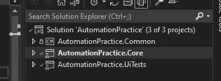

项目结构

**自动练习。Common** 包含可以在所有项目中重用的支持类和方法。

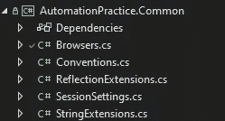

**自动练习。Core** 包含所有的基础设施和核心自动化框架类。我们将最终添加定制的测试属性和测试报告生成逻辑。

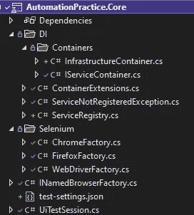

**自动练习。UITests** 将最终包含应用程序**的测试。**

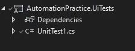

**概述:**

在这个框架中，我们将严格遵循标准约定，而不是配置每个类。您将看到带有 **Enforce 方法**的**约定类**，如果任何约定被破坏，该方法将抛出**约定异常**。强制约定，如命名约定、名称空间或构造函数等。在一组类中保持代码的结构。这促进了可重用性并减少了工作量。我所说的可重用性不仅仅是指代码重用，而是更广泛的东西，比如结构的可重用性，人和经验的可重用性。

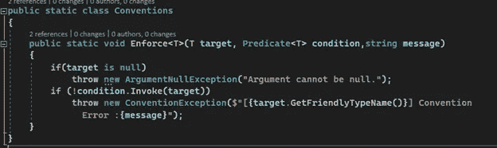

**依赖注入**

这个框架中的 DI 容器被设计成允许多个团队管理他们对测试的依赖。每个模块都有自己的***IServiceContainer***实现，所有具体实现都必须在 **AutomationPractice 中。Core.DI.Containers** 名称空间。框架将自动注入这个名称空间中的依赖项。为了演示这一点，我添加了**infra structure Container**类，它将基础设施相关的服务添加到 DI 容器中。

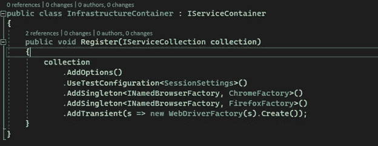

我还演示了扩展方法方法( *UseTestConfiguration* )来实现相同的目标(如果所有的扩展方法都在各自模块的不同类中)。您可以使用这两种方法中的任何一种。所有的容器或所需的服务将最终被添加到 **ServiceRegistry** 类中，该类创建了一个 **ServiceProvider** 。服务提供者被传递给 **UiTestSession** 类，该类将在整个 *UiTests* 项目中用于获取所需的对象。

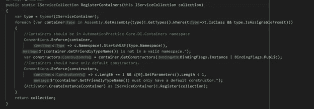

**配置**

在任何测试项目中处理配置通常依赖于一个组织或者一个项目。出于本演示的目的，我们将假设运行测试的云虚拟机有一个环境变量，存储一个 *test-setting.json* 文件的路径。对于本地开发/调试，我们将有一个后备 json 文件，不允许任何人使用凭证将它推送到远程分支。这是文件的样子。

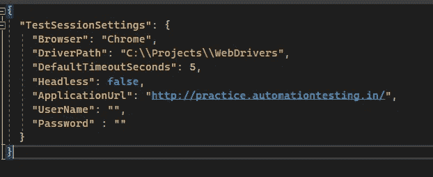

**注**:为了方便调试，我把驱动程序从 bin 文件夹中移走了。

该文件将使用 **ConfigurationBuilder** 类解析为 *ConfigurationRoot* 对象。并且**ConfigureFromConfigurationOptions**类将其绑定到 **SessionSettings** 对象。这使我们能够直接从构造函数中注入它，而不需要使用*I Options<T>T*接口(选项模式)。

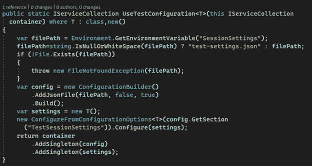

**实现网络驱动工厂。**

实现使用**工厂方法**设计模式根据配置初始化 web 驱动程序的具体实例。所有具体的驱动工厂都需要实现 *INamedBrowserFactory* 接口和不同的浏览器名称(**浏览器** enum)。具体工厂由包装工厂类 **WebDriverFactory** 调用，以将 *IWebDriver* 解析为已配置的浏览器类型。如果您使用过工厂方法设计模式，下面的代码应该很容易理解。

下面给出的是工厂接口。

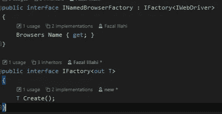

下面是 Chrome WebDriver 工厂的实现

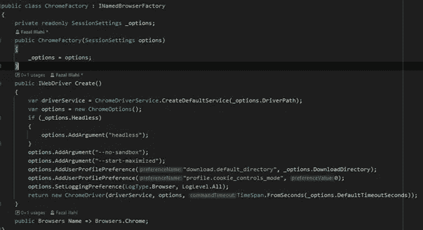

下面给出的包装工厂类调用正确的工厂来创建 WebDriver 的实例。

**UiTestSession** 类是我们用来解析服务或存储测试会话数据或设置的 go 类。我们稍后将重构这个类，以分离它必须负责的不同职责。最终，这个类将由不同的对象组成，这些对象将有自己的职责。

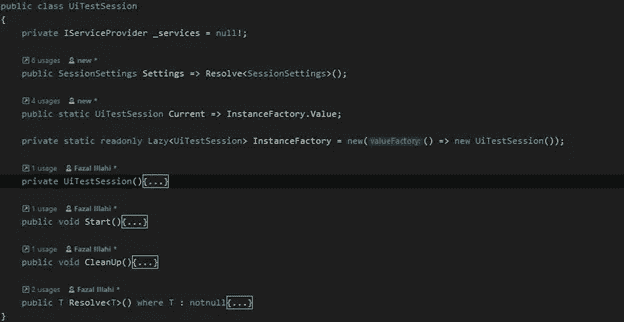

**Start** 方法应该在测试会话开始时调用。我们最好在 *OneTimeSetUp* 方法中的某个地方调用它。一旦调用了 **Start** 方法，我们就可以要求会话解析测试中所需的页面或 WebDriver 或任何服务。为了在测试中获得 WebDriver 的一个对象，我们使用如下所示的 *Resolve* 方法。

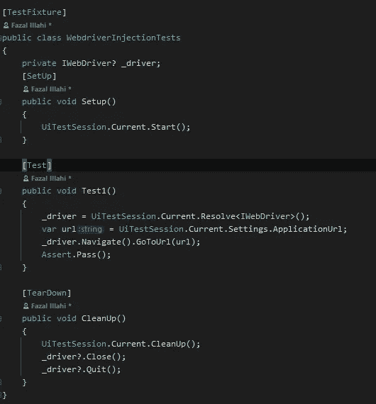

希望这篇文章对你有用。第二部分见。

**参考文献:**

罗伯特·C·马丁的《坚实的原则》

[工厂方法设计模式](https://sourcemaking.com/design_patterns/factory_method)

[依赖注入](https://auth0.com/blog/dependency-injection-in-dotnet-core/)

[配置在。网芯](https://docs.microsoft.com/en-us/aspnet/core/fundamentals/configuration/?view=aspnetcore-6.0)

[C#编程指南](https://docs.microsoft.com/en-us/dotnet/csharp/programming-guide/)