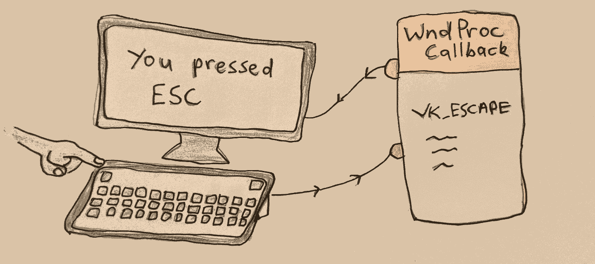
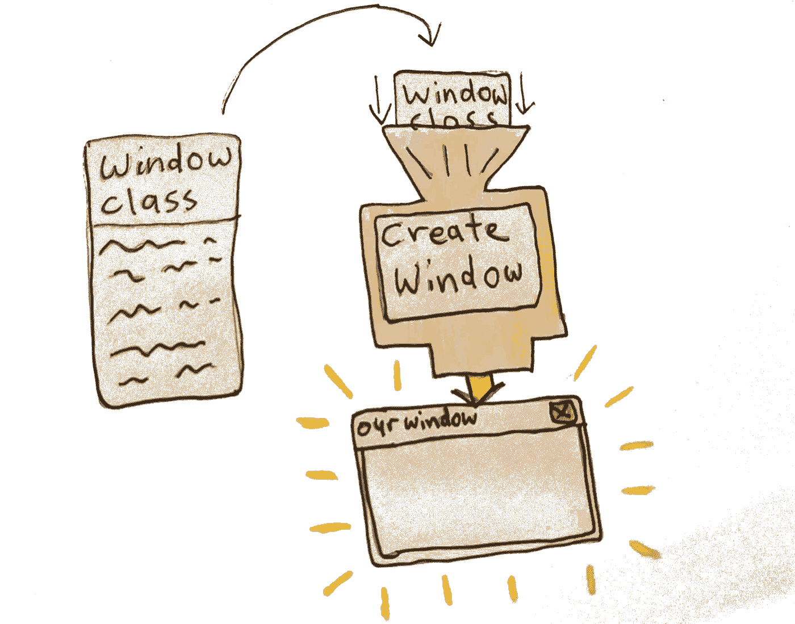
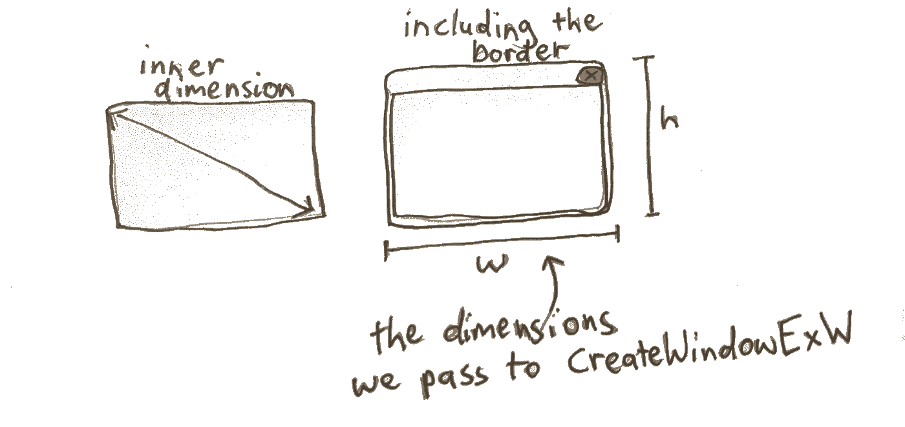
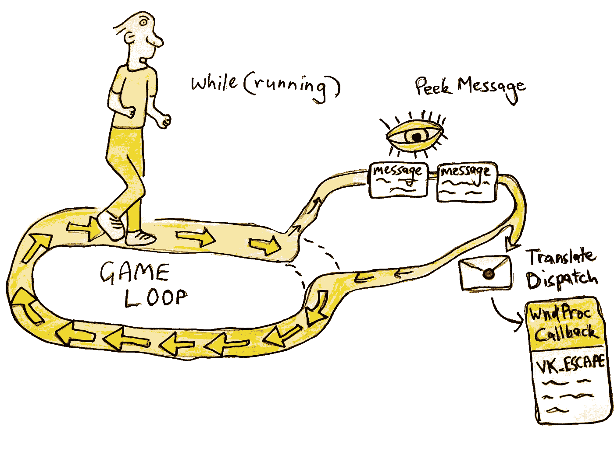
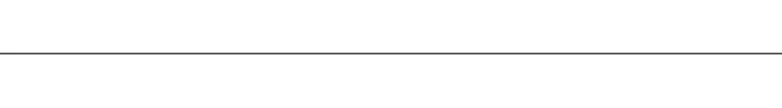
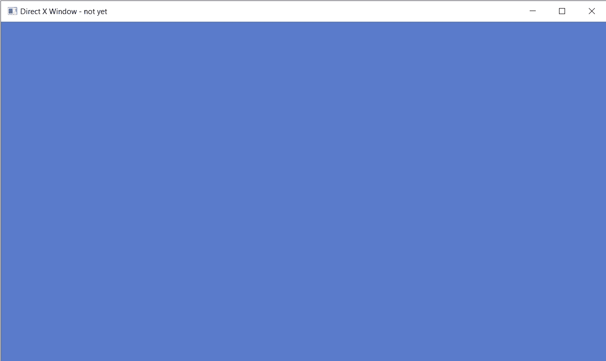

# 将 DirectX 11 用于游戏:第 1 部分

> 原文：<https://blog.devgenius.io/using-directx-11-for-games-part1-65a51fb91fe2?source=collection_archive---------2----------------------->

在本文中，我将介绍如何创建一个 DirectX 11 上下文来用于您的游戏。DirectX 11 是 Windows 的原生图形 API。DirectX 比 OpenGL 有优势，因为它在 Windows 计算机上更可靠——这是游戏发布时的一个优势。您希望它能在尽可能多的机器上运行，并且最大程度地减少中断。你不希望你一半的用户(或者更糟！)来加载你的游戏，发现一个空白的屏幕。相对于 OpenGL 的另一个优势是 DirectX 更容易推理。OpenGL 是一个巨大的状态机，其中绑定了纹理、顶点数组和混合模式等选项，这些选项会一直保持绑定状态，直到您明确解除绑定或取消设置它们。这可能会导致很难发现的错误。DirectX 11 API 少了一个状态机，多了更多你可以推理的函数调用，让图形程序的体验更加愉悦。

我们开始吧！对于任何 windows 程序来说，第一件事就是 Windows 入口点，我们将把它放在 main.cpp 文件中:

```
#include <windows.h>int WINAPI WinMain(HINSTANCE hInstance, HINSTANCE /*hPrevInstance*/, LPSTR /*lpCmdLine*/, int /*nShowCmd*/) {return 0;}
```

我们已经注释掉了程序中不使用的变量——我们只使用函数的第一个变量，hin instance——这是 exe 运行的实例，我们将需要它来创建一个窗口。

我们可以编译它来确保一切正常。我们从命令行使用 MSVC 编译器，所以我们要键入:

```
cl main.cpp
```

太好了！希望没有任何编译错误。接下来，我们要声明一个窗口类。这是您为我们想要创建的窗口选择设置而创建的。它看起来像这样:

```
//First register the type of window we are going to create
        WNDCLASSEXW winClass = {};
        winClass.cbSize = sizeof(WNDCLASSEXW);
        winClass.style = CS_HREDRAW | CS_VREDRAW;
        winClass.lpfnWndProc = &WndProc;
        winClass.hInstance = hInstance;
        winClass.hIcon = LoadIconW(0, IDI_APPLICATION);
        winClass.hCursor = LoadCursorW(0, IDC_ARROW);
        winClass.lpszClassName = L"MyWindowClass";
        winClass.hIconSm = LoadIconW(0, IDI_APPLICATION);if(!RegisterClassExW(&winClass)) {
            MessageBoxA(0, "RegisterClassEx failed", "Fatal Error", MB_OK);
            return GetLastError();
        }
```

我们声明一个类型为 *WINDCLASSEXW* 的结构调用 *winClass* 。注意，我们使用的是 WinAPI 函数的 W 版本。还有就是 A 型。区别在于，W 类型支持 unicode 字符串(W 表示宽字符或每个字符 2 个字节)，而 A 类型只支持 ANSI 字符(非 Unicode，每个字符只有 1 个字节)。所以为了更新，我们使用了 W 函数。我们将添加另外两个东西来支持 unicode:
1。将#define UNICODE 放在我们文件的顶部。这告诉其他 windows 函数我们支持 unicode，所以请帮助我们。

2.将 L 放在字符串文字的前面。这告诉编译器将字符串视为宽字符串(每个字符 2 个字节)。这个看起来像这个*L“my window class”。*

你可以在这里阅读更多关于 Unicode 在 windows 上的支持[http://www.cplusplus.com/forum/articles/16820/](http://www.cplusplus.com/forum/articles/16820/)

这里要注意的主要事情是，我们想要一个在调整大小时可以重画的窗口。我们通过传递标志 *CS_HREDRAW | CS_VREDRAW 来实现这一点。*我们还传递了一个指向一个名为 *WndProc* 的函数的指针，如行*win class . lpfnwndproc =&WndProc；*



WndProc 回调处理输入事件

这是一个回调函数，处理发送到我们应用程序的事件，比如调整大小、键盘输入和退出程序。我们必须自己定义它，所以我们将在我们的主函数之上做那件事。

```
LRESULT CALLBACK WndProc(HWND hwnd, UINT msg, WPARAM wparam, LPARAM lparam)
{
    LRESULT result = 0;
    switch(msg) {
        case WM_KEYDOWN: {
            if(wparam == VK_ESCAPE)
                PostQuitMessage(0);
            break;
        }
        case WM_DESTROY: {
            PostQuitMessage(0);
        } break;
        default:
            result = DefWindowProcW(hwnd, msg, wparam, lparam);
    }
    return result;
}
```

您将看到我们正在处理 WM_KEYDOWN 事件，在该事件中，我们检查该键是否为 escape。如果是这样，我们就毁了我们的窗户。我们还处理 WM_DESTROY 事件，我们发布一个 QuitMessage，我们将在消息循环中处理它。我们给默认函数的所有其他事件。

接下来，我们将实际创建我们的窗口。



我们将窗口类结构传递给 CreateWindowExW 函数来获取我们的窗口

```
//Now create the actual window
        RECT initialRect = { 0, 0, 960, 540 };
        AdjustWindowRectEx(&initialRect, WS_OVERLAPPEDWINDOW, FALSE, WS_EX_OVERLAPPEDWINDOW);
        LONG initialWidth = initialRect.right - initialRect.left;
        LONG initialHeight = initialRect.bottom - initialRect.top;HWND hwnd = CreateWindowExW(WS_EX_OVERLAPPEDWINDOW,
                                winClass.lpszClassName,
                                L"Direct X Window - not yet",
                                WS_OVERLAPPEDWINDOW | WS_VISIBLE,
                                CW_USEDEFAULT, CW_USEDEFAULT,
                                initialWidth, 
                                initialHeight,
                                0, 0, hInstance, 0);if(!hwnd) {
            MessageBoxA(0, "CreateWindowEx failed", "Fatal Error", MB_OK);
            return GetLastError();
        }
```

我们使用 CreateWindowExW 来实际创建我们的窗口。我们给它一个之前创建的 windowclass，并给这个窗口一个名字。我们还传递了我们的 hin instance(exe 的句柄)和一些初始标志—*WS _ overlapped window | WS _ VISIBLE*(我们需要一个普通的窗口类型，我们希望我们的窗口是可见的)。我们还传递了窗口的初始大小。这里需要注意的是——窗口*的初始宽度&高度包括边界*，为了得到我们想要的实际内部尺寸，我们必须使用

```
AdjustWindowRectEx(&initialRect, WS_OVERLAPPEDWINDOW, FALSE, WS_EX_OVERLAPPEDWINDOW);
```

我们为内部窗口传入我们想要的维度，它返回包含我们应该传递给 CreateWindow 的边界的维度。



CreateWindow 获取包括边框在内的窗口尺寸。我们使用 AdjustWindowRectEx 来获得正确的尺寸。

太好了！如果我们现在编译它，我们应该会看到一个窗口短暂出现，然后又消失。就这么办吧。

为了编译 is，我们现在需要传递一个链接器标志，因为我们使用了位于 *user32.lib* 中的函数

```
cl main.cpp /link user32.lib
```

现在，当我们运行这个和运行我们的 main.exe，我们应该看到我们的窗口短暂出现。为了结束这一课，我们将添加臭名昭著的游戏循环。



在 CreateWindow 函数下面，我们将这样写:

```
bool running = true;
while(running) {}
```

然而，如果我们运行这个，我们将陷入一个无限循环，因为我们不处理我们的消息——特别是我们的退出消息。这是处理我们的 WndPro 回调以处理我们收到的事件的地方。我们将使用 PeekMessage 而不是 GetMessage 来接收事件。不同之处在于，GetMessage 等待消息处理，而不是继续运行程序。对于一个游戏，你需要 PeekMessage。

```
bool running = true;
while(running) {MSG msg = {};
        while(PeekMessageW(&msg, 0, 0, 0, PM_REMOVE))
        {
            if(msg.message == WM_QUIT)
                isRunning = false;
            TranslateMessage(&msg);
            DispatchMessageW(&msg);
        }
}
```

我们的 WndProc 回调通过 DispatchMessage 调用。所以所有的输入都在那里处理。您将看到我们通过将 running 设置为 false 来处理 WM_QUIT 消息。这是当我们按下红色的 X 按钮或按下 escape 键时，因为我们在 wndProc 回调中处理它。

现在，如果我们使用与上面相同的代码(cl main.cpp /link user32.lib)编译并运行它，我们将得到一个保持打开的窗口。我们可以通过按红色 X 或按 escape 来退出。

厉害！干得好。我们正在开发 directX 渲染器。

你可以在这里看到到目前为止的所有代码[https://github . com/ol ster1/DirectX 11 _ tutorial/blob/main/lesson 1/main . CPP](https://github.com/Olster1/directX11_tutorial/blob/main/lesson1/main.cpp)



好了，接下来我们将开始使用 DirectX。首先，我们需要在 main.cpp 文件的顶部包含 directX 头文件。

```
#include <d3d11_1.h>
```

首先我们要创建两个东西——一个*d3d 11 设备*和一个*d3d 11 设备上下文*。当我们创建一个设备时，我们指定了我们想要的 d3d 特性的类型(是 d3d11，还是 d3d9 和 d3d10？)，我们是要软件还是硬件(使用 GPU)渲染？我们想要支持什么类型的像素格式？

该设备负责创建资源(如着色器、帧缓冲区和顶点缓冲区)并与视频适配器对话。您只想为每个程序创建一个设备。

另一方面,*设备环境*包含使用设备的环境或设置。它专门用于使用设备拥有的资源生成渲染命令。我们使用 *d3ddevice* 来创建资源，如着色器、顶点缓冲区、纹理&帧缓冲区。我们使用*设备上下文*来设置渲染状态，如 setViewport、setShader、setVertexBuffers，并提交绘制调用——我们使用资源的上下文。

为了创建这两个东西，我们使用函数 *D3D11CreateDevice，*传入一个指向 *ID3D11Device* 的指针和一个指向要填充的**id3d 11 device context***的指针。看起来是这样的:***

```
***ID3D11Device* baseDevice;
        ID3D11DeviceContext* baseDeviceContext;
        D3D_FEATURE_LEVEL featureLevels[] = { D3D_FEATURE_LEVEL_11_0 }; //we just want d3d 11 features, not below
        UINT creationFlags = D3D11_CREATE_DEVICE_BGRA_SUPPORT; 
        #if defined(DEBUG_BUILD)
        creationFlags |= D3D11_CREATE_DEVICE_DEBUG;
        #endifHRESULT hResult = D3D11CreateDevice(0, D3D_DRIVER_TYPE_HARDWARE, //hardware rendering instead of software rendering
                                            0, creationFlags, 
                                            featureLevels, ARRAYSIZE(featureLevels),
                                            D3D11_SDK_VERSION, &baseDevice, 
                                            0, &baseDeviceContext);
        if(FAILED(hResult)){
            MessageBoxA(0, "D3D11CreateDevice() failed", "Fatal Error", MB_OK);
            return GetLastError();
        }***
```

***我们需要 Direct11 功能、硬件渲染、支持 BGRA 的设备，并且在调试版本中，我们希望创建一个调试设备来发现程序中的错误。***

***这里还有一个问题。有更新版本的 *ID3D11DeviceContext* 和 *ID3D11DeviceContext* 被恰当地称为 *ID3D11Device1* 和 *ID3D11DeviceContext1* ，它们具有更多的功能。因为我们更愿意拥有这些，所以我们查询刚刚创建的设备以获得一个更新的设备。看起来是这样的:***

```
***ID3D11Device1* d3d11Device;
ID3D11DeviceContext1* d3d11DeviceContext;// Get 1.1 interface of D3D11 Device and Context
 hResult = baseDevice->QueryInterface(__uuidof(ID3D11Device1), (void**)&d3d11Device);
 assert(SUCCEEDED(hResult));
 baseDevice->Release();hResult = baseDeviceContext->QueryInterface(__uuidof(ID3D11DeviceContext1), (void**)&d3d11DeviceContext);
 assert(SUCCEEDED(hResult));
 baseDeviceContext->Release();***
```

***我们使用 *QueryInterface* 从我们的设备中获取 *ID3D11Device1* 的类型。我们的 deviceContext 也是如此。然后，我们发布原始设备和设备上下文。***

***厉害！现在我们可以检查这是否可以编译。我们将链接到 d3d11.lib 以使其工作。我们的命令行构建脚本现在看起来像这样:***

```
***cl main.cpp /link user32.lib d3d11.lib***
```

***还要确保在 main.cpp 的顶部包含 assert***

```
***#include <assert.h>***
```

******

***太好了！接下来，我们将在 deviceContext 中激活调试层。你可以看到，当我们创建 deviceContext 时，我们请求一个带有标志 *D3D11_CREATE_DEVICE_DEBUG 的调试兼容上下文。*为了启用 d3d 错误上的*中断*，我们再次查询设备上下文。***

```
***#ifdef DEBUG_BUILD
    // Set up debug layer to break on D3D11 errors
    ID3D11Debug *d3dDebug = nullptr;
    d3d11Device->QueryInterface(__uuidof(ID3D11Debug), (void**)&d3dDebug);
    if (d3dDebug)
    {
        ID3D11InfoQueue *d3dInfoQueue = nullptr;
        if (SUCCEEDED(d3dDebug->QueryInterface(__uuidof(ID3D11InfoQueue), (void**)&d3dInfoQueue)))
        {
            d3dInfoQueue->SetBreakOnSeverity(D3D11_MESSAGE_SEVERITY_CORRUPTION, true);
            d3dInfoQueue->SetBreakOnSeverity(D3D11_MESSAGE_SEVERITY_ERROR, true);
            d3dInfoQueue->Release();
        }
        d3dDebug->Release();
    }
#endif***
```

***我们使用 *QueryInterface* 从我们的设备获取 *ID3D11Debug* 对象。一旦我们得到了这个，我们就可以从中获得 *d3dInfoQueue* 。然后，我们使用 *SetBreakOnSeverity* 函数来说明我们想要中断什么错误。你可以在下面的链接中看到其他选项。***

***[](https://docs.microsoft.com/en-us/windows/win32/api/d3d12sdklayers/ne-d3d12sdklayers-d3d12_message_severity) [## D3D12 _ 消息 _ 严重性(d3d12sdklayers.h) - Win32 应用程序

### 信息队列的调试消息严重级别。typedef 枚举 D3D12_MESSAGE_SEVERITY {…

docs.microsoft.com](https://docs.microsoft.com/en-us/windows/win32/api/d3d12sdklayers/ne-d3d12sdklayers-d3d12_message_severity) 

下一步是创建 SwapChain。这是用于向用户显示帧的缓冲区集合。当一个缓冲区被绘制到屏幕上时，我们渲染到交换链中的一个缓冲区。使用多个缓冲器来避免*撕裂。*当我们试图渲染到同一个缓冲区时，就会发生这种情况，因为它被绘制到监视器上，导致旧图像出现在屏幕的上半部分，而新图像出现在下半部分。相反，我们有两个或更多的缓冲区，我们可以乒乓之间。我们绘制一个(称为 backbuffer)，而另一个则显示给用户。

为了创建 SwapChain，我们首先需要创建 *DXGI 工厂*，它用于生成处理全屏过渡的对象(即 swapchain)。这是使用 *QueryInterface 和其他辅助函数*向下钻取并获得我们需要的最终对象的另一种情况。看起来是这样的:

```
// Get DXGI Factory (needed to create Swap Chain)
IDXGIFactory2* dxgiFactory;
{// First, retrieve the underlying DXGI Device from the D3D Device      IDXGIDevice1* dxgiDevice;
 HRESULT hResult = d3d11Device->QueryInterface(__uuidof(IDXGIDevice1), (void**)&dxgiDevice);
            assert(SUCCEEDED(hResult));// Identify the physical adapter (GPU or card) this device is running on.
IDXGIAdapter* dxgiAdapter;
            hResult = dxgiDevice->GetAdapter(&dxgiAdapter);
            assert(SUCCEEDED(hResult));
            dxgiDevice->Release();DXGI_ADAPTER_DESC adapterDesc;
            dxgiAdapter->GetDesc(&adapterDesc);//the graphics card that is being used by this progam 
OutputDebugStringA("Graphics Device: ");
OutputDebugStringW(adapterDesc.Description);// And obtain the factory object that created it.
hResult = dxgiAdapter->GetParent(__uuidof(IDXGIFactory2), (void**)&dxgiFactory);
            assert(SUCCEEDED(hResult));
            dxgiAdapter->Release();
        }
```

我们从我们的*d3d 11 设备中得到 *dxgiDevice* 。*然后我们调用 *GetAdapter* 我们返回 directX 正在使用的视频适配器(*IDXGIAdapter*)——这代表你的显卡。我们可以看到具体是什么，使用上面看到的 GetDesc 函数——在我的例子中，它使用的是集成显卡。

该适配器的父代是在我们创建*d3d 11 设备*时创建的*dxg factory*。唷！我们已经有了负责创建 *SwapChain[1]的*dxg factory*。所以现在让我们来创建它吧！*


现在我们将创建我们的 SwapChain。我们使用函数 *CreateSwapChainForHwnd。*我们还需要创建我们想要创建的缓冲区的描述。它将是什么像素格式(我们希望每种颜色 8 位 B8G8R8A8 也希望输出为 SRGB)。它的宽度和高度。是否是多样本缓冲区。我们希望 swapchain 中有多少缓冲区(我们希望至少有 2 个以避免撕裂)。当窗口的长宽比和大小不同时，我们希望后台缓冲区如何响应。

看起来是这样的:

```
DXGI_SWAP_CHAIN_DESC1 d3d11SwapChainDesc = {};
            d3d11SwapChainDesc.Width = 0; // use window width
            d3d11SwapChainDesc.Height = 0; // use window height
            d3d11SwapChainDesc.Format = DXGI_FORMAT_B8G8R8A8_UNORM_SRGB;
            d3d11SwapChainDesc.SampleDesc.Count = 1;
            d3d11SwapChainDesc.SampleDesc.Quality = 0;
            d3d11SwapChainDesc.BufferUsage = DXGI_USAGE_RENDER_TARGET_OUTPUT;
            d3d11SwapChainDesc.BufferCount = 2;
            d3d11SwapChainDesc.Scaling = DXGI_SCALING_STRETCH;
            d3d11SwapChainDesc.SwapEffect = DXGI_SWAP_EFFECT_DISCARD;
            d3d11SwapChainDesc.AlphaMode = DXGI_ALPHA_MODE_UNSPECIFIED;
            d3d11SwapChainDesc.Flags = 0;
```

由于这些是我们正在绘制的缓冲区，我们将 BufferUsage 设置为*DXGI _ USAGE _ RENDER _ TARGET _ OUTPUT。*因为我们不从缓冲区读取，所以我们不关心 alphaMode。我们还必须在 *SwapEffect* 变量中选择一个缓冲区如何显示在屏幕上的选项。由于我们在每一帧都将完整的场景从头开始渲染到缓冲区中，所以我们不需要依赖过去的渲染来保留在缓冲区中。因此，我们使用交换效果 *DXGI_SWAP_EFFECT_DISCARD，*而不是*DXGI _ SWAP _ EFFECT _ SEQUENTIAL[2]。*

现在我们已经得到了 SwapChainDescription，我们准备使用 *CreateSwapChainForHwnd，*传入我们的设备、我们的描述和我们的 windowHandle 来创建它:

```
HRESULT hResult = dxgiFactory->CreateSwapChainForHwnd(d3d11Device, hwnd, &d3d11SwapChainDesc, 0, 0, &d3d11SwapChain);
            assert(SUCCEEDED(hResult));dxgiFactory->Release();
```

我们还释放了指向 dxgiFactory 的指针，因为我们不再需要它了。


好了，我们已经得到了我们的*d3d 11 设备*，我们的*d3d 11 设备上下文*和我们的*交换链*。我们可以把这三样东西渲染到我们的窗口。

在此之前，我们需要做的最后一件事是访问 SwapChain 中的 backbuffer。这表示为一个 *ID3D11RenderTargetView，*它负责我们正在渲染到*中的内容的可写部分。*为了从我们的 SwapChain 中的 backbuffer 得到这个，我们做如下的事情:

```
// Create Framebuffer Render Target
    ID3D11RenderTargetView* d3d11FrameBufferView;
    {
        ID3D11Texture2D* d3d11FrameBuffer;
        HRESULT hResult = d3d11SwapChain->GetBuffer(0, __uuidof(ID3D11Texture2D), (void**)&d3d11FrameBuffer);
        assert(SUCCEEDED(hResult));hResult = d3d11Device->CreateRenderTargetView(d3d11FrameBuffer, 0, &d3d11FrameBufferView);
        assert(SUCCEEDED(hResult));
        d3d11FrameBuffer->Release();
    }
```

我们使用 swapChain 中的 *GetBuffer* 函数，将缓冲区索引作为零传递，因为这是我们可以通过交换效果 DXGI_SWAP_EFFECT_DISCARD 访问的唯一缓冲区。一旦我们得到它，我们就可以创建一个 RenderTargetView。

所以我们已经有了所有的工具来进行渲染(deviceContext 和 swapchain ),并且我们已经有了将要渲染的缓冲区 backbuffer 的 RenderTargetView。

该渲染了！


在我们的游戏循环中，处理完消息后，我们将把 renderTarget 清除为蓝色。看起来是这样的:

```
MSG msg = {};
        while(PeekMessageW(&msg, 0, 0, 0, PM_REMOVE))
        {
            if(msg.message == WM_QUIT)
                isRunning = false;
            TranslateMessage(&msg);
            DispatchMessageW(&msg);
        }FLOAT backgroundColor[4] = { 0.1f, 0.2f, 0.6f, 1.0f };
        d3d11DeviceContext->ClearRenderTargetView(d3d11FrameBufferView, backgroundColor);
```

我们使用我们的 *d3d11DeviceContext* 来处理渲染命令，以清除渲染目标视图——我们创建的 backbuffer 视图。

然后，我们使用 swapchain 完成框架，调用 *present。这表示我们已经完成了这一帧的所有渲染，是时候呈现了。这相当于 OpenGL 命令 *wglSwapBuffers。**

```
d3d11SwapChain->Present(1, 0);
```

第一个参数是同步间隔-我们如何与 V-sync 同步。零表示不要等待垂直同步，现在就显示图像。值 1 到 4 表示在这些数量的垂直同步之后同步显示。也就是说，在我们可以继续渲染之前，我们要等待多少个垂直同步。我们想跟上显示器的刷新率，所以我们选择一个。该值与使用 openGL 的*wglswapinteralext()相同。*

第二个参数是我们希望如何将帧呈现给输出。零表示我们从当前缓冲区开始呈现每个缓冲区中的一个帧，也就是说，我们使用写入一个帧同时读取另一个帧的排序能力，并在呈现时翻转它们。


我们成功了。当我们编译并运行游戏时，我们应该希望得到一个浅蓝色的屏幕。



成功的蓝屏

可以在这里看到完整的代码:[https://github . com/olster 1/DirectX 11 _ tutorial/blob/main/lesson 2/main . CPP](https://github.com/Olster1/directX11_tutorial/blob/main/lesson2/main.cpp)

你也可以在这里找到一个测量帧时间的版本(需要在 Visual Studio 中运行才能看到控制台输出):[https://github . com/ol ster1/DirectX 11 _ tutorial/blob/main/lesson 2 _ with timing/main . CPP](https://github.com/Olster1/directX11_tutorial/blob/main/lesson2_withTiming/main.cpp)


您已经完成了第 1 部分的全部课程。恭喜你自己！在低水平上做计算机图形不是一件容易的事。

在第 2 部分中，我们将在屏幕上渲染一个彩色的三角形，这是渲染完整的 3d 模型的必经之路。到时候见！

注册我的时事通讯，每周收到一封邮件，告诉你我在做什么，我在学什么，我在教什么。

https://oliver532.substack.com/p/coming-soon?r=9i1j7&T4 UTM _ campaign = post&UTM _ medium = web&UTM _ source = copy


测验:

我们用什么函数来创建一个窗口？

*【CreateWindowExW】*

我们需要传递什么来创建一个窗口？

*【一个我们在创建窗口之前注册的 windowClass。它还包含指向 out 事件回调 wndProc 的函数指针，用于处理输入]*

我们在每个游戏循环的开始做什么？

[ *我们使用 PeekMessage 处理收到的消息。]*

我们的 WndProc 函数什么时候被调用？

*【当我们使用 dispatch message()】*

在渲染到我们的窗口之前，我们需要创建哪四个 directX 对象？

*【d3d 11 device，d3d11DeviceContext，IDXGISwapChain，和一个 ID3D11RenderTargetView。使用 DirectX 至少需要一个设备。它负责创造资源。DeviceContext 用于设置我们将使用 GPU 的状态。在渲染场景时，我们使用 DeviceContext 最多。RenderTargetView 表示我们正在绘制的缓冲区]*

什么函数将我们的最终缓冲区提交给 GPU？

*【swap chain-】Present()函数。它需要两个参数:同步间隔和我们想要如何显示缓冲区]*

为什么我们在交换链中至少需要两个缓冲区？

*【停止撕裂——也就是说，我们开始更新显示在屏幕上的缓冲区，使一半的缓冲区成为原始图像，另一半成为我们正在写入的新图像。相反，我们在 SwapChain]* 中的缓冲区之间来回切换

注意事项:

[1]需要注意的是，您可以只使用 D3D11CreateDeviceAndSwapChain，它可以同时创建两者。它被分开是为了展示更多幕后发生的事情。

[2]这些值有更新的版本:推荐使用的 DXGI_SWAP_EFFECT_FLIP_DISCARD 和 DXGI _ SWAP _ EFFECT _ FLIP _ SEQUENTIAL。虽然这些只在 Windows 10 上可用***