# 使用 Excel 进行数据分析

> 原文：<https://blog.devgenius.io/using-excel-for-data-analytics-2c5a1575d6bd?source=collection_archive---------5----------------------->

全球有**11 亿人使用微软 Excel** 。换句话说，超过 1/8 的人使用 Excel。办公用户(有罪..分配..)通常会花三分之一以上的时间使用 Excel。

因此，尽管它是最常用的工具之一，但许多公司已经为员工提供了它，并且通常使用它进行数据分析，包括跨国公司将其作为数据分析的重要工具。

让我们从学习 **Excel 的基础开始。**

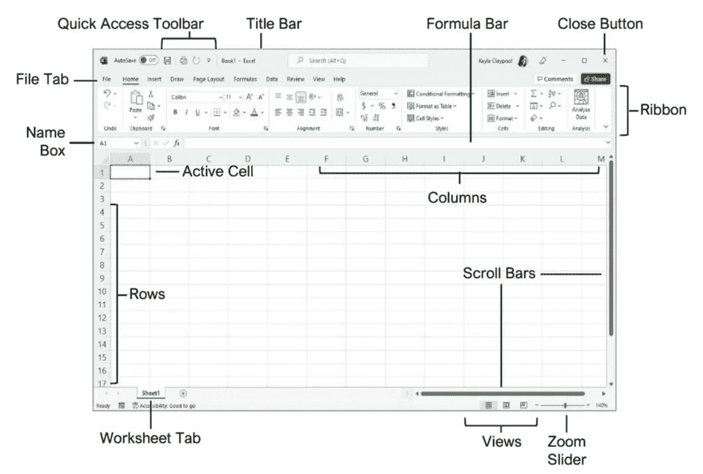

Excel 的基本布局

一些**快捷方式**让你马上开始使用它…

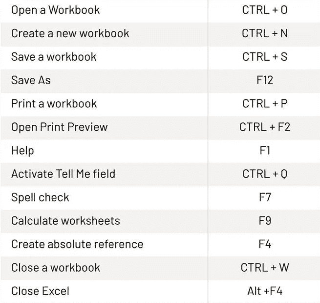

Excel 快速入门

# 让我们从**管理数据表开始，**

使用 **IF 函数**，允许你在一个值和你期望的值之间进行**逻辑比较**，它可以有**两个结果**。第一个结果是你的比较是否**真**，第二个是你的比较是否**假**。

例如在 **Excel** ，

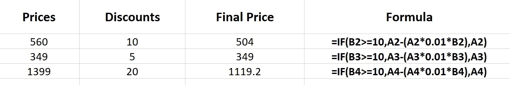

如果 Excel 中的条件格式

在上面的例子中，如果折扣**大于 10%或等于它**，它将从原始价格中扣除，但在少数情况下**小于**，它将不予考虑，并且**原始价格将保持为最终价格**。这可以被认为好像一家商店在一种产品上的利润率非常低，现在甚至亏损，因为给的折扣比它过滤的利润率高。

同样的高级版本可以是 **IFS 函数**来检查是否满足一个或多个条件并返回对应于第一个真条件的值。

例如在 **Excel** 中，

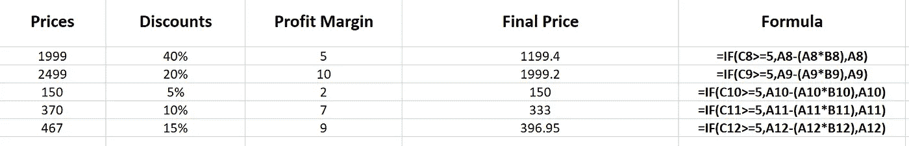

Excel 中的 IFS 条件格式

在上面的例子中，商店可以成功退货(我们可以希望)这里的条件是，如果**利润率**大于**等于 5** ，我们将给予折扣，否则**原始价格将得到粘贴到**最终价格**的列**(阅读我在那里所做的)。

现在，另一个函数， **COUNTIF** 计算符合标准的单元格的数量。

例如在 **Excel** 中，

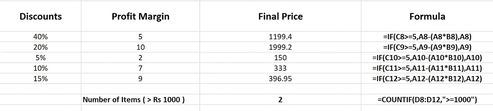

Excel 中的 COUNTIF 条件格式

在上面的例子中，商店可以成功(仍应如此)退货(我们可以希望)。我们统计了最终价格**超过 1000 卢比**(标准)的**件商品的数量。**

另一个(函数)， **SUMIFS** 对满足指定标准的范围内的值求和。

例如在 **Excel** ，

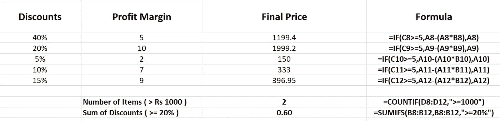

Excel 中的 SUMIFS 条件格式

在上面的例子中，商店可以成功(仍应如此)退货(我们可以再次希望)**折扣总和**提供大于或等于 20 % 的**总和，以检查提供的特定折扣范围，如零食部分的折扣范围。**

# 文本格式和组合，

在这一部分中，让我们从三个最常用的基本文本函数开始， **LEFT、RIGHT、**和 **MID** ，它们用于根据提供的起始字符和字符数从左、右和中间提取字符数。

例如在 **Excel** 中，

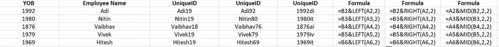

Excel 中的左、右、中间文本功能

在上面的例子中，nah store 现在早就不存在了，让我们来看看员工和同事之间的关系，因此我们试图使用上面讨论的三个函数创建一个 **uniqueid** 。它们都会产生不同的结果，我们将 **YOB(出生年份)**和**员工姓名**组合在一起。

还有一个函数叫做 **LEN** ，它给出生成的 **uniqueid** 的长度，例如在 **Excel** 中如下

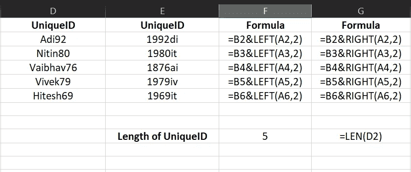

D2(信元)的唯一标识长度— Adi92

有时，当手头的文本出现换行符和大量需要清理的空格时，也可以说是**数据清理**、**替换**(通过匹配替换给定字符串中的文本)，以及**查找&替换(**在工作簿中搜索某些内容，例如特定的数字或文本字符串，或者您可以用其他内容替换它**)。**

例如在 **Excel** 中，

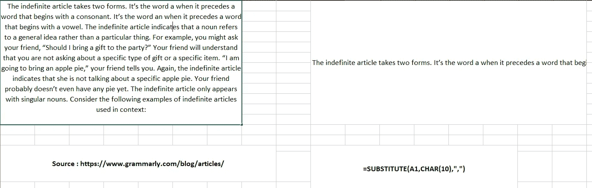

Excel 中的替代函数

在上面的例子中，我们取了一篇文章文本，用**替换**功能删除了它的**换行符**和**空格**，这非常有助于认为你是在复制某些内容以供参考，**网站文本**有许多**空格**和**换行符**，就像上面的例子一样。

# 查找，

这里讨论三种查找， **vlookup、hlookup 和 xlookup。**

当你需要在一个表格或一个范围内逐行查找东西时，使用 VLOOKUP 。

例如，通过零件号查找汽车零件的价格，或者根据员工 ID 查找员工姓名。

现在 **HLOOKUP** 用于当您的比较值位于数据表**顶部**的**行**中，并且您想要向下查看指定的**行数**时。

当您的比较值位于您想要查找的数据左侧**的**列**时，使用 **VLOOKUP** 。**

例如在 **Excel** 中，

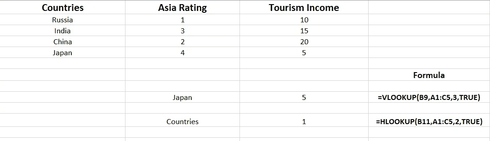

Excel 中的 HLOOKUP 和 VLOOKUP 示例

在上面的例子中， **Japan** 是我们使用 **vlookup** 查找**旅游收入**的查找值，同样，我们这样做是通过给 **3** 的值，因为在这种情况下**行索引**是 3。对于 **hlookup** ，我们将**国家**作为查找值，我们需要**亚洲评级**对于**俄罗斯**我们为其提供**列索引 2** 并得到相同的值。

现在，一个新的条目 everywhere **XLOOKUP** 搜索一个范围或数组，然后返回与它找到的第一个匹配项相对应的项。如果不存在匹配，那么 XLOOKUP 可以返回最接近的匹配。

例如在 **Excel** 中，

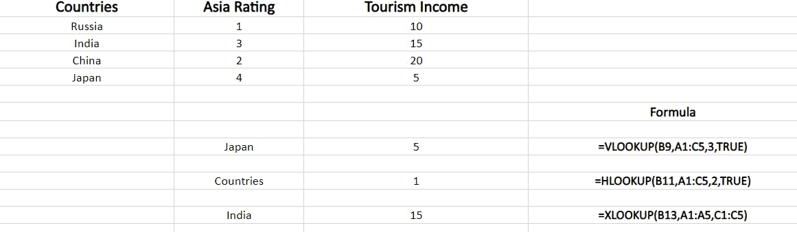

Excel 中的 XLOOKUP

在上面的例子中， **India** 被给定为**查找值** e，然后选择**搜索表**和**目标表**，它将给出结果为 **15** ，就像我们搜索**旅游收入**一样。

# 如果分析，

如果您知道想要从公式中得到的结果，但不确定公式需要什么输入值才能得到该结果，请使用**目标搜索**功能。

例如在 **Excel** 中，

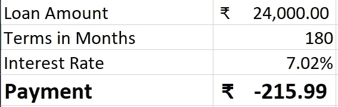

=使用了 PMT(B3/12，B2，B1)

在上面的例子中，您根据**贷款金额、月数、**和**利率计算出**要支付的金额**。**

# 图表，

图形对于表格的可视化很重要，对于趋势和模式识别也很重要。

在下面的示例中， **vlookup** 中使用的**国家**示例正在进行图形化返回。

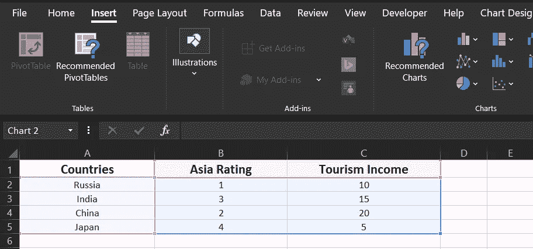

插入>推荐图表

相同生成的图形如下所示。

例如在 **Excel** 中，

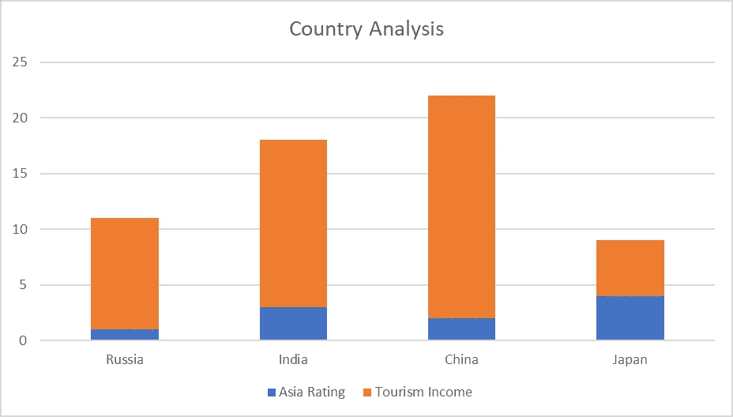

堆积条形图

标记线图

上面的 **Excel** 中包含了**数据分析**的概述，更多内容请见下文。

> **参考文献**
> 
> [https://support . Microsoft . com/en-us/office/create-a-chart-from-start-to-finish-0baf 399 e-dd61-4e 18-8a 73-B3 FD 5d 5680 C2](https://support.microsoft.com/en-us/office/create-a-chart-from-start-to-finish-0baf399e-dd61-4e18-8a73-b3fd5d5680c2)
> 
> [https://support . Microsoft . com/en-us/office/create-a-chart-from-start-to-finish-0baf 399 e-dd61-4e 18-8a 73-B3 FD 5d 5680 C2](https://support.microsoft.com/en-us/office/create-a-chart-from-start-to-finish-0baf399e-dd61-4e18-8a73-b3fd5d5680c2)
> 
> [https://support . Microsoft . com/en-us/office/use-goal-seek-to-find-the-result-you-want-by-adjusting-an-input-value-320 cb99e-F4 a4-417 f-B1 C3-4f 369 d6e 66 c 7](https://support.microsoft.com/en-us/office/use-goal-seek-to-find-the-result-you-want-by-adjusting-an-input-value-320cb99e-f4a4-417f-b1c3-4f369d6e66c7)
> 
> [https://support . Microsoft . com/en-us/office/Formulas-and-Functions-294d 9486-b332-48ed-b489-Abe 7d 0 f 9 EDA 9 # id 0 EAA baaa = Reference&id 0 ebbd = Functions](https://support.microsoft.com/en-us/office/Formulas-and-functions-294d9486-b332-48ed-b489-abe7d0f9eda9#ID0EAABAAA=Reference&ID0EBBD=Functions)

我们在 LinkedIn 上连线:[https://www.linkedin.com/in/tripathiadityaprakash](https://www.linkedin.com/in/tripathiadityaprakash)

或者我的网站:

 [## 特里帕蒂·阿迪蒂亚·普拉卡什

### 编辑描述

tripathiaditya.netlify.app](https://tripathiaditya.netlify.app/)