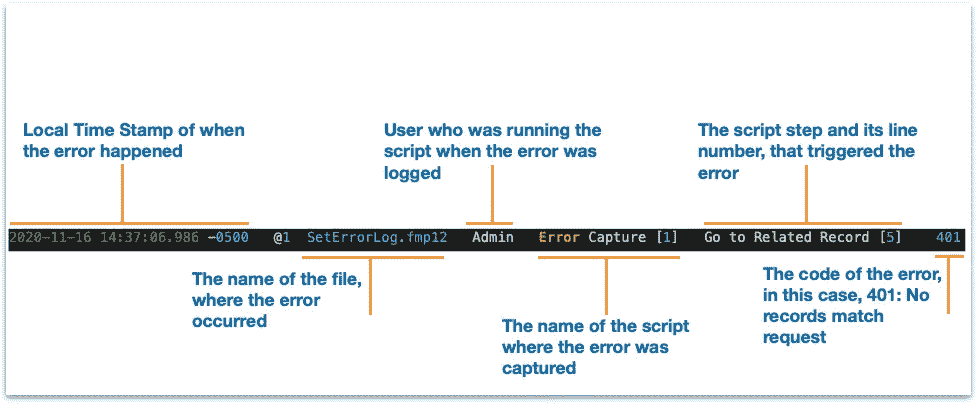
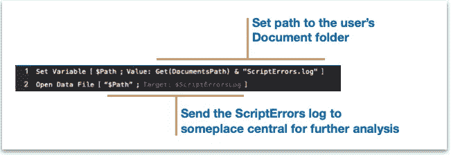

# 使用 FileMaker 错误日志

> 原文：<https://blog.devgenius.io/using-filemaker-error-logs-1fc350d61206?source=collection_archive---------5----------------------->

在之前的一篇文章中，我们谈到了 [FileMaker 错误代码](https://blog.supportgroup.com/conquering-filemaker-error-codes?utm_source=BlogPost-2020-11-30&utm_medium=Medium&utm_campaign=traffic)，并强调了在开发过程中保持警惕的重要性。我们必须时刻警惕我们的解决方案中可能出现问题的模糊领域。有时，我们不得不将我们的解决方案推到边缘，希望揭示出一个可能被忽视的弱点。我们还研究了一些捕捉错误的技术，然后对它们进行组织，以便我们可以适当地处理它们。这篇文章将探讨一个新工具，克拉丽丝女团给了我们几个版本，称为设置错误日志。这个工具允许我们将错误捕获提升到一个全新的高度。

# ScriptErrors.log

[设置错误日志](https://blog.supportgroup.com/filemaker-18-error-logging-function?utm_source=BlogPost-2020-11-30&utm_medium=Medium&utm_campaign=traffic)是一个简单的脚本步骤，允许我们将脚本中的错误写入用户电脑或 iOS 设备上的日志中。在脚本中调用该命令会打开一个进程，记录该文件的任何脚本中的所有错误，直到我们关闭该文件或将错误记录设置为 off。因此，如果我们遇到脚本化工作流的问题，而该问题似乎只发生在一天中的特定时间，或者可能只针对特定用户，我们可以在后台运行该操作，并记录在该用户设备上发生的任何错误。

该设置错误日志创建的文件名为 ScriptErrors.log，它被写入用户的文档文件夹中。如果日志文件已经存在，那么 FileMaker 只是将新数据作为附加行添加到文件中。因此，我们不必担心每次需要时维护文件或创建新文件。关于设置错误日志脚本步骤，有几件事需要了解，这可能有助于我们利用它作为工具来暴露问题。

你可能会问，这个文件写了什么？嗯，一些标准数据以及我们喜欢的任何东西。让我们从标准的东西开始。

大多数事情都很重要——谁，什么，在哪里，什么时候。但有时，我们需要更多的细节来清除一个棘手的错误，这就是设置错误日志的“齿轮选项”发挥作用的地方。我们可以最大化计算引擎的能力来获取各种重要的东西，比如状态变量、全局字段、当前布局名称、一两个导入字段的内容，甚至客户端版本或操作系统。任何可能帮助我们确定问题原因的信息都可以通过选项附加到行尾。

在上面的示例中，我们添加了布局名称、与该布局关联的表以及错误发生时用户所处的模式。窗口模式被置于末尾有两个原因。通常，我们不考虑在查找模式下执行的脚本。在文件制作中，查找模式是一个如此微妙的转变，在我们与用户的访谈中并不总是被用户报告。

如前所述，ScriptErrors.log 文件是直接在用户的 Document 文件夹中创建和/或更新的，所以每个用户都有自己的日志。因此，我们可以创建一个脚本化的过程来收集这些日志并将其发送给我们自己，或者通过几个脚本步骤将信息添加到我们的解决方案中。只需使用 Open Data File 脚本步骤并获取(DocumentsPath ),以 ScriptErrors.log 作为路径，我们就可以捕获每个文件的信息并将其存储在数据库中，或者将其传递给电子邮件。有了这些信息，我们将很好地找到应用程序中可怕的错误。

# 无错误

总而言之，文件制作器给了我们一些非常好的工具，让创建无错误的过程少了很多麻烦。话虽如此，我们不能太害怕或太骄傲而不去使用它们。

我们充满了有用的 FileMaker 开发信息，例如[如何从重复域](https://blog.supportgroup.com/how-to-move-data-from-repeating-fields-in-filemaker?utm_source=BlogPost-2020-11-30&utm_medium=Medium&utm_campaign=traffic)移动数据以及[如何管理和定制图像](https://blog.supportgroup.com/how-to-manage-image-features-in-filemaker?utm_source=BlogPost-2020-11-30&utm_medium=Medium&utm_campaign=traffic)。[查看我们为定制应用开发者提供的更多技巧和窍门。](https://blog.supportgroup.com/developer-resources?utm_source=BlogPost-2020-11-30&utm_medium=Medium&utm_campaign=traffic)

*原为 2020 年 11 月 30 日在*[*https://blog.supportgroup.com*](https://blog.supportgroup.com/using-filemaker-error-logs)*发表。*