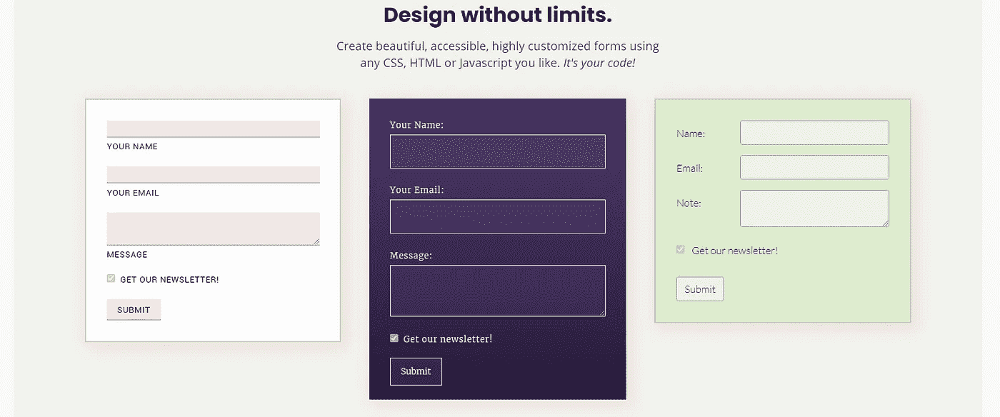

# 使用 Formspree 在您的网站上设置电子邮件

> 原文：<https://blog.devgenius.io/using-formspree-to-set-up-email-on-your-website-f9b51ac45aa7?source=collection_archive---------14----------------------->

你的投资组合或商业网站上的联系信息对于推动与潜在客户、雇主或合作伙伴的互动至关重要。Formspree 使得在你的网站上设置一个可以直接给你发送邮件和联系信息的表单变得非常简单。

由[梅林达·金佩尔](https://unsplash.com/@melindagimpel?utm_source=medium&utm_medium=referral)在 [Unsplash](https://unsplash.com?utm_source=medium&utm_medium=referral) 上拍摄的照片

# 为什么是 Formspree？

老实说，就在几周前，当我第一次听说 Formspree 时，我也有同样的问题。作为一名网站开发人员，我知道一个聪明的方法，在我的作品集上提供一个链接，让用户可以给我发邮件，一个简单的*<a href = ' mailto:…'>*就可以很好地完成这个任务。使用 HTML 电子邮件标签，你甚至可以提供额外的设置来设置默认的主题和正文参数，很棒吧？

实际上也许不是，虽然这是一个强大的工具，HTML 电子邮件标签要求最终用户，你未来的客户或合作伙伴，有一个默认的电子邮件客户端设置，如果他们没有，它只是重定向到一个新的页面，在那里你的电子邮件地址在网址中提供。这些额外的步骤可能会让想要联系的人失去兴趣，就这样，联系失去了，哎呀！

这就是 Formspree 的亮点，在你设置好之后，你的最终用户只需添加他们的联系信息和一条消息，所有这些信息在他们点击提交之后就会被捕获并直接提供到你的电子邮件收件箱中。快速，简单，非常有用。

# 设置它

设置 Formspree 既简单又快速，你需要访问你想要添加表单的网站的源代码，以及你想要发送表单信息的电子邮件地址。

一旦你有了这些，去 Formspree 的[网站](https://formspree.io/)注册吧。这是您使用电子邮件发送所有新邮件的地方。连接这些元素后，您现在可以访问将被添加到站点源代码中的代码。

抓取这段代码的副本，并将其插入到您认为最合适的位置。如果您是开发人员，您可能会注意到 form 元素包含一个 POST 方法。POST 是最常与创建新项目相关联的操作，它是 CRUD 操作中的 C 语言，了解这一点可以让您更抽象地思考使用表单时发生了什么。

一旦插入了代码，您就基本上完成了获得完整功能的所有必要工作。然而，因为表单是 HTML，你可以用你自己的 HTML、CSS 或 JavaScript 修改高度定制表单，就像 Formspree 喜欢说的，这是你的代码，发挥创造力。

Formspree 鼓励 it 服务的用户在他们的代码中发挥创造力！

此外，请放心，Formspree 已经为用户输入实现了一些后端检查，即检查电子邮件地址的格式是否正确。我已经开始构建自己的表单验证逻辑，并且在开始测试自己的表单验证逻辑时才意识到这已经是内置的了。

对表单满意后，保存代码并部署。你现在有了一个新的，简单，快速和可靠的方式，让潜在的客户，项目合作伙伴或雇主与你联系，真棒！

在我的作品集网站上实现的 Formspree 代码的例子。

# 快速试验

我建议您在获得初始更改后进行快速测试。只需导航到您的网站，插入一个电子邮件地址和一些虚拟文本(确保使用有效的电子邮件格式)并提交您的邮件。几分钟之内，您应该会收到一封关于新活动的电子邮件和一条来自您的网站的新消息。

就这样，您的设置和准备就绪。免费层为用户提供 30 天内最多 50 次提交和归档邮件。如果您发现自己需要额外的提交，更长的存档时间或其他功能，他们提供了两个额外的高级包来满足您的需求。

我是一名专门研究 JavaScript、Node 和 React 的 Web 开发人员，对 Python 有极大的兴趣。除了网络之外，我喜欢构建应用程序，这些应用程序有时可以解决问题，并且通常会带来更多的问题，而不是答案。我也喜欢写一些技术和非技术概念，并且对社会科学、政治和户外活动非常着迷。

查看我的[作品集](https://jacob-garlick.com/)获取我的作品样本，或者在[推特](https://twitter.com/garlick_jake)上关注我，获取关于新文章和偶尔老爸笑话的通知。