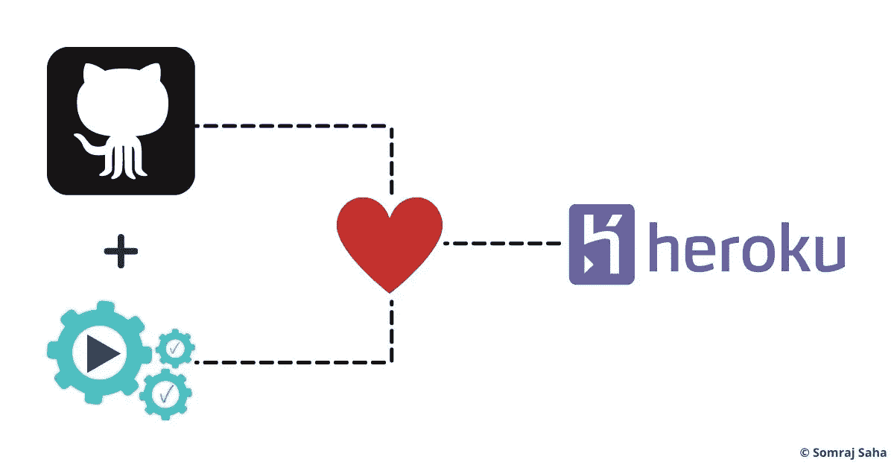

# 使用 GitHub 操作将 FastAPI 项目部署到 Heroku

> 原文：<https://blog.devgenius.io/using-github-actions-to-deploy-a-fastapi-project-to-heroku-8ae3f9046178?source=collection_archive---------3----------------------->

## DevOps

## Heroku 使部署变得轻而易举，但是在质量控制和最佳实践上有所妥协。因此，本文展示了如何在保持最佳实践的同时，将 GitHub 动作与 Heroku 配合使用。

GitHub Actions(和 GitHub)加 Heroku 是天作之合

GitHub Actions(和 GitHub)加 Heroku 是天作之合

我经常在 GitHub 存储库上构建 Python 项目和托管源代码。感谢 [GitHub Actions](https://github.com/features/actions) ，我也不用担心持续集成的需求。而 [Heroku](https://www.heroku.com) 则负责我的持续部署需求。

但是，有一个问题。Heroku 没有提供使用 GitHub 动作部署项目的直接方法。我需要下载 Heroku CLI 来代替它。

如果你读过我的文章，你会知道我是一个极简主义者。我不喜欢给我的开发机器添加比需要的更多的膨胀软件和额外的依赖。因此，我不得不寻找另一种选择。

我目前的开发过程是在我的本地机器上提交更改&然后把它推到远程。这里的 remote 通常是一个 GitHub repo，配置 GitHub 动作来触发一系列测试。如果一切顺利，就将项目部署到生产环境中。相当标准的做法&这里没有什么特别的。

但是警告是 Heroku CLI 使用`git`命令将代码推送到 Heroku 的遥控器。因此，这很像将代码推送到 GitHub 存储库。但是，没有强大的 CI/CD 管道。我可以配置 Heroku 在 GitHub 上测试通过后进行部署。但是最好坚持标准做法&在一个屋檐下配置一切。

此外，在远程机器上调用`git`命令听起来不是一个好主意。所以，我觉得分享我用来避免这种棘手情况的技巧是正确的事情。

因此，我们将使用 GitHub 操作来配置 CI/CD 管道。并且， [FastAPI](http://fastapi.tiangolo.com/) 来构建我们假设的 REST API。

不多说了，让我们开始学习如何做吧。

# 部署前要知道的事情

Heroku 的设计反映了简化和降低复杂性的需要。它的用户不需要了解深入的 CI/CD 概念和实践。但是只要用户非常熟悉 Git 命令，就可以使用了。

换句话说，将项目部署到 Heroku 就像将您的代码推送到 GitHub repos 一样简单！

您将开发您的项目&然后将您的代码推送到 Heroku remote。它触发一个构建过程，在远程服务器上建立一个 web 服务器。换句话说，部署项目再简单不过了。

但是这个过程有一个缺点，Heroku 没有提供足够健壮的 CI/CD 管道。没有办法检查任何突破性的变化或错误。这就是 GitHub 动作派上用场的地方。

因此，我们将使用 [AkhileshNS](https://github.com/AkhileshNS) 的`[heroku-deploy](https://github.com/AkhileshNS/heroku-deploy)`动作来部署项目。所述动作是围绕基本`git`命令调用的 NodeJS 包装器。这些调用与您在 Heroku CLI 中使用的完全一样。

此外，为了保持简单明了，我们的 FastAPI 应用程序是一个不超过 8 行代码的单个文件！

除此之外，Heroku 还需要一些额外的文件来运行构建过程。这些文件也会被推送到 Heroku remote。它们是纯文本文件，包含 Heroku 在构建阶段需要解析的信息。在本文的后面，您将会找到关于它们的更多细节。

此外，`heroku-deploy`动作还需要一个 API 密钥来进行认证。因此，确保你有它连同项目的名称。

考虑到所有的先决条件，现在让我们来开发这个项目。

# 把所有东西放在一起

# 我们简单的 FastAPI 项目

随着所有先决条件的设置和收集，这里是我们的小项目概述。

首先，FastAPI 项目非常简单，只有 8 行代码！它的源代码在`main.py`文件中有详细说明。它配置了路由，以便在查询时返回一组 JSON 响应。所述路线是:一条`/` ( *或根*)路线&一条`/healthcheck`路线。如您所见，后者在我们的 CI/CD 渠道中有一定的重要性。

根路由像这样返回一个 JSON 响应；`{"message": "Hello, World!"}`查询时。并且`/healtchcheck`路由充当 REST API 的最后一道防线。但是它也会返回一个 JSON 响应，以便用户更好地理解。因此，如果您对此路由调用一个`cURL`命令，您应该会返回`{"message": "Everything, OK!"}`响应。

我们将配置 CI/CD 管道来查询健康检查路由，以检查它是否仍在运行。不这样做意味着返回一个`400` ( *或类似的*)响应代码，将调用回滚。因此，我们生产环境中的 REST API 将一直保持运行，不管有什么重大变化或错误出现。

也就是说，下面是我们的 REST API 的源代码:

我们简单的 FastAPI 应用程序

# 配置 GitHub 操作工作流

构建好 REST API 后，让我们为它配置一个 CI/CD 管道。管道是相当标准的&没有什么花哨的。在每个 Push 和/或 PR 事件中，它会调用一系列测试，然后进行代码质量检查。如果一切顺利，工作流也将调用部署过程。

但是在讨论我们的管道之前，让我们先了解一下 GitHub 动作。

很容易将 GitHub 动作混淆为“*又一个 CI/CD 工具*”。但是，事实并非如此。GitHub 将其定义为一个自动化工具，可以满足所有你能想到的软件开发需求。此外，GitHub 和/或社区还正式提供了许多预配置的操作。我们将在用例中使用的一个这样的动作是`AkhileshNS/heroku-deploy`动作。

我们将在每个推送事件上触发我们的工作流。但是您也可以将其配置为触发其他事件。您可以在触发工作流的[事件列表中找到更多信息](https://docs.github.com/en/actions/reference/events-that-trigger-workflows)这是官方文档。

通过 [YAML](https://yaml.org/) 文件进一步配置工作流程。而且，它们存储在`.github/workflows`目录下，这个目录也是受版本控制的。GitHub 将解析这些 YAML 文件，以获得如何设置环境的指令。

这是我们的工作流程:

我们部署 FastAPI 项目的 GitHub Actions 工作流

GitHub 动作工作流必须遵循特定的语法。解释语法有点超出了本文的范围。所以，你可以参考[官方文档](https://docs.github.com/en/actions/reference/workflow-syntax-for-github-actions)来了解语法。

也就是说，让我们了解如何定制我们的工作流。

在我们的`main.yml`文件的顶部是带有`name`关键字的工作流名称。接下来是`on`关键字，它指示 GitHub 动作在`push`事件上触发工作流。

还有更多" *on event* "关键字可用于触发工作流。因此，请务必查看文档&根据您的需求配置您的管道。

继续，工作流程的`jobs`部分几乎是流水线的心脏。GitHub 将在这里找到何时触发&的指令。根据我们的需要，我们定义了 3 个任务&,它们将并行运行，除非明确配置不这样做。

这些作业被配置为在最新版本的 Ubuntu 上运行。此外，`deploy`作业依赖于其他先前的作业。因此，当`test` & `linter`作业并行运行时，`deploy`作业将等待它们通过。如果他们不这样做，那么`deploy`任务甚至不会执行。

管道的这种结构确保了 bug 永远不会被引入到生产中。从而确保源代码的质量标准。如果你想知道如何为 Python 项目建立代码质量检查，我有一篇文章给你。查看[一个标准的&完整的 CI/CD 管道，以了解如何设置它。](https://jarmos.netlify.app/posts/a-standard-ci-cd-pipeline-for-python-projects)

更深入地研究一下`deploy`工作，让我们弄清楚它的确切目的。

像它的前辈一样，`deploy`作业也运行在最新版本的 Ubuntu 上。然后它指示 GitHub 解析要执行的步骤。相应地，GitHub " *在虚拟环境中复制*"回购的内容。随后执行`heroku-deploy`动作。

`heroku-deploy`动作也需要几个变量才能起作用。这些变量是使用`with`关键字提供的。上述操作接受的变量比我们正在使用的要多。因此，一定要检查它的回购，以便进一步配置。

也就是说，我们使用了`heroku_api_key`、`heroku_app_name`、`heroku_email`、`healthcheck`、&、`rollbackonhealthcheckfailed`变量。因为，前 3 个变量接受有价值的用户信息，它们作为 GitHub 秘密传入。变量`healtcheck`接受一个到`/healthcheck`路径的 URL。最后，`rollbackonhealthcheckfailed`接受一个布尔值。

最后一个变量作为最后一道防线帮助我们。每当一个事件触发工作流&项目部署时，都会执行健康检查。它将寻找一个`200`响应代码&，如果失败，工作流将恢复到以前的工作版本！

如果你问我的话，我觉得非常漂亮！

但是，为什么我们首先需要这样的复杂性呢？

您知道，在生产环境中，拥有强大的 CI/CD 管道是很常见的。这些系统测试您的提交推送和 PR 是否有任何潜在的中断。不要忘记编码最佳实践和质量标准。

管道的健康检查和回滚功能是最后一道防线。因为，错误和/或重大变更有可能通过初步检查。这可能会破坏我们生产中的 REST API。想象一下对于你的项目的用户来说会是什么样子(*并且他们为使用它而付费*)！

但幸运的是，你不必担心这种情况会成为现实。借助运行状况检查和回滚功能，问题将像转向南方一样迅速转向北方。所以，换句话说，你可以无忧无虑地睡个好觉。

# 关于`Procfile`、`requirements.txt`、&、`runtime.txt`文件

如前所述，Heroku 在构建过程中需要某些纯文本文件。它解析这些文件来设置 web 服务器&项目的依赖项。因此，对于我们的 REST API 项目，它是一个 Python 应用程序，下面是 Heroku 需要解析的文件。

*   Heroku 解析的用于在远程机器上建立网络服务器的`Procfile` ( *没有文件扩展名*)。因此，在使用 uvicorn 时，文件的内容应该是:`uvicorn main:app --host=0.0.0.0 --port=${PORT:-5000} --workers 4`。
*   `requirements.txt`列出了项目依赖关系。并且，Heroku 将解析它来安装项目的依赖项。
*   `runtime.txt`文件声明了用于 REST API 的特定 Python 版本。因此，如果它依赖于 Python v3.8.10，文件的内容将是`Python-3.8.10`。**一定要注意格式** &它必须完全相似，否则它不会工作。

有了这些文件，您在 Heroku 上的构建环境应该很快就可以启动并运行了。但是让我们在提交版本控制之前仔细检查一下目录结构。您的目录结构应该是这样的:

现在，每次您将更改推送到 GitHub 存储库时，推送事件都会触发工作流。如果测试和代码质量检查通过，工作流将尝试将项目部署到 Heroku。最重要的是，如果健康检查 URL 向我们的工作流返回一个`200`响应代码，REST API 就开始运行了！

然后您可以导航到`https://<PROJECT-NAME>.herokuapp.com` URL 来查看我们的 REST API。如果工作正常，您应该会在屏幕上看到 JSON 响应。

有了这个设置，现在你就可以两全其美了。Heroku 的简单部署和 GitHub 动作的强大代码质量检查！最棒的是，不需要在本地机器上使用 Heroku CLI。😆

# 一些潜在的障碍

虽然本文详述的技术和代码可以工作，但还不够健壮。在`heroku-deploy`行动中有几个脆弱的地方需要注意。如果你仔细阅读源代码，你会发现这是[使用 NodeJS 调用实际的](https://github.com/AkhileshNS/heroku-deploy/blob/79ef2ae4ff9b897010907016b268fd0f88561820/index.js#L19) `[git](https://github.com/AkhileshNS/heroku-deploy/blob/79ef2ae4ff9b897010907016b268fd0f88561820/index.js#L19)` [命令](https://github.com/AkhileshNS/heroku-deploy/blob/79ef2ae4ff9b897010907016b268fd0f88561820/index.js#L19)。

但是，NodeJS 并不意味着调用 shell 命令。所以，难怪在使用它的时候东西会坏掉。换句话说，这里使用的操作更像是一种变通方法。

这个问题的更好的解决方案是包装 Heroku 提供的 API 来创建一个动作。对我们来说幸运的是，隧道的另一端似乎出现了一丝曙光。Heroku 提供了一个官方 API 来与他们的构建过程和其他服务进行交互。他们将其命名为 [Heroku 平台 API](https://devcenter.heroku.com/articles/platform-api-reference) 。他们甚至分享了一篇文章，使用他们的平台 API 以编程方式向 Heroku 发布代码。

所以，向 JavaScript 开发者大声疾呼。如果你正在读这篇文章&你有开发 GitHub 动作的经验，社区需要你。但在此之前，这篇文章应该是任何想将 FastAPI 应用程序部署到 Heroku 的人的一个很好的指南。

不过，还有其他选择。谷歌无服务器基础设施是由微软 Azure 和/或亚马逊网络服务提供的。所以，如果你想尝试一下，可以看看我写的这篇关于谷歌无服务器产品的文章。你可以在[谷歌无服务器基础设施:GCP 无服务器计算初级读本&上阅读。](https://jarmos.netlify.app/posts/posts/google-serverless-infrastructure-what-are-the-differences)

在那之前，干杯&快乐发展！🍻

*原载于 2021 年 5 月 5 日*[*https://jarmos . netlify . app*](https://jarmos.netlify.app/posts/using-github-actions-to-deploy-a-fastapi-project-to-heroku/)*。*