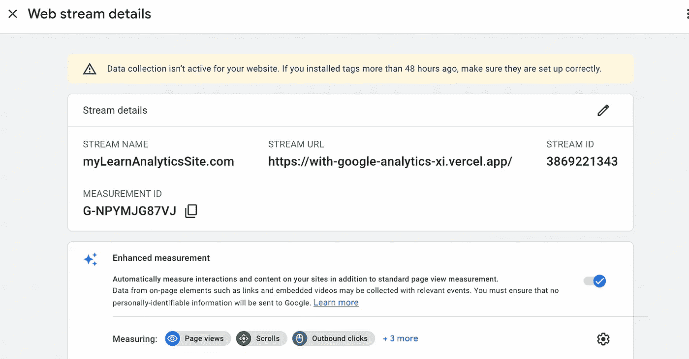
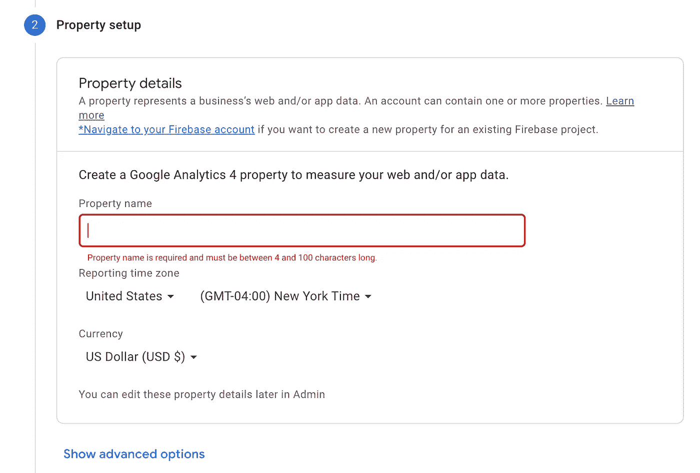
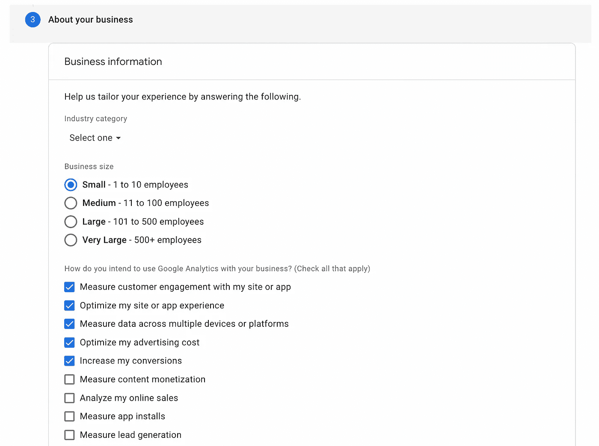
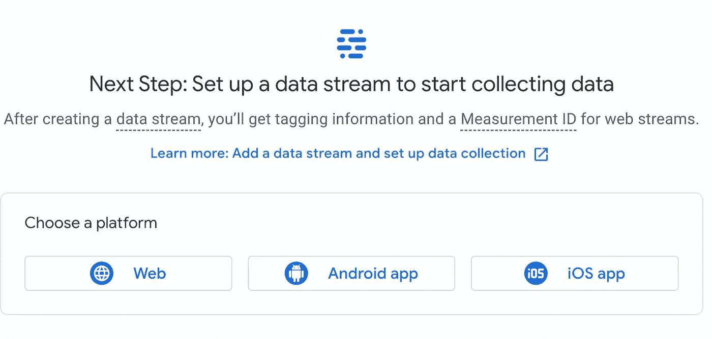
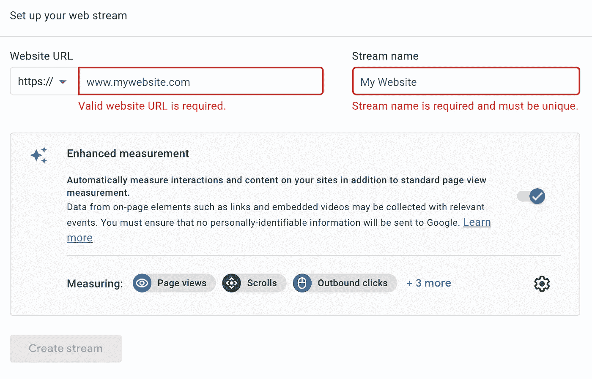

# 使用谷歌分析

> 原文：<https://blog.devgenius.io/using-google-analytics-6c70476605c0?source=collection_archive---------17----------------------->

卢卡斯·布拉塞克在 [Unsplash](https://unsplash.com?utm_source=medium&utm_medium=referral) 上的照片

## 谷歌分析简介

本着“新的学习看起来很混乱”的精神，我将深入研究一下 Google Analytics，这是我志愿者学习项目的一部分。一路上我已经有一些惊喜了。惊喜 1:该项目托管在 Vercel 上，我了解到这是一个非常用户友好的应用托管平台。我一直在用 Heroku，甚至试过 Hostinger，但是 Vercel 太简单了。上面有我的几个项目——只是处理一些错误(我生活的故事)。我跑题了。

我正在做的项目是在现有的网站上实现谷歌分析，我开始在一个工作分支上测试它。惊喜#2: Google Analytics 是一个免费工具，“为搜索引擎优化( [SEO](https://www.techtarget.com/whatis/definition/search-engine-optimization-SEO) )和营销目的提供统计数据和基本分析工具”([来源](https://www.techtarget.com/searchbusinessanalytics/definition/Google-Analytics))。我喜欢它是免费的。它使用 JavaScript 页面标签。可以说，只需在我们的代码中为每个页面添加标签，然后观察点击量。

惊喜三:没那么容易。我看过几个关于如何做到这一点的视频，第一个视频让我很困惑，因为有些东西不匹配。第二个视频较新，因此在搜索结果中排名不高。它立即表示，在整个 GA 实施过程中，已经更新了许多内容。啊哈！

## 设置

从[谷歌分析网站](https://marketingplatform.google.com/about/analytics/)开始，点击开始。在“帐户设置”中，使用您的名字和姓氏(或任何其他名称)创建帐户名称。

向下滚动并单击下一步。然后在属性设置中，使用网站名称(不是 url)创建一个属性，例如“我的书店”

对时区和货币进行必要的调整，然后单击下一步。然后在“关于您的企业”中，选择您的企业规模，并检查您在此特定情况下可能使用此工具的所有方式。单击下一步。

在弹出窗口中单击 I accept，您应该会看到一个数据流选择页面。选择适合您的应用的平台。我单击了 web，因为我正在使用基于 web 浏览器的应用程序。

在下一页，设置网站名称和 url。然后单击创建流。

您已经完成了设置的一部分。在我的下一篇文章中，我将讨论在应用程序中添加跟踪 ID。哦，第四个惊喜是，这个应用程序的现有代码没有 index.html 文件，所以我陷入了一个循环，不仅是在哪里添加标签，而且整个应用程序是如何运行的！现在正忙得不可开交，希望会带着一些答案回来。