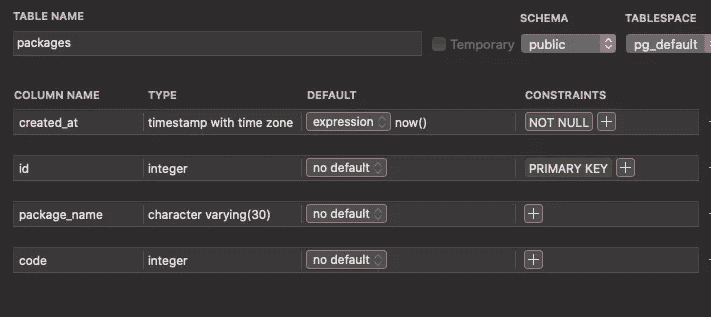
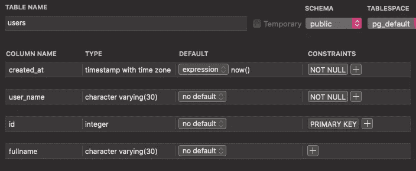

# 在 PostgreSQL 中使用继承

> 原文：<https://blog.devgenius.io/using-inheritance-in-postgresql-434158b932a4?source=collection_archive---------4----------------------->


Philippe jaus ons 在 [Unsplash](https://unsplash.com?utm_source=medium&utm_medium=referral) 上拍摄的照片

PostgreSQL 具有表继承特性。这个概念来自面向对象的数据库。在 PostgresSQL 中，一个表可以从一个或多个其他表继承。子表从一个或多个父表继承列以及所有 check 约束和 not null 约束。有些约束(唯一、主键、外键)不能从父表继承到子表([公文](https://www.postgresql.org/docs/9.1/ddl-inherit.html))。

让我们看看一些 SQL。

```
CREATE TABLE entities ( created_at TIMESTAMPTZ NOT NULL DEFAULT NOW());
```

***【实体】*** 将被用作父表。它有一个 **created_at** 列，存储来自 NOW()函数的当前日期时间。继承 ***【实体】*** 表的表将获得列以及约束。

```
CREATE TABLE packages ( id INT GENERATED BY DEFAULT AS IDENTITY PRIMARY KEY, package_name VARCHAR(30), code INT) INHERITS (entities);
```

这是结果。



图像由发布者提供

***【套餐】*** 表继承自 ***【实体】*** 有**创建 _at** 列。这样可以减少 DDL，更好地组织 DDL。

这是另一个表继承多个表的例子。

```
CREATE TABLE people ( user_name VARCHAR(30) NOT NULL);
```

***【人】*** 表中有**用户名**列。

```
CREATE TABLE users ( id INT GENERATED BY DEFAULT AS IDENTITY PRIMARY KEY, fullname VARCHAR(30)) INHERITS (entities, people);
```

下面是结果。



图像由发布者提供

***【用户】*** 表继承了 ***【实体】*** 和*【人】* 表的 **created_at** 和 **user_name** 列来自各自的父表。

感谢您的阅读。希望这对你有所帮助。如果你喜欢这个帖子，请给一些掌声。