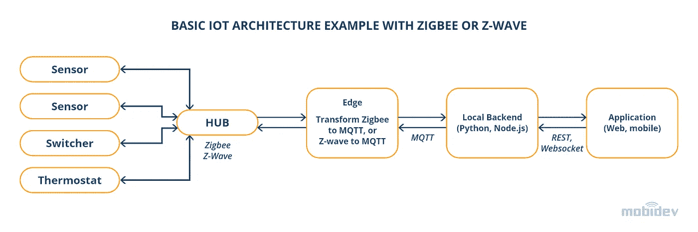
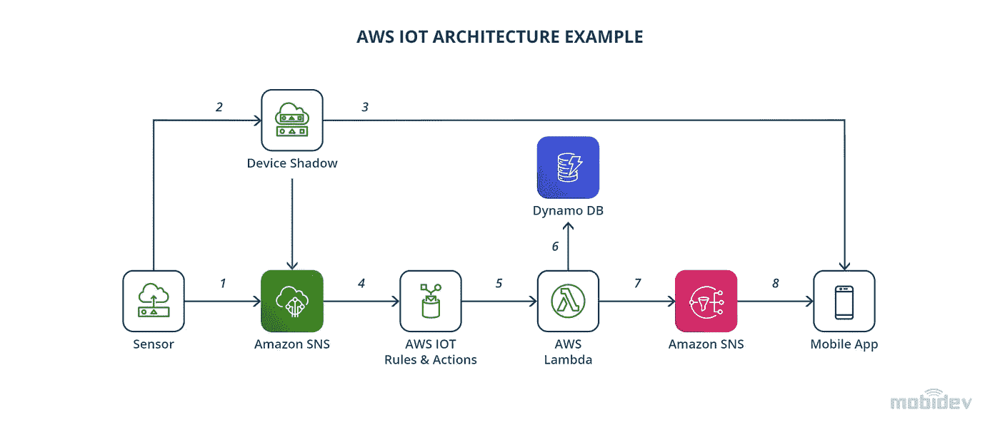
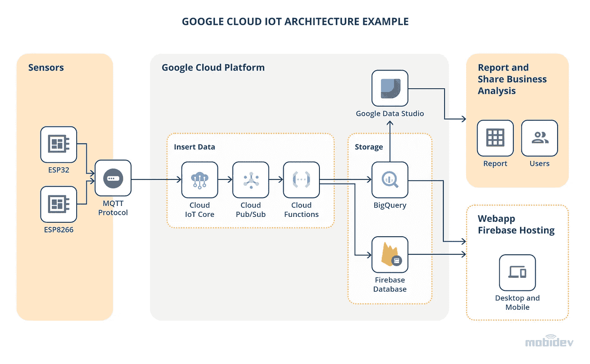

# 使用物联网实现智能办公自动化

> 原文：<https://blog.devgenius.io/using-iot-for-smart-office-automation-809de0b5b495?source=collection_archive---------6----------------------->

照片由 [Alex wong](https://unsplash.com/@killerfvith?utm_source=unsplash&utm_medium=referral&utm_content=creditCopyText) 在 [Unsplash](https://unsplash.com/?utm_source=unsplash&utm_medium=referral&utm_content=creditCopyText) 上拍摄

*由 JavaScript 架构师 Oleg Starostin 在* [*MobiDev*](https://mobidev.biz/) 撰写

企业旨在通过利用物联网(IoT)技术创建智能办公室，使工作场所更加安全并降低成本，同时重建因疫情而损失的收入。

物联网技术允许建筑管理人员测量和控制室内环境的温度、二氧化碳水平和湿度。这种努力为每位员工创造了最佳的工作环境，并降低了能源消耗。

后 COVID 时代办公室重新开放的有用解决方案包括库存管理和增强的安全性。智能库存是最省时、最具成本效益的物联网集成之一。公司还可以添加基于语音和人脸识别的智能办公安全解决方案。

在本文中，我们将概述构建智能办公生态系统的工程方法，并确定智能办公应用的一些物联网安全问题。

新冠肺炎·疫情以以前无法想象的方式改变了商业。虽然全球许多员工仍在远程工作，但随着我们开始回到现场工作，办公室生活将会大不相同。许多企业正在转向利用物联网(IoT)技术来使工作场所更安全并降低成本，而公司则在重建因疫情而损失的收入。

# 什么是物联网智能办公自动化？

将物联网技术用于智能办公室意味着办公室中有许多设备连接到物联网，这允许对它们进行远程控制。这些设备在没有人工干预的情况下工作并收集数据。有了智能技术，办公室可以比以往任何时候都更有效率，实现琐碎任务的自动化，从而让员工有更多时间从事有价值的项目。有许多方法可以利用智能办公技术。

# 智能办公室减少能源消耗

许多设备在计时器上工作效率更高。为了改进对能源消耗的深入控制，企业将系统和计算机放在时间表上。当人们进入某个区域时，它们打开，当人们离开时，它们关闭。许多智能办公室选择采用 LED 照明，利用地板内或墙壁上的灯来帮助人们保持一定的安全距离。

跟踪能源消耗可以让企业了解时间安排或其他变化是否会减少每月开支。例如，一些简单的事情，如安排人们早晚晚半小时以节省取暖费用，可能会显著降低整体能源消耗。

# 办公室气候控制比以往任何时候都容易

智能恒温器是第一批成为主流的物联网技术之一，但现代智能办公室远远超过了智能家居所拥有的技术。物联网技术允许测量和控制温度、二氧化碳(CO2)和湿度。这种控制使建筑或运营经理能够为每个员工创造最佳的工作环境。可以有一个自动控制百叶窗的系统，从而减少对加热和冷却的需求。

使用智能技术进行气候控制是实现物联网智能办公自动化的最简单、最具成本效益的方式之一。空调或暖气的控制可根据一天中的时间进行调节，并可远程控制。企业可以更进一步，根据房间里是否有人，自动打开或关闭气候控制。

**考虑这个典型案例:**

想象一个雇员坐在窗户旁边。当阳光开始照射到他们的脸上时，智能百叶窗会收到信号并自动落下。对百叶窗的调节可以在一天中的特定时间进行，或者在监控系统接收到指示需要调节的传感器信息之后进行。

# 智能家具提高生产力

智能办公家具，如桌子、椅子，甚至隔墙，可以提高生产力，改善员工的情绪。例如，控制他们的桌子，可以给他们选择，包括他们想要从坐着到站着的频率的目标。员工可以自动调整他们工作空间的高度，或者如果他们愿意，可以接收他们一天或一周的行为数据。

[用在洗手间或办公室其他地方的智能镜子](https://mobidev.biz/case-studies/smart-mirror-alexa-skills-development)显示相关信息并播放视频。会议室、入口通道或大厅中使用的智能镜子可以进行有效的演示。客户和客人喜欢智能镜子。使用它们能让企业留下积极的第一印象。

# 智能办公安全解决方案为公司省钱

使用物联网技术的智能办公室安全解决方案不仅仅是远程控制摄像头。他们可以使用[语音和面部识别](https://mobidev.biz/case-studies/face-voice-recognition-machine-learning)来判断谁进入了一栋大楼，一个人在哪里，办公室里有多少人。这使公司能够跟踪他们离达到建筑容量还有多远，并确保没有未经授权的人在安全区域。

安全自动化通常可以节省安全人员的费用，因为他们可以使用智能技术来跟踪进出大楼的人。安全自动化针对特定事件制定报告并发送警报。公司可以在当天最后一个人离开办公室时收到通知，以便员工可以确保安全系统处于戒备状态。该系统自动创建报告，报告谁在办公室，何时向公司提供更多数据，以优化其建筑内的运动，以及谁可能涉及安全漏洞。

另一个智能安全解决方案包括在高价值物品上放置跟踪器，这减少了物理盗窃的威胁。在某些业务中，这可能是一个巨大的优势，因为它能够在对象移动或越过特定阈值时收到警报。

# 后 COVID 办公室的智能调度

日程安排在后 COVID 办公室非常重要。物联网技术可以更轻松地让员工全天保持最佳人数，以确保符合安全惯例。公司可以创建一个登记流程，并监控任何潜在的警告信号。该系统使公司能够通过使用智能停车解决方案来跟踪谁在同一个房间以及人们将车停在哪里。

智能排班可以减少加班时间，错开上下班时间，这样人们可以有更灵活的时间表，同时将同一地区的人数保持在最低水平。智能排班可以自动创建一个考虑所有员工偏好并符合公司整体要求的主计划。

支持物联网的设备和网络的智能调度在后 COVID 办公环境中非常有用。公司可以自动为需要匹配员工日程的物联网项目创建日程。如果员工请病假，这很方便，因为如果他们不在工作，他们的工作空间可以自动调整。对物联网时间表进行实时更改是智能办公技术的最佳用途之一。

# 智能库存保持业务平稳运行

智能库存是公司可以添加到其运营中的最省时的物联网集成趋势之一。智能办公室使用射频识别(RFID)标签跟踪库存，而不是每周或每月花费数小时手动清点库存项目并更新过时的 excel 或纸质文档。这种巧妙的方法可以对库存资产进行更精确的估价。

物联网技术不仅可以跟踪库存总量，RFID 标签还可以评估每个标签最后一次扫描的时间和确切位置。公司对如何清点、转移和使用库存有了更好的了解。利用实时利用率报告，可以更容易地发现问题，如生产瓶颈、员工盗窃和订单问题。

智能库存可以根据交付周期自动生成报告，显示订购产品的最佳数量，以便公司始终掌握消费者需求。公司使用 RFID 技术跟踪库存的时间越长，它就变得越准确，因此使用这种技术的企业随着时间的推移会变得更有效率。

除了 RFID 技术之外，公司还可以在丢失或被盗发生率高的商品上安装追踪器，看看如何使它们在生产过程中的移动更加安全高效。这项技术对于拥有大量库存的物联网应用尤其有用。库存的物理位置可能会对业务效率产生巨大影响。

# 人工智能跟踪系统和安全

人工智能跟踪系统提供了许多优势，增加了安全性和便利性。

人工智能跟踪系统的一个优势是，它们可以使用面部识别技术来帮助确定办公室的人数。为系统配置一个简单的问候语，当安全摄像头检测到附近有人时，该问候语就会响起。

来自跟踪系统的信息可以使用内部应用程序或网络程序将不同部门的人联系起来，从而提供安全性和便利性。例如，如果有人忘记带钥匙或有其他问题，很容易快速将他们与办公室的其他人联系起来以提供帮助。

# 人工智能聊天机器人

智能办公室的另一个有趣的增强功能是人工智能(AI)聊天机器人，使办公室更加舒适和安全。AI 聊天机器人有助于降低能耗，简化预订会议室和时间记录，并增加工作场所的安全性。

一个与 Slack 或 Telegram 集成的 AI 聊天机器人，使所有公司员工都可以访问系统，而不需要额外的软件。一个人工智能聊天机器人可以执行许多命令。通过请求，聊天机器人给出有用的信息，例如来自传感器的数据、办公室的人数以及同事的当前位置。

# 智能办公应用的物联网安全问题

[物联网安全问题](https://mobidev.biz/blog/mitigate-internet-of-things-iot-security-threats)是一个真正的威胁，尤其是在这项技术快速发展的时候。一个主要的安全问题是“僵尸网络”攻击。当一个物联网网络被黑客侵入大量网络以获取信息时，就会发生这样的攻击。利用最新的安全准则并确保所有网络的安全是极其重要的。

许多引人注目的安全漏洞都涉及物联网技术中的漏洞，不仅是智能办公室中的漏洞，还包括大型网络中的漏洞。在保护物联网网络安全方面，信息安全智能分析可帮助组织保持领先地位。对相关数据的分析有助于 IT 安全经理了解薄弱环节和可能的威胁。网络分段是一种有价值的 IT 安全策略。通过使用网络分段，如果物联网系统的单个部分受损，黑客就无法访问整个网络。

咨询专业的物联网开发公司以确保网络的安全性是一个明智的选择，特别是如果存在可能通过云计算或网络计算机访问的敏感数据。

以下是与智能办公室的安全性改进和自动化相关的要点:

1.  SSL 证书是强制性的。借助 REST 传输数据应该通过 HTTPS 实现。对于 MQTT，需要 SSL 证书。
2.  无法访问互联网的本地服务器和本地网络是安全的。
3.  为了确保远程访问没有任何严重的安全风险，公司可以选择具有远程 VPN 连接的本地服务器。
4.  可以轻松实施双因素身份验证和一次性密码来提高安全性。
5.  云解决方案包括保护数据所需的工具。
6.  在传输敏感数据时，Cloudflare 等附加服务可用于保护和安全。

# 构建智能办公生态系统的工程方法

基于物联网的智能办公解决方案没有统一的架构。每个项目都需要一个独特的方法，从阐明项目的目标和需求开始。

让我们看看物联网技术提供的可能性，以及在这种情况下什么方法可能有用。

要创建架构并实施智能办公自动化项目，必须以相反的顺序工作。首先，了解什么样的传感器是必要的。然后，确定需要收集哪些数据以及系统管理的设备。检查平面图是因为它们显示了传感器的距离和电源位置。

传感器必须通过通信协议传输数据。将数据从边缘设备传输到基于云的服务器的最流行的协议类型是 [MQTT](https://mobidev.biz/blog/mqtt-5-protocol-features-iot-development) ，这是一种旨在处理数据包而非实时数据流的网络协议。MQTT 的主要优点是低能耗和高可靠性。这种轻量级协议适用于在不稳定网络条件下通信的物联网设备。

值得注意的是，向物联网上的边缘设备传输数据也可以基于其他协议，如 OPC、Modbus 和 TCP。这些协议互不相同。例如，OPC 是工业数据交换的标准。它指的是独立的开放接口标准。OPC 在工业物联网通信中很有用。

Modbus 是一种串行通信协议，用于从控制设备到控制器的信号传输。Modbus 协议用于不同系统的内置数据采集，例如测量温度或湿度，然后将结果传输至监控计算机程序的系统。第三种互联网协议是 TCP，这是最常用的协议类型。TCP-IP 是物联网的传输层协议。

# 网络(传感器-物联网集线器)层

第一种是使用导线将传感器和终端设备与控制器连接起来。这种方法对于支持物联网的智能办公解决方案来说是最可靠的。

第二种方法使用无线连接。如果办公室装修完成，这种解决方案是最佳选择，因为不需要铺设电线。无线连接有不同的选择:Zigbee 网络、Z-Wave 网络、Wi-Fi 和 T2 BLE T3。

每个选项都有利弊。最适合某个项目的方式取决于网络上的设备数量、覆盖区域及其预算。

最近，由于 Zigbee 3.0 的引入，Zigbee 以其长距离范围、速度、安全水平而经历了受欢迎程度的上升。对 Zigbee 需求的增加来自于价格和利益的强大价值主张。对于标准的 IT 网络，使用上述任何一种解决方案，集线器都是必要的。集线器必须连接到本地网络。该中心转换从传感器接收的数据，然后根据项目的规格，将数据发布到本地服务器或基于云的计算机。

# 系统层

最常见的云服务物联网提供商是 AWS 物联网和 Google Cloud 物联网。以下是如何实施这些解决方案的示例。

## AWS 物联网架构示例

## 谷歌云物联网架构示例

*最初发表于*[*https://mobidev . biz*](https://mobidev.biz/blog/using-iot-for-smart-office-automation)*并基于 mobi dev 技术研究。*